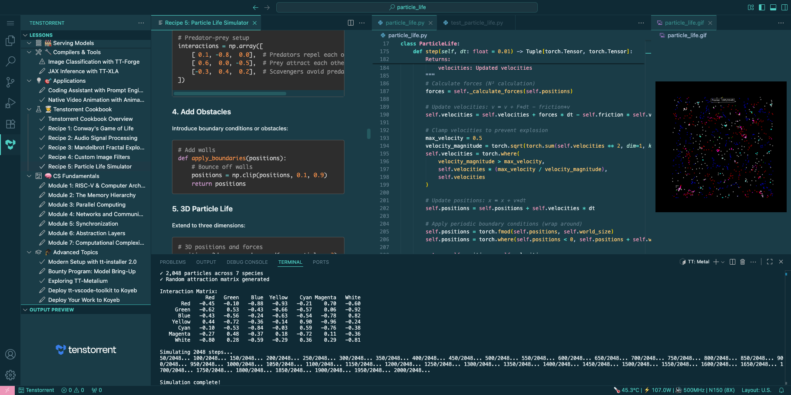
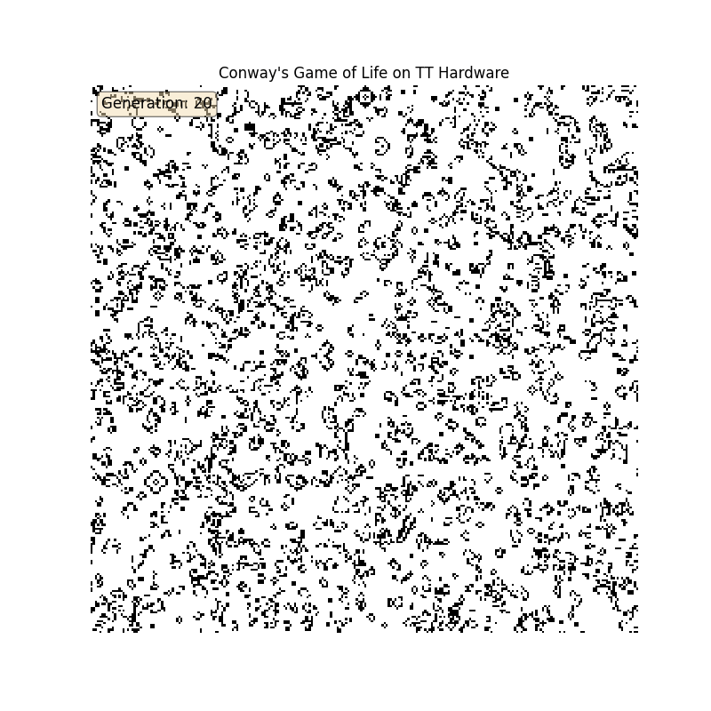
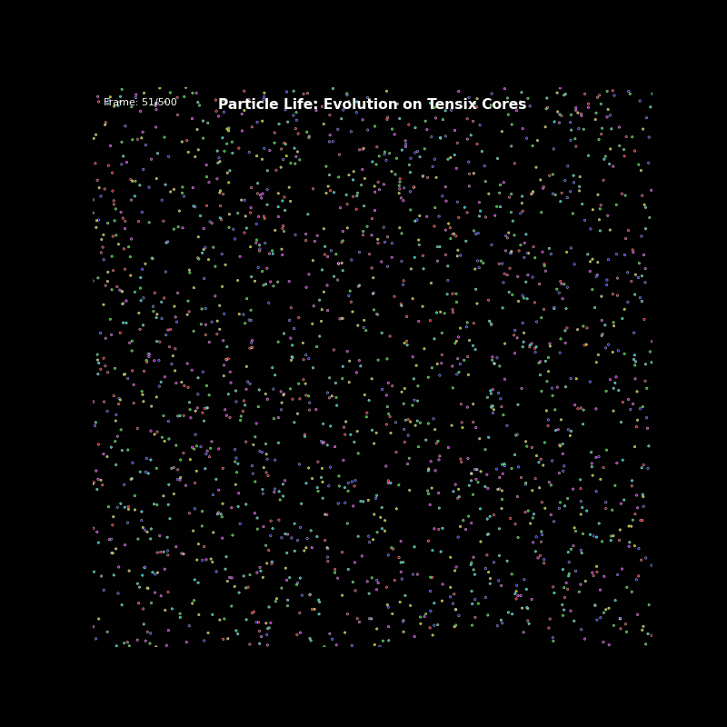
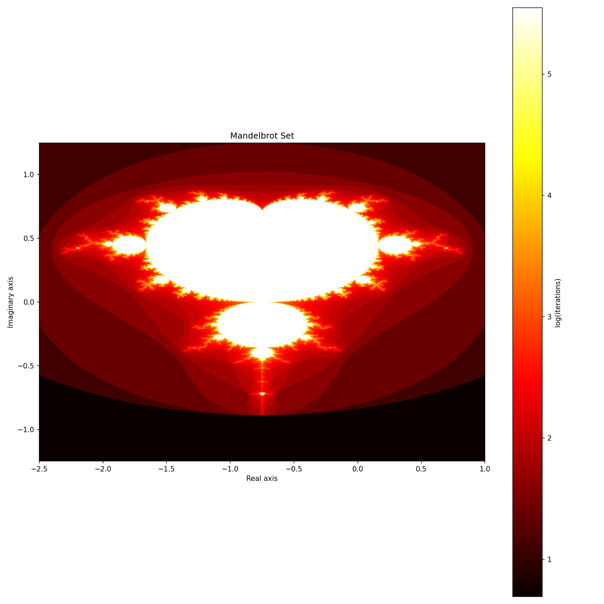
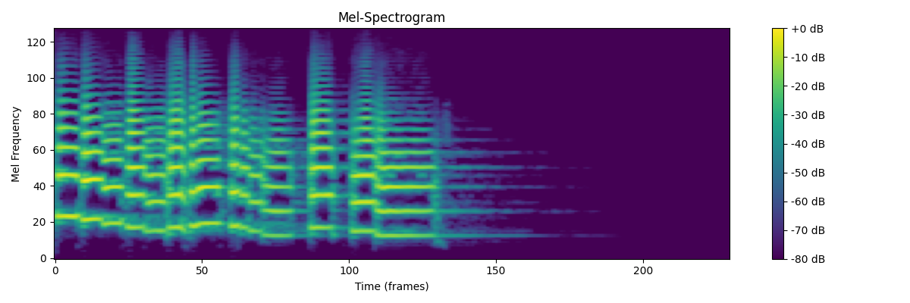

# TT-VSCode-Toolkit

**Interactive learning and development tools for Tenstorrent AI accelerators**

[](https://marketplace.visualstudio.com/items?itemName=Tenstorrent.tt-vscode-toolkit)
[](LICENSE)
[](https://code.visualstudio.com/)

Learn Tenstorrent hardware and software through 53 interactive lessons with guided hands-on exercises, production-ready code templates, and intelligent hardware detection. Perfect for developers new to Tenstorrent hardware and teams building production AI inference and **custom training** pipelines.



---

## Overview

The TT-VSCode-Toolkit is an educational extension that provides:

- ✅ **53 Interactive Lessons** - From hardware detection to custom training, organized by skill level
- ✅ **Custom Training Ready** - Train models from scratch or fine-tune existing ones (validated on hardware!)
- ✅ **Click-to-Run Commands** - Execute lessons step-by-step without copy-pasting commands
- ✅ **Hardware Auto-Detection** - Automatically detects your Tenstorrent device and provides tailored guidance
- ✅ **Production Templates** - Real, tested code you can customize for your projects
- ✅ **Multi-Framework Support** - Learn vLLM, TT-Forge<sup>™</sup>, TT-XLA, and TT-Metalium<sup>™</sup>
- ✅ **Live Device Monitoring** - Real-time temperature, power, and health status in the status bar

**Target Audience:**
- Developers new to Tenstorrent hardware
- AI engineers deploying models on TT accelerators
- Teams building production inference pipelines
- ML researchers training custom models
- Contributors to the Tenstorrent ecosystem

---

## Quick Start

### Try in Docker (No Installation)

Run the IDE locally in your browser:

```bash
docker run -d -p 8080:8080 -e PASSWORD=demo \
  ghcr.io/tenstorrent/tt-vscode-toolkit:latest
```

Access at: http://localhost:8080 (password: `demo`)

---

## Installation

### Prerequisites

**Hardware:**
- Tenstorrent accelerator (n150, n300, T3000, p100, p150, or Galaxy)
- 32GB+ RAM recommended (16GB minimum)
- 100GB+ free disk space for models

**Software:**
- Linux (Ubuntu 20.04+, RHEL 8+, or compatible)
- Python 3.10+ (3.11 for TT-XLA)
- VSCode 1.93+
- TT-Metalium installed and configured

**Verify your environment:**
```bash
tt-smi                                           # Hardware detected?
python3 --version                                # Python 3.10+?
python3 -c "import ttnn; print('✓ Ready')"       # TT-Metalium working?
```

### Installation

#### Option 1: VS Code Marketplace (Recommended)

```bash
code --install-extension Tenstorrent.tt-vscode-toolkit
```

Or search **"TT-VSCode-Toolkit"** in the VSCode Extensions panel (`Ctrl+Shift+X`).

→ [Open in VS Code Marketplace](https://marketplace.visualstudio.com/items?itemName=Tenstorrent.tt-vscode-toolkit)

**Other install options:**
- **[Open VSX Registry](https://open-vsx.org/extension/Tenstorrent/tt-vscode-toolkit)** — for VSCodium, Gitpod, and code-server
- **[Browse lessons without installing](https://docs.tenstorrent.com/tt-vscode-toolkit/)** — microsite with all lesson content

#### Option 2: Install from VSIX Package

```bash
# Download the latest release from GitHub
gh release download --repo tenstorrent/tt-vscode-toolkit --pattern '*.vsix'

# Install extension
code --install-extension tt-vscode-toolkit-*.vsix
```

#### Option 3: Build from Source

```bash
# Clone repository
git clone https://github.com/tenstorrent/tt-vscode-toolkit.git
cd tt-vscode-toolkit

# Install dependencies
npm install

# Build and package extension
npm run build
npm run package

# Install
code --install-extension tt-vscode-toolkit-*.vsix
```

### First Steps

1. **Open VSCode** - The extension activates automatically on startup
2. **Open Tenstorrent Sidebar** - Click the Tenstorrent icon in the activity bar
3. **Start Learning** - Begin with "Hardware Detection" lesson or open the Welcome page

**Configuration:** By default, all lessons are visible. To show only validated lessons, disable "Show Unvalidated Lessons" in settings.

---

## Learning Paths

### 🎯 Beginner Path (4-6 hours)
*Perfect for first-time users*

```
1. Hardware Detection      (5 min)  → Verify your hardware setup
2. Verify Installation     (5 min)  → Test TT-Metalium installation
3. Download Model          (30 min) → Get Llama-3.1-8B or Qwen3-0.6B
4. vLLM Production         (20 min) → Launch production server
```

**What you'll learn:** Hardware detection, environment verification, model downloading, and production inference serving with OpenAI-compatible API.

### 🚀 Intermediate Path (6-8 hours)
*For experienced developers*

```
1. Hardware Detection      → Verify setup
2. vLLM Production        → Production serving
3. Image Generation       → Stable Diffusion on TT hardware
4. TT-Forge               → PyTorch model compilation
5. Coding Assistant       → Build an AI coding tool
```

**What you'll learn:** Production deployment patterns, multi-modal inference (text + images), compiler workflows, and practical AI applications.

### 💡 Advanced Path (10-15 hours)
*For contributors and power users*

```
1. TT-XLA                 → JAX production compiler
2. RISC-V Programming     → Low-level Tensix core programming
3. Bounty Program         → Model bring-up opportunities
4. TT-Metalium Cookbook   → Custom hardware projects
```

**What you'll learn:** Advanced compiler usage, low-level hardware programming, model bring-up workflows, and custom kernel development.

---

## Lesson Catalog

**39 lessons** organized by category. Hardware badges show validated platforms (✅ = tested and working).

<!-- LESSON_CATALOG_START -->
<!-- This section is auto-generated by scripts/generate-lesson-registry.js -->
<!-- Do not edit manually - your changes will be overwritten -->

### 👋 Your journey begins here
*0 lessons, 0 validated*


### 🚀 Your First Inference
*7 lessons, 7 validated*

- **Modern Setup with TT-Installer 2.0** — `N150` `P300C`
- **Hardware Detection** — `N150` `P300C`
- **Verify Your Setup** — `N150` `P300C`
- **Download Model and Run Inference** — `N150` `P300C`
- **Interactive Chat with Direct API** — `N150`
- **HTTP API Server with Direct API** — `N150`
- **Build TT-Metalium from Source** — `N150` `P300C`

### 🏭 Serving Models
*4 lessons, 3 validated*

- **Production Inference with TT-Inference-Server** — `N150` `P100`
- **Production Inference with vLLM** — `N150` `P300C`
- **Image Generation with Stable Diffusion XL** — `N150`
- **Video Generation via Frame-by-Frame Diffusion** — *draft*

### 🔧 Compilers & Tools
*3 lessons, 0 validated*

- **Image Classification with TT-Forge** — `P300C`
- **JAX and PyTorch/XLA on Tenstorrent** — `P300C`
- **Introduction to TT-Lang** — *draft*

### 🎯 Applications
*5 lessons, 4 validated*

- **Coding Assistant with Aider** — *draft*
- **Native Video Animation with AnimateDiff** — `P300C`
- **OpenClaw AI Assistant on TT-QuietBox 2** — `P300X2`
- **Generating Video on TT-QuietBox 2** — `P300X2`
- **Local AI Agents on TT-QuietBox 2** — `P300X2`

### 🎓 Advanced Topics
*5 lessons, 2 validated*

- **Bounty Program: Model Bring-Up** — *draft*
- **Exploring TT-Metalium** — `N150` `P300C`
- **Twenty-and-Ten Things You Can Do with ttsim** — *draft*
- **ttsim QEMU Bridge: Full-System Simulation** — *draft*
- **Monkeypatching TT-NN** — `P300C`

### 🎓 Custom Training
*8 lessons, 3 validated*

- **Understanding Custom Training** — *draft*
- **Dataset Fundamentals** — *draft*
- **Configuration Patterns** — *draft*
- **Fine-tuning Basics** — `P300C`
- **Multi-Device Training** — `P300C`
- **Experiment Tracking** — *draft*
- **Model Architecture Basics** — *draft*
- **Training from Scratch** — `P300C`

### 🔬 Build an LLM from Scratch
*7 lessons, 0 validated*

- **Build an LLM from Scratch — Pick Your Altitude** — *draft*
- **Tokenizer & Data from Scratch** — *draft*
- **Embeddings & the Residual Stream** — *draft*
- **Attention from Scratch** — *draft*
- **The Transformer Block & the Model** — *draft*
- **Train It & Run for Real** — `P300C`
- **Prove It's Right: Verifying a Model You Trained** — *draft*

### 👨‍🍳 Tenstorrent Cookbook
*6 lessons, 6 validated*

- **Tenstorrent Cookbook Overview** — `N150` `P300C`
- **Recipe 1: Conway's Game of Life** — `N150` `P300C`
- **Recipe 2: Audio Signal Processing** — `N150` `P300C`
- **Recipe 3: Mandelbrot Fractal Explorer** — `N150` `P300C`
- **Recipe 4: Custom Image Filters** — `N150` `P300C`
- **Recipe 5: Particle Life Simulator** — `N150` `P300C`

### 🧠 CS Fundamentals
*8 lessons, 0 validated*

- **Module 1: RISC-V & Computer Architecture** — *draft*
- **Module 2: The Memory Hierarchy** — *draft*
- **Module 3: Parallel Computing** — *draft*
- **Module 4: Networks and Communication** — *draft*
- **Module 5: Synchronization** — *draft*
- **Module 6: Abstraction Layers** — *draft*
- **Module 7: Computational Complexity in Practice** — *draft*
- **Module 8: Matrix Math and Matmul Labs** — *draft*

<!-- LESSON_CATALOG_END -->

---

## Key Features

### Intelligent Hardware Detection
- Auto-detects device type (n150, n300, T3000, p100, p150, Galaxy)
- Provides hardware-specific commands and configurations
- Real-time telemetry monitoring (temperature, power, clock speed)
- Multi-device support with aggregate health status

### Interactive Learning Experience
- Click-to-run commands from lesson content
- Persistent terminal sessions maintain environment state
- Visual progress tracking
- Hierarchical organization by difficulty and category

### Production-Ready Code
- Tested templates for common workflows
- Best practices from Tenstorrent engineering team
- Scripts saved to `~/tt-scratchpad/` for easy customization
- Hardware-specific optimization examples

### Multi-Framework Coverage
| Framework | Purpose | Use Case |
|-----------|---------|----------|
| **vLLM** | Production LLM serving | OpenAI-compatible API, high throughput |
| **TT-Forge** | PyTorch compilation | MLIR-based experimental compiler |
| **TT-XLA** | JAX/PyTorch XLA | Production compiler for JAX workflows |
| **TT-Metalium** | Low-level kernels | Custom ops and hardware programming |

### Hands-On Cookbook Projects

The Cookbook (Lesson 16) includes 5 interactive projects that run directly on Tenstorrent hardware:

<table>
<tr>
<td width="50%">
<a href="https://github.com/tenstorrent/tt-vscode-toolkit/blob/main/assets/img/game_of_life.gif"></a>
<p align="center"><b>Game of Life</b> - Classic cellular automaton with TT-NN<sup>™</sup> acceleration<br/><sup><a href="https://github.com/tenstorrent/tt-vscode-toolkit/blob/main/assets/img/game_of_life.gif">View full animation →</a></sup></p>
</td>
<td width="50%">
<a href="https://github.com/tenstorrent/tt-vscode-toolkit/blob/main/assets/img/particle_life.gif"></a>
<p align="center"><b>Particle Life</b> - Physics simulation with 10,000+ particles<br/><sup><a href="https://github.com/tenstorrent/tt-vscode-toolkit/blob/main/assets/img/particle_life.gif">View full animation →</a></sup></p>
</td>
</tr>
<tr>
<td width="50%">

<p align="center"><b>Mandelbrot Set</b> - Fractal rendering with hardware acceleration</p>
</td>
<td width="50%">

<p align="center"><b>Audio Processing</b> - Mel spectrogram computation</p>
</td>
</tr>
</table>

**Plus:** Image filters (blur, sharpen, edge detection) - all with complete source code and interactive tutorials.

---

## Documentation

### User Documentation
- **[FAQ.md](content/pages/FAQ.md)** - Comprehensive troubleshooting (covers 90% of common issues)
- **Lesson Content** - Interactive lessons accessible via the extension
- **[CHANGELOG.md](CHANGELOG.md)** - Version history and release notes

### Developer Documentation
- **[CONTRIBUTING.md](CONTRIBUTING.md)** - Development setup, architecture, and contribution guidelines
- **[docs/ARCHITECTURE.md](docs/ARCHITECTURE.md)** - Technical architecture and design principles
- **[docs/TESTING.md](docs/TESTING.md)** - Testing guide (134+ automated tests)
- **[docs/PACKAGING.md](docs/PACKAGING.md)** - Build and distribution workflow

### Community & Support
- **[Tenstorrent Documentation](https://docs.tenstorrent.com)** - Official technical documentation
- **[Discord Community](https://discord.gg/tenstorrent)** - Live discussions and community support
- **[GitHub Issues](https://github.com/tenstorrent/tt-vscode-toolkit/issues)** - Bug reports and feature requests
- **[Code of Conduct](CODE_OF_CONDUCT.md)** - Community standards
- **[Security Policy](SECURITY.md)** - Vulnerability reporting

---

## Common Issues

### "No hardware detected"
```bash
tt-smi -r      # Reset and rescan
sudo tt-smi    # Try with elevated permissions
```
*See [FAQ.md](content/pages/FAQ.md) for complete diagnostic steps.*

### "ImportError: undefined symbol" (TT-XLA)
```bash
unset TT_METAL_HOME
unset TT_METAL_VERSION
```
*TT-XLA requires clean environment. See Lesson 12 for details.*

### "vLLM won't start"
```bash
echo $TT_METAL_HOME    # Should be ~/tt-metal
echo $MESH_DEVICE      # Should match your hardware (e.g., N150)
```
*See [FAQ.md](content/pages/FAQ.md) for systematic vLLM debugging.*

For more troubleshooting, check the **[FAQ](content/pages/FAQ.md)** or join **[Discord](https://discord.gg/tenstorrent)**.

---

## Contributing

We welcome contributions! Here's how to get involved:

1. **Report Issues** - Use our [issue templates](.github/ISSUE_TEMPLATE/) for bugs, content issues, feature requests, or new lesson ideas
2. **Improve Content** - Lessons are in `content/lessons/*.md` - submit PRs for corrections or improvements
3. **Add Features** - See [CONTRIBUTING.md](CONTRIBUTING.md) for development setup
4. **Validate Lessons** - Test lessons on hardware and update metadata
5. **Join Discussions** - Participate in [Discord](https://discord.gg/tenstorrent) and [GitHub Discussions](https://github.com/tenstorrent/tt-vscode-toolkit/discussions)

**See [CONTRIBUTING.md](CONTRIBUTING.md) for:**
- Development setup instructions
- Architecture and design principles
- Code style and standards
- Testing requirements
- Pull request workflow
- Packaging and distribution

---

## Release Information

### Latest Release: v0.1.18 (2026-07-13)

**Highlights:**
- 🐛 **PRD-246 first-inference flow fixes (from QB2 testing)** — fixed the broken "Step 3: Download the Model" skip link, consolidated the scattered Hugging Face auth flow into one sequence, marked the device-reset check optional, dropped the redundant `tt-smi` step from the installer lesson, and simplified the "Test TT-Metalium" button (with a QB2/Podman caveat)
- ✅ **Regression test for the docs-site command parser (issue #42)** — extracted the parser into a pure module and added tests that lock in the function-boundary guard so a keyless file-opener can never again inherit the next command's template
- 🧹 **PR #43 follow-up** — `train_nano_from_scratch.py` docstring example now matches the `~/tt-metal` code default

### Previous Release: v0.1.17 (2026-07-10)

**Highlights:**
- 🔧 **PR #43 review fixes** — robust `ttml` `.pth` wiring (venv-safe site-packages + `build_Release` path), export-aware docs-site command parser, `~/tt-metal` default in the from-scratch scaffold, and doc/version alignment
- 🐛 **Fixed issue #42** — CS-Fundamentals no longer renders a stray game-of-life command under "Open Kernel Source"; the docs-site generator's command parser was crossing function boundaries and dropping digit-keyed commands (both fixed; nine commands now resolve correctly)

**Plus the v0.1.10–v0.1.14 training-track hardening pass:**
- 🎯 **Honest 80M-from-scratch reality folded into `ct8`** — an ~80M `nanollama3` trains from scratch across four QB2 chips in ~2.4 h to the structure-and-vocabulary tier; coherence is **data-bound** (100M tokens plateaus at eval loss ~1.4; Mini-LLM used 361M), not a hardware limit
- 🔧 **TT-QuietBox<sup>®</sup> 2 topology corrected everywhere** — a QB2 is a `P300_X2` ring mesh (four Blackhole<sup>®</sup> chips, 2×2), not four independent chips, across `ct1`/`ct8`/`tt-xla-jax`
- 📣 **Build prerequisite now stated upfront** — `build-tt-metal`, `ct1`, and `lfs-00` all warn early that training needs a recent `tt-metal` built from source **with `tt-train` enabled** (verified v0.73), so nobody discovers it four labs in
- 📌 **Version floors aligned to the verified reality** — `ct4`/`ct8` raised to `minTTMetalVersion: v0.73.1` in both markdown and the registry
- 🩹 **`ct8` troubleshooting enriched** with real four-chip-run gotchas (fabric/MGD timeout, device contention, DDP checkpoint-save, broken auto-resume, decoder looping)

### Earlier: v0.1.9 (2026-07-09)

**Highlights:**
- ✅ **ct5 (Multi-Device Training) flipped to `validated`** — multi-chip `tt-train` DDP verified working on a TT-QuietBox<sup>®</sup> 2, with near-linear scaling to 4 Blackhole<sup>®</sup> chips (1.95× at 2 chips, 3.98× at 4 chips)
- 🧩 **The mesh graph descriptor (MGD) fix documented** — the fabric-router-sync failure that blocked 2-/4-chip DDP was a missing MGD, not a hardware fault; the lesson now shows the exact `TT_MESH_GRAPH_DESC_PATH` fix for both chip counts

**See [CHANGELOG.md](CHANGELOG.md) for complete version history.**

### Version Support

| Version | Status | Notes |
|---------|--------|-------|
| 0.0.x | ✅ Current | Active development, full support |

---

## License

This project is licensed under the **Apache License 2.0** - see the [LICENSE](LICENSE) file for details.

### License Understanding

This software assists in programming Tenstorrent products. However, making, using, or selling hardware, models, or IP may require the license of rights (such as patent rights) from Tenstorrent or others. See [LICENSE_understanding.txt](LICENSE_understanding.txt) for details.

### Third-Party Licenses

This extension depends on several open source projects:
- **marked** (MIT) - Markdown parsing
- **sanitize-html** (MIT) - HTML sanitization
- **mermaid** (MIT) - Diagram rendering

Run `npm list --prod` to see all production dependencies.

---

## Acknowledgments

Built by the Tenstorrent community with contributions from:
- Tenstorrent Developer Relations and Engineering teams
- Open source contributors worldwide
- Community members providing feedback and hardware validation

**Special thanks to:**
- Beta testers who validated lessons on real hardware across all device types
- Documentation contributors who improved clarity and caught errors
- Bug reporters who helped us fix issues quickly
- Community members suggesting new lessons and features

---

## Related Projects

**Tenstorrent Ecosystem:**
- **[TT-Metalium](https://github.com/tenstorrent/tt-metal)** - Core runtime and kernel library
- **[vLLM](https://github.com/tenstorrent/vllm)** - High-performance LLM serving (TT fork)
- **[TT-Forge](https://github.com/tenstorrent/tt-forge)** - MLIR-based compiler for PyTorch
- **[TT-XLA](https://github.com/tenstorrent/tt-xla)** - XLA compiler plugin for JAX
- **[TT-Inference-Server](https://github.com/tenstorrent/tt-inference-server)** - Production inference automation

---

**Ready to start building AI on Tenstorrent hardware? Install the extension and open the Welcome page!** 🚀

*Questions? Check the [FAQ](content/pages/FAQ.md) or join our [Discord community](https://discord.gg/tenstorrent)!*
