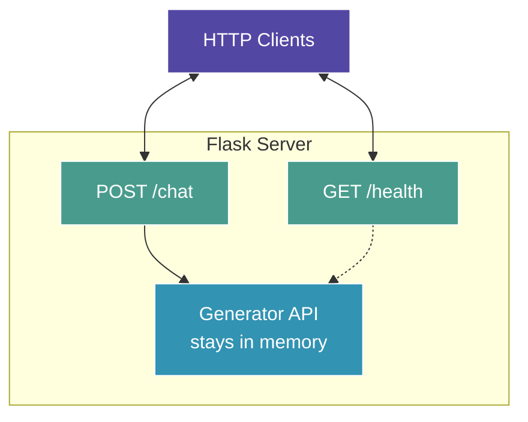

# HTTP API Server with Direct API

Transform your interactive chat into a production-ready HTTP API using the Generator API - perfect for building applications that need fast, reliable inference.

## From Chat to API

In Lesson 4, you built an interactive terminal chat. Now you'll wrap that same Generator API pattern in an HTTP server, enabling:

- Query the model from any programming language
- Build web applications with AI features
- Create microservices architectures
- Test with simple curl commands
- Deploy to production with proper scaling

The key advantage: **model stays loaded in memory between HTTP requests** for fast responses.

**What you'll build:** A production-grade Flask server with the model loaded once on startup.

## Architecture



**Performance:**
- Load time (startup): 2-5 minutes
- Per-request latency: 1-3 seconds (model already loaded!)
- Scales efficiently for multiple concurrent requests

---

## Starting Fresh?

This lesson builds on Lesson 4. If you're jumping here directly, verify your setup:

### Quick Prerequisite Checks

```bash
# Hardware detected?
tt-smi -s

# tt-metal working?
python3 -c "import ttnn; print('✓ tt-metal ready')"

# Model downloaded (Meta format)?
ls ~/models/Llama-3.1-8B-Instruct/original/consolidated.00.pth

# Dependencies installed?
python3 -c "import pi; print('✓ pi installed')"
python3 -c "import flask; print('✓ flask installed')"
```

**All checks passed?** Continue to Step 1 below.

**If any checks fail:**

**No hardware or tt-metal?**
- See [Hardware Detection](command:tenstorrent.showLesson?%7B%22lessonId%22%3A%22hardware-detection%22%7D) and [Verify Installation](command:tenstorrent.showLesson?%7B%22lessonId%22%3A%22verify-installation%22%7D)

**No model?**
- See [Download Model](command:tenstorrent.showLesson?%7B%22lessonId%22%3A%22download-model%22%7D)
- Quick download:
  ```bash
  huggingface-cli login
  hf download meta-llama/Llama-3.1-8B-Instruct \
    --local-dir ~/models/Llama-3.1-8B-Instruct
  ```

**No dependencies?**
- Install Direct API dependencies:
  ```bash
  pip install pi flask
  pip install git+https://github.com/tenstorrent/llama-models.git@tt_metal_tag
  ```

---

## Prerequisites

Same as Lesson 4:
- tt-metal installed and working
- Model downloaded (Llama-3.1-8B-Instruct) in **Meta format** (`original/` subdirectory)
- Dependencies: `pi`, `llama-models`, and `flask` packages

---

## Step 1: Install Flask (If Not Already Done)

Flask is a lightweight Python web framework:

```bash
pip install flask
```

[📦 Install Flask](command:tenstorrent.installFlask)

**What this does:**
- Installs Flask and its dependencies
- Takes just a few seconds
- Only needed once per environment

## Step 2: Create the API Server Script

This command creates `~/tt-scratchpad/tt-api-server-direct.py`:

```bash
# Creates the API server with direct Generator API
mkdir -p ~/tt-scratchpad && cp template ~/tt-scratchpad/tt-api-server-direct.py && chmod +x ~/tt-scratchpad/tt-api-server-direct.py
```

[🌐 Create API Server Script](command:tenstorrent.createApiServerDirect)

**What this does:**
- Creates `~/tt-scratchpad/tt-api-server-direct.py` with Flask + Generator API
- **Opens the file in your editor** so you can see the implementation!
- Makes it executable

**What's inside:**
- `initialize_model()` - Loads model once at server startup
- `generate_response()` - Fast inference using the loaded model
- Flask routes for `/health` and `/chat`
- Proper error handling and JSON responses

## Step 3: Start the API Server

Now start the server (this takes 2-5 minutes to load the model):

```bash
cd ~/tt-metal && \
  export HF_MODEL=~/models/Llama-3.1-8B-Instruct && \
  export PYTHONPATH=$(pwd) && \
  python3 ~/tt-scratchpad/tt-api-server-direct.py --port 8080
```

[🚀 Start API Server (Direct API)](command:tenstorrent.startApiServerDirect)

**What you'll see:**

```text
🔄 Importing tt-metal libraries and loading model...
   This will take 2-5 minutes on first run...

📥 Initializing Tenstorrent mesh device...
📥 Loading model into memory...
✅ Model loaded successfully!

🌐 Llama API Server (Direct API) on Tenstorrent
============================================================
Model: meta-llama/Llama-3.1-8B-Instruct

🚀 Server ready on http://127.0.0.1:8080

Available endpoints:
  • GET  http://127.0.0.1:8080/health
  • POST http://127.0.0.1:8080/chat

Note: Model is loaded in memory - inference is fast!
      No reloading between requests.

Press CTRL+C to stop the server

 * Running on http://127.0.0.1:8080
```

**The model is now loaded and ready!** Leave this terminal open.

## Step 4: Test with curl

Open a **second terminal** and test the API.

### Health Check

Verify the server is running and the model is loaded:

```bash
curl http://localhost:8080/health
```

Response:
```json
{
  "status": "healthy",
  "model": "meta-llama/Llama-3.1-8B-Instruct",
  "model_loaded": true,
  "note": "Model is loaded in memory for fast inference"
}
```

### Basic Inference Query

Send your first prompt (**notice how fast it is!**):

```bash
curl -X POST http://localhost:8080/chat \
  -H "Content-Type: application/json" \
  -d '{"prompt": "What is machine learning?"}'
```

[💬 Test: Basic Inference](command:tenstorrent.testApiBasicDirect)

**Response:**
```json
{
  "prompt": "What is machine learning?",
  "response": "Machine learning is a subset of artificial intelligence...",
  "tokens_generated": 45,
  "time_seconds": 1.23,
  "tokens_per_second": 36.6
}
```

**Notice:** Only 1-3 seconds! The model was already loaded.

### Try Multiple Queries

Send several requests to see the speed:

```bash
# Question about AI
curl -X POST http://localhost:8080/chat \
  -H "Content-Type: application/json" \
  -d '{"prompt": "Explain neural networks in simple terms"}'

# Creative writing
curl -X POST http://localhost:8080/chat \
  -H "Content-Type: application/json" \
  -d '{"prompt": "Write a haiku about programming"}'

# Technical question
curl -X POST http://localhost:8080/chat \
  -H "Content-Type: application/json" \
  -d '{"prompt": "What are transformers in AI?"}'
```

[🔄 Test: Multiple Queries](command:tenstorrent.testApiMultipleDirect)

**Each request takes ~1-3 seconds** because the model stays loaded!

### Custom Parameters

Control generation with optional parameters:

```bash
# Longer response
curl -X POST http://localhost:8080/chat \
  -H "Content-Type: application/json" \
  -d '{
    "prompt": "Explain quantum computing",
    "max_tokens": 256
  }'

# More creative (higher temperature)
curl -X POST http://localhost:8080/chat \
  -H "Content-Type: application/json" \
  -d '{
    "prompt": "Write a creative story",
    "max_tokens": 200,
    "temperature": 0.7
  }'
```

## API Reference

### POST /chat

Generates text using the loaded model.

**Request Body (JSON):**
```json
{
  "prompt": "Your question here",
  "max_tokens": 128,        // Optional, default: 128
  "temperature": 0.0        // Optional, default: 0.0 (greedy)
}
```

**Response (JSON):**
```json
{
  "prompt": "Your question here",
  "response": "Generated response...",
  "tokens_generated": 45,
  "time_seconds": 1.23,
  "tokens_per_second": 36.6
}
```

**Parameters:**
- `prompt` (required): Your input text
- `max_tokens` (optional): Maximum tokens to generate (1-2048, default: 128)
- `temperature` (optional): Sampling temperature (0.0-2.0, default: 0.0)
  - 0.0 = deterministic (greedy)
  - 0.7 = balanced creativity
  - 1.0+ = very creative

**Error Response:**
```json
{
  "error": "Error message here"
}
```

### GET /health

Health check endpoint.

**Response (JSON):**
```json
{
  "status": "healthy",
  "model": "meta-llama/Llama-3.1-8B-Instruct",
  "model_loaded": true,
  "note": "Model is loaded in memory for fast inference"
}
```

## Using from Python

Query the API from Python scripts:

```python
import requests

response = requests.post(
    "http://localhost:8080/chat",
    json={
        "prompt": "What is machine learning?",
        "max_tokens": 128,
        "temperature": 0.0
    }
)

data = response.json()
print(f"Response: {data['response']}")
print(f"Speed: {data['tokens_per_second']:.1f} tokens/sec")
```

## Using from JavaScript

Query from a web application:

```javascript
fetch('http://localhost:8080/chat', {
  method: 'POST',
  headers: { 'Content-Type': 'application/json' },
  body: JSON.stringify({
    prompt: 'What is machine learning?',
    max_tokens: 128
  })
})
.then(res => res.json())
.then(data => {
  console.log('Response:', data.response);
  console.log('Speed:', data.tokens_per_second, 'tok/s');
});
```

## Understanding the Code

**Open `~/tt-scratchpad/tt-api-server-direct.py` in your editor** (it opened automatically). Key sections:

### Initialization (Lines ~80-135)

```python
def initialize_model():
    """Load model once at startup"""
    global GENERATOR, MODEL_ARGS, ...

    # Open mesh device
    MESH_DEVICE = ttnn.open_mesh_device(...)

    # Create model
    MODEL_ARGS, MODEL, TT_KV_CACHE, _ = create_tt_model(
        MESH_DEVICE,
        instruct=True,
        optimizations=DecodersPrecision.performance,
        ...
    )

    # Create generator
    GENERATOR = Generator([MODEL], [MODEL_ARGS], MESH_DEVICE, ...)
```

**This runs once when the server starts!**

### Request Handling (Lines ~140-200)

```python
def generate_response(prompt, max_tokens=128, temperature=0.0):
    """Use the loaded model for fast inference"""
    # Preprocess
    tokens, encoded, pos, lens = preprocess_inputs_prefill([prompt], ...)

    # Prefill and decode using the GLOBAL model
    logits = GENERATOR.prefill_forward_text(...)
    for _ in range(max_tokens):
        logits = GENERATOR.decode_forward_text(...)

    return response, tokens_generated
```

**This runs for each HTTP request - fast!**

### Flask Routes (Lines ~205-250)

```python
@app.route('/chat', methods=['POST'])
def chat():
    data = request.get_json()
    prompt = data['prompt']
    max_tokens = data.get('max_tokens', 128)
    temperature = data.get('temperature', 0.0)

    response, tokens = generate_response(prompt, max_tokens, temperature)

    return jsonify({
        "prompt": prompt,
        "response": response,
        "tokens_generated": tokens,
        ...
    })
```

## Performance Metrics

Watch the server logs to see real-time performance:

```text
📝 Request: What is machine learning?...
✓ Generated 45 tokens in 1.23s (36.6 tok/s)

📝 Request: Explain neural networks...
✓ Generated 52 tokens in 1.41s (36.9 tok/s)
```

**Typical performance:**
- Latency: 1-3 seconds per request
- Throughput: 20-40 tokens/second
- Memory: ~8GB (model stays loaded)

## Customization Ideas

**1. Add authentication**
```python
@app.route('/chat', methods=['POST'])
def chat():
    auth_token = request.headers.get('Authorization')
    if auth_token != 'Bearer your-secret-token':
        return jsonify({"error": "Unauthorized"}), 401
    ...
```

**2. Rate limiting**
```python
from flask_limiter import Limiter

limiter = Limiter(app, default_limits=["10 per minute"])

@app.route('/chat', methods=['POST'])
@limiter.limit("5 per minute")
def chat():
    ...
```

**3. Streaming responses**
```python
from flask import stream_with_context

@app.route('/chat/stream', methods=['POST'])
def chat_stream():
    def generate():
        for token in generate_tokens(prompt):
            yield f"data: {token}\n\n"

    return Response(stream_with_context(generate()),
                   mimetype='text/event-stream')
```

**4. Request logging**
```python
import logging

logging.basicConfig(filename='api.log', level=logging.INFO)

@app.route('/chat', methods=['POST'])
def chat():
    logging.info(f"Request from {request.remote_addr}: {prompt[:50]}")
    ...
```

## Deployment Considerations

**For production:**

1. **Use a production WSGI server:**
```bash
pip install gunicorn
gunicorn -w 1 -b 0.0.0.0:8080 tt-api-server-direct:app
```

2. **Add HTTPS:**
```bash
# Use nginx or Apache as reverse proxy with SSL
```

3. **Monitor and scale:**
- Track latency and throughput
- Use load balancer for multiple instances
- Monitor GPU/NPU memory usage

4. **Add proper error handling:**
- Timeout protection
- Input validation
- Request queuing

## Stopping the Server

To stop the server:
1. Switch to the server terminal
2. Press `Ctrl+C`

The model will unload and cleanup happens automatically.

## Troubleshooting

**Port already in use:**
```bash
python3 ~/tt-scratchpad/tt-api-server-direct.py --port 8081
```

**Connection refused:**
- Check server is running (look for "Server ready" message)
- Verify correct port
- Try `http://127.0.0.1:8080` instead of `localhost`

**Slow responses:**
- First request may be slightly slower (cache warming)
- Check server logs for performance metrics
- Reduce `max_tokens` for faster responses

**Out of memory:**
- Only run one server instance at a time
- Close other programs
- Use smaller `max_seq_len` during initialization

## What You Learned

- ✅ How to build HTTP APIs with the Generator API
- ✅ Model initialization vs. request handling
- ✅ Flask server patterns for AI inference
- ✅ API design with proper JSON responses
- ✅ Performance monitoring and optimization

**Key takeaway:** Production AI APIs load the model once and handle many requests efficiently. This is the foundation for building scalable AI services.

## What's Next?

You now have:
- ✅ Interactive chat (Lesson 4)
- ✅ HTTP API server (Lesson 5)

Want to go even further? **Lesson 6** introduces **vLLM** - a production-grade inference engine with:
- OpenAI-compatible API
- Continuous batching (serve multiple users efficiently)
- Advanced optimizations
- Battle-tested at scale

Continue to Lesson 6: Production Inference with vLLM!

## Learn More

- [Flask Documentation](https://flask.palletsprojects.com/)
- [REST API Best Practices](https://restfulapi.net/)
- [TT-Metal Generator API](https://github.com/tenstorrent/tt-metal/blob/main/models/tt_transformers/tt/generator.py)
