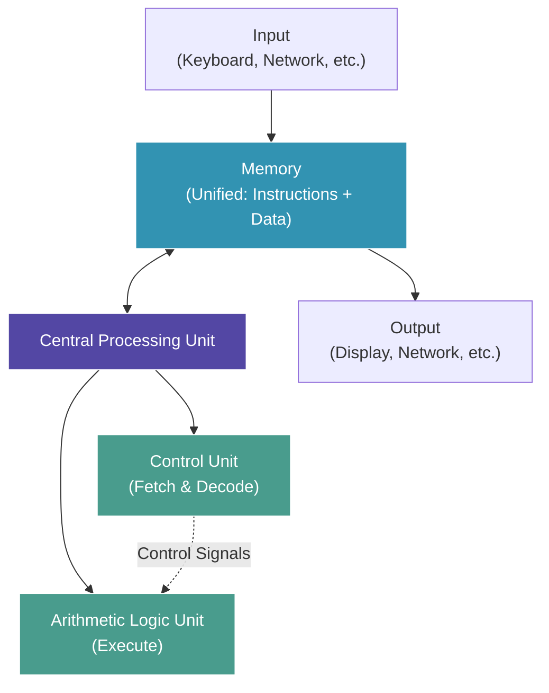
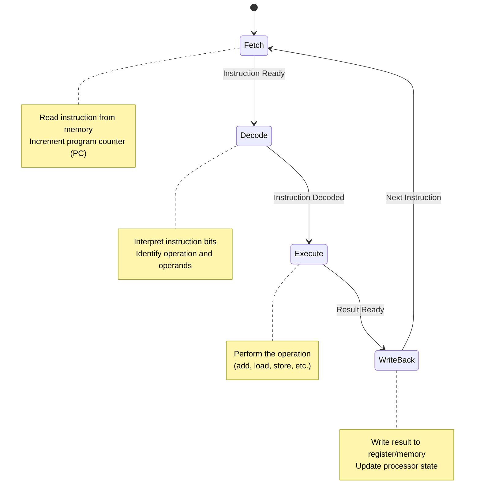
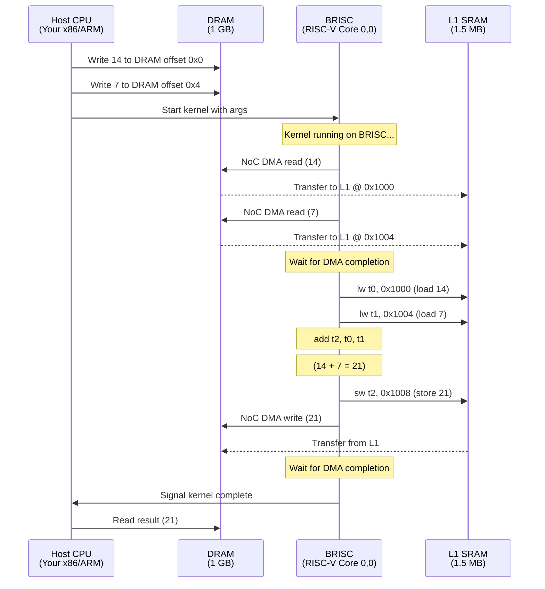

# Module 1: RISC-V & Computer Architecture

## Introduction: From Abstraction to Silicon Through RISC-V

As an industry professional, you've written countless lines of code. You understand APIs, frameworks, databases, and distributed systems. But what actually *happens* when you write `x = a + b`?

**This series takes you from CS theory to real silicon.** Not in a textbook, not in a simulator, but on hardware you can touch - with **880 RISC-V processors** at your command.

### What You'll Learn

By the end of this module, you'll understand:

- ✅ **Von Neumann Architecture** - The foundation of every computer since 1945
- ✅ **Fetch-Decode-Execute Cycle** - What CPUs actually do, millions of times per second
- ✅ **RISC-V ISA** - The instruction set that runs the world (and this chip)
- ✅ **One Core Deeply** - Master one processor before scaling to 880

**Philosophy:** Understanding 880 cores starts with understanding ONE core completely.

---

## Part 1: CS Theory - What is a Computer?

### The Von Neumann Architecture (1945)

Every modern computer - your laptop, your phone, your GPU, this Tenstorrent chip - follows the same fundamental architecture proposed by John von Neumann in 1945:



**Key Insight:** Instructions and data live in the same memory. The program is just data that tells the computer what to do.

### The Fetch-Decode-Execute Cycle

Every processor, whether it's your laptop's Intel Core or this Tenstorrent BRISC, does the same thing repeatedly:



**This cycle runs billions of times per second.** Understanding it deeply is the key to performance optimization.

### Turing Completeness

A computer is **Turing complete** if it can:
1. Perform arbitrary arithmetic
2. Store and retrieve data from memory
3. Make conditional decisions (if/then)
4. Loop indefinitely

**The BRISC processor we're about to program is Turing complete.** With just 32 registers and a small instruction set, it can compute anything computable.

---

## Part 2: Why This Matters (Industry Context)

### "But I Write Python/Java/Go..."

You might think: *"I haven't thought about CPU instructions since my undergrad CS course. Why does this matter now?"*

**Three reasons:**

#### 1. Performance Debugging
When your Python code is slow, it's often because:
- Cache misses (memory hierarchy - Module 2)
- False sharing (synchronization - Module 5)
- Branch misprediction (speculation)

**You can't fix what you don't understand.**

#### 2. Hardware Acceleration
Modern software runs on GPUs, TPUs, NPUs, and custom accelerators. They all follow the same principles:
- Parallel execution (Module 3)
- Explicit memory management (Module 2)
- Network communication (Module 4)

**Tenstorrent hardware makes these principles *visible* and *programmable*.**

#### 3. The Abstraction is Leaking
Your framework hides the hardware... until it doesn't:
- Why is NumPy 100x faster than Python loops?
- Why do GPUs need "kernel fusion"?
- Why does "data locality" matter in databases?

**Understanding the hardware explains the software.**

### Industry Examples

**Google's TPUs:** Custom matrix multiplication units with explicit SRAM management (just like what we'll program)

**NVIDIA's GPUs:** 10,000+ cores with explicit synchronization barriers (just like our NoC)

**AWS Graviton:** ARM processors with similar RISC architecture to RISC-V

**This lesson teaches you principles that apply everywhere.**

---

## Part 3: On Real Hardware - The BRISC Processor

### Meet Your 880 Computers

A Tenstorrent Wormhole chip contains **176 Tensix cores**. Each Tensix contains **5 RISC-V processors**:

```text
┌─────────────────────────────────────────────────────────┐
│  Tensix Core (one of 176)                               │
│                                                          │
│  ┌──────────────┐  ┌──────────────┐  ┌──────────────┐  │
│  │   BRISC      │  │   NCRISC     │  │   TRISC0     │  │
│  │ (Data Move)  │  │ (Data Move)  │  │  (Unpack)    │  │
│  │  RV32IM      │  │  RV32IM      │  │  RV32IM      │  │
│  └──────────────┘  └──────────────┘  └──────────────┘  │
│                                                          │
│  ┌──────────────┐  ┌──────────────┐                     │
│  │   TRISC1     │  │   TRISC2     │                     │
│  │   (Math)     │  │   (Pack)     │                     │
│  │   RV32IM     │  │   RV32IM     │                     │
│  └──────────────┘  └──────────────┘                     │
│                                                          │
│  Shared: 1.5 MB L1 SRAM                                 │
└─────────────────────────────────────────────────────────┘

176 Tensix × 5 RISC-V cores = 880 processors
```

**Today, we focus on BRISC (RISCV_0)** - the primary data movement processor.

### RISC-V ISA: RV32IM

BRISC implements the **RV32IM instruction set**:
- **RV32**: 32-bit architecture (registers and addresses)
- **I**: Integer base instructions (add, load, store, branch)
- **M**: Multiplication and division

**Total instruction set: ~50 instructions.** (Compare to x86's 1000+ instructions!)

**RISC Philosophy:** Simple instructions, executed fast. Complexity goes in the compiler, not the hardware.

### The BRISC Programmer's Model

When you write a BRISC kernel, you have:

**32 General-Purpose Registers:**
```
x0  (zero)  - Always 0 (hardware enforced)
x1  (ra)    - Return address
x2  (sp)    - Stack pointer
x3  (gp)    - Global pointer
x4  (tp)    - Thread pointer
x5-x7       - Temporaries
x8-x9       - Saved registers
x10-x17     - Arguments/return values
x18-x27     - Saved registers
x28-x31     - Temporaries
```

**Program Counter (PC):**
- Points to the next instruction to execute
- Incremented after each fetch (PC += 4)
- Modified by branches/jumps

**Memory:**
- **L1 SRAM (1.5 MB)** - Directly addressable, shared with other cores
- **DRAM (1 GB+)** - Accessed via NoC DMA only

---

## Part 4: Hands-On - Run Your First RISC-V Program

Let's run the canonical first program: **adding two integers**.

### Step 1: Build Programming Examples

First, build tt-metal with RISC-V programming examples enabled:

```bash
cd ~/tt-metal && \
  ./build_metal.sh --build-programming-examples
```

[🔨 Build Programming Examples](command:tenstorrent.buildProgrammingExamples)

**This takes 5-10 minutes.** The build system:
1. Compiles host C++ code (x86/ARM)
2. Compiles RISC-V kernels (using riscv32-gcc cross-compiler)
3. Links everything together

### Step 2: Run the Addition Example

Now run the example:

```bash
cd ~/tt-metal && \
  export TT_METAL_DPRINT_CORES=0,0 && \
  ./build_Release/programming_examples/metal_example_add_2_integers_in_riscv
```

[🚀 Run RISC-V Addition](command:tenstorrent.runRiscvExample)

**Expected output:**
```
Success: Result is 21
0:(x=0,y=0):BR: Adding integers: 14 + 7
```

**Note:** You'll see device initialization logs and possibly firmware version warnings before the output. These are normal - the system initializes all detected hardware before running your kernel. On multi-device systems (like QuietBox), you'll see initialization for all cards even though only device 0 is used.

**🎉 Congratulations!** You just ran a program on a RISC-V processor.

### Step 3: Understand What Happened

Let's trace the execution step by step:



**Key Points:**
1. **Host controls setup** - Writes input data, launches kernel
2. **BRISC does the work** - Fetches data, computes, writes back
3. **NoC DMA moves data** - Between DRAM and L1 SRAM
4. **Explicit synchronization** - Barriers wait for DMA completion

This is **bare-metal programming**. No OS, no abstractions, complete control.

---

## Part 5: Dive Deeper - The RISC-V Kernel

Let's examine the actual kernel code:

[📖 Open Kernel Source](command:tenstorrent.openRiscvKernel)

**File:** `~/tt-metal/tt_metal/programming_examples/add_2_integers_in_riscv/kernels/reader_writer_add_in_riscv.cpp`

### Runtime Arguments

The host passes arguments to the kernel:

```cpp
void kernel_main() {
    // Host tells us where DRAM buffers are
    uint32_t src0_dram = get_arg_val<uint32_t>(0);  // Address of first integer
    uint32_t src1_dram = get_arg_val<uint32_t>(1);  // Address of second integer
    uint32_t dst_dram  = get_arg_val<uint32_t>(2);  // Where to write result

    // Host tells us where to use L1 SRAM
    uint32_t src0_l1   = get_arg_val<uint32_t>(3);  // L1 buffer for first int
    uint32_t src1_l1   = get_arg_val<uint32_t>(4);  // L1 buffer for second int
    uint32_t dst_l1    = get_arg_val<uint32_t>(5);  // L1 buffer for result
```

**Why separate DRAM and L1 addresses?**
- DRAM: Large (1 GB+), slow access (~200 cycles via NoC)
- L1 SRAM: Small (1.5 MB), fast access (~1 cycle direct)
- Pattern: DMA from DRAM to L1, compute on L1, DMA back

### NoC DMA Operations

Moving data from DRAM to L1:

```cpp
    // Calculate NoC addresses (include X,Y coordinates)
    uint64_t src0_dram_noc_addr = get_noc_addr(0, src0);
    uint64_t src1_dram_noc_addr = get_noc_addr(0, src1);

    // Asynchronous DMA: Start transfers in parallel
    noc_async_read(src0_dram_noc_addr, src0_l1, sizeof(uint32_t));
    noc_async_read(src1_dram_noc_addr, src1_l1, sizeof(uint32_t));

    // Wait for both transfers to complete
    noc_async_read_barrier();
```

**Key concept: Asynchronous DMA**
- `noc_async_read()` starts the transfer and returns immediately
- BRISC can do other work while DMA happens
- `noc_async_read_barrier()` blocks until all transfers finish

**This is explicit parallelism** - DMA happens on dedicated hardware while the processor continues.

### The RISC-V Addition

Now the actual computation:

```cpp
    // Cast L1 addresses to pointers
    uint32_t* dat0 = (uint32_t*)src0_l1;  // Points to L1 SRAM
    uint32_t* dat1 = (uint32_t*)src1_l1;
    uint32_t* out0 = (uint32_t*)dst_l1;

    // This C++ code compiles to RISC-V assembly:
    //   lw   t0, 0(a0)     # Load *dat0 into register t0
    //   lw   t1, 0(a1)     # Load *dat1 into register t1
    //   add  t2, t0, t1    # Add t0 + t1, result in t2
    //   sw   t2, 0(a2)     # Store t2 to *out0

    (*out0) = (*dat0) + (*dat1);

    // Debug print (visible with TT_METAL_DPRINT_CORES=0,0)
    DPRINT << "Adding integers: " << *dat0 << " + " << *dat1 << "\n";
```

**From C++ to RISC-V:**

The expression `(*out0) = (*dat0) + (*dat1)` becomes:

```asm
# RISC-V Assembly (what actually executes)
lw   t0, 0(a0)      # Load word from address in a0 → t0
lw   t1, 0(a1)      # Load word from address in a1 → t1
add  t2, t0, t1     # Add t0 and t1 → t2
sw   t2, 0(a2)      # Store word from t2 → address in a2
```

**This is the fetch-decode-execute cycle in action:**

1. **Fetch:** Read `lw t0, 0(a0)` from instruction memory
2. **Decode:** "Load word, source=memory[a0], dest=t0"
3. **Execute:** Read from L1 SRAM at address in a0
4. **Write Back:** Write value to register t0
5. **Repeat** for next instruction

### Writing Result Back to DRAM

Finally, DMA the result back:

```cpp
    // DMA write from L1 to DRAM
    uint64_t dst_dram_noc_addr = get_noc_addr(0, dst);
    noc_async_write(dst_l1, dst_dram_noc_addr, sizeof(uint32_t));

    // Wait for write to complete before kernel exits
    noc_async_write_barrier();
}
```

**Why the barrier at the end?**
- If the kernel exits before DMA completes, the result might not be written
- Explicit synchronization ensures correctness
- Compare to x86 where writes "just work" (cache coherence hardware handles it)

---

## Part 6: Experiments and Discussion

### Experiment 1: Change the Operation

Modify the kernel to multiply instead of add:

```cpp
// Change this line:
(*out0) = (*dat0) + (*dat1);

// To this:
(*out0) = (*dat0) * (*dat1);
```

**Rebuild and run:**
```bash
cd ~/tt-metal
./build_metal.sh --build-programming-examples
./build_Release/programming_examples/metal_example_add_2_integers_in_riscv
```

**Question:** How does the RISC-V assembly change?
- Addition: `add t2, t0, t1` (one instruction, one cycle)
- Multiplication: `mul t2, t0, t1` (one instruction, but ~3 cycles on RISC-V)

### Experiment 2: Remove the Barrier

Comment out the DMA barrier:

```cpp
noc_async_read(src0_dram_noc_addr, src0_l1, sizeof(uint32_t));
noc_async_read(src1_dram_noc_addr, src1_l1, sizeof(uint32_t));
// noc_async_read_barrier();  ← COMMENT THIS OUT
```

**What happens?**
- The kernel might read garbage from L1 (DMA not complete yet)
- You'll get wrong answers (race condition!)
- This demonstrates **why synchronization matters**

### Experiment 3: Measure DMA vs Compute Time

Modify the kernel to measure cycles:

```cpp
uint64_t start = get_cycle_count();
noc_async_read(src0_dram_noc_addr, src0_l1, sizeof(uint32_t));
noc_async_read_barrier();
uint64_t dma_cycles = get_cycle_count() - start;

start = get_cycle_count();
(*out0) = (*dat0) + (*dat1);
uint64_t compute_cycles = get_cycle_count() - start;

DPRINT << "DMA: " << dma_cycles << " cycles, Compute: " << compute_cycles << " cycles\n";
```

**Typical result:**
- DMA: ~200 cycles (memory latency)
- Compute: ~4 cycles (load, load, add, store)

**Insight:** Memory access is 50x slower than computation!

This is why **near-memory compute** matters - Module 2 explores this deeply.

---

## Part 7: Discussion Questions

### Question 1: Why RISC vs CISC?

**RISC (Reduced Instruction Set Computing):**
- Simple instructions (add, load, store)
- Fixed instruction size (32 bits)
- Easy to pipeline and parallelize
- Compiler does the optimization

**CISC (Complex Instruction Set Computing):**
- Complex instructions (e.g., x86's `ADDPS` adds 4 floats in one instruction)
- Variable instruction size (1-15 bytes on x86)
- More work per instruction, but harder to pipeline

**Question:** Why did Tenstorrent choose RISC-V over x86 or ARM?
- **Answer:** Simpler hardware, easier to replicate 880 times, better for parallel workloads

### Question 2: What Makes a Good Instruction Set?

Consider these design tradeoffs:
- More instructions = More silicon area per core
- Complex instructions = Harder to pipeline = Lower clock frequency
- Simple instructions = More instructions per program = More instruction memory

**Question:** Is there a "perfect" ISA?
- **Answer:** No! It depends on the workload. RISC-V is great for parallel data processing (what Tenstorrent does), x86 is great for sequential legacy code (what your laptop does).

### Question 3: How Does This Compare to Your CPU?

Your laptop's CPU has:
- **Out-of-order execution** - Instructions can execute in any order
- **Branch prediction** - Guesses which way an `if` will go
- **Speculative execution** - Executes both sides of an `if` before deciding
- **Cache coherence** - Automatic synchronization between cores

**BRISC has NONE of these.**

**Question:** Is BRISC "worse" than your laptop's CPU?
- **Answer:** No! It's *different*. BRISC is simple, predictable, and easy to replicate 880 times. Your laptop's CPU is complex, fast for single-threaded code, but hard to scale beyond ~16 cores.

**Different tools for different jobs.**

---

## Part 8: Connections to Other Systems

### GPUs (NVIDIA, AMD)

GPUs have thousands of simple cores (like BRISC) running SIMT (Single Instruction, Multiple Threads):
- Each core executes the same instruction
- Different cores process different data
- Explicit memory hierarchy (global → shared → registers)
- Explicit synchronization (`__syncthreads()`)

**Sound familiar?** That's what we're learning here.

### Cloud FPGAs (AWS F1, Azure NP-Series)

FPGAs let you design custom processors:
- You could implement a RISC-V core in an FPGA
- Full control over instruction set and memory hierarchy
- But: Much more complex to program

**Tenstorrent gives you FPGA-like control with CPU-like programming.**

### Embedded RISC-V (SiFive, ESP32-C3)

Other RISC-V chips exist, but typically:
- 1-4 cores (vs our 880)
- No network-on-chip (single shared bus)
- KB of memory (vs our 1.5 MB L1 per core)

**Tenstorrent is RISC-V at datacenter scale.**

---

## Part 9: Key Takeaways

After completing this module, you should understand:

✅ **Von Neumann Architecture** - The fetch-decode-execute cycle is fundamental
✅ **RISC-V ISA** - Simple instructions executed quickly
✅ **Memory Hierarchy** - DRAM is slow, L1 SRAM is fast (Module 2 deepens this)
✅ **Explicit Control** - No OS, no abstractions, you control everything
✅ **One Core Mastered** - Now we can scale to 880 cores (Module 3)

### What We Skipped (For Now)

- **Pipelining** - How CPUs overlap instructions (comes up in Module 7)
- **Memory addressing modes** - We only used direct loads/stores
- **The other 4 RISC-V cores** - NCRISC, TRISC0/1/2 (Module 6 covers this)
- **Multi-core communication** - How 880 cores talk to each other (Module 4)

**We're building up systematically.** Each module adds one concept.

---

## Part 10: Next Steps

### Recommended Experiments

Before moving to Module 2, try these:

1. **Modify the integers:** Change from 14+7 to 1000000+2000000
2. **Try division:** Replace `+` with `/` and see the RISC-V `div` instruction
3. **Add a third integer:** Extend the kernel to compute `a + b + c`
4. **Measure instruction count:** Use `get_cycle_count()` to profile execution

### Preview of Module 2: Memory Hierarchy

Next, we'll explore **why DRAM is 50x slower than L1**:
- Cache locality (spatial and temporal)
- Bandwidth vs latency tradeoffs
- Near-memory compute advantages
- How to structure data for performance

**Teaser question:** We transferred 4 bytes (one integer) from DRAM to L1. That took ~200 cycles. If we transferred 4 KB (1000 integers), would it take 200,000 cycles?

**Spoiler:** No! Bandwidth is different from latency. Module 2 explains why.

---

## Additional Resources

### RISC-V Learning

- **RISC-V ISA Spec:** https://riscv.org/technical/specifications/
- **RISC-V Reader Book:** Free e-book, excellent introduction
- **RV32IM Reference Card:** One-page summary of all instructions

### Tenstorrent Resources

- **Metalium Guide:** `~/tt-metal/METALIUM_GUIDE.md`
- **Programming Examples:** `~/tt-metal/tt_metal/programming_examples/`
- **Tech Reports:** `~/tt-metal/tech_reports/prog_examples/`

### Community

- **Tenstorrent Discord:** https://discord.gg/tenstorrent
- **GitHub:** https://github.com/tenstorrent/tt-metal

---

## Summary: From Theory to Practice

We started with CS theory:
- **Von Neumann architecture** (1945)
- **Fetch-decode-execute cycle** (every computer)
- **Turing completeness** (what makes a computer universal)

We connected to industry:
- **Why abstractions leak** (Python hides this, but it's still happening)
- **How hardware acceleration works** (GPUs do the same thing)
- **Performance debugging** (understanding instructions = understanding performance)

We ran it on real hardware:
- **880 RISC-V cores** (176 Tensix × 5 cores each)
- **BRISC processor** (RV32IM instruction set)
- **Bare-metal programming** (no OS, complete control)

**Next module:** We explore why memory is slow and what to do about it.

Welcome to CS fundamentals on real hardware. Let's continue! 🚀

[→ Continue to Module 2: Memory Hierarchy](command:tenstorrent.showLesson?%7B%22lessonId%22%3A%22cs-fundamentals-02-memory%22%7D)
