# Module 2: The Memory Hierarchy

## Introduction: Why Memory Matters More Than Compute

In Module 1, we measured something striking:
- **Computing `a + b`:** ~4 cycles
- **Fetching `a` from DRAM:** ~200 cycles

**Memory is 50x slower than computation.**

This imbalance is the defining challenge of modern computing. It doesn't matter how fast your processor is if it's waiting for data.

### What You'll Learn

- ✅ **The Memory Hierarchy** - Registers → Cache → DRAM → Disk
- ✅ **Locality of Reference** - Why some code is 100x faster than other code
- ✅ **Bandwidth vs Latency** - Two different concepts often confused
- ✅ **Near-Memory Compute** - Why Tenstorrent's architecture is different
- ✅ **Practical Optimization** - How to structure data for performance

**Key Insight:** Fast code is about memory access patterns, not clever algorithms.

---

## Part 1: CS Theory - The Memory Hierarchy

### The Memory Pyramid

Every computer system has a hierarchy of memory, trading size for speed:

```mermaid
graph TD
    subgraph "Memory Hierarchy"
    R["Registers<br/>32 × 32-bit<br/>0 cycles<br/>~1 KB"]
    L1["L1 SRAM<br/>1.5 MB per core<br/>1-2 cycles<br/>FAST"]
    L2["L2 Cache<br/>256 KB - 32 MB<br/>10-20 cycles<br/>Medium"]
    DRAM["DRAM<br/>1-64 GB<br/>200+ cycles<br/>SLOW"]
    DISK["Disk/SSD<br/>TB scale<br/>100,000+ cycles<br/>VERY SLOW"]
    end

    R --> L1
    L1 --> L2
    L2 --> DRAM
    DRAM --> DISK

    style R fill:#499c8d,color:#fff
    style L1 fill:#3293b2,color:#fff
    style L2 fill:#5347a4,color:#fff
    style DRAM fill:#666,color:#fff
    style DISK fill:#333,color:#fff
```



**The Rule:** Each level is ~10x larger and ~10x slower than the one above it.

### Why This Hierarchy Exists

**Q:** Why not make everything as fast as registers?
**A:** **Cost and physics.**

| Memory Type | Cost per GB | Latency | Size Limit |
|-------------|-------------|---------|------------|
| SRAM (registers/L1) | $10,000 | 1 cycle | ~10 MB |
| DRAM | $10 | 200 cycles | 100+ GB |
| SSD | $0.10 | 100,000 cycles | TB scale |

**SRAM is 1000x more expensive than DRAM.** Building a 64 GB system from SRAM would cost $640,000!

**Physics:** Larger memories have longer wires → higher latency. Can't beat the speed of light.

### Locality of Reference

Programs exhibit two types of locality:

#### Temporal Locality
**"If you access memory location X, you'll likely access it again soon."**

Example:
```cpp
// Loop counter 'i' is accessed repeatedly
for (int i = 0; i < 1000; i++) {
    sum += data[i];
}
```

**Optimization:** Keep `i` in a register (0 cycles) instead of reloading from memory each time.

#### Spatial Locality
**"If you access memory location X, you'll likely access X+1, X+2... soon."**

Example:
```cpp
// Array elements accessed sequentially
for (int i = 0; i < 1000; i++) {
    sum += data[i];  // data[0], data[1], data[2]...
}
```

**Optimization:** Fetch entire cache line (64 bytes) when you access data[0], not just 4 bytes.

### The 90-10 Rule

**Empirical observation:** 90% of execution time is spent in 10% of the code.

This is WHY caching works:
- Most programs access a small "working set" repeatedly
- Keep that working set in fast memory (L1/L2 cache)
- Only go to slow DRAM when absolutely necessary

**If programs accessed memory randomly, caching wouldn't help.**

---

## Part 2: Industry Context - Memory Bottlenecks Everywhere

### Why NumPy is Fast (and Pure Python is Slow)

Consider summing 1 million numbers:

**Pure Python:**
```python
# Slow: ~100ms
total = 0
for i in range(1_000_000):
    total += numbers[i]  # Python list: pointer chase every iteration
```

**NumPy:**
```python
# Fast: ~1ms (100x faster!)
total = np.sum(numbers)  # Contiguous memory, vectorized, cache-friendly
```

**Why the difference?**
- **Python list:** Each element is a pointer to a PyObject (cache misses everywhere)
- **NumPy array:** Contiguous memory, sequential access (cache hits galore)

**It's not the algorithm (both are O(n)) - it's the memory access pattern.**

### Database Columnar Storage

Traditional row-based storage:
```
Row 1: [id=1,  name="Alice", age=30, salary=100000]
Row 2: [id=2,  name="Bob",   age=25, salary=80000]
Row 3: [id=3,  name="Carol", age=35, salary=120000]
```

Query: "SELECT AVG(salary) FROM employees"
- Must load ALL data (id, name, age, salary) even though we only need salary
- Poor cache utilization

**Columnar storage (Parquet, BigQuery):**
```
Column salary: [100000, 80000, 120000]
```

- Only load the column you need
- Sequential access = excellent cache performance
- **10-100x faster for analytical queries**

### GPU Kernel Fusion

**Problem:** Separate operations = multiple memory round-trips

```python
# Slow: 3 separate kernels, 3 DRAM reads/writes
y = relu(x)          # DRAM → GPU → DRAM
z = batchnorm(y)     # DRAM → GPU → DRAM
output = dropout(z)  # DRAM → GPU → DRAM
```

**Solution:** Fuse into one kernel

```python
# Fast: 1 kernel, 1 DRAM read/write
output = dropout(batchnorm(relu(x)))  # Intermediate results stay in registers
```

**Speedup:** 3-5x, purely from avoiding memory traffic.

**The lesson:** Memory bandwidth is precious. Minimize transfers.

---

## Part 3: On Tenstorrent Hardware - The Memory Hierarchy

### Tenstorrent's Memory Architecture

```text
┌─────────────────────────────────────────────────────┐
│  BRISC Processor (one of 880)                       │
│                                                      │
│  ┌──────────────────────────────────────────────┐  │
│  │  Registers: 32 × 32-bit                      │  │
│  │  Access: 0 cycles                            │  │
│  │  Size: 128 bytes                             │  │
│  └──────────────────────────────────────────────┘  │
│                         ↓                            │
│  ┌──────────────────────────────────────────────┐  │
│  │  L1 SRAM: 1.5 MB (shared by 5 cores)        │  │
│  │  Access: 1-2 cycles                          │  │
│  │  Bandwidth: ~1 TB/s (to local core)         │  │
│  └──────────────────────────────────────────────┘  │
│                         ↓                            │
└─────────────────────────────────────────────────────┘
                          ↓ NoC
┌─────────────────────────────────────────────────────┐
│  DRAM: 1 GB per channel (12 channels = 12 GB)      │
│  Access: 200+ cycles (via NoC)                      │
│  Bandwidth: ~100 GB/s aggregate                     │
└─────────────────────────────────────────────────────┘
```

**Key differences from a typical CPU:**

| Feature | Your Laptop CPU | Tenstorrent |
|---------|-----------------|-------------|
| L1 per core | 32 KB | 1.5 MB (47x larger!) |
| L2 cache | 256 KB - 8 MB | None (explicit control) |
| Cache coherence | Automatic | None (explicit sync) |
| DRAM access | Implicit loads | Explicit DMA |

**Philosophy:** Give programmers a LOT of fast memory (L1) and explicit control over movement.

### No Automatic Caching

**Your CPU hides the memory hierarchy:**
```cpp
int x = array[1000];  // CPU automatically:
                      // 1. Checks L1 cache (miss)
                      // 2. Checks L2 cache (miss)
                      // 3. Fetches from DRAM
                      // 4. Updates L1/L2 caches
                      // You don't control any of this
```

**Tenstorrent makes it explicit:**
```cpp
// You must explicitly DMA from DRAM to L1
noc_async_read(dram_addr, l1_addr, size);
noc_async_read_barrier();

// Now you can access the data in L1
int x = *(int*)l1_addr;  // Fast (1 cycle)
```

**Advantage:** Complete control, predictable performance
**Disadvantage:** More code, more responsibility

### Near-Memory Compute

**Traditional architecture (CPU):**
```
CPU <--[slow bus]--> DRAM
```
- Compute happens far from memory
- All data must travel over slow bus
- Bus becomes bottleneck

**Tenstorrent architecture:**
```
Tensix Core (Compute + 1.5 MB SRAM) <--[NoC]--> DRAM
```
- Compute happens NEXT to fast memory (L1)
- Only bring working set from DRAM once
- Do lots of computation on L1 data
- **Memory-bandwidth advantage**

**This is why Tenstorrent is good at AI workloads** - lots of reuse of data in L1.

---

## Part 4: Hands-On - Measuring Memory Performance

Let's write experiments to measure latency and bandwidth.

### Experiment Setup

We'll create two programs:
1. **Latency test:** Access single elements (worst case for cache)
2. **Bandwidth test:** Access large sequential chunks (best case for cache)

### Build the Memory Hierarchy Example

First, let's build a custom example:

```bash
cd ~/tt-metal
./build_metal.sh --build-programming-examples
```

[🔨 Build Examples](command:tenstorrent.buildProgrammingExamples)

### Experiment 1: Latency - Random Access

**Scenario:** Access 1000 random locations in DRAM

```cpp
// Kernel: random_access.cpp
void kernel_main() {
    uint32_t* indices = (uint32_t*)get_arg_val<uint32_t>(0);  // Random indices
    uint32_t* dram_data = (uint32_t*)get_arg_val<uint32_t>(1);

    uint64_t start = get_cycle_count();

    uint32_t sum = 0;
    for (int i = 0; i < 1000; i++) {
        uint32_t idx = indices[i];
        // Each access hits a different cache line - WORST CASE
        noc_async_read(dram_data + idx, l1_buffer, sizeof(uint32_t));
        noc_async_read_barrier();
        sum += *(uint32_t*)l1_buffer;
    }

    uint64_t cycles = get_cycle_count() - start;
    DPRINT << "Random access: " << cycles << " cycles\n";
    DPRINT << "Avg latency: " << cycles/1000 << " cycles per access\n";
}
```

**Expected result:**
```
Random access: ~200,000 cycles
Avg latency: ~200 cycles per access
```

**Why?** Each access:
1. Sends NoC request to DRAM controller
2. Waits for DRAM latency (~200 cycles)
3. Transfers data back over NoC
4. No caching benefit (every access is to a different location)

### Experiment 2: Bandwidth - Sequential Access

**Scenario:** Access 1000 sequential locations in DRAM

```cpp
// Kernel: sequential_access.cpp
void kernel_main() {
    uint32_t* dram_data = (uint32_t*)get_arg_val<uint32_t>(0);

    uint64_t start = get_cycle_count();

    // Transfer 1000 integers (4 KB) in ONE DMA
    noc_async_read(dram_data, l1_buffer, 4000);
    noc_async_read_barrier();

    // Now compute on L1 data (fast!)
    uint32_t sum = 0;
    uint32_t* data = (uint32_t*)l1_buffer;
    for (int i = 0; i < 1000; i++) {
        sum += data[i];  // Each access: 1 cycle (L1)
    }

    uint64_t cycles = get_cycle_count() - start;
    DPRINT << "Sequential access: " << cycles << " cycles\n";
    DPRINT << "Avg time: " << cycles/1000 << " cycles per element\n";
}
```

**Expected result:**
```
Sequential access: ~400 cycles (for entire 4 KB)
Avg time: ~0.4 cycles per element
```

**Why the massive difference?**
- **Latency:** 200 cycles to start the transfer
- **Bandwidth:** 1-2 cycles per 32 bytes after that
- Transferring 1000 elements together amortizes latency cost

**Key formula:**
```
Time = Latency + (Size / Bandwidth)
     = 200 cycles + (4000 bytes / 32 bytes-per-cycle)
     = 200 + 125 = ~325 cycles
```

### The Latency vs Bandwidth Insight


**Latency:** Fixed cost to start a transfer (like driving to the store)
**Bandwidth:** Rate of data transfer (like how much you can carry per trip)

**Optimization:** Make fewer, larger transfers (one trip with a truck, not 100 trips with a bicycle).

---

## Part 5: Practical Optimization Strategies

### Strategy 1: Prefetching

**Problem:** Waiting for data stalls the processor

**Solution:** Start loading next data while processing current data

```cpp
// Bad: Serial (load → compute → load → compute)
for (int i = 0; i < 100; i++) {
    noc_async_read(dram + i*SIZE, l1_buffer, SIZE);
    noc_async_read_barrier();
    process(l1_buffer);  // Processor idle during load
}
// Time: 100 × (200 cycles load + 50 cycles compute) = 25,000 cycles

// Good: Pipelined (overlap load and compute)
noc_async_read(dram, l1_buffer[0], SIZE);  // Start first load
for (int i = 0; i < 99; i++) {
    noc_async_read(dram + (i+1)*SIZE, l1_buffer[1], SIZE);  // Start next load
    noc_async_read_barrier();  // Wait for PREVIOUS load
    process(l1_buffer[0]);     // Process while next load happens
    swap(l1_buffer[0], l1_buffer[1]);  // Swap buffers
}
process(l1_buffer[0]);  // Process last chunk
// Time: 200 cycles (first load) + 100 × max(200, 50) = 20,200 cycles
```

**Speedup:** 1.24x from overlapping memory and compute.

### Strategy 2: Blocking (Tiling)

**Problem:** Working set doesn't fit in L1

**Solution:** Process data in L1-sized chunks

```cpp
// Bad: Process entire 10 MB array (doesn't fit in L1)
for (int i = 0; i < 10*1024*1024; i++) {
    result[i] = input[i] * 2;  // DRAM access every iteration - SLOW
}

// Good: Process in 1 MB chunks (fits in L1)
for (int block = 0; block < 10; block++) {
    // Load 1 MB into L1
    noc_async_read(dram + block*MB, l1_input, MB);
    noc_async_read_barrier();

    // Process entirely from L1 (fast!)
    for (int i = 0; i < MB/4; i++) {
        l1_output[i] = l1_input[i] * 2;  // 1 cycle per iteration
    }

    // Write back to DRAM
    noc_async_write(l1_output, dram_out + block*MB, MB);
    noc_async_write_barrier();
}
```

**This is how matrix multiplication works:**
- Divide matrices into blocks that fit in L1
- Load blocks once, reuse many times
- **10-100x speedup** over naive implementation

### Strategy 3: Data Layout

**Problem:** Access pattern determines performance

**Bad layout (Array of Structs):**
```cpp
struct Particle {
    float x, y, z;      // Position (12 bytes)
    float vx, vy, vz;   // Velocity (12 bytes)
    float mass;         // Mass (4 bytes)
    // Total: 28 bytes per particle
};
Particle particles[1000];

// Update positions (only need x, y, z, vx, vy, vz)
for (int i = 0; i < 1000; i++) {
    particles[i].x += particles[i].vx;  // Load entire 28-byte struct
    particles[i].y += particles[i].vy;  // Even though we only use 24 bytes
    particles[i].z += particles[i].vz;  // 14% wasted bandwidth!
}
```

**Good layout (Struct of Arrays):**
```cpp
struct Particles {
    float x[1000], y[1000], z[1000];
    float vx[1000], vy[1000], vz[1000];
    float mass[1000];
};
Particles particles;

// Update positions (only load what we need)
for (int i = 0; i < 1000; i++) {
    particles.x[i] += particles.vx[i];  // Load only x and vx
    particles.y[i] += particles.vy[i];  // Sequential access, cache-friendly
    particles.z[i] += particles.vz[i];  // No wasted bandwidth
}
```

**Benefit:** Better cache utilization, sequential access, no wasted bandwidth.

**This is why columnar databases exist!**

---

## Part 6: Discussion Questions

### Question 1: Why Not Just Use More SRAM?

**Q:** If SRAM is 50x faster than DRAM, why not build computers with 64 GB of SRAM instead of DRAM?

**A: Cost, power, and physics.**
- **Cost:** 64 GB SRAM = $640,000 (vs $640 for DRAM)
- **Power:** SRAM uses 10x more power per bit than DRAM
- **Size:** SRAM transistor count: 6T per bit, DRAM: 1T+1C per bit
- **Physics:** Larger memory = longer wires = higher latency

**Design tradeoff:** Use SRAM where it matters most (close to compute), DRAM for bulk storage.

### Question 2: What if We Could Eliminate Memory Latency?

**Thought experiment:** Imagine we invented instant memory (0-cycle latency, infinite bandwidth).

**Q:** Would computers be infinitely fast?

**A: No!** Many programs are compute-bound, not memory-bound:
- Cryptography (lots of bitwise operations)
- Compression (complex algorithms)
- Ray tracing (compute-intensive per pixel)

But for data processing (databases, AI inference, scientific computing), **memory is the bottleneck**.

**This is why Tenstorrent's near-memory compute matters.**

### Question 3: How Does Cache Coherence Work?

**Scenario:** Two CPU cores accessing the same memory location

```
Core 0: Reads X (value: 42)
Core 1: Writes X ← 100
Core 0: Reads X again
```

**Q:** Should Core 0 see 42 or 100?

**A: 100 (on x86/ARM).** Hardware cache coherence protocols (MESI, MOESI) automatically synchronize:
1. Core 1 writes X ← 100
2. Hardware invalidates Core 0's cached copy
3. Core 0's next read fetches updated value from Core 1's cache

**On Tenstorrent:** NO cache coherence. You must explicitly synchronize (Module 5 covers this).

**Tradeoff:**
- **Automatic coherence:** Easier to program, but complex hardware, doesn't scale well beyond ~64 cores
- **Explicit synchronization:** More code, but simpler hardware, scales to 880 cores

---

## Part 7: Real-World Example - Matrix Multiplication

Matrix multiplication is the perfect example of memory optimization.

### Naive Implementation (Slow)

```cpp
// C = A × B (all 1000×1000 matrices)
for (int i = 0; i < 1000; i++) {
    for (int j = 0; j < 1000; j++) {
        float sum = 0;
        for (int k = 0; k < 1000; k++) {
            sum += A[i][k] * B[k][j];  // Memory access every iteration
        }
        C[i][j] = sum;
    }
}
```

**Problem:**
- Accesses B in column-major order (stride = 1000, not sequential)
- Poor cache utilization
- Lots of DRAM traffic

**Performance:** ~10 seconds on BRISC

### Blocked Implementation (Fast)

```cpp
// Process in 32×32 blocks that fit in L1
#define BLOCK 32

for (int i0 = 0; i0 < 1000; i0 += BLOCK) {
    for (int j0 = 0; j0 < 1000; j0 += BLOCK) {
        for (int k0 = 0; k0 < 1000; k0 += BLOCK) {
            // Load blocks of A and B into L1
            load_block(A, i0, k0);
            load_block(B, k0, j0);

            // Compute on L1 data (fast!)
            for (int i = i0; i < i0+BLOCK; i++) {
                for (int j = j0; j < j0+BLOCK; j++) {
                    for (int k = k0; k < k0+BLOCK; k++) {
                        C[i][j] += A_l1[i-i0][k-k0] * B_l1[k-k0][j-j0];
                    }
                }
            }
        }
    }
}
```

**Benefits:**
- Each block loaded once, reused 32 times
- All computation happens on L1 data
- Sequential access patterns

**Performance:** ~0.5 seconds on BRISC (20x faster!)

**This is what BLAS libraries (Intel MKL, OpenBLAS) do internally.**

---

## Part 8: Connections to Other Systems

### CPUs (Intel, AMD, ARM)

Modern CPUs have 3-4 levels of cache:
```
L1: 32-64 KB per core, 4 cycles
L2: 256 KB - 1 MB per core, 12 cycles
L3: 8-32 MB shared, 40 cycles
DRAM: 16-64 GB, 200 cycles
```

**Similar hierarchy, automatic management** (vs Tenstorrent's explicit control).

### GPUs (NVIDIA, AMD)

GPU memory hierarchy:
```
Registers: 64 KB per SM, 0 cycles
Shared memory: 48-100 KB per SM, 1-2 cycles (like L1)
L1 cache: 128 KB per SM, automatic
L2 cache: 6-50 MB, automatic
Global memory (GDDR): 16-80 GB, 200+ cycles (like DRAM)
```

**CUDA programming is all about managing shared memory** (equivalent to our L1 SRAM).

### High-Performance Databases

**PostgreSQL, MySQL** (row-based):
- Optimized for transactional workloads (read/write full rows)
- Good when you need all columns

**BigQuery, Snowflake, ClickHouse** (columnar):
- Optimized for analytical workloads (read subset of columns)
- 10-100x faster for analytics
- **Same memory hierarchy principles apply**

---

## Part 9: Key Takeaways

After completing this module, you should understand:

✅ **Memory Hierarchy** - Registers → L1 → DRAM, each 10x slower
✅ **Latency vs Bandwidth** - Two different concepts, both matter
✅ **Locality of Reference** - Why some code is 100x faster
✅ **Near-Memory Compute** - Tenstorrent's architectural advantage
✅ **Practical Optimization** - Prefetching, blocking, data layout

### The Core Insight

**Modern computing is memory-bound, not compute-bound.**

Your bottleneck is:
- Not the algorithm's O(n²) complexity
- Not the processor's GHz rating
- **The memory access pattern**

**Optimizing for cache = 10-100x speedup**, often for free.

---

## Part 10: Preview of Module 3 - Parallelism

Next, we scale from 1 core to 880 cores:

**Teaser question:** We just saw that sequential access to 1000 integers takes ~400 cycles on one core. If we split the work across 880 cores, how fast will it be?

- **Intuition:** 880x faster → 0.45 cycles total
- **Reality:** More like 5-10 cycles total (100-200x speedup)

**Why the difference?** Communication overhead, synchronization, and Amdahl's Law.

**Module 3 explores when parallelism helps (and when it doesn't).**

---

## Additional Resources

### Memory Architecture

- **"What Every Programmer Should Know About Memory"** by Ulrich Drepper (free PDF)
- **"Computer Architecture: A Quantitative Approach"** by Hennessy & Patterson (Chapter 5)

### Performance Optimization

- **"Software Optimization Resources"** by Agner Fog (free)
- **Intel Optimization Manual** (cache behavior deep dive)

### Tenstorrent Specific

- **Metalium Programming Guide:** `~/tt-metal/METALIUM_GUIDE.md`
- **Memory Architecture Docs:** `~/tt-metal/tech_reports/Memory/`

---

## Summary

We explored:
- **Theory:** Cache hierarchies, locality, latency vs bandwidth
- **Industry:** Why NumPy is fast, why databases use columns, why GPUs fuse kernels
- **Tenstorrent:** 1.5 MB L1 SRAM, explicit DMA, near-memory compute
- **Practice:** Measured latency (200 cycles), bandwidth (32 bytes/cycle), optimizations (20x speedup)

**Next:** We take what we've learned and scale to 880 cores in parallel.

[→ Continue to Module 3: Parallel Computing](command:tenstorrent.showLesson?%7B%22lessonId%22%3A%22cs-fundamentals-03-parallelism%22%7D)
