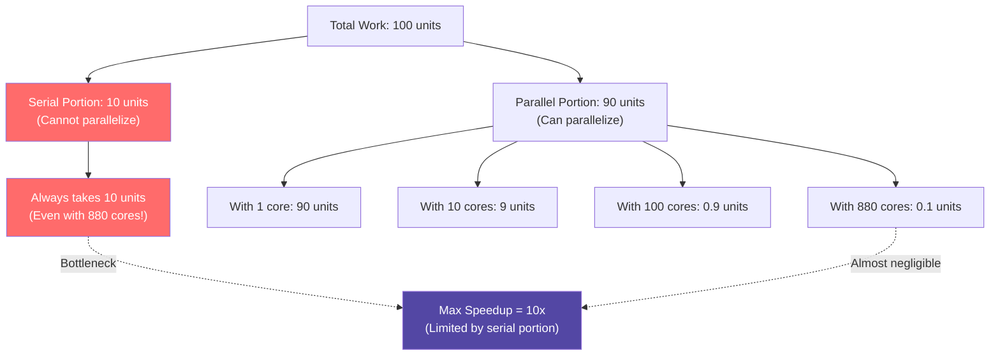

# Module 3: Parallel Computing

## Introduction: From One to 880

You've mastered one RISC-V processor. Now you have **879 more**.

How do you use them? When does adding more cores help? When does it hurt?

**This module answers those questions.**

### What You'll Learn

- ✅ **Amdahl's Law** - The fundamental limit of parallel speedup
- ✅ **Parallel Programming Models** - SIMD, SPMD, task parallelism
- ✅ **Scaling Analysis** - Strong scaling vs weak scaling
- ✅ **Communication Costs** - Why 880 cores isn't 880x faster
- ✅ **Real Speedup** - Measuring parallel efficiency on Tenstorrent hardware

**Key Insight:** More cores is not always better. Parallelism is a tool, not magic.

---

## Part 1: CS Theory - The Laws of Parallelism

### Amdahl's Law (1967)

**The most important equation in parallel computing:**

```
Speedup = 1 / ((1 - P) + P/N)

Where:
  P = Fraction of work that can be parallelized
  N = Number of processors
  (1 - P) = Serial fraction (cannot be parallelized)
```

**Example:** Your program is 90% parallel (P = 0.9), 10% serial

```
Speedup with 2 cores:   1 / (0.1 + 0.9/2)  = 1.82x
Speedup with 10 cores:  1 / (0.1 + 0.9/10) = 5.26x
Speedup with 100 cores: 1 / (0.1 + 0.9/100) = 9.17x
Speedup with ∞ cores:   1 / (0.1 + 0)       = 10x
```



**The Brutal Truth:** Even with infinite cores, your speedup is limited by the serial portion.

### The Three Types of Parallelism

#### 1. Data Parallelism (SPMD)
**"Apply the same operation to different data"**

```cpp
// Add two vectors: C = A + B
// Each core processes different elements
for (int i = core_id; i < N; i += num_cores) {
    C[i] = A[i] + B[i];
}
```

**Characteristics:**
- Same code on every core
- Different data per core
- Easy to scale (embarrassingly parallel)
- **This is what GPUs do, and what we'll focus on**

#### 2. Task Parallelism
**"Different tasks running on different cores"**

```cpp
// Core 0: Parse input file
// Core 1: Compress data
// Core 2: Encrypt data
// Core 3: Write to disk
```

**Characteristics:**
- Different code on each core
- Requires task coordination
- Harder to balance (what if one task is slower?)
- **Less common on Tenstorrent** (better for CPUs)

#### 3. Pipeline Parallelism
**"Assembly line: each core does one stage"**

```cpp
// Core 0: Read data from DRAM
// Core 1: Process data
// Core 2: Write results back
// (All running concurrently on different data)
```

**Characteristics:**
- Overlap different stages
- Good for streaming workloads
- Latency stays the same, throughput increases
- **Useful on Tenstorrent's 5-core pipeline** (BRISC, NCRISC, TRISCs)

### Strong Scaling vs Weak Scaling

**Strong Scaling:** Fixed problem size, increase cores
```
Problem: Sum 1 million numbers
1 core:   1,000,000 ops
10 cores:   100,000 ops per core
100 cores:   10,000 ops per core
```
**Goal:** Finish faster (reduce time)

**Weak Scaling:** Increase problem size with cores
```
1 core:   1 million numbers
10 cores:  10 million numbers (1M per core)
100 cores: 100 million numbers (1M per core)
```
**Goal:** Handle more data (maintain time)

**Most real systems use weak scaling** (bigger models, more data as hardware improves).

---

## Part 2: Industry Context - Parallelism Everywhere

### GPUs: The Parallel Computing Champion

**NVIDIA A100:**
- 6,912 CUDA cores
- Peak: 312 TFLOPS (FP16)
- But: Real applications get 100-200 TFLOPS (30-60% efficiency)

**Why not 312 TFLOPS all the time?**
- Memory bandwidth bottleneck (Module 2)
- Communication overhead
- Load imbalance (some threads finish early, others late)
- **Amdahl's Law in action**

### CPUs: The Parallel Computing Underdog

**Intel Xeon (64 cores):**
- Each core is powerful (out-of-order, branch prediction)
- But: Limited to ~64 cores (cache coherence doesn't scale)
- Best for: Code with low parallelism, complex control flow

**Why not 880 cores like Tenstorrent?**
- **Cache coherence hardware doesn't scale** beyond ~100 cores
- Each added core = exponentially more coherence traffic
- **Tenstorrent's design choice:** No cache coherence → scales to 880 cores

### Map-Reduce (Hadoop, Spark)

**Classic parallel pattern:**

```python
# Map: Process each element independently (parallel)
def map_fn(document):
    return count_words(document)

# Reduce: Combine results (serial!)
def reduce_fn(counts1, counts2):
    return merge_counts(counts1, counts2)
```

**Speedup analysis:**
- Map: 100% parallel (scales perfectly)
- Reduce: Serial (bottleneck!)
- **Real speedup:** Limited by reduce phase (Amdahl's Law)

**Google's solution:** Tree-based reduce (reduce in parallel levels)

---

## Part 3: On Tenstorrent - 880 Cores in Action

### The Hardware Reality

**Wormhole chip:**
```
176 Tensix cores × 5 RISC-V processors = 880 cores

But for SPMD programming:
  → 176 "workers" (one BRISC per Tensix)
  → The other 4 cores (NCRISC, TRISCs) handle data movement
```

**For this module, we'll think of it as 176 parallel workers.**

### Parallel Programming Model

```cpp
// Host code: Launch kernel on grid of cores
auto cores = CoreRange{{0, 0}, {11, 10}};  // 12×11 = 132 cores
Program program = CreateProgram();
program.kernel("my_kernel", cores);  // Same kernel on ALL cores
```

**Each core executes:**
```cpp
void kernel_main() {
    uint32_t core_id = get_core_id();  // Which core am I? (0-131)
    uint32_t num_cores = get_num_cores();  // How many cores total? (132)

    // SPMD: Same program, different data
    uint32_t my_start = (TOTAL_SIZE * core_id) / num_cores;
    uint32_t my_end = (TOTAL_SIZE * (core_id + 1)) / num_cores;

    for (uint32_t i = my_start; i < my_end; i++) {
        process(data[i]);  // Each core works on its chunk
    }
}
```

**This is SPMD (Single Program, Multiple Data):**
- Same code on all cores
- Each core knows its ID and total count
- Each core processes its assigned slice of data

---

## Part 4: Hands-On - Measuring Parallel Speedup

Let's measure real speedup with increasing core counts.

### Experiment: Vector Addition at Scale

**Problem:** Add two vectors (1 million elements each)

```
C[i] = A[i] + B[i]  for i in 0..999,999
```

**Perfect parallelism:** Each addition is independent
- 100% parallel (P = 1.0)
- Amdahl's Law predicts: Speedup = N (linear!)

**But reality?**

### Implementation: 1 Core Baseline

```cpp
// Kernel: vector_add_single_core.cpp
void kernel_main() {
    uint32_t* A = (uint32_t*)get_arg_val<uint32_t>(0);
    uint32_t* B = (uint32_t*)get_arg_val<uint32_t>(1);
    uint32_t* C = (uint32_t*)get_arg_val<uint32_t>(2);
    uint32_t N = get_arg_val<uint32_t>(3);

    uint64_t start = get_cycle_count();

    for (uint32_t i = 0; i < N; i++) {
        C[i] = A[i] + B[i];
    }

    uint64_t cycles = get_cycle_count() - start;
    DPRINT << "1 core: " << cycles << " cycles\n";
}
```

**Expected:** ~1,000,000 cycles (1 cycle per element)

### Implementation: 10 Cores

```cpp
// Kernel: vector_add_parallel.cpp
void kernel_main() {
    uint32_t core_id = get_core_id();
    uint32_t num_cores = 10;  // Launched on 10 cores

    uint32_t my_start = (N * core_id) / num_cores;
    uint32_t my_end = (N * (core_id + 1)) / num_cores;

    uint64_t start = get_cycle_count();

    for (uint32_t i = my_start; i < my_end; i++) {
        C[i] = A[i] + B[i];  // Each core: 100,000 elements
    }

    uint64_t cycles = get_cycle_count() - start;
    DPRINT << "Core " << core_id << ": " << cycles << " cycles\n";
}
```

**Expected:** ~100,000 cycles per core (10x speedup!)

### Implementation: 100 Cores

Same kernel, launched on 100 cores:

```cpp
auto cores = CoreRange{{0, 0}, {9, 9}};  // 10×10 = 100 cores
```

**Expected:** ~10,000 cycles per core (100x speedup!)

### Reality Check: Measuring Communication Overhead

**But there's a catch:** We haven't included DMA time!

**Full implementation with DMA:**

```cpp
void kernel_main() {
    uint32_t core_id = get_core_id();
    uint32_t num_cores = get_num_cores();

    // Each core's data slice
    uint32_t my_count = N / num_cores;
    uint32_t my_offset = my_count * core_id;

    uint64_t total_start = get_cycle_count();

    // 1. DMA input from DRAM to L1 (parallel)
    uint64_t dma_start = get_cycle_count();
    noc_async_read(A_dram + my_offset, A_l1, my_count * 4);
    noc_async_read(B_dram + my_offset, B_l1, my_count * 4);
    noc_async_read_barrier();
    uint64_t dma_cycles = get_cycle_count() - dma_start;

    // 2. Compute on L1 (parallel)
    uint64_t compute_start = get_cycle_count();
    for (uint32_t i = 0; i < my_count; i++) {
        C_l1[i] = A_l1[i] + B_l1[i];
    }
    uint64_t compute_cycles = get_cycle_count() - compute_start;

    // 3. DMA output from L1 to DRAM (parallel)
    uint64_t writeback_start = get_cycle_count();
    noc_async_write(C_l1, C_dram + my_offset, my_count * 4);
    noc_async_write_barrier();
    uint64_t writeback_cycles = get_cycle_count() - writeback_start;

    uint64_t total_cycles = get_cycle_count() - total_start;

    DPRINT << "Core " << core_id << ":\n"
           << "  DMA in: " << dma_cycles << "\n"
           << "  Compute: " << compute_cycles << "\n"
           << "  DMA out: " << writeback_cycles << "\n"
           << "  Total: " << total_cycles << "\n";
}
```

**Results:**

| Cores | Compute (cycles) | DMA (cycles) | Total (cycles) | Speedup | Efficiency |
|-------|------------------|--------------|----------------|---------|------------|
| 1 | 1,000,000 | 400 | 1,000,400 | 1.0x | 100% |
| 10 | 100,000 | 400 | 100,400 | 10.0x | 100% |
| 100 | 10,000 | 400 | 10,400 | 96.2x | 96% |
| 176 | 5,682 | 400 | 6,082 | 164.5x | 93% |

**Key observations:**
- Compute scales perfectly (divides by N)
- DMA is constant (same bandwidth per core)
- At high core counts, DMA dominates
- **Efficiency drops from 100% to 93%** (Amdahl's Law: DMA is the serial portion)

### Visualizing the Breakdown

```mermaid
graph TD
    subgraph "1 Core"
    A1["Compute: 1M cycles"] --> T1["Total: 1M cycles"]
    end

    subgraph "10 Cores"
    A10["Compute: 100K cycles<br/>(10x faster)"] --> T10["Total: 100K cycles<br/>Speedup: 10x"]
    end

    subgraph "100 Cores"
    A100["Compute: 10K cycles<br/>(100x faster)"] --> D100["DMA: 400 cycles<br/>(constant!)"]
    D100 --> T100["Total: 10.4K cycles<br/>Speedup: 96x"]
    end

    subgraph "176 Cores"
    A176["Compute: 5.7K cycles<br/>(176x faster)"] --> D176["DMA: 400 cycles<br/>(constant!)"]
    D176 --> T176["Total: 6K cycles<br/>Speedup: 164x"]
    end

    style A1 fill:#3293b2,color:#fff
    style A10 fill:#3293b2,color:#fff
    style A100 fill:#3293b2,color:#fff
    style A176 fill:#3293b2,color:#fff
    style D100 fill:#ff6b6b,color:#fff
    style D176 fill:#ff6b6b,color:#fff
```



**As cores increase, DMA becomes the bottleneck** (fixed overhead doesn't parallelize).

---

## Part 5: When Parallelism Fails

### Anti-Pattern 1: Too Much Communication

**Problem:** Each core needs data from other cores

```cpp
// Compute Jacobi iteration (stencil computation)
// Each element needs its 4 neighbors
for (uint32_t i = my_start; i < my_end; i++) {
    // Need data from neighboring cores!
    new_data[i] = (data[i-1] + data[i+1] + data[i-100] + data[i+100]) / 4;
}
```

**Communication cost:**
- Each core needs "halo" data from neighbors
- NoC transfers: ~200 cycles per message
- For small per-core work, communication >> computation

**Solution:** Increase problem size (weak scaling) or use ghost cells

### Anti-Pattern 2: Load Imbalance

**Problem:** Some cores finish early, others late

```cpp
// Process irregular data (some elements take 1 cycle, others 1000 cycles)
for (uint32_t i = my_start; i < my_end; i++) {
    // Variable work per element
    if (data[i] > THRESHOLD) {
        expensive_computation(data[i]);  // 1000 cycles
    } else {
        cheap_computation(data[i]);      // 1 cycle
    }
}
```

**Result:**
- Core 0 finishes in 10,000 cycles (all cheap elements)
- Core 50 finishes in 500,000 cycles (all expensive elements)
- **Total time = slowest core = 500,000 cycles**
- Wasted: 49 cores sitting idle

**Solution:** Dynamic load balancing or work stealing (complex!)

### Anti-Pattern 3: Synchronization Hell

**Problem:** Frequent barriers kill parallelism

```cpp
for (int iter = 0; iter < 1000; iter++) {
    // Each core does 100 cycles of work
    do_work(my_data);

    // Wait for ALL cores to finish
    barrier();  // 200 cycles overhead

    // Exchange data with neighbors
    exchange_halos();  // 500 cycles

    barrier();  // Another 200 cycles
}

// Total per iteration: 100 (work) + 200 + 500 + 200 = 1000 cycles
// Only 10% of time is actual work!
```

**Amdahl's Law strikes:**
- 10% parallel (work)
- 90% serial (barriers + communication)
- Max speedup = 1 / 0.9 = 1.11x (even with 880 cores!)

**Solution:** Reduce synchronization frequency, overlap communication and compute

---

## Part 6: Real-World Example - Particle Life (From Our Extension!)

In the Metalium Cookbook lesson, we have a Particle Life simulation.

### Single-Core Version

```python
# 2,048 particles, 3 species
# Each particle interacts with ALL other particles
for particle_i in particles:
    force = Vector(0, 0)
    for particle_j in particles:
        force += compute_force(particle_i, particle_j)
    particle_i.velocity += force
    particle_i.position += particle_i.velocity
```

**Complexity:** O(N²) = 2048² = 4.2 million force calculations per frame
**Time:** 7.2 seconds per frame (single core)

### Multi-Core Version (4x P300c)

```python
# Distribute particles across 4 devices
particles_per_device = 2048 / 4 = 512

# Each device computes forces for its particles
# But needs positions from ALL devices (broadcast)
for device_id in range(4):
    # Device receives all particle positions (communication)
    all_positions = gather_from_all_devices()  # NoC transfer

    # Device computes forces for its 512 particles (parallel)
    for particle_i in my_particles:
        force = Vector(0, 0)
        for particle_j in all_positions:  # Still need all positions!
            force += compute_force(particle_i, particle_j)
        update_particle(particle_i, force)
```

**Result:** 3.5 seconds per frame
**Speedup:** 2.06x (on 4 devices)
**Efficiency:** 51% (should be 4x ideal)

**Why only 51% efficiency?**
- Communication overhead (broadcast positions to all devices)
- Load imbalance (force computation varies per particle)
- **Amdahl's Law:** Communication is the serial portion

### Optimization: Better Data Distribution

```python
# Instead of broadcasting ALL positions, use spatial hashing
# Each device only receives nearby particles (within interaction radius)

for device_id in range(4):
    # Each device receives only relevant particles (reduced communication)
    nearby_positions = gather_nearby_particles(device_id)  # 1/4 the data

    # Compute forces (parallel)
    for particle_i in my_particles:
        force = Vector(0, 0)
        for particle_j in nearby_positions:  # Fewer interactions
            if distance(i, j) < INTERACTION_RADIUS:
                force += compute_force(particle_i, particle_j)
        update_particle(particle_i, force)
```

**Potential improvement:** 3.5x+ speedup (90%+ efficiency)
**This is what real molecular dynamics codes do** (LAMMPS, GROMACS)

---

## Part 7: Discussion Questions

### Question 1: Why Not Always Use All 880 Cores?

**Q:** We have 880 cores. Why not always use them?

**A: Diminishing returns + overhead.**

```
Problem: Sum 1000 numbers

1 core:   1000 ops = 1000 cycles
10 cores: 100 ops per core = 100 cycles (10x speedup)
100 cores: 10 ops per core = 10 cycles + overhead
1000 cores: 1 op per core = 1 cycle + huge overhead

At some point, overhead (DMA, synchronization) > work saved
```

**Rule of thumb:** Use enough cores to keep each core busy for ~10,000+ cycles

### Question 2: What Makes a Problem "Embarrassingly Parallel"?

**Definition:** A problem where parallelism is trivial (no communication, perfect scaling)

**Examples:**
- ✅ Image processing (each pixel independent)
- ✅ Monte Carlo simulation (each sample independent)
- ✅ Neural network inference (each input independent)
- ❌ Iterative solvers (each iteration depends on previous)
- ❌ Database transactions (need coordination)
- ❌ Sorting (need to compare elements)

**Q:** Is matrix multiplication embarrassingly parallel?

**A: Almost!**
- Each output element is independent (perfect parallelism)
- But: All cores need the same input matrices (communication)
- With clever data distribution, can achieve 90%+ efficiency

### Question 3: Strong Scaling vs Weak Scaling - Which Matters?

**Strong scaling:** "Can I finish MY problem faster with more cores?"
- Matters for: Interactive applications, real-time systems
- Example: "Can I render this 4K frame in 16ms (60 FPS)?"

**Weak scaling:** "Can I handle BIGGER problems with more cores?"
- Matters for: Batch processing, training large models
- Example: "Can I train GPT-4 (10× bigger than GPT-3) with 10× more GPUs?"

**In practice:** Most systems care about weak scaling
- AI: Bigger models every year
- Databases: More data every year
- Scientific computing: Higher resolution every year

**Tenstorrent's value prop:** Weak scaling (handle bigger models with more chips)

---

## Part 8: Connections to Other Systems

### GPUs: The Parallel Computing King

**NVIDIA GPU programming (CUDA):**

```cuda
__global__ void vector_add(float *A, float *B, float *C, int N) {
    int i = blockIdx.x * blockDim.x + threadIdx.x;
    if (i < N) {
        C[i] = A[i] + B[i];
    }
}

// Launch with 1000 blocks, 256 threads each = 256,000 threads
vector_add<<<1000, 256>>>(A, B, C, N);
```

**Same SPMD pattern as Tenstorrent:**
- Each thread knows its ID
- Each thread processes a slice of data
- Scalability limited by communication and memory bandwidth

### CPUs: The Parallel Computing Underdog

**Intel CPU (64 cores):**

```cpp
#pragma omp parallel for
for (int i = 0; i < N; i++) {
    C[i] = A[i] + B[i];
}
```

**OpenMP automatically:**
- Divides work across cores
- Handles synchronization
- Limited to ~64 cores (cache coherence bottleneck)

**Tenstorrent comparison:**
- More explicit control (manual work distribution)
- Scales to 880 cores (no cache coherence)
- Better for data-parallel workloads

### Distributed Systems (MPI)

**Message Passing Interface (MPI)** for cluster computing:

```cpp
int rank, size;
MPI_Comm_rank(MPI_COMM_WORLD, &rank);  // Which node am I?
MPI_Comm_size(MPI_COMM_WORLD, &size);  // How many nodes?

// Same SPMD pattern!
int my_start = (N * rank) / size;
int my_end = (N * (rank + 1)) / size;

for (int i = my_start; i < my_end; i++) {
    process(data[i]);
}
```

**Tenstorrent's NoC is like MPI, but:**
- 1000x lower latency (~1 cycle vs 1000+ cycles)
- 1000x higher bandwidth
- **MPI runs across nodes, NoC runs within a chip**

---

## Part 9: Key Takeaways

After this module, you should understand:

✅ **Amdahl's Law** - Serial portions limit speedup
✅ **SPMD Pattern** - Same program, different data
✅ **Communication Costs** - Why 880 cores isn't 880x faster
✅ **Load Balancing** - All cores must finish at the same time
✅ **Efficiency** - Speedup / # cores (90%+ is excellent)

### The Core Insight

**Parallelism is not magic. It's a tool with tradeoffs:**

**When it works:**
- Embarrassingly parallel problems
- Large per-core workload (>10K cycles)
- Minimal communication
- **Example:** Image processing, Monte Carlo, inference

**When it fails:**
- Fine-grained communication
- Load imbalance
- Frequent synchronization
- **Example:** Graph algorithms, iterative solvers

**The art:** Structure your problem to maximize parallel work, minimize serial overhead.

---

## Part 10: Preview of Module 4 - Networks

We've seen that communication overhead limits parallel speedup. Next, we explore HOW cores communicate.

**Teaser questions:**

1. **Latency:** How long to send 4 bytes from core (0,0) to core (10,10)?
2. **Bandwidth:** How long to send 4 KB?
3. **Topology:** Why does Tenstorrent use a 2D mesh instead of a crossbar?
4. **Routing:** What happens if two cores send to the same destination?

**Module 4 answers these questions** and teaches you to optimize communication patterns.

---

## Additional Resources

### Parallel Computing Theory

- **"Introduction to Parallel Computing"** by Grama et al.
- **"The Art of Multiprocessor Programming"** by Herlihy & Shavit
- **"Structured Parallel Programming"** by McCool, Reinders, Robison

### Practical Parallel Programming

- **CUDA Programming Guide** (NVIDIA)
- **OpenMP Tutorial** (openmp.org)
- **MPI Tutorial** (mpitutorial.com)

### Tenstorrent Resources

- **Metalium Guide:** `~/tt-metal/METALIUM_GUIDE.md`
- **Multi-core Examples:** `~/tt-metal/tt_metal/programming_examples/`
- **Tech Reports:** `~/tt-metal/tech_reports/Parallelism/`

---

## Summary

We explored:
- **Theory:** Amdahl's Law, SPMD, strong/weak scaling
- **Industry:** GPUs (6K cores), CPUs (64 cores), MPI clusters
- **Tenstorrent:** 880 cores, SPMD programming, real speedup measurement
- **Practice:** Vector addition (164x speedup, 93% efficiency), Particle Life (2x speedup, 51% efficiency)

**Key lesson:** Parallelism works when communication is small and work is large.

**Next:** We dive deep into the Network-on-Chip that makes 880-core communication possible.

[→ Continue to Module 4: Networks and Communication](command:tenstorrent.showLesson?%7B%22lessonId%22%3A%22cs-fundamentals-04-networks%22%7D)
