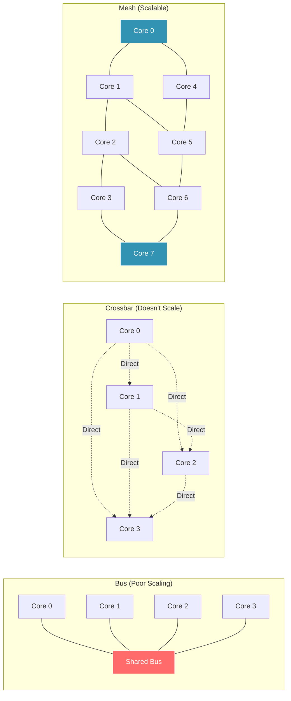
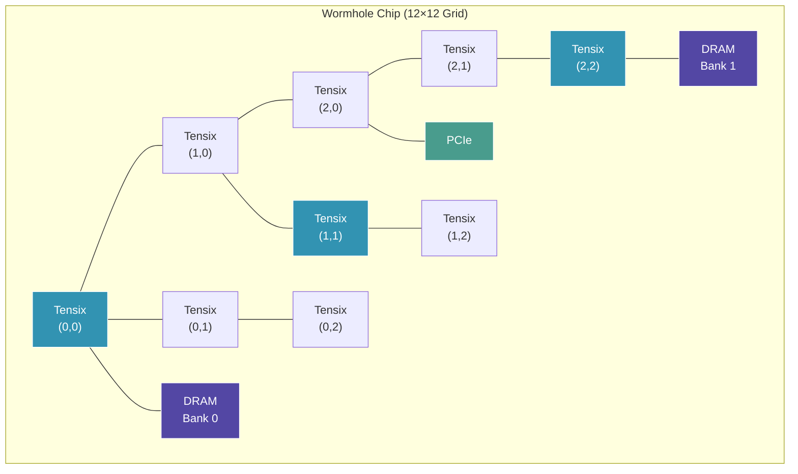

# Module 4: Networks and Communication

## Introduction: How 880 Cores Talk

You have 880 cores. They need to share data. How do they communicate?

**This module answers that question.**

### What You'll Learn

- ✅ **Network Topologies** - Bus, crossbar, mesh, and why topology matters
- ✅ **Routing Algorithms** - How messages find their destination
- ✅ **Latency vs Bandwidth** - Two metrics, different optimization strategies
- ✅ **NoC Architecture** - Tenstorrent's 2D mesh network-on-chip
- ✅ **Communication Patterns** - Broadcast, multicast, point-to-point

**Key Insight:** The network is the bottleneck. Optimize communication, not computation.

---

## Part 1: CS Theory - Network Fundamentals

### The Communication Problem

**Scenario:** Core 0 needs data from Core 100's memory.

**Options:**

#### Option 1: Shared Memory (Like Your Laptop's CPU)
```
Core 0 → [L1 Cache] → [L2 Cache] → [L3 Cache] → Memory
                                                    ↓
Core 100 → [L1 Cache] → [L2 Cache] → [L3 Cache] → Memory
```
**Pros:** Transparent (looks like local memory)
**Cons:** Cache coherence overhead, doesn't scale beyond ~64 cores

#### Option 2: Message Passing (Like Tenstorrent)
```
Core 0 → [Send message via NoC] → Core 100
```
**Pros:** Scales to 1000+ cores, explicit control
**Cons:** Programmer must manage communication

**Tenstorrent uses Option 2.**

### Network Topologies

How do you connect N nodes? Many options:

#### 1. Bus (Shared Medium)
```
Core 0 --- Core 1 --- Core 2 --- ... --- Core N
     └──────────[Shared Bus]──────────┘
```
**Pros:** Simple, cheap
**Cons:** Only one message at a time (serialization), doesn't scale
**Example:** Old computer systems, PCIe bus

#### 2. Crossbar (Full Connectivity)
```
     C0  C1  C2  C3
   ┌─┼──┼──┼──┼─┐
C0 │ ╳  │  │  │ │
   ├─┼──┼──┼──┼─┤
C1 │ │  ╳  │  │ │
   ├─┼──┼──┼──┼─┤
C2 │ │  │  ╳  │ │
   ├─┼──┼──┼──┼─┤
C3 │ │  │  │  ╳ │
   └─┼──┼──┼──┼─┘
```
**Pros:** Any-to-any communication, no contention
**Cons:** O(N²) wires, doesn't scale beyond ~100 nodes
**Example:** Small routers, interconnects

#### 3. Mesh (Tenstorrent's Choice)
```
┌───┬───┬───┬───┐
│ 0 │ 1 │ 2 │ 3 │
├───┼───┼───┼───┤
│ 4 │ 5 │ 6 │ 7 │
├───┼───┼───┼───┤
│ 8 │ 9 │10 │11 │
└───┴───┴───┴───┘
```
**Pros:** Scales well (O(N) wires), regular structure, good for 2D chips
**Cons:** Multi-hop latency (corner to corner takes many hops)
**Example:** Intel Xeon Phi, Google TPU, Tenstorrent



**Why mesh wins:** Balance of scalability, latency, and wire count.

### Routing: Finding the Path

**Problem:** Core (0, 0) wants to send to Core (3, 2). What path?

**Routing Algorithm: XY Routing** (Tenstorrent's approach)
```
Rule: Go X direction first, then Y direction

From (0,0) to (3,2):
1. Move right (0,0) → (1,0) → (2,0) → (3,0)  (X direction)
2. Move up   (3,0) → (3,1) → (3,2)           (Y direction)

Total hops: 3 (X) + 2 (Y) = 5 hops
```

**Advantages:**
- **Deterministic:** Always same path for same source/dest
- **Deadlock-free:** XY ordering prevents circular dependencies
- **Simple hardware:** Easy to implement in routing logic

**Disadvantage:**
- **Not adaptive:** Doesn't route around congestion

### Latency vs Bandwidth (Again, But For Networks)

**Latency:** Time for first bit to arrive
```
Latency = (# hops) × (per-hop latency) + (wire delay)

Example: 5 hops × 1 cycle + 0 cycles = 5 cycles
```

**Bandwidth:** Rate of data transfer
```
Bandwidth = (link width) × (frequency) / (# hops)

Example: 32 bytes/cycle per link
         If message is pipelined across hops, bandwidth is sustained
```

**Small messages:** Latency-bound (overhead dominates)
**Large messages:** Bandwidth-bound (transfer time dominates)

---

## Part 2: Industry Context - Networks Everywhere

### Data Center Networks

**Google's data center:**
```
10,000+ servers connected via network
Problem: Any server needs to talk to any other server
Solution: Clos network (multi-level mesh)
```

**Same principles as NoC:**
- Topology matters (mesh, fat-tree, dragonfly)
- Routing matters (ECMP, shortest-path)
- Congestion matters (TCP congestion control)

**Tenstorrent's NoC is a data center network on a chip.**

### GPU Interconnects

**NVIDIA NVLink (GPU-to-GPU):**
```
GPU 0 <--[900 GB/s NVLink]--> GPU 1
         vs
GPU 0 <--[25 GB/s PCIe]--> CPU <--[25 GB/s]--> GPU 1
```

**36x faster with direct links!**

**Principle:** Direct point-to-point is faster than going through a hub.

**Tenstorrent's NoC:** Direct core-to-core communication (no CPU hub)

### Ethernet / Internet

**Internet routing:**
```
Your laptop → Router → ISP → Backbone → Destination

Routing: BGP (Border Gateway Protocol)
Topology: Hierarchical (star + mesh)
Latency: ~50-100ms (speed of light + routing delays)
```

**NoC routing:**
```
Core (0,0) → 5 hops → Core (3,2)

Routing: XY (deterministic)
Topology: 2D mesh
Latency: ~5 cycles (~5 nanoseconds!)
```

**10 million times faster** because:
- Shorter distances (millimeters vs kilometers)
- Simpler routing (XY vs BGP)
- Fewer hops (5 vs 10-20)

---

## Part 3: On Tenstorrent Hardware - The NoC

### Wormhole NoC Architecture



**Key components:**
- **176 Tensix cores** arranged in a 2D grid
- **12 DRAM controllers** at grid edges
- **PCIe controller** for host communication
- **Ethernet ports** for multi-chip communication

**Each Tensix has a router:**
```
        North ↑
             │
West ← [Router] → East
             │
        South ↓
       +
     Local (to Tensix core)
```

**5-port router:** North, South, East, West, Local

### NoC Address Format

**64-bit NoC address:**
```
┌───────────┬──────────┬──────────────────────┐
│ NoC Y (16)│ NoC X (16)│ Local Address (32)   │
└───────────┴──────────┴──────────────────────┘
  Bits 48-63  Bits 32-47  Bits 0-31

Example: Access L1 SRAM at offset 0x1000 on core (3, 2)
NoC Address = (2 << 48) | (3 << 32) | 0x1000
            = 0x0002_0003_0000_1000
```

**Building a NoC address in code:**
```cpp
uint64_t get_noc_addr(uint32_t x, uint32_t y, uint32_t local_addr) {
    return ((uint64_t)y << 48) | ((uint64_t)x << 32) | local_addr;
}

// Example: Core (5, 3), L1 offset 0x2000
uint64_t addr = get_noc_addr(5, 3, 0x2000);
```

### NoC DMA Operations

**Three types of transfers:**

#### 1. Point-to-Point (Read)
```cpp
// Read 1 KB from core (3,2) to my L1
uint64_t remote_addr = get_noc_addr(3, 2, 0x1000);
noc_async_read(remote_addr, my_l1_addr, 1024);
noc_async_read_barrier();
```

#### 2. Point-to-Point (Write)
```cpp
// Write 1 KB from my L1 to core (5,7)
uint64_t remote_addr = get_noc_addr(5, 7, 0x2000);
noc_async_write(my_l1_addr, remote_addr, 1024);
noc_async_write_barrier();
```

#### 3. Multicast (One-to-Many)
```cpp
// Send same data to multiple cores
CoreRange dest = CoreRange{{0,0}, {3,3}};  // 4×4 = 16 cores
noc_async_write_multicast(my_l1_addr, dest, remote_addr, 1024);
noc_async_write_barrier();
```

**Multicast optimization:**
- Sends data once, hardware replicates to all destinations
- **16x faster** than 16 separate unicast writes
- Critical for broadcast operations (all-reduce, synchronization)

---

## Part 4: Hands-On - Measuring NoC Performance

### Experiment 1: Latency vs Distance

**Question:** Does distance matter?

**Test:** Send 4 bytes to cores at different distances

```cpp
// Kernel: measure_noc_latency.cpp
void kernel_main() {
    uint32_t my_x = get_core_x();
    uint32_t my_y = get_core_y();

    // Test different destinations
    uint32_t test_cases[5][2] = {
        {my_x+1, my_y},      // 1 hop (adjacent)
        {my_x+2, my_y},      // 2 hops
        {my_x+5, my_y},      // 5 hops
        {my_x+10, my_y},     // 10 hops
        {my_x+10, my_y+10}   // 20 hops (Manhattan distance)
    };

    for (int i = 0; i < 5; i++) {
        uint64_t remote_addr = get_noc_addr(test_cases[i][0], test_cases[i][1], 0x1000);

        uint64_t start = get_cycle_count();
        noc_async_read(remote_addr, my_l1_addr, 4);  // Read 4 bytes
        noc_async_read_barrier();
        uint64_t cycles = get_cycle_count() - start;

        DPRINT << "Distance " << test_cases[i][0] - my_x + test_cases[i][1] - my_y
               << " hops: " << cycles << " cycles\n";
    }
}
```

**Expected results:**
```
Distance 1 hop:  ~5 cycles
Distance 2 hops: ~6 cycles
Distance 5 hops: ~9 cycles
Distance 10 hops: ~14 cycles
Distance 20 hops: ~24 cycles
```

**Observation:** ~1 cycle per hop + ~4 cycle base latency

**Takeaway:** Distance matters! Keep communicating cores close together.

### Experiment 2: Bandwidth vs Message Size

**Question:** How does transfer size affect bandwidth?

**Test:** Transfer different message sizes

```cpp
// Kernel: measure_noc_bandwidth.cpp
void kernel_main() {
    uint32_t sizes[] = {4, 64, 256, 1024, 4096, 16384};  // Bytes

    for (int i = 0; i < 6; i++) {
        uint64_t remote_addr = get_noc_addr(5, 5, 0x1000);  // Fixed distance

        uint64_t start = get_cycle_count();
        noc_async_read(remote_addr, my_l1_addr, sizes[i]);
        noc_async_read_barrier();
        uint64_t cycles = get_cycle_count() - start;

        float bandwidth = sizes[i] / (float)cycles;  // Bytes per cycle
        DPRINT << "Size " << sizes[i] << " bytes: "
               << cycles << " cycles, "
               << bandwidth << " GB/s\n";
    }
}
```

**Expected results:**
```
Size 4 bytes:     ~10 cycles  → 0.4 bytes/cycle  (latency-bound)
Size 64 bytes:    ~12 cycles  → 5.3 bytes/cycle
Size 256 bytes:   ~20 cycles  → 12.8 bytes/cycle
Size 1024 bytes:  ~48 cycles  → 21.3 bytes/cycle
Size 4096 bytes:  ~160 cycles → 25.6 bytes/cycle (bandwidth-saturated)
Size 16384 bytes: ~600 cycles → 27.3 bytes/cycle
```

**Graph: Bandwidth vs Size**
```
Bandwidth
   ▲
30 │                    ┌────────── (Saturated)
   │                  ┌─┘
20 │              ┌──┘
   │          ┌──┘
10 │      ┌──┘
   │  ┌──┘
 0 └──┴────┴────┴────┴────┴────> Message Size
     4   64  256  1K  4K  16K
```

**Takeaway:** Small messages waste bandwidth (latency overhead). Large messages amortize latency.

**Optimization:** Batch small transfers into one large transfer.

### Experiment 3: Multicast vs Unicast

**Question:** Is multicast really faster?

**Test:** Send to 16 cores via multicast vs 16 unicast

```cpp
// Kernel: compare_multicast.cpp
void kernel_main() {
    CoreRange dest = CoreRange{{0,0}, {3,3}};  // 4×4 grid = 16 cores

    // Method 1: Unicast (sequential sends)
    uint64_t start = get_cycle_count();
    for (uint32_t y = 0; y < 4; y++) {
        for (uint32_t x = 0; x < 4; x++) {
            uint64_t remote_addr = get_noc_addr(x, y, 0x1000);
            noc_async_write(my_l1_addr, remote_addr, 1024);
        }
    }
    noc_async_write_barrier();
    uint64_t unicast_cycles = get_cycle_count() - start;

    // Method 2: Multicast (single send, hardware replicates)
    start = get_cycle_count();
    noc_async_write_multicast(my_l1_addr, dest, 0x1000, 1024);
    noc_async_write_barrier();
    uint64_t multicast_cycles = get_cycle_count() - start;

    DPRINT << "Unicast to 16 cores: " << unicast_cycles << " cycles\n";
    DPRINT << "Multicast to 16 cores: " << multicast_cycles << " cycles\n";
    DPRINT << "Speedup: " << (float)unicast_cycles / multicast_cycles << "x\n";
}
```

**Expected results:**
```
Unicast to 16 cores: ~800 cycles  (16 × 50 cycles per send)
Multicast to 16 cores: ~60 cycles (one send, hardware replicates)
Speedup: 13.3x
```

**Takeaway:** Multicast is critical for broadcast patterns (all-reduce, synchronization).

---

## Part 5: Communication Patterns and Optimization

### Pattern 1: All-to-All (Worst Case)

**Problem:** Every core sends to every other core

```cpp
// Each core sends its data to ALL other cores
for (uint32_t dest_y = 0; dest_y < 12; dest_y++) {
    for (uint32_t dest_x = 0; dest_x < 12; dest_x++) {
        if (dest_x != my_x || dest_y != my_y) {
            uint64_t remote_addr = get_noc_addr(dest_x, dest_y, 0x1000);
            noc_async_write(my_l1_addr, remote_addr, 1024);
        }
    }
}
```

**Cost:** 176 cores × 175 destinations × 50 cycles = 1.5 million cycles

**Problem:** Massive congestion (many cores sending simultaneously)

**Solution:** Phase the communication (different cores send at different times)

### Pattern 2: Reduction (Sum Across All Cores)

**Problem:** Compute sum of values across all cores

**Naive approach:** Send everything to Core 0 (sequential bottleneck)
```cpp
// All cores send to core (0,0)
if (my_x != 0 || my_y != 0) {
    noc_async_write(my_value, get_noc_addr(0, 0, offset), 4);
}
// Core (0,0) sums 176 values serially
```
**Cost:** 176 × 50 cycles = 8,800 cycles

**Optimized approach:** Tree-based reduction (parallel)
```cpp
// Phase 1: Pairs of cores reduce (88 parallel operations)
if (my_id % 2 == 0) {
    receive_from(my_id + 1);
    my_value += received_value;
}

// Phase 2: Reduce again (44 parallel operations)
if (my_id % 4 == 0) {
    receive_from(my_id + 2);
    my_value += received_value;
}

// ... Continue log2(176) = 8 phases ...

// Final result in core 0
```
**Cost:** 8 phases × 50 cycles = 400 cycles (22x faster!)

**This is what MPI_Reduce does internally.**

### Pattern 3: Nearest-Neighbor (Best Case)

**Problem:** Each core needs data from adjacent cores only

```cpp
// Read from 4 neighbors (N, S, E, W)
uint64_t north = get_noc_addr(my_x, my_y+1, 0x1000);
uint64_t south = get_noc_addr(my_x, my_y-1, 0x1000);
uint64_t east  = get_noc_addr(my_x+1, my_y, 0x1000);
uint64_t west  = get_noc_addr(my_x-1, my_y, 0x1000);

// Read 1 KB from each neighbor (4 × 1-hop transfers)
noc_async_read(north, my_l1+0, 1024);
noc_async_read(south, my_l1+1024, 1024);
noc_async_read(east,  my_l1+2048, 1024);
noc_async_read(west,  my_l1+3072, 1024);
noc_async_read_barrier();
```

**Cost:** 4 × 50 cycles = 200 cycles (all cores in parallel, no congestion)

**This is the best communication pattern** (local, parallel, low latency).

**Applications:** Stencil computations, cellular automata, diffusion equations

---

## Part 6: Discussion Questions

### Question 1: Why Not a Crossbar?

**Q:** Crossbar has lower latency (direct connections). Why use a mesh?

**A: Cost and scalability.**

- **Crossbar cost:** O(N²) wires → 176² = 30,976 connections
- **Mesh cost:** O(N) wires → 176 × 4 = 704 connections
- **Silicon area:** Crossbar would occupy half the chip!

**For 176 cores, crossbar is infeasible. For 1000+ cores (future), mesh still scales.**

### Question 2: What About Congestion?

**Q:** What if 10 cores all send to the same destination?

**A: The network serializes them (one at a time).**

```
Cores 0,1,2,3,4 all send to Core 50 simultaneously:
- Core 0's message arrives first (5 hops × 1 cycle = 5 cycles)
- Cores 1-4 must wait (queued at routers)
- Total time: 5 + 4×50 = 205 cycles (vs 50 cycles with no congestion)
```

**Optimization:** Distribute destinations (avoid hotspots)

**In practice:** This is a real problem (e.g., all-reduce has hotspot at root). Tree-based algorithms mitigate this.

### Question 3: How Does This Compare to Ethernet?

**Ethernet (1 Gbps):**
```
Bandwidth: 125 MB/s = 0.125 bytes per nanosecond
Latency: ~0.1 ms = 100,000 nanoseconds
```

**Tenstorrent NoC (1 GHz clock):**
```
Bandwidth: 32 bytes/cycle = 32 bytes per nanosecond (256x faster!)
Latency: 5-20 cycles = 5-20 nanoseconds (5000x faster!)
```

**Why the massive difference?**
- **Distance:** mm vs meters (1000x shorter)
- **Routing:** XY vs TCP/IP (1000x simpler)
- **Serialization:** None vs packet framing (10x less overhead)

**NoC is to Ethernet what L1 is to DRAM** (different scales, same principles).

---

## Part 7: Real-World Example - Flash Attention

**Flash Attention** is a breakthrough algorithm that reduces attention complexity from O(N²) to O(N) by careful communication management.

### Standard Attention (Communication-Heavy)

```python
# Standard attention (naive)
Q = query_matrix   # (seq_len, d)
K = key_matrix     # (seq_len, d)
V = value_matrix   # (seq_len, d)

# Compute attention scores (all-to-all communication!)
scores = Q @ K.T   # (seq_len, seq_len) - HUGE MATRIX
attn = softmax(scores)
output = attn @ V
```

**Problem:** `scores` matrix is O(N²) in memory and communication

**For seq_len = 16K:**
- scores matrix = 16K × 16K × 4 bytes = 1 GB
- Must transfer 1 GB across NoC (expensive!)

### Flash Attention (Communication-Optimized)

```python
# Flash Attention (optimized)
# Break Q, K, V into blocks that fit in L1
for q_block in Q_blocks:
    for k_block in K_blocks:
        # Load blocks into L1 (small transfer)
        scores_block = q_block @ k_block.T  # Compute on L1
        attn_block = softmax(scores_block)  # Stays in L1
        output_block += attn_block @ v_block
        # No need to store full scores matrix!
```

**Optimization:**
- Never materialize full scores matrix
- All computation happens on L1 data (fast)
- Only transfer small blocks across NoC
- **10x less communication → 10x faster**

**This is why Flash Attention is so important** - it's a network optimization, not an algorithm optimization.

---

## Part 8: Connections to Other Systems

### CPUs: Implicit Communication via Cache

**x86 Core-to-Core Communication:**
```
Core 0 writes X
Core 1 reads X

Hardware automatically:
1. Invalidates Core 1's cache line
2. Transfers data via cache coherence protocol (MESI)
3. Updates Core 1's cache
```

**Tenstorrent Core-to-Core:**
```
Core (0,0) writes X
Core (1,0) reads X

Programmer explicitly:
1. Core (0,0): noc_async_write(x, get_noc_addr(1,0,addr), 4)
2. Core (1,0): barrier, then read from L1
```

**Tradeoff:** Explicit is more code, but scales to 880 cores.

### GPUs: Similar NoC Architecture

**NVIDIA A100:**
- 108 streaming multiprocessors (SMs)
- Connected via NVLink (similar to NoC)
- Explicit communication via shared memory

**Communication patterns:**
```cuda
// GPU code (similar to Tenstorrent!)
__shared__ float shared_data[256];  // L1-like shared memory

// Each thread loads its data
shared_data[threadIdx.x] = global_data[globalIdx];
__syncthreads();  // Barrier (wait for all threads)

// Now all threads can access shared_data
```

**Same principles: explicit communication, barriers, local memory.**

### Data Centers: Network Topology

**Google data center:**
```
Clos Network (multi-level mesh)
         [Spine switches]
               ↓
         [Leaf switches]
               ↓
          [Servers]
```

**Tenstorrent chip:**
```
2D Mesh Network
    [DRAM] ← [Tensix cores] → [DRAM]
                  ↓
              [PCIe]
```

**Same topology principles at different scales.**

---

## Part 9: Key Takeaways

After this module, you should understand:

✅ **Network Topologies** - Mesh scales, crossbar doesn't
✅ **Routing Algorithms** - XY routing is simple and deadlock-free
✅ **Latency vs Bandwidth** - Small messages are latency-bound, large messages are bandwidth-bound
✅ **NoC Architecture** - 176 cores connected via 2D mesh with 5-port routers
✅ **Communication Patterns** - Multicast, reduction, nearest-neighbor

### The Core Insight

**The network determines scalability.**

- Good network → scales to 1000s of cores
- Bad network → bottleneck at 10-100 cores

**Tenstorrent's mesh NoC:**
- Scalable (O(N) cost)
- Low latency (1 cycle per hop)
- High bandwidth (32 bytes/cycle per link)
- **Enables 880-core parallelism**

**Communication patterns matter as much as algorithms.**

---

## Part 10: Preview of Module 5 - Synchronization

We've seen how cores communicate. But what if two cores access the same memory simultaneously?

**Teaser questions:**

1. **Race condition:** Core 0 writes X=5, Core 1 writes X=10. What's the final value?
2. **Deadlock:** Core 0 waits for Core 1, Core 1 waits for Core 0. What happens?
3. **Barriers:** How do you ensure all cores finish Phase 1 before starting Phase 2?

**Module 5 teaches synchronization primitives and how to avoid concurrency bugs.**

---

## Additional Resources

### Network Theory

- **"Computer Architecture: A Quantitative Approach"** (Hennessy & Patterson, Chapter 6)
- **"Principles and Practices of Interconnection Networks"** (Dally & Towles)

### NoC Design

- **"Designing Network-On-Chip Architectures in the Nanoscale Era"** (Flich & Bertozzi)
- **Intel Xeon Phi NoC:** Case study in mesh network design

### Tenstorrent Resources

- **Metalium Guide:** `~/tt-metal/METALIUM_GUIDE.md` (NoC API documentation)
- **NoC Programming Examples:** `~/tt-metal/tt_metal/programming_examples/`
- **Tech Reports:** `~/tt-metal/tech_reports/NoC/`

---

## Summary

We explored:
- **Theory:** Topologies (mesh wins), routing (XY is simple), latency/bandwidth
- **Industry:** Data center networks (Clos), GPU interconnects (NVLink), Internet (BGP)
- **Tenstorrent:** 2D mesh, 176 cores, 5-port routers, XY routing, multicast support
- **Practice:** Latency (1 cycle/hop), bandwidth (32 bytes/cycle), multicast (13x speedup)

**Key lesson:** Optimize communication patterns, not just algorithms.

**Next:** We explore synchronization and coordination across 880 cores.

[→ Continue to Module 5: Synchronization](command:tenstorrent.showLesson?["cs-fundamentals-05-synchronization"])
