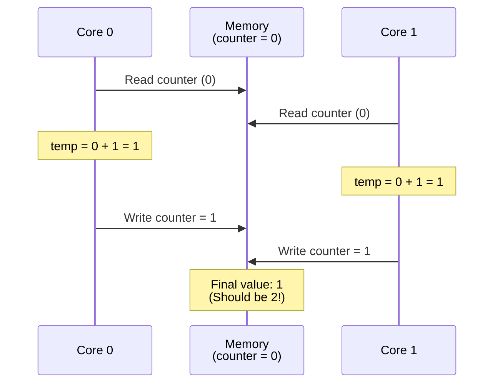

# Module 5: Synchronization

## Introduction: When Cores Collide

You have 880 cores running simultaneously. They share data. What could go wrong?

**Everything.**

### What You'll Learn

- ✅ **Race Conditions** - When concurrent access causes bugs
- ✅ **Synchronization Primitives** - Barriers, semaphores, locks
- ✅ **Deadlock** - When cores wait forever
- ✅ **Cache Coherence** - What x86 gives you (and Tenstorrent doesn't)
- ✅ **Explicit Synchronization** - Manual coordination on Tenstorrent

**Key Insight:** Concurrency is hard. Explicit synchronization makes it visible (and manageable).

---

## Part 1: CS Theory - The Fundamentals of Synchronization

### The Problem: Race Conditions

**Scenario:** Two cores increment a shared counter

```cpp
// Shared variable in DRAM
uint32_t counter = 0;

// Core 0 and Core 1 both run:
counter = counter + 1;
```

**What's the final value of counter?**

**You might think:** 2 (each core adds 1)

**Reality:** Could be 1 or 2 (race condition!)

**Why?** The operation `counter = counter + 1` is NOT atomic. It's three operations:

```cpp
// Assembly breakdown:
1. Load:  temp = read(counter)     // Core 0: temp = 0
2. Add:   temp = temp + 1          // Core 0: temp = 1
3. Store: write(counter, temp)     // Core 0: writes 1

// Meanwhile, Core 1 does the same thing:
1. Load:  temp = read(counter)     // Core 1: temp = 0 (before Core 0's write!)
2. Add:   temp = temp + 1          // Core 1: temp = 1
3. Store: write(counter, temp)     // Core 1: writes 1

// Final result: counter = 1 (lost update!)
```



**This is a race condition** - the outcome depends on timing (which core wins the "race").

### Synchronization Primitives

To prevent race conditions, we need synchronization:

#### 1. Locks (Mutual Exclusion)
**"Only one core can access the shared resource at a time"**

```cpp
Lock counter_lock;

// Core 0 and Core 1:
acquire(counter_lock);    // Wait if another core holds the lock
counter = counter + 1;    // Critical section (only one core at a time)
release(counter_lock);    // Let other cores proceed
```

**Result:** counter = 2 (always correct)

#### 2. Barriers (Synchronization Point)
**"Wait until all cores reach this point"**

```cpp
// Phase 1: Each core processes its data
process_my_data();

// Barrier: Wait for ALL cores to finish Phase 1
barrier();

// Phase 2: Use data computed by ALL cores
compute_using_all_data();
```

**Use case:** Multi-phase algorithms where each phase depends on the previous phase

#### 3. Semaphores (Counting Synchronization)
**"Control access to N resources"**

```cpp
Semaphore slots(4);  // Allow 4 concurrent accesses

// Core 0, 1, 2, 3, 4, 5... all try to use the resource
wait(slots);      // Decrement count (block if 0)
use_resource();   // At most 4 cores can be here
signal(slots);    // Increment count (wake up waiting cores)
```

**Use case:** Resource pools (e.g., 4 DRAM channels, limit concurrent accesses)

### Deadlock: The Danger of Locks

**Scenario:** Two cores, two locks

```cpp
// Core 0:
acquire(lock_A);
acquire(lock_B);  // ← Blocked if Core 1 holds lock_B
// Critical section
release(lock_B);
release(lock_A);

// Core 1:
acquire(lock_B);
acquire(lock_A);  // ← Blocked if Core 0 holds lock_A
// Critical section
release(lock_A);
release(lock_B);
```

**Deadlock:**
1. Core 0 acquires lock_A
2. Core 1 acquires lock_B
3. Core 0 waits for lock_B (held by Core 1)
4. Core 1 waits for lock_A (held by Core 0)
5. **Both cores wait forever** (deadlock)

**Prevention:** Always acquire locks in the same order

```cpp
// Both cores:
acquire(lock_A);  // Always A first
acquire(lock_B);  // Then B
// Critical section
release(lock_B);
release(lock_A);
```

---

## Part 2: Industry Context - Synchronization Everywhere

### CPUs: Hardware Cache Coherence

**Your laptop's CPU automatically synchronizes cores.**

**MESI Protocol (Modified, Exclusive, Shared, Invalid):**

```
Core 0 writes X = 5:
1. Core 0's cache line for X enters "Modified" state
2. Hardware sends invalidation message to all other cores
3. Core 1's cache line for X enters "Invalid" state

Core 1 reads X:
1. Core 1 detects "Invalid" state
2. Hardware fetches updated value from Core 0's cache
3. Core 1 sees X = 5 (correct!)
```

**You never see this** - it's automatic hardware synchronization.

**Cost:** Complex hardware, doesn't scale beyond ~64 cores

### GPUs: Explicit Synchronization

**CUDA programming:**

```cuda
__shared__ float shared_data[256];  // Shared across threads in a block

// Thread 0 writes
if (threadIdx.x == 0) {
    shared_data[0] = 42;
}

// Barrier: Wait for Thread 0 to finish
__syncthreads();

// Thread 1 reads (now safe!)
if (threadIdx.x == 1) {
    float x = shared_data[0];  // Always sees 42
}
```

**Explicit `__syncthreads()` barrier** - programmer must insert synchronization points.

**This is similar to Tenstorrent's model.**

### Databases: Transactions and Isolation

**Database transactions use locks for consistency:**

```sql
-- Transaction 1:
BEGIN TRANSACTION;
UPDATE accounts SET balance = balance - 100 WHERE id = 1;
UPDATE accounts SET balance = balance + 100 WHERE id = 2;
COMMIT;

-- Transaction 2 (concurrent):
BEGIN TRANSACTION;
SELECT SUM(balance) FROM accounts;  -- Must see consistent state
COMMIT;
```

**Database automatically:**
- Acquires locks on rows being updated
- Ensures Transaction 2 sees either "before" or "after" state (not partial)
- Prevents lost updates (like our counter example)

**This is synchronization at the application level.**

---

## Part 3: On Tenstorrent Hardware - NO Cache Coherence

### The Big Difference

**Your laptop (x86/ARM):**
- Hardware cache coherence (MESI protocol)
- Cores automatically synchronized
- "Memory operations appear in program order"
- You rarely think about synchronization

**Tenstorrent (RISC-V NoC):**
- **NO hardware cache coherence**
- **Explicit synchronization required**
- "Memory operations complete when DMA finishes"
- **You must think about synchronization**

### Why No Cache Coherence?

**Design tradeoff:**

**With coherence (x86):**
- ✅ Easy to program (automatic synchronization)
- ❌ Complex hardware (MESI protocol, snooping, directories)
- ❌ Doesn't scale beyond ~64 cores
- ❌ High power consumption

**Without coherence (Tenstorrent):**
- ❌ Harder to program (explicit synchronization)
- ✅ Simple hardware (no coherence protocol)
- ✅ Scales to 880+ cores
- ✅ Lower power consumption

**Tenstorrent's choice:** Scalability over ease-of-use.

### Synchronization on Tenstorrent: Barriers

**The primary synchronization primitive: DMA barriers**

```cpp
// Core 0 writes data
noc_async_write(my_data, get_noc_addr(1, 0, remote_addr), 1024);
noc_async_write_barrier();  // ← WAIT for write to complete

// Now Core 1 can safely read the data
```

**What the barrier does:**
1. Blocks Core 0 until all pending DMA operations complete
2. Ensures data is visible to other cores
3. Provides a synchronization point

**Without the barrier:**
```cpp
// Core 0 writes data
noc_async_write(my_data, get_noc_addr(1, 0, remote_addr), 1024);
// NO BARRIER - Core 0 continues immediately!

// Core 1 reads (might see old data!)
uint32_t value = *(uint32_t*)remote_addr;  // Race condition!
```

**The DMA might not finish before Core 1 reads** → incorrect results.

---

## Part 4: Hands-On - Synchronization Bugs and Fixes

### Experiment 1: The Race Condition

**Setup:** Two cores increment a shared counter 1000 times each

**Buggy version (no synchronization):**

```cpp
// Kernel: race_condition.cpp
// Host allocates counter in DRAM, initializes to 0

void kernel_main() {
    uint32_t core_id = get_core_id();
    uint32_t* counter_dram = (uint32_t*)get_arg_val<uint32_t>(0);

    // Each core increments 1000 times
    for (int i = 0; i < 1000; i++) {
        // Read-modify-write (NOT ATOMIC!)
        uint32_t value;
        noc_async_read((uint64_t)counter_dram, &value, 4);
        noc_async_read_barrier();

        value++;  // Increment

        noc_async_write(&value, (uint64_t)counter_dram, 4);
        noc_async_write_barrier();
    }

    if (core_id == 0) {
        uint32_t final_value;
        noc_async_read((uint64_t)counter_dram, &final_value, 4);
        noc_async_read_barrier();
        DPRINT << "Final counter value: " << final_value << "\n";
        DPRINT << "Expected: 2000, Actual: " << final_value << "\n";
    }
}
```

**Expected:** 2000 (2 cores × 1000 increments)

**Actual:** ~1200-1800 (varies each run due to race condition)

**Why?** Cores read the same value, both increment, both write → lost updates.

### Experiment 2: Adding Synchronization (Spin Lock)

**Fixed version (with simple spin lock):**

```cpp
// Kernel: synchronized_counter.cpp
// Host allocates counter + lock in DRAM

void kernel_main() {
    uint32_t core_id = get_core_id();
    uint32_t* counter_dram = (uint32_t*)get_arg_val<uint32_t>(0);
    uint32_t* lock_dram = (uint32_t*)get_arg_val<uint32_t>(1);

    for (int i = 0; i < 1000; i++) {
        // Acquire lock (spin until we get it)
        uint32_t lock_value;
        do {
            noc_async_read((uint64_t)lock_dram, &lock_value, 4);
            noc_async_read_barrier();
        } while (lock_value != 0);  // Spin while locked

        // Set lock to 1 (acquired)
        lock_value = 1;
        noc_async_write(&lock_value, (uint64_t)lock_dram, 4);
        noc_async_write_barrier();

        // Critical section: Increment counter
        uint32_t value;
        noc_async_read((uint64_t)counter_dram, &value, 4);
        noc_async_read_barrier();
        value++;
        noc_async_write(&value, (uint64_t)counter_dram, 4);
        noc_async_write_barrier();

        // Release lock (set to 0)
        lock_value = 0;
        noc_async_write(&lock_value, (uint64_t)lock_dram, 4);
        noc_async_write_barrier();
    }

    if (core_id == 0) {
        uint32_t final_value;
        noc_async_read((uint64_t)counter_dram, &final_value, 4);
        noc_async_read_barrier();
        DPRINT << "Final counter value: " << final_value << "\n";
    }
}
```

**Result:** Always 2000 (correct!)

**Cost:** Much slower (~100x) due to lock contention

**Why slow?** Cores spin-wait for the lock → wasted cycles.

### Experiment 3: Better Synchronization (Atomic Reduction)

**Best version (accumulate locally, then combine):**

```cpp
// Kernel: local_accumulation.cpp

void kernel_main() {
    uint32_t core_id = get_core_id();

    // Phase 1: Each core accumulates locally (NO synchronization needed)
    uint32_t my_sum = 0;
    for (int i = 0; i < 1000; i++) {
        my_sum++;  // Just count to 1000 (trivial example)
    }

    // Phase 2: Core 0 collects all sums (sequential, but only 2 ops)
    if (core_id == 0) {
        uint32_t total = my_sum;  // Start with Core 0's sum

        // Read Core 1's sum
        uint32_t core1_sum;
        noc_async_read(get_noc_addr(1, 0, l1_addr), &core1_sum, 4);
        noc_async_read_barrier();
        total += core1_sum;

        DPRINT << "Final total: " << total << "\n";
    } else if (core_id == 1) {
        // Core 1 writes its sum to L1 for Core 0 to read
        *(uint32_t*)l1_addr = my_sum;
    }
}
```

**Result:** Always 2000 (correct!)

**Cost:** Fast! (minimal synchronization)

**Key insight:** Minimize shared writes. Accumulate locally, synchronize at the end.

---

## Part 5: Common Synchronization Patterns

### Pattern 1: Barrier (Wait for All)

**Use case:** Multi-phase algorithm

```cpp
void kernel_main() {
    // Phase 1: Process my data
    process_local_data();

    // Barrier implementation: All cores write "done" flag
    uint32_t done = 1;
    noc_async_write(&done, barrier_addr + core_id * 4, 4);
    noc_async_write_barrier();

    // Core 0 waits for all cores
    if (core_id == 0) {
        uint32_t all_done[NUM_CORES];
        noc_async_read(barrier_addr, all_done, NUM_CORES * 4);
        noc_async_read_barrier();

        // Wait until all cores report done
        for (int i = 0; i < NUM_CORES; i++) {
            while (all_done[i] != 1) {
                noc_async_read(barrier_addr + i * 4, &all_done[i], 4);
                noc_async_read_barrier();
            }
        }
    }

    // Now all cores can proceed to Phase 2
    use_data_from_all_cores();
}
```

**Better approach:** Use tt-metal's built-in barrier (when available).

### Pattern 2: Producer-Consumer

**Use case:** One core generates data, another consumes it

```cpp
// Shared buffer + flags
uint32_t buffer[100];
uint32_t producer_index = 0;
uint32_t consumer_index = 0;

// Producer core:
while (has_data) {
    // Wait for space in buffer
    while ((producer_index + 1) % 100 == consumer_index) {
        // Buffer full, wait
    }

    // Write data
    buffer[producer_index] = produce_data();
    noc_async_write(&buffer[producer_index], consumer_addr, 4);
    noc_async_write_barrier();

    // Update index
    producer_index = (producer_index + 1) % 100;
}

// Consumer core:
while (needs_data) {
    // Wait for data in buffer
    while (producer_index == consumer_index) {
        // Buffer empty, wait
    }

    // Read data
    uint32_t data = buffer[consumer_index];
    process_data(data);

    // Update index
    consumer_index = (consumer_index + 1) % 100;
}
```

**Challenge:** Avoiding deadlock and ensuring progress.

### Pattern 3: All-Reduce (Combine Values from All Cores)

**Use case:** Compute sum/max/min across all cores

```cpp
// Tree-based reduction (log2(N) steps)
uint32_t my_value = compute_local_value();

uint32_t step = 1;
while (step < NUM_CORES) {
    if (core_id % (step * 2) == 0) {
        // I'm a receiver
        uint32_t partner_id = core_id + step;
        if (partner_id < NUM_CORES) {
            uint32_t partner_value;
            noc_async_read(get_partner_addr(partner_id), &partner_value, 4);
            noc_async_read_barrier();

            my_value += partner_value;  // Combine (sum, max, etc.)
        }
    } else if (core_id % step == 0) {
        // I'm a sender
        uint32_t partner_id = core_id - step;
        noc_async_write(&my_value, get_partner_addr(partner_id), 4);
        noc_async_write_barrier();
    }

    step *= 2;
    barrier();  // Synchronize before next step
}

// Core 0 now has the final result
if (core_id == 0) {
    DPRINT << "Total sum: " << my_value << "\n";
}
```

**Complexity:** O(log N) steps (much better than O(N) sequential accumulation)

---

## Part 6: Discussion Questions

### Question 1: Why Are Race Conditions So Hard to Debug?

**Q:** Race conditions often work correctly in testing, but fail in production. Why?

**A: Timing-dependent bugs.**

- In testing: Low load, cores don't collide often
- In production: High load, cores collide frequently
- **Heisenbugs:** Adding debug prints changes timing → bug disappears!

**Example:**
```cpp
// Buggy code (race condition)
counter++;

// Add debug print
DPRINT << "counter = " << counter << "\n";  // ← Changes timing!
counter++;

// Bug might not appear because the print slows down execution
```

**Lesson:** Test under high load, use synchronization tools (not manual inspection).

### Question 2: When Is Synchronization Overkill?

**Q:** Should we always use locks/barriers for shared memory?

**A: No! Synchronization has cost.**

**Use synchronization when:**
- Multiple writers to same location
- Writers and readers to same location
- Order of operations matters

**Skip synchronization when:**
- Read-only access (no writes)
- Each core writes to disjoint memory regions (no overlap)
- Single producer, single consumer with careful protocol

**Example of safe unsynchronized code:**
```cpp
// Each core writes to its own region (no overlap)
uint32_t my_start = core_id * 1000;
uint32_t my_end = my_start + 1000;

for (uint32_t i = my_start; i < my_end; i++) {
    output[i] = process(input[i]);  // No synchronization needed!
}
```

### Question 3: Cache Coherence vs Explicit Synchronization - Which Is Better?

**Q:** Why doesn't Tenstorrent use hardware cache coherence like x86?

**A: Scalability tradeoff.**

| Feature | Cache Coherence (x86) | Explicit Sync (Tenstorrent) |
|---------|----------------------|------------------------------|
| **Ease of use** | Easy (automatic) | Hard (manual barriers) |
| **Scalability** | ~64 cores max | 880+ cores |
| **Power** | High (coherence traffic) | Low (only explicit transfers) |
| **Performance** | Unpredictable (cache misses) | Predictable (explicit DMA) |

**Analogy:**
- **Cache coherence:** Like automatic transmission (easy, but complex mechanism)
- **Explicit sync:** Like manual transmission (harder to learn, but more control)

**Tenstorrent targets:** Data-parallel workloads where explicit control is valuable.

---

## Part 7: Real-World Example - Barrier Synchronization in Training

**Use case:** Distributed training with data parallelism

### Scenario: 4 Devices, 1 Model

```python
# Each device has:
# - Full copy of model weights
# - Subset of training data

# Training loop:
for batch in data_batches:
    # Phase 1: Compute gradients locally (parallel, no sync)
    local_gradients = compute_gradients(model, my_batch)

    # Phase 2: Synchronize gradients (all-reduce)
    # BARRIER: Wait for all devices to finish Phase 1
    barrier()

    # All-reduce: Average gradients from all devices
    global_gradients = all_reduce(local_gradients)  # Sum then divide by 4

    # Phase 3: Update model weights (parallel, using same global gradients)
    model.weights -= learning_rate * global_gradients

    # BARRIER: Wait for all devices to update before next iteration
    barrier()
```

**Why barriers are critical:**
- **Without barrier after Phase 1:** Some devices start all-reduce while others still computing → wrong averages
- **Without barrier after Phase 2:** Some devices use old weights, others use new → divergence

**This is why PyTorch's DDP (DistributedDataParallel) has implicit barriers.**

### Performance Impact

```
Without synchronization: WRONG RESULTS (model diverges)

With naive synchronization (global lock):
  - 100 ms compute per device
  - 50 ms synchronization overhead
  - Total: 150 ms per iteration

With optimized synchronization (tree reduce + overlap):
  - 100 ms compute per device
  - 10 ms synchronization overhead (overlapped with compute)
  - Total: 110 ms per iteration
```

**36% speedup** from smart synchronization!

---

## Part 8: Connections to Other Systems

### Operating Systems: Semaphores and Mutexes

**Linux kernel:**
```c
// Create mutex
pthread_mutex_t lock;
pthread_mutex_init(&lock, NULL);

// Thread 1 and Thread 2:
pthread_mutex_lock(&lock);
// Critical section
pthread_mutex_unlock(&lock);
```

**Similar to our spin lock, but:**
- OS scheduler suspends blocked threads (not spinning)
- Hardware support (atomic instructions like CAS)

**Tenstorrent:** No OS, no threads → manual synchronization

### Databases: ACID Transactions

**Atomicity, Consistency, Isolation, Durability**

```sql
BEGIN TRANSACTION;
  UPDATE account SET balance = balance - 100 WHERE id = 1;
  UPDATE account SET balance = balance + 100 WHERE id = 2;
COMMIT;
```

**Database uses:**
- Two-phase locking (acquire all locks before releasing any)
- Deadlock detection (timeout and retry)
- Transaction logs (durability)

**Much more sophisticated than our barriers, but same principles.**

### Web Services: Distributed Locks

**Redis distributed lock:**
```python
# Multiple servers competing for a shared resource
lock = redis_client.set("my_lock", "server_1", nx=True, ex=10)
if lock:
    # I have the lock
    process_shared_resource()
    redis_client.delete("my_lock")
else:
    # Another server has the lock
    wait_or_fail()
```

**Same problem (synchronization) at different scale (milliseconds vs nanoseconds).**

---

## Part 9: Key Takeaways

After this module, you should understand:

✅ **Race Conditions** - Concurrent access without synchronization causes bugs
✅ **Synchronization Primitives** - Locks, barriers, semaphores coordinate cores
✅ **Deadlock** - Circular waiting causes infinite blocking
✅ **Cache Coherence** - x86 has it (automatic), Tenstorrent doesn't (explicit)
✅ **Explicit Barriers** - `noc_async_read/write_barrier()` ensures ordering

### The Core Insight

**Concurrency is fundamentally hard.**

- **With hardware coherence (x86):** Easier to program, but limited scalability
- **Without hardware coherence (Tenstorrent):** Harder to program, but scales to 880 cores

**The art of parallel programming:**
1. Minimize shared state (use local memory)
2. Batch synchronization (not per-operation)
3. Use proven patterns (barriers, reductions)

**Get synchronization wrong → corrupted data, deadlocks, heisenbugs.**

---

## Part 10: Preview of Module 6 - Abstraction Layers

We've been programming at a low level (RISC-V, NoC, explicit sync). But most developers use higher-level languages.

**Teaser questions:**

1. **Compilation:** How does `x = a + b` in Python become RISC-V instructions?
2. **Abstraction cost:** Why is NumPy 100x faster than pure Python?
3. **JIT compilation:** How do frameworks optimize without seeing your code?

**Module 6 explores the stack from Python to silicon.**

---

## Additional Resources

### Concurrency Theory

- **"The Art of Multiprocessor Programming"** by Herlihy & Shavit
- **"Operating Systems: Three Easy Pieces"** by Arpaci-Dusseau (Concurrency chapters)

### Practical Synchronization

- **"Programming Massively Parallel Processors"** by Kirk & Hwu (GPU synchronization)
- **"CUDA C++ Programming Guide"** (NVIDIA documentation)

### Tenstorrent Resources

- **Metalium Guide:** `~/tt-metal/METALIUM_GUIDE.md` (Synchronization primitives)
- **Synchronization Examples:** `~/tt-metal/tt_metal/programming_examples/`
- **Tech Reports:** `~/tt-metal/tech_reports/Synchronization/`

---

## Summary

We explored:
- **Theory:** Race conditions, locks, barriers, deadlock
- **Industry:** x86 cache coherence (automatic), GPU barriers (explicit), database locks
- **Tenstorrent:** No hardware coherence, explicit DMA barriers, manual synchronization
- **Practice:** Race condition (wrong results), spin locks (slow), local accumulation (fast)

**Key lesson:** Synchronization makes concurrency correct, but adds overhead. Minimize shared state.

**Next:** We climb the abstraction stack from RISC-V assembly to Python.

[→ Continue to Module 6: Abstraction Layers](command:tenstorrent.showLesson?["cs-fundamentals-06-abstraction"])
