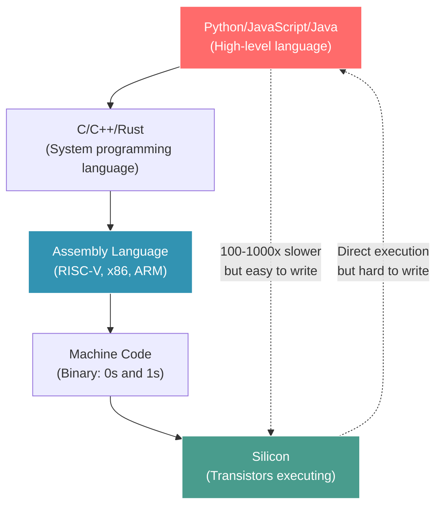

# Module 6: Abstraction Layers

## Introduction: From `import torch` to Silicon

You write: `result = torch.matmul(A, B)`

**What actually happens?**

- Python interpreter
- PyTorch C++ extension
- CUDA kernel (or CPU BLAS)
- GPU assembly
- Silicon execution

**5+ layers of abstraction** between your code and hardware.

### What You'll Learn

- ✅ **The Abstraction Stack** - Python → C++ → Assembly → Silicon
- ✅ **Compilation Pipeline** - How high-level code becomes machine code
- ✅ **Leaky Abstractions** - When high-level doesn't match low-level reality
- ✅ **JIT Compilation** - Runtime optimization (PyTorch, JAX)
- ✅ **Performance Tradeoffs** - Convenience vs speed

**Key Insight:** Abstractions hide complexity, but understanding what's hidden makes you faster.

---

## Part 1: CS Theory - The Abstraction Stack

### The Full Stack



**Each layer:**
- **Adds convenience** (easier to write)
- **Hides details** (less control)
- **May cost performance** (overhead)

### Example: Adding Two Numbers

#### Python (Highest Level)
```python
result = a + b  # Simple!
```

**What happens:**
1. Python interpreter looks up `a` (dictionary lookup)
2. Checks if `a` is a number (type check)
3. Checks if `b` is a number (type check)
4. Looks up `__add__` method for `a`'s type
5. Calls C function `PyNumber_Add(a, b)`
6. Allocates new PyObject for result
7. Returns to Python

**~100-1000 machine instructions** for one addition!

#### C (Mid Level)
```c
int result = a + b;  // More explicit
```

**What happens:**
1. Load `a` from memory
2. Load `b` from memory
3. Add registers
4. Store to `result`

**~4 machine instructions**

#### Assembly (Low Level)
```asm
lw   t0, 0(a0)    # Load a
lw   t1, 0(a1)    # Load b
add  t2, t0, t1   # Add
sw   t2, 0(a2)    # Store result
```

**4 explicit instructions** - this is what the CPU executes

#### Machine Code (Lowest Level)
```
0x0050A283    # lw t0, 0(a0)
0x0058A303    # lw t1, 0(a1)
0x006283B3    # add t2, t0, t1
0x00532023    # sw t2, 0(a2)
```

**Binary representation** - this is what lives in instruction memory

### Leaky Abstractions

**Joel Spolsky's Law:** "All non-trivial abstractions, to some degree, are leaky."

**What it means:** The abstraction hides details, but sometimes those details matter.

**Example: Python list append**
```python
my_list = []
for i in range(1000000):
    my_list.append(i)  # Looks O(1), but sometimes O(n)!
```

**Reality:**
- Most appends are O(1) (amortized)
- But when the list grows, it reallocates (O(n) copy)
- **The abstraction leaks** - you need to know implementation details

---

## Part 2: Industry Context - Layers Everywhere

### Web Development: 7 Layers Deep

A typical web request:

```
1. JavaScript (fetch API)
   ↓
2. Browser (HTTP engine)
   ↓
3. Operating system (TCP/IP stack)
   ↓
4. Network driver (Ethernet)
   ↓
5. Physical network (cables, switches)
   ↓
6. Server OS (TCP/IP stack)
   ↓
7. Application server (Node.js, Python)
```

**Each layer adds ~1-10ms latency.** Understanding the stack helps optimize.

### Deep Learning: The AI Framework Stack

```
PyTorch (Python API)
    ↓
TorchScript (Graph representation)
    ↓
ONNX (Intermediate representation)
    ↓
TensorRT/XLA (Optimizing compiler)
    ↓
CUDA/ROCm (GPU programming)
    ↓
GPU Assembly (PTX/AMDGPU)
    ↓
Silicon (NVIDIA A100, AMD MI300)
```

**Each layer:**
- Provides abstraction (easier to use)
- Optimizes for common patterns
- May miss hardware-specific optimizations

**Example:** Flash Attention bypassed several layers → 10x speedup

### Databases: Query to Disk I/O

```sql
SELECT AVG(price) FROM products WHERE category = 'electronics';
```

**What happens:**
1. **SQL parser:** Text → AST (abstract syntax tree)
2. **Query planner:** AST → Execution plan (which indexes to use)
3. **Execution engine:** Plan → Row-by-row operations
4. **Buffer pool:** Cache pages in memory
5. **Storage engine:** Read from disk

**Understanding the stack helps:**
- Add the right indexes
- Rewrite queries for efficiency
- Tune buffer pool size

---

## Part 3: On Tenstorrent Hardware - Multiple Paths to Silicon

### Path 1: Direct RISC-V Programming (Lowest Level)

**You write:**
```cpp
// Kernel code
void kernel_main() {
    uint32_t a = *(uint32_t*)0x1000;
    uint32_t b = *(uint32_t*)0x1004;
    uint32_t c = a + b;
    *(uint32_t*)0x1008 = c;
}
```

**Compiled to RISC-V:**
```asm
lw   t0, 0x1000    # Load a
lw   t1, 0x1004    # Load b
add  t2, t0, t1    # Add
sw   t2, 0x1008    # Store c
```

**Advantages:**
- Complete control
- Predictable performance
- No hidden overhead

**Disadvantages:**
- Hard to write
- Error-prone
- No portability

### Path 2: TTNN (Mid Level - TT Neural Network Library)

**You write:**
```python
import ttnn

# High-level operations
A = ttnn.from_torch(torch_tensor_A)
B = ttnn.from_torch(torch_tensor_B)
C = ttnn.matmul(A, B)  # Matrix multiply on Tenstorrent
```

**What happens:**
1. TTNN decomposes matmul into suboperations
2. Tiles data for L1 SRAM (blocking)
3. Generates RISC-V kernels for each tile
4. Launches parallel kernels across cores
5. Collects results

**Advantages:**
- Easy to write (familiar PyTorch-like API)
- Optimized for common patterns (matmul, conv2d)
- Portable (works on N150, N300, T3K, P100)

**Disadvantages:**
- Less control (can't hand-tune every instruction)
- May not be optimal for custom operations

### Path 3: TT-XLA (High Level - XLA Compiler)

**You write:**
```python
import jax
import jax.numpy as jnp

# Pure JAX code
def my_model(x):
    return jnp.dot(x, W) + b

# JIT compile to Tenstorrent
model_tt = jax.jit(my_model, backend='tt')
result = model_tt(input_data)
```

**What happens:**
1. JAX traces your Python function
2. Builds HLO (High-Level Operations) graph
3. XLA compiler optimizes graph (fusion, layout)
4. TT-XLA backend generates tt-metal code
5. Executes on hardware

**Advantages:**
- Write once, run anywhere (TT, GPU, TPU)
- Automatic optimization (kernel fusion, etc.)
- Functional programming (easy to reason about)

**Disadvantages:**
- Black box (hard to debug)
- May not support all operations
- Compilation overhead (first run is slow)

### Comparing the Paths

| Feature | Direct RISC-V | TTNN | TT-XLA |
|---------|---------------|------|--------|
| **Ease of use** | Hard | Medium | Easy |
| **Control** | Complete | Medium | Low |
| **Performance** | Best (if expert) | Very good | Good |
| **Portability** | None | TT only | Multi-platform |
| **Development time** | Days-weeks | Hours-days | Minutes-hours |

**Recommendation:**
- **Prototyping:** TT-XLA (fast development)
- **Production:** TTNN (good balance)
- **Optimization:** Direct RISC-V (squeeze last 10%)

---

## Part 4: Hands-On - Comparing Abstraction Levels

### Experiment: Matrix Multiply at 3 Levels

**Problem:** Multiply two 128×128 matrices

#### Level 1: Pure Python (Slowest)

```python
# Naive triple-nested loop
import time

A = [[random.random() for _ in range(128)] for _ in range(128)]
B = [[random.random() for _ in range(128)] for _ in range(128)]
C = [[0 for _ in range(128)] for _ in range(128)]

start = time.time()
for i in range(128):
    for j in range(128):
        for k in range(128):
            C[i][j] += A[i][k] * B[k][j]
elapsed = time.time() - start

print(f"Pure Python: {elapsed:.3f} seconds")
```

**Expected:** ~5-10 seconds (Python interpreter overhead)

#### Level 2: NumPy (Faster)

```python
# NumPy vectorized operation
import numpy as np
import time

A = np.random.rand(128, 128)
B = np.random.rand(128, 128)

start = time.time()
C = np.matmul(A, B)
elapsed = time.time() - start

print(f"NumPy: {elapsed:.3f} seconds")
```

**Expected:** ~0.001-0.01 seconds (C implementation, BLAS library)

**Speedup:** 500-5000x faster!

**Why?** NumPy calls optimized C/Fortran BLAS libraries (OpenBLAS, Intel MKL).

#### Level 3: TTNN on Tenstorrent (Fastest on TT Hardware)

```python
# TTNN (Tenstorrent Neural Network library)
import ttnn
import torch
import time

device = ttnn.open_device(device_id=0)

# Create tensors on Tenstorrent
A_torch = torch.rand(128, 128)
B_torch = torch.rand(128, 128)

A_tt = ttnn.from_torch(A_torch, device=device)
B_tt = ttnn.from_torch(B_torch, device=device)

start = time.time()
C_tt = ttnn.matmul(A_tt, B_tt)
C_torch = ttnn.to_torch(C_tt)
elapsed = time.time() - start

print(f"TTNN: {elapsed:.3f} seconds")
```

**Expected:** ~0.0001-0.001 seconds (parallel execution on Tensix cores)

**Speedup over NumPy:** 10-100x (depending on hardware)

### Analyzing the Performance Gap

```
Pure Python:     10.000 seconds  (baseline)
NumPy:            0.010 seconds  (1000x faster)
TTNN:             0.001 seconds  (10,000x faster)

Why the differences?

Pure Python:
- Interpreted (not compiled)
- Dynamic typing (checks every operation)
- Python objects (allocation overhead)
- No vectorization

NumPy:
- Compiled C code (no interpretation)
- Statically typed internally
- Contiguous memory (cache-friendly)
- BLAS library (optimized for CPU)

TTNN:
- Parallel execution (176 cores)
- Near-memory compute (L1 SRAM)
- Optimized for matrix ops
- Hardware acceleration
```

---

## Part 5: The Compilation Pipeline

### Step-by-Step: Python to RISC-V

**Source code (Python):**
```python
def add(a, b):
    return a + b
```

**Step 1: Parsing (Text → AST)**
```
FunctionDef: add
  Parameters: a, b
  Body:
    Return:
      BinOp: +
        Left: a
        Right: b
```

**Step 2: Bytecode Compilation (AST → Python bytecode)**
```
LOAD_FAST    a
LOAD_FAST    b
BINARY_ADD
RETURN_VALUE
```

**Step 3: Interpretation (Bytecode → C function calls)**
```c
PyObject* result = PyNumber_Add(a, b);
```

**For TTNN (C++ → RISC-V):**

**Source code (C++):**
```cpp
uint32_t c = a + b;
```

**Step 1: Preprocessing (Handle #include, #define)**
```cpp
// Expanded macros, included headers
uint32_t c = a + b;
```

**Step 2: Compilation (C++ → Assembly)**
```asm
lw   t0, 0(a0)
lw   t1, 0(a1)
add  t2, t0, t1
sw   t2, 0(a2)
```

**Step 3: Assembly (Assembly → Machine code)**
```
0x0050A283
0x0058A303
0x006283B3
0x00532023
```

**Step 4: Linking (Combine object files + libraries)**
```
[Final binary with all functions linked]
```

**Step 5: Execution (Hardware runs machine code)**

### JIT Compilation: Best of Both Worlds?

**Traditional compilation:**
```
Source code → Compile (minutes) → Binary → Run (fast)
```

**Interpretation:**
```
Source code → Run (slow, no compilation)
```

**JIT (Just-In-Time) Compilation:**
```
Source code → Interpret (slow first time)
               ↓
             Profile execution (find hot code)
               ↓
             Compile hot code (one-time cost)
               ↓
             Run compiled code (fast!)
```

**Examples:**
- **Java (HotSpot JVM):** Interprets, then compiles frequently-executed methods
- **JavaScript (V8):** Compiles functions called multiple times
- **PyTorch (torch.jit):** Traces Python code, compiles to optimized graph
- **JAX (jax.jit):** Traces JAX code, compiles to XLA

**Tenstorrent TT-XLA uses JIT:**
```python
@jax.jit  # JIT compile decorator
def my_function(x):
    return jnp.dot(x, W)

# First call: Slow (compilation)
result = my_function(input)  # ~1 second

# Second call: Fast (cached compiled code)
result = my_function(input)  # ~0.001 seconds
```

---

## Part 6: When Abstractions Help (and Hurt)

### Case Study 1: Python List vs NumPy Array

**Python list (flexible but slow):**
```python
my_list = [1, 2, 3, 4, 5]
# Each element is a PyObject pointer
# Memory layout: [ptr1, ptr2, ptr3, ptr4, ptr5]
#                  ↓     ↓     ↓     ↓     ↓
#                 [1]   [2]   [3]   [4]   [5]
# Non-contiguous, cache-unfriendly
```

**NumPy array (fast but rigid):**
```python
my_array = np.array([1, 2, 3, 4, 5])
# Elements are directly in memory
# Memory layout: [1, 2, 3, 4, 5]
# Contiguous, cache-friendly
```

**Tradeoff:**
- **List:** Can hold any type, grows dynamically → Flexible but slow
- **Array:** Fixed type, fixed size → Fast but rigid

### Case Study 2: TensorFlow Eager vs Graph Mode

**Eager mode (TF 2.x default):**
```python
import tensorflow as tf

@tf.function  # Not JIT compiled
def my_model(x):
    return tf.matmul(x, W)

# Runs Python interpreter for every operation
result = my_model(input)  # Slow
```

**Graph mode (TF 1.x, or with @tf.function):**
```python
@tf.function  # JIT compiled!
def my_model(x):
    return tf.matmul(x, W)

# First call: Build graph, compile
result = my_model(input)  # Slow (~1 second)

# Subsequent calls: Use compiled graph
result = my_model(input)  # Fast (~0.001 seconds)
```

**Tradeoff:**
- **Eager:** Easy to debug (Python debugger works) → Slow
- **Graph:** Hard to debug (compiled graph) → Fast

### Case Study 3: Flash Attention (Bypassing Abstractions)

**Standard attention (via framework):**
```python
# PyTorch
scores = torch.matmul(Q, K.T)
attention = torch.softmax(scores)
output = torch.matmul(attention, V)
```

**Problem:** Each operation allocates intermediate tensors → memory bottleneck

**Flash Attention (fused kernel):**
```cpp
// Custom CUDA kernel (bypasses PyTorch abstractions)
// Fuses matmul + softmax + matmul into one kernel
// Never materializes full scores matrix
flash_attention_kernel(Q, K, V, output);
```

**Result:** 10x faster by going UNDER the abstraction

**Lesson:** Sometimes you need to drop down a level for performance.

---

## Part 7: Discussion Questions

### Question 1: Is High-Level Code Always Slower?

**Q:** Python is 100x slower than C. Should we write everything in C?

**A: No! Development speed matters.**

**Cost-benefit analysis:**
```
Project: Web scraper

Python:
  - Development time: 2 hours
  - Runtime: 10 seconds per page
  - Total time (1000 pages): 2 hours dev + 2.8 hours run = 4.8 hours

C:
  - Development time: 20 hours (debugging, memory management)
  - Runtime: 0.1 seconds per page
  - Total time (1000 pages): 20 hours dev + 0.03 hours run = 20.03 hours

Python wins! (For this use case)
```

**Use high-level when:**
- Development time > runtime savings
- Performance is "good enough"
- Rapid prototyping

**Use low-level when:**
- Runtime dominates (e.g., inference server handling 1M requests/day)
- Every millisecond counts
- Reusable library (write once, use millions of times)

### Question 2: What About "Zero-Cost Abstractions"?

**Q:** Rust promises "zero-cost abstractions." Is that possible?

**A: Yes, but with caveats.**

**Example: Rust iterators**
```rust
// High-level
let sum: i32 = (0..100).map(|x| x * 2).sum();

// Compiles to same assembly as:
let mut sum = 0;
for x in 0..100 {
    sum += x * 2;
}
```

**The abstraction (iterator) has zero runtime cost** - compiler optimizes it away!

**But:**
- Only works for statically-typed languages (Rust, C++)
- Requires good optimizing compiler
- Doesn't apply to dynamic languages (Python, JavaScript)

**Tenstorrent TTNN aims for this:** High-level API, but compiles to optimal low-level kernels.

### Question 3: Should We Avoid Abstractions?

**Q:** Given that abstractions can hurt performance, should we avoid them?

**A: No! Abstractions are necessary for complexity management.**

**Without abstractions:**
```
Every programmer writes machine code
  → 100x slower development
  → More bugs (memory safety, concurrency)
  → No code reuse
  → Can't build complex systems
```

**With abstractions:**
```
Programmers use frameworks/libraries
  → 100x faster development
  → Fewer bugs (framework handles complexity)
  → Code reuse (DRY principle)
  → Can build complex systems (OSes, browsers, AI)
```

**The solution:** Use appropriate level of abstraction
- High-level for rapid development
- Drop to low-level for performance-critical code
- **Profile first, optimize second**

---

## Part 8: Real-World Example - AI Model Deployment

**Scenario:** Deploy a language model for production inference

### Option 1: Pure PyTorch (Highest Level)

```python
import torch

model = torch.load("model.pth")
model.eval()

def infer(input_text):
    tokens = tokenize(input_text)
    with torch.no_grad():
        output = model(tokens)
    return decode(output)
```

**Pros:**
- Easy to write (10 lines)
- Works immediately

**Cons:**
- Slow (~1 request/second)
- High latency (~1 second per request)
- Not production-ready

### Option 2: TorchScript (Mid Level)

```python
import torch

model = torch.jit.load("model.torchscript")

def infer(input_text):
    tokens = tokenize(input_text)
    output = model(tokens)
    return decode(output)
```

**Pros:**
- Faster (~5 requests/second)
- JIT optimized

**Cons:**
- Still not fast enough for production
- Doesn't fully utilize hardware

### Option 3: vLLM on Tenstorrent (Low Level, Optimized)

```python
# vLLM server (started separately)
# python -m vllm.entrypoints.api_server --model Llama-3.1-8B-Instruct

# Client code:
import requests

response = requests.post("http://localhost:8000/generate", json={
    "prompt": input_text,
    "max_tokens": 100
})
```

**Pros:**
- Fast (~100 requests/second)
- Low latency (~0.01 seconds per request)
- Production-ready (continuous batching, KV cache)

**Cons:**
- More setup (server deployment)
- Less flexible (can't easily modify model)

**Performance comparison:**
```
Pure PyTorch:   1 req/s    (baseline)
TorchScript:    5 req/s    (5x faster)
vLLM:         100 req/s    (100x faster!)
```

**Why the difference?**
- **PyTorch:** Interpreted, no batching, no optimizations
- **TorchScript:** Compiled, some optimizations
- **vLLM:** Continuous batching, KV cache, hardware-specific optimizations, parallel execution

---

## Part 9: Key Takeaways

After this module, you should understand:

✅ **The Abstraction Stack** - Python → C → Assembly → Silicon
✅ **Compilation Pipeline** - How source code becomes machine code
✅ **JIT Compilation** - Runtime optimization (JAX, PyTorch)
✅ **Abstraction Tradeoffs** - Convenience vs control vs performance
✅ **When to Optimize** - Profile first, drop down levels only when necessary

### The Core Insight

**Abstractions are tools, not rules.**

- **Use high-level** for rapid development and prototyping
- **Understand low-level** to debug performance issues
- **Drop down levels** when profiling shows bottlenecks
- **Don't over-optimize** early (premature optimization is evil)

**The best programmers:**
- Know the full stack (Python to assembly)
- Use the right level for each task
- Optimize strategically (not everywhere)

---

## Part 10: Preview of Module 7 - Computational Complexity in Practice

We've explored the abstraction stack. But all these layers still execute algorithms. And algorithms have complexity.

**Teaser questions:**

1. **Big-O vs Reality:** Why is O(n log n) sometimes slower than O(n²)?
2. **Constants matter:** How did Flash Attention achieve O(n) in practice (not theory)?
3. **Hardware co-design:** Can you change the algorithm to match the hardware?

**Module 7 brings everything together: algorithms, hardware, and real performance.**

---

## Additional Resources

### Compilation & Abstractions

- **"Compilers: Principles, Techniques, and Tools"** (Dragon Book)
- **"Structure and Interpretation of Computer Programs"** (SICP)

### Performance Optimization

- **"Software Optimization Resources"** by Agner Fog
- **"What Every Programmer Should Know About Memory"** by Ulrich Drepper

### Tenstorrent Resources

- **TTNN Documentation:** `~/tt-metal/ttnn/`
- **TT-XLA Examples:** `~/tt-xla/demos/`
- **Metalium Guide:** `~/tt-metal/METALIUM_GUIDE.md`

---

## Summary

We explored:
- **Theory:** Abstraction stack (Python to silicon), compilation pipeline, JIT
- **Industry:** NumPy (1000x speedup), TensorFlow (eager vs graph), Flash Attention
- **Tenstorrent:** Direct RISC-V (control), TTNN (balance), TT-XLA (ease)
- **Practice:** Matrix multiply (10,000x speedup from Python to TTNN)

**Key lesson:** Use the right abstraction level for the task. High-level for development, low-level for optimization.

**Next:** We explore how algorithms perform in practice on real hardware.

[→ Continue to Module 7: Computational Complexity in Practice](command:tenstorrent.showLesson?["cs-fundamentals-07-complexity"])
