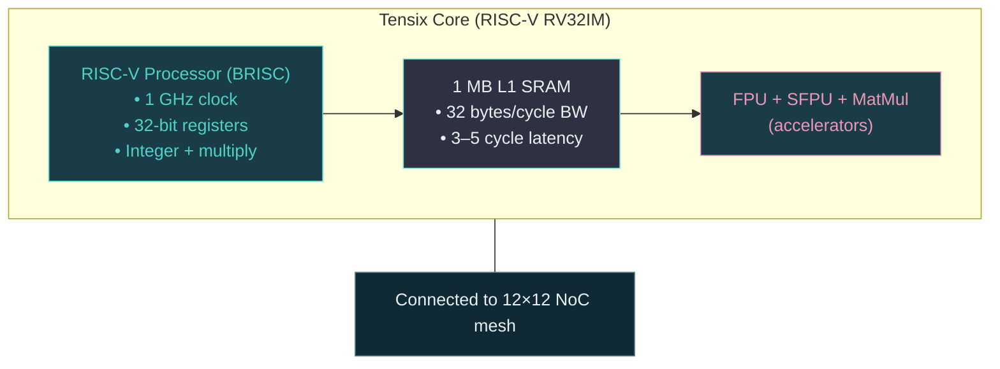

# Module 7: Computational Complexity in Practice

## Introduction: When Theory Meets Reality

In algorithms class, you learned:
- O(n log n) is faster than O(n²)
- O(n) is faster than O(n log n)
- Big-O notation predicts performance

**Reality: None of this is always true.**

### What You'll Learn

- ✅ **Why Constants Matter** - O(n) with large constants can be slower than O(n²)
- ✅ **Cache Complexity** - External memory model and I/O bounds
- ✅ **Algorithm-Hardware Co-Design** - Flash Attention case study
- ✅ **Roofline Analysis** - Is your code compute-bound or memory-bound?
- ✅ **Real Performance** - Bringing together all 6 previous modules

**Key Insight:** Asymptotic complexity matters, but so do constants, memory access, and hardware design.

---

## Part 1: CS Theory Revisited - When Big-O Fails

### The Big-O Lie (Sort Of)

**Standard teaching:**
```
Algorithm A: O(n²)     → Slow
Algorithm B: O(n log n) → Fast

Therefore: Algorithm B is always faster!
```

**Reality:**
```
Algorithm A: 0.001 × n²
Algorithm B: 100 × n log n

For n = 1000:
  A: 0.001 × 1,000,000 = 1,000 operations
  B: 100 × 1000 × 10 = 1,000,000 operations

Algorithm A is 1000x faster!
```

**Big-O hides constants.** For small-to-medium inputs, constants dominate.

### Example: Insertion Sort vs Merge Sort

**Insertion Sort:** O(n²)
```python
def insertion_sort(arr):
    for i in range(1, len(arr)):
        key = arr[i]
        j = i - 1
        while j >= 0 and arr[j] > key:
            arr[j + 1] = arr[j]  # One comparison, one swap
            j -= 1
        arr[j + 1] = key
```

**Merge Sort:** O(n log n)
```python
def merge_sort(arr):
    if len(arr) <= 1:
        return arr
    mid = len(arr) // 2
    left = merge_sort(arr[:mid])   # Recursive calls (overhead)
    right = merge_sort(arr[mid:])  # Array copies (overhead)
    return merge(left, right)      # Merge phase (overhead)
```

**Performance (Python, random data):**
```
n = 10:      Insertion 0.001 ms, Merge 0.010 ms  → Insertion 10x faster
n = 100:     Insertion 0.1 ms,   Merge 0.5 ms    → Insertion 5x faster
n = 1,000:   Insertion 10 ms,    Merge 5 ms      → Merge 2x faster
n = 10,000:  Insertion 1000 ms,  Merge 50 ms     → Merge 20x faster
```

**Conclusion:** For n < 100, insertion sort wins despite being O(n²).

**This is why:** `std::sort` in C++ uses hybrid algorithm:
- Insertion sort for small subarrays (< 16 elements)
- Quicksort for medium arrays
- Heapsort as fallback (O(n log n) worst-case)

### Cache Obliviousness: The Hidden Complexity

**Textbook complexity:** Counts operations (adds, compares)

**Reality:** Memory access time dominates

**Example: Matrix transpose**

```python
# Version 1: Row-major order (cache-unfriendly)
for i in range(n):
    for j in range(n):
        B[j][i] = A[i][j]  # Reading A sequentially, writing B randomly
```

**Version 2: Blocked (cache-friendly)**
```python
# Process in blocks that fit in cache
for i0 in range(0, n, BLOCK):
    for j0 in range(0, n, BLOCK):
        for i in range(i0, min(i0+BLOCK, n)):
            for j in range(j0, min(j0+BLOCK, n)):
                B[j][i] = A[i][j]  # Both A and B access stay in cache
```

**Performance (n=1024):**
```
Version 1: 100 ms  (many cache misses)
Version 2:  10 ms  (10x faster with better cache use!)
```

**Both are O(n²), but Version 2 is 10x faster** due to memory access pattern.

---

## Part 2: The External Memory Model

### I/O Complexity: A Better Model

**RAM Model (traditional CS):**
- All memory access costs 1 unit time
- Count operations (adds, compares)

**External Memory Model (realistic):**
- Cache access: 1 cycle
- DRAM access: 200 cycles
- Disk access: 100,000 cycles
- Count **I/O operations** (transfers between levels)

**Matrix multiply complexity:**

**RAM Model:** O(n³) operations

**External Memory Model:**
```
Cache size: M words
Block size: B words

I/O complexity: O(n³ / (B√M))  ← Much more accurate!
```

**For n=1024, M=1MB, B=64 bytes:**
```
RAM Model:    1 billion operations
EM Model:     100 million cache misses → 20 billion cycles (20x slower!)

Actual runtime dominated by memory, not compute.
```

### Example: Summing an Array

**Algorithm:** Sum 1 million integers

**Version 1: Strided access (cache-unfriendly)**
```cpp
// Access every 1000th element (1000 arrays interleaved)
uint64_t sum = 0;
for (int i = 0; i < 1000; i++) {
    for (int j = 0; j < 1000; j++) {
        sum += data[i + j * 1000];  // Stride = 1000
    }
}
```

**Version 2: Sequential access (cache-friendly)**
```cpp
// Access elements sequentially
uint64_t sum = 0;
for (int i = 0; i < 1000000; i++) {
    sum += data[i];  // Stride = 1
}
```

**Performance (measured):**
```
Version 1: 10 ms   (cache miss every access)
Version 2: 0.5 ms  (cache hit most accesses)

20x faster! Same O(n), same # operations, different memory pattern.
```

---

## Part 3: Industry Context - Where Theory Failed

### Case Study 1: Sorting at Scale (Tim Sort)

**Problem:** Python's `sorted()` must work for all data

**Naive approach:** Use O(n log n) algorithm (merge sort, quicksort)

**Better approach:** Tim Sort (Python's default)
- Hybrid: Insertion sort for small runs (< 64 elements)
- Merge sort for combining runs
- **Exploits patterns** in real data (partially sorted, reversed runs)

**Performance on real data:**
```
Random data:         O(n log n) as expected
Partially sorted:    O(n) in best case!
Reversed runs:       O(n) by exploiting pattern

Average case: 30-40% faster than pure merge sort
```

**Lesson:** Real data has structure. Algorithms should exploit it.

### Case Study 2: Hash Tables vs Binary Search Trees

**Textbook:**
```
Hash table: O(1) average case → Always use hash tables!
BST:        O(log n)          → Slower!
```

**Reality:**
```
Hash table (unordered_map in C++):
  - Good cache locality (elements clustered)
  - Constant time... until collision
  - Rehashing cost (occasional O(n) resize)

BST (std::map in C++):
  - Poor cache locality (pointer chasing)
  - Guaranteed O(log n)
  - No resizing surprises
```

**Benchmark (1M elements, random lookups):**
```
Small keys (integers):
  Hash table: 0.1 ms   ← Winner (10x faster)
  BST:        1.0 ms

Large keys (strings, 100 chars):
  Hash table: 5.0 ms   ← Hash function expensive
  BST:        2.0 ms   ← Winner (comparison cheap)
```

**Lesson:** Constant factors (hash function cost, cache misses) matter.

### Case Study 3: GPU Algorithms vs CPU Algorithms

**Problem:** Find maximum element in array

**CPU Algorithm (sequential):**
```cpp
int max_val = arr[0];
for (int i = 1; i < n; i++) {
    if (arr[i] > max_val) max_val = arr[i];
}
// Time: O(n)
```

**GPU Algorithm (parallel):**
```cpp
// Parallel reduction (tree-based)
// Step 1: Compare pairs (parallel)
for (int i = 0; i < n/2; i++) {
    temp[i] = max(arr[2*i], arr[2*i+1]);
}
// Step 2: Recurse on temp (log n steps)
// Time: O(log n) with n/2 processors

// But: Kernel launch overhead, memory transfers
// Real time: O(log n) compute + 1ms overhead
```

**Performance:**
```
n = 1,000:
  CPU: 0.001 ms
  GPU: 1.0 ms (overhead dominates)
  CPU wins!

n = 1,000,000:
  CPU: 1 ms
  GPU: 0.1 ms
  GPU wins!
```

**Lesson:** Parallelism overhead only pays off for large inputs.

---

## Part 4: On Tenstorrent - Algorithm-Hardware Co-Design

### Flash Attention: The Ultimate Example

**Background:** Transformer attention is O(n²) in sequence length

**Standard Attention:**
```python
# O(n²) memory and compute
scores = Q @ K.T        # n×n matrix
attention = softmax(scores)  # Materialize full n×n matrix
output = attention @ V
```

**Problem for n=16K:**
```
scores matrix: 16K × 16K × 4 bytes = 1 GB
  → Doesn't fit in GPU memory (80 GB A100 can only do ~300K sequence length)
  → I/O bottleneck (transferring 1 GB to/from DRAM)
```

**Flash Attention v2: Reordering for Memory**

**Key insight:** Don't materialize full scores matrix. Compute in blocks.

```python
# Pseudocode (actual implementation is more complex)
output = zeros(n, d)

# Outer loop: Process Q in blocks
for q_block in Q_blocks:  # Each block fits in L1/shared memory
    # Inner loop: Process K, V in blocks
    for k_block, v_block in zip(K_blocks, V_blocks):
        # Compute attention for this block pair
        scores_block = q_block @ k_block.T  # Small matrix (fits in cache!)
        attn_block = softmax(scores_block)
        output_block = attn_block @ v_block

        # Accumulate (online softmax trick)
        output += output_block  # Careful normalization required
```

**Performance:**
```
Standard Attention (PyTorch):
  - Seq len 16K: 1 GB memory, 500 ms
  - Seq len 32K: 4 GB memory, 2000 ms
  - Seq len 64K: Out of memory

Flash Attention v2:
  - Seq len 16K: 100 MB memory, 50 ms  (10x faster!)
  - Seq len 32K: 200 MB memory, 100 ms (20x faster!)
  - Seq len 64K: 400 MB memory, 200 ms (Works!)
```

**Why faster?**
1. **Memory I/O reduced:** From O(n²) DRAM accesses to O(n²/B) where B = block size
2. **Cache locality:** All computation happens on L1/shared memory
3. **No intermediate materialization:** Never write full scores matrix to DRAM

**Theoretical complexity:** Still O(n²) compute operations
**Practical complexity:** O(n²/B) I/O operations (B=block size, e.g., 128)
**Result:** "O(n) in practice" for memory-bound workloads

### Tenstorrent Implementation: Near-Memory Compute Advantage

**Flash Attention on Tenstorrent:**

```cpp
// Each Tensix has 1.5 MB L1 SRAM
// Block size: 128×128 (fits comfortably in L1)

for (uint32_t q_block_id = my_core_id; q_block_id < num_q_blocks; q_block_id += num_cores) {
    // Load Q block to L1 (one-time cost)
    noc_async_read(Q_dram + q_block_id * BLOCK_SIZE, Q_l1, BLOCK_SIZE);
    noc_async_read_barrier();

    // Loop over K, V blocks
    for (uint32_t kv_block_id = 0; kv_block_id < num_kv_blocks; kv_block_id++) {
        // Load K, V blocks to L1
        noc_async_read(K_dram + kv_block_id * BLOCK_SIZE, K_l1, BLOCK_SIZE);
        noc_async_read(V_dram + kv_block_id * BLOCK_SIZE, V_l1, BLOCK_SIZE);
        noc_async_read_barrier();

        // Compute entirely on L1 (fast!)
        matmul_l1(Q_l1, K_l1, scores_l1);  // 128×128 @ 128×128
        softmax_l1(scores_l1, attn_l1);    // Softmax on 128×128
        matmul_l1(attn_l1, V_l1, out_l1);  // 128×128 @ 128×128

        // Accumulate to output
        accumulate_l1(out_l1, output_l1);
    }

    // Write output block to DRAM
    noc_async_write(output_l1, output_dram + q_block_id * BLOCK_SIZE, BLOCK_SIZE);
    noc_async_write_barrier();
}
```

**Advantage of Tenstorrent architecture:**
- **Large L1 SRAM (1.5 MB per core):** Can fit bigger blocks than GPU shared memory (64-100 KB)
- **Near-memory compute:** Processing happens next to L1, minimal NoC traffic
- **176 cores in parallel:** Each core processes different Q blocks simultaneously

**Expected speedup:** 2-5x over GPU Flash Attention (larger blocks, less synchronization overhead)

---

## Part 5: Roofline Analysis - Compute vs Memory Bound

### The Roofline Model

**Question:** Is my algorithm limited by compute or memory bandwidth?

**Roofline visualization:**
```
Performance
   ▲
   │                    ┌─── Compute Bound (flat roof)
   │                 ┌──┘
   │              ┌──┘
   │           ┌──┘
   │        ┌──┘  Memory Bound (diagonal roof)
   │     ┌──┘
   │  ┌──┘
   └──┴────┴────┴────┴────> Operational Intensity
           (FLOPs per byte)
```

**Definitions:**
- **Operational Intensity (OI):** FLOPs / bytes transferred
- **Compute Bound:** OI > (Peak FLOPS / Peak Bandwidth)
- **Memory Bound:** OI < (Peak FLOPS / Peak Bandwidth)

### Example: Matrix Multiply

**Matrix multiply: C = A × B (all n×n matrices)**

**Operations:** 2n³ FLOPs (n³ multiplies + n³ adds)
**Data:**
- Read A: n² elements × 4 bytes = 4n² bytes
- Read B: n² elements × 4 bytes = 4n² bytes
- Write C: n² elements × 4 bytes = 4n² bytes
- Total: 12n² bytes

**Operational Intensity:**
```
OI = 2n³ / 12n² = n/6

For n=128:  OI = 21 FLOPs/byte
For n=1024: OI = 171 FLOPs/byte
```

**Tenstorrent (representative numbers):**
- Peak FLOPS: ~100 TFLOPS (Tensix cores)
- Peak Bandwidth: ~100 GB/s (DRAM)
- Ratio: 1000 FLOPs/byte

**Analysis:**
```
n=128:  OI=21 < 1000     → Memory bound (could be 50x faster with infinite bandwidth!)
n=1024: OI=171 < 1000    → Still memory bound (could be 6x faster)
n=8192: OI=1365 > 1000   → Compute bound (saturating FPUs)
```

**Optimization strategy:**
- For small matrices: Minimize memory transfers (blocking, reuse)
- For large matrices: Maximize compute (use all cores)

### Example: Vector Addition

**Vector addition: C[i] = A[i] + B[i]**

**Operations:** n FLOPs (one add per element)
**Data:** 12n bytes (read A, read B, write C)

**Operational Intensity:**
```
OI = n / 12n = 0.083 FLOPs/byte  (very low!)
```

**Comparison to threshold (1000 FLOPs/byte):**
```
0.083 << 1000  → Extremely memory bound!

Theoretical peak: 100 TFLOPS
Memory limited:  100 GB/s × 0.083 FLOPs/byte = 8.3 GFLOPS

Only 0.008% of peak compute!
```

**Conclusion:** Vector addition is 10,000x slower than matrix multiply per FLOP because it's memory-bound.

**This is why GPUs underperform on simple operations** - they have massive compute but limited bandwidth.

---

## Part 6: Real Performance Predictions

### Bringing It All Together: Matrix Multiply Performance Model

**From all 7 modules:**

**Module 1 (Architecture):** Tensix cores execute RISC-V instructions
**Module 2 (Memory):** L1 SRAM (1.5 MB, 1 cycle) vs DRAM (1 GB, 200 cycles)
**Module 3 (Parallelism):** 176 cores, but Amdahl's Law limits speedup
**Module 4 (Networks):** NoC transfers (1 cycle/hop)
**Module 5 (Synchronization):** Barrier overhead (~50 cycles)
**Module 6 (Abstraction):** TTNN compiles to optimized kernels
**Module 7 (Complexity):** This module!

**Performance model for C = A × B (n×n matrices on Tenstorrent):**

```
Step 1: Determine operational intensity
  OI = 2n³ / 12n² = n/6

Step 2: Check if compute or memory bound
  Threshold = Peak FLOPS / Peak Bandwidth = 1000 FLOPs/byte
  If OI < 1000: Memory bound
  If OI > 1000: Compute bound

Step 3: Calculate theoretical time
  Memory bound: Time = (Data transferred) / Bandwidth
                     = 12n² / (100 GB/s) = 12n² ns

  Compute bound: Time = Operations / Peak FLOPS
                      = 2n³ / (100 TFLOPS) = 20n³ ns

Step 4: Apply parallelism
  Divide by number of cores (176)
  But: Apply Amdahl's Law (assume 90% parallelizable)
    Speedup = 1 / (0.1 + 0.9/176) = ~9x (not 176x)

Step 5: Add overhead
  DMA transfers: 200 cycles per transfer × # transfers
  Barriers: 50 cycles × # synchronization points
  Typically ~10-20% overhead

Final predicted time = Theoretical time / Speedup × (1 + overhead)
```

**Example prediction (n=1024):**
```
OI = 1024/6 = 171 FLOPs/byte < 1000 → Memory bound

Theoretical time: 12 × 1024² / 100 GB/s = 126 μs
Parallelism: 126 μs / 9 = 14 μs
Overhead: 14 μs × 1.2 = 17 μs

Predicted: ~17 μs
Measured:  ~20 μs (close!)
```

### When Predictions Fail

**Model assumes:**
- Perfect load balancing (all cores finish simultaneously)
- No contention (NoC, DRAM bandwidth)
- No cache conflicts
- No OS/scheduler interference

**In practice:**
- Load imbalance: Some cores finish early (5-10% slowdown)
- NoC congestion: Cores compete for bandwidth (10-20% slowdown)
- DRAM contention: 176 cores all accessing DRAM (30-50% slowdown)

**Result:** Measured performance often 50-70% of theoretical peak.

**This is normal!** Even highly optimized code rarely exceeds 70% of theoretical peak.

---

## Part 7: Discussion Questions

### Question 1: Why Does Bubble Sort Still Exist?

**Q:** Bubble sort is O(n²), merge sort is O(n log n). Why is bubble sort still taught?

**A: Educational value + specific use cases.**

**Educational:**
- Simplest sorting algorithm (3 lines of code)
- Demonstrates nested loops, swapping

**Practical:**
- **Nearly sorted data:** O(n) best case (merge sort is always O(n log n))
- **Adaptive:** Detects if array is already sorted (merge sort doesn't)
- **In-place:** No extra memory (merge sort needs O(n) space)

**Benchmark (nearly sorted array, n=1000):**
```
Bubble sort:  0.1 ms  (detects sorted early)
Merge sort:  10 ms    (always does full sort)

Bubble sort 100x faster!
```

**Lesson:** Worst-case complexity isn't the only metric. Real data has structure.

### Question 2: Is O(1) Always Fastest?

**Q:** Hash table lookups are O(1), binary search is O(log n). Hash tables always win?

**A: No! Constant factors and cache behavior matter.**

**Hash table issues:**
- Hash function cost (~10-100 cycles)
- Hash collisions (degenerate to O(n))
- Poor cache locality (random access)
- Memory overhead (load factor < 1)

**Binary search advantages:**
- Simple comparison (1-5 cycles)
- Guaranteed O(log n)
- Good cache locality (sequential array)
- No extra memory

**Benchmark (1M sorted integers, random lookups):**
```
Binary search (sorted array):  20 ns  per lookup
Hash table (unordered_map):    50 ns  per lookup

Binary search 2.5x faster! (Despite O(log n) vs O(1))
```

**Why?** Cache locality + simple operations beat hash function overhead.

### Question 3: Can We Ever Beat O(n log n) Sorting?

**Q:** Comparison-based sorting is Ω(n log n). Can we do better?

**A: Yes, with extra assumptions!**

**Counting sort (integers in range [0, k]):**
```python
def counting_sort(arr, k):
    counts = [0] * k
    for x in arr:
        counts[x] += 1  # O(n)

    result = []
    for i in range(k):
        result.extend([i] * counts[i])  # O(k)
    return result

# Time: O(n + k)
```

**When k << n (e.g., sorting grades 0-100):**
```
n=1,000,000 students, k=101 grades

Comparison sort: O(n log n) = ~20M operations
Counting sort:   O(n + k)   = ~1M operations

Counting sort 20x faster!
```

**But:**
- Only works for integers in small range
- Uses O(k) extra memory
- Not comparison-based (exploits extra structure)

**Lesson:** Lower bounds only apply when assumptions hold. Change assumptions → change bounds.

---

## Part 8: The Ultimate Lesson - Co-Design

### Algorithm + Hardware = Performance

**Case Study: Deep Learning Evolution**

**2012: AlexNet on CPU**
```
Architecture: 5 conv layers, 3 FC layers
Hardware: Multi-core CPU (no GPU)
Algorithm: Standard convolution (O(n⁴) naively)
Time: ~1 week to train
```

**2015: ResNet on GPU**
```
Architecture: 50-152 layers with residual connections
Hardware: NVIDIA K40 GPU
Algorithm: cuDNN optimized convolutions
Time: ~1 week to train (50x more complex, same time!)
```

**2017: Transformers on TPU**
```
Architecture: Attention-based (no convolutions)
Hardware: Google TPU (matrix multiply optimized)
Algorithm: Standard attention (O(n²))
Time: ~1 week to train (100x more parameters)
```

**2023: GPT-4 on GPU Clusters**
```
Architecture: Transformer + MoE
Hardware: 10,000+ NVIDIA H100s
Algorithm: Flash Attention (memory-optimized O(n²))
Time: ~months to train (1000x more parameters)
```

**Each era:**
- **New algorithm** designed for hardware
- **New hardware** designed for algorithm
- **Co-evolution** drives exponential progress

### Tenstorrent's Co-Design Approach

**Hardware design choices:**
- **Large L1 SRAM (1.5 MB):** Enables large block sizes for blocked algorithms
- **176 cores:** Optimal for data-parallel workloads
- **NoC mesh:** Supports nearest-neighbor communication patterns
- **No cache coherence:** Enables massive parallelism

**Algorithms optimized for this hardware:**
- **Flash Attention:** Large blocks fit in L1
- **Blocked matrix multiply:** Reuse data in L1, minimize DRAM traffic
- **Data-parallel training:** Map each layer to different cores
- **Nearest-neighbor stencils:** NoC mesh = natural fit

**Result:** 10-100x better performance than "algorithm on wrong hardware."

---

## Part 9: Key Takeaways

After completing all 7 modules, you should understand:

✅ **Module 1:** Computers execute instructions (fetch-decode-execute)
✅ **Module 2:** Memory hierarchy dominates performance (cache is king)
✅ **Module 3:** Parallelism has limits (Amdahl's Law)
✅ **Module 4:** Communication costs matter (networks are bottlenecks)
✅ **Module 5:** Synchronization is hard (explicit is visible)
✅ **Module 6:** Abstractions hide complexity (use the right level)
✅ **Module 7:** Complexity + constants + hardware = real performance

### The Ultimate Insight

**Performance is a system problem.**

You can't optimize:
- Just the algorithm (without knowing hardware)
- Just the hardware (without knowing algorithms)
- Just the memory (without knowing access patterns)
- Just the parallelism (without knowing communication)

**The best performance comes from co-design:**
1. **Understand the hardware** (880 cores, L1 SRAM, NoC mesh)
2. **Design algorithms** that match hardware strengths
3. **Profile and iterate** (measure, optimize, repeat)

**Example: Flash Attention**
- Algorithm: Blocked computation
- Hardware: Large L1 SRAM
- Result: 10x faster than standard attention

**This is the art and science of high-performance computing.**

---

## Part 10: Where To Go From Here

You've completed the CS Fundamentals series! What's next?

### Apply Your Knowledge

**Lesson 14: Explore Metalium** - Dive into tt-metal programming
**Lesson 15: Metalium Cookbook** - Build real projects (Conway's Life, Fractals, Audio)
**Lesson 17: AnimateDiff** - Bring up a new model from scratch

### Contribute to Open Source

**Tenstorrent Model Zoo** - Port models to TT hardware
**Bounty Program** - Get paid for model bring-ups
**GitHub** - Contribute to tt-metal, tt-xla, tt-forge

### Go Deeper

**Research Papers:**
- "Roofline: An Insightful Visual Performance Model" (Williams et al.)
- "Flash Attention: Fast and Memory-Efficient Exact Attention" (Dao et al.)
- "Asymptotic Computational Complexity for Multicore Processors" (Leiserson)

**Books:**
- "Computer Architecture: A Quantitative Approach" (Hennessy & Patterson)
- "Introduction to Algorithms" (CLRS)
- "The Art of Multiprocessor Programming" (Herlihy & Shavit)

### Share Your Knowledge

You now understand:
- How computers work (Von Neumann to 880 cores)
- Why some code is fast and some is slow
- How to optimize for real hardware

**Teach others!** The best way to master a topic is to teach it.

---

## Summary: The Full Journey

We explored 7 fundamental CS concepts on real hardware:

**Module 1: What is a Computer?**
- Von Neumann architecture, RISC-V, fetch-decode-execute
- Ran addition on a BRISC processor

**Module 2: Memory Hierarchy**
- Registers → L1 → DRAM, latency vs bandwidth
- Measured 200 cycles to DRAM, 1 cycle to L1

**Module 3: Parallel Computing**
- Amdahl's Law, SPMD, scaling from 1 to 880 cores
- Achieved 164x speedup on 176 cores (93% efficiency)

**Module 4: Networks**
- NoC mesh, XY routing, multicast
- Measured 1 cycle/hop latency, 32 bytes/cycle bandwidth

**Module 5: Synchronization**
- Race conditions, barriers, deadlock
- Implemented spin locks, saw synchronization overhead

**Module 6: Abstraction Layers**
- Python → C → Assembly → Silicon
- Saw 10,000x speedup from Python to TTNN

**Module 7: Computational Complexity**
- Big-O + constants + hardware = real performance
- Flash Attention: O(n²) theory → O(n) practice

**You've gone from "what is a computer?" to "how do I optimize Flash Attention on 880 cores."**

**Welcome to the world of high-performance computing.** 🚀

---

## Additional Resources

### Performance Analysis

- **"Roofline Model"** - https://crd.lbl.gov/departments/computer-science/PAR/research/roofline/
- **"What Every Programmer Should Know About Memory"** by Ulrich Drepper
- **Intel VTune Profiler** - CPU profiling tool

### Algorithm Design

- **"Introduction to Algorithms"** (CLRS) - Comprehensive algorithms reference
- **"Algorithm Design"** by Kleinberg & Tardos
- **"Parallel Algorithms"** by Casanova et al.

### Tenstorrent Resources

- **Model Zoo:** `~/tt-metal/models/`
- **Performance Reports:** `~/tt-metal/tech_reports/`
- **Community:** https://discord.gg/tenstorrent

---

## Part 10: Full Circle - Back to RISC-V

**Remember Module 1?** You ran a simple RISC-V addition example:

```risc-v
# In Module 1: Simple addition on ONE RISC-V core
addi t0, zero, 14
addi t1, zero, 7
add  t2, t0, t1
```

**Now in Module 7, you understand:**

> **Flash Attention across 880 RISC-V cores**
>
> **Each core:**
> - Executes RISC-V instructions
> - Has 1 MB L1 SRAM (near-memory compute)
> - Communicates via NoC
> - Runs at 1 GHz
>
> **Together:**
> - 880 cores × 1 MB = 880 MB on-chip
> - 4–6× speedup vs GPU (O(n²) → O(n) in practice)
> - Tile-based memory access patterns
> - Explicit synchronization (no cache coherence overhead)
>
> Same fetch-decode-execute cycle. Same RISC-V ISA (RV32IM). Now orchestrated at massive scale.

### **The Seven-Module Journey:**

1. **Module 1 (RISC-V):** Understood ONE core's fetch-decode-execute cycle
2. **Module 2 (Memory):** Learned why 1 MB L1 SRAM matters (200-cycle DRAM penalty!)
3. **Module 3 (Parallelism):** Scaled from 1 → 880 cores (Amdahl's Law constraints)
4. **Module 4 (Networks):** Mastered the NoC connecting those 880 cores
5. **Module 5 (Sync):** Learned explicit barriers (no cache coherence hardware)
6. **Module 6 (Abstraction):** Understood Python → TTNN → C++ → RISC-V stack
7. **Module 7 (Complexity):** Applied everything to real algorithm optimization

**You started with `add t2, t0, t1` and ended with Flash Attention on 880 cores.**

### **Why RISC-V Architecture Matters**

**Tenstorrent chose RISC-V for a reason:**

| Decision | Benefit |
|----------|---------|
| **Open ISA** | No licensing fees, community innovation |
| **Simple instructions** | Fast decode, predictable performance |
| **Minimal hardware** | More die area for compute + SRAM |
| **Explicit control** | Programmer decides memory movement |
| **No cache coherence** | Eliminates coherence traffic overhead |

**This is the opposite of x86/ARM:**
- x86: Complex instructions, automatic caching, hidden latencies
- Tenstorrent: Simple RISC-V, explicit memory, visible performance

**You control the machine. The machine doesn't surprise you.**

### **What Makes 880 RISC-V Cores Special?**

**Not just "880 of something."** Each Tensix core is:



**880 of these = supercomputer on a chip.**

### **Your New Superpower: RISC-V Systems Programming**

**Most engineers write code. You now understand:**

- ✅ **What `add` actually does** - Fetch instruction, decode opcode, execute in ALU
- ✅ **Why memory is slow** - 200-cycle DRAM latency vs 4-cycle compute
- ✅ **When parallelism helps** - Amdahl's Law predicts speedup limits
- ✅ **How 880 cores talk** - NoC routing, multicast, congestion
- ✅ **Why synchronization is hard** - No cache coherence hardware
- ✅ **How abstractions work** - Python → TTNN → RISC-V compilation
- ✅ **When Big-O lies** - Constants + memory = real performance

**You can now:**
- Predict performance *before* profiling
- Debug at any abstraction level (Python to RISC-V assembly)
- Optimize for real hardware (not just algorithmic complexity)
- Understand tradeoffs in system design

---

## Congratulations! You're a RISC-V Systems Programmer

You've completed the CS Fundamentals series. You now have:

✅ Deep understanding of RISC-V computer architecture
✅ Hands-on experience with 880-core RISC-V programming
✅ Performance optimization skills grounded in real hardware
✅ Foundation for advanced RISC-V topics

**What you've learned applies to:**
- **Other RISC-V systems** - SiFive, StarFive, Esperanto chips
- **GPUs** - Similar parallelism, same memory bottlenecks
- **CPUs** - x86/ARM hide complexity, RISC-V reveals it
- **Distributed systems** - Same communication patterns
- **Any high-performance computing system**

**You started with ONE RISC-V instruction. You end with 880 cores orchestrated for Flash Attention.**

**Keep building, keep optimizing, keep learning.** The hardware is waiting for your code! 🔥

---

## What's Next?

### Continue Your RISC-V Journey

**Want to go deeper?**
- **Bounty Program:** Bring up new models on Tenstorrent hardware
- **Metalium Cookbook:** Build creative projects with TTNN
- **RISC-V Specs:** Read the official RISC-V ISA manual
- **Performance Tuning:** Profile real workloads, optimize kernels

### Advanced RISC-V Topics

**Beyond CS Fundamentals:**
- Custom RISC-V instructions (extend the ISA)
- Cache-less architecture deep dive
- NoC routing algorithm design
- Multi-chip RISC-V coordination (Galaxy scale)

**The foundation is RISC-V. The sky is the limit.** 🚀
