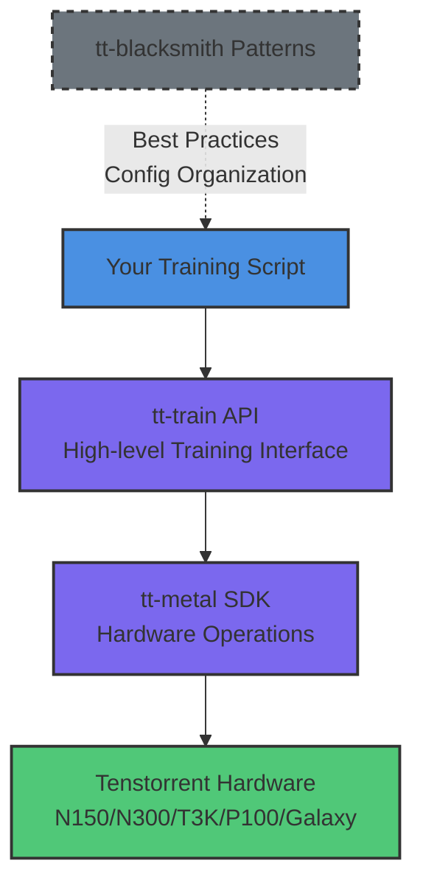
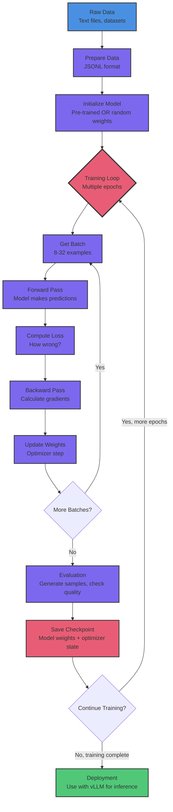

# Understanding Custom Training

Welcome to the Custom Training series! This lesson provides a conceptual foundation for understanding how to build and customize AI models on Tenstorrent hardware.

## What You'll Learn

- What is custom training and when do you need it?
- The difference between fine-tuning and training from scratch
- How training frameworks work together
- The tt-blacksmith approach to model development
- When to use tt-train vs tt-blacksmith vs PyTorch

**Time:** 10-15 minutes | **Prerequisites:** Basic understanding of machine learning concepts

---

## Custom Training vs Inference

So far in this extension, you've learned how to **run** pre-trained models (inference). Now you'll learn how to **create** your own models (training).

### Inference (What You've Done)
- Load a pre-trained model
- Feed it inputs, get outputs
- Like using a tool someone else built
- Fast, predictable, production-ready

### Training (What We'll Build)
- Teach a model new behaviors
- Adjust billions of parameters
- Like building your own custom tool
- Slower, requires experimentation, incredibly powerful

**Key insight:** Training is where the magic happens. A model is just a collection of numbers (weights) until training teaches it what those numbers should be.

---

## Two Paths to Custom Models

### Path 1: Fine-Tuning (Lessons CT-2 through CT-6)
**Start with a pre-trained model, teach it something new.**

**When to use:**
- You want to specialize an existing model
- You have a specific task or domain
- You have 100-10,000 examples
- You want results in hours, not days

**Example:** Take TinyLlama (general language model) and fine-tune it to explain machine learning concepts in creative ways.

**Analogy:** Like hiring an experienced developer and training them on your company's codebase.

### Path 2: Training from Scratch (Lessons CT-7 and CT-8)
**Build a model from the ground up.**

**When to use:**
- You want complete architectural control
- You're researching new model designs
- You want to deeply understand how models work
- You have time and computational resources

**Example:** Build a tiny transformer (10-20M parameters) that learns language patterns from scratch.

**Analogy:** Like teaching yourself programming from first principles.

---

## The Training Framework Ecosystem

Tenstorrent's training ecosystem is designed around clarity and modularity. Here's how the pieces fit together:

### tt-metal (Foundation)
- **What it is:** Core SDK for Tenstorrent hardware
- **What it does:** Low-level operations, kernels, device management, memory handling
- **Why it matters:** This is the foundation everything else builds on
- **Location:** `vendor/tt-metal/`

### tt-train (Training Framework)
- **What it is:** Python API for training on TT hardware
- **What it does:** PyTorch-like interface, built-in DDP for multi-device training, YAML configuration
- **Why it matters:** Makes training feel familiar to ML engineers while optimizing for TT hardware
- **Location:** `vendor/tt-metal/tt-train/`

### tt-blacksmith (Development Patterns)
- **What it is:** Not just for bounties - it's a **development framework**
- **What it does:** Config-driven patterns, modular organization, experiment management best practices
- **Why it matters:** Shows you how experienced engineers structure training projects
- **Location:** External reference (we'll apply these patterns throughout)

**How they work together:**



**Think of it like web development:**
- tt-metal = Browser APIs (low-level)
- tt-train = React/Vue (framework)
- tt-blacksmith = Design patterns & best practices
- Your script = Your application

---

## The tt-blacksmith Philosophy

tt-blacksmith isn't just a collection of bounty scripts - it's a framework for **making things work** on Tenstorrent hardware. Here are its key patterns:

### 1. Configuration-Driven Everything
Instead of hardcoding values, use YAML configs:

```yaml
training_config:
  batch_size: 8
  learning_rate: 1e-4
  num_epochs: 3

device_config:
  enable_ddp: False    # Single device
  mesh_shape: [1, 1]

logging_config:
  use_wandb: false     # Optional experiment tracking
  log_level: "INFO"
```

**Why:** Easy to experiment, reproduce, and share configurations.

### 2. Modular Organization
Separate concerns into focused components:
- **Dataset handling** - Load, validate, format data
- **Model creation** - Architecture definition
- **Training loop** - Forward, backward, optimize
- **Evaluation** - Generate samples, compute metrics

**Why:** Easier to debug, test, and reuse code.

### 3. Progressive Enhancement
Start simple, add complexity when needed:
1. File-based logging → WandB integration
2. Single device → Multi-device DDP
3. Fine-tuning → Training from scratch

**Why:** Learn incrementally, avoid over-engineering.

---

## Understanding the Training Process

Training a model is like teaching through repetition - show examples, measure mistakes, make corrections, repeat. Here's the complete flow:



**What each step does:**

### Step 1: Prepare Data
Transform raw text into training format (JSONL with prompt/response pairs). Quality matters more than quantity here.

### Step 2: Initialize Model
Either load pre-trained weights (fine-tuning) or start from random numbers (training from scratch). Most of the time, you'll fine-tune.

### Step 3: Training Loop (The Core)
This is where learning happens:
1. **Get Batch** - Load 8-32 examples from your dataset
2. **Forward Pass** - Model makes predictions based on current weights
3. **Compute Loss** - Measure how far predictions are from correct answers
4. **Backward Pass** - Calculate which direction to adjust each weight
5. **Update Weights** - Actually change the model's parameters
6. **Repeat** - Do this thousands of times

**Think of loss as:** A score that goes down as the model gets better. Loss of 2.5 → 1.2 → 0.5 means it's learning.

### Step 4: Evaluation
Generate sample outputs to see if the model is improving. This happens every few hundred steps, not every step.

### Step 5: Save Checkpoint
Store model weights and training state so you can resume if interrupted or pick the best version later.

### Step 6: Deployment
Once training is complete, use your fine-tuned model for inference. Integrate with vLLM (from **Lesson 7: vLLM Production**) for production serving.

---

## Hardware Considerations

### N150 (Single Wormhole Chip)
- **Perfect for:** Fine-tuning small models (1-3B params)
- **Batch size:** 4-8 (conservative for DRAM)
- **Training time:** 1-3 hours typical
- **What you'll learn:** Core concepts, single-device patterns

### N300 (Dual Wormhole Chips)
- **Perfect for:** Larger models, faster training
- **Batch size:** 16-32 (distributed across chips)
- **Training time:** 30-60 minutes (2x faster than N150)
- **What you'll learn:** DDP patterns, multi-device coordination

### T3K / Blackhole / Galaxy (Advanced)
- **Perfect for:** Large-scale training, experimentation
- **Batch size:** 32+ (highly parallel)
- **Training time:** Minutes for small jobs
- **What you'll learn:** Scaling strategies, tensor parallelism

**For this series:** We'll focus on N150 (everyone can follow) with N300 examples for scaling.

---

## The Trickster Model (Our Example)

Throughout this series, we'll build "tt-trickster" - a creative, flexible AI model:

**What it does:**
- Explains ML/AI concepts in approachable, creative ways
- Shows how to fine-tune for educational content
- Demonstrates patterns applicable to **any** custom model

**Why this example:**
- Clear difference from base model (easy to evaluate)
- Useful output (you'll actually use it!)
- Teaches transferable principles
- Flexible enough to adapt to your needs

**Not limited to one task:** After CT-4, you'll understand how to adapt the trickster approach to your own use cases.

---

## What You'll Build (Series Overview)

### Lessons CT-2 and CT-3: Preparation
- Create training datasets (JSONL format)
- Write configuration files (YAML)
- Understand the pieces before assembly

### Lesson CT-4: Your First Fine-Tuning
- Fine-tune TinyLlama on tt-trickster dataset
- Monitor training progress
- Test the fine-tuned model
- **Outcome:** Working custom model in 1-3 hours

### Lessons CT-5 and CT-6: Scaling Up
- Train on multiple devices (DDP)
- Track experiments with WandB
- Understand performance optimization

### Lessons CT-7 and CT-8: Advanced Topics
- Understand transformer architecture
- Train a tiny model from scratch
- See the full picture (10M → 1B+ params)

---

## Common Questions

### "Should I fine-tune or train from scratch?"

**99% of the time: fine-tune.**

Fine-tuning is:
- **Faster** - Hours vs days/weeks
- **Cheaper** - Less compute required
- **Better** - Pre-trained models already understand language
- **Easier** - Fewer hyperparameters to tune

Train from scratch when:
- You're researching new architectures
- You need complete control
- You want to understand the fundamentals
- You're building something truly novel

### "How much data do I need?"

**For fine-tuning:**
- 50-200 examples: Decent results for specific tasks
- 1,000-10,000 examples: Strong performance
- 100,000+ examples: Approaching pre-training scale

**For training from scratch:**
- Millions of examples for production models
- But 10,000+ examples can teach a tiny model (CT-8)

**Quality > Quantity:** 200 high-quality examples beat 10,000 mediocre ones.

### "Will fine-tuning erase what the model learned?"

**No, if done correctly.**

- Use a low learning rate (1e-4 to 1e-5)
- Don't over-train (watch validation loss)
- The model retains general knowledge while learning your task

**Think of it as:** Teaching a PhD new skills, not wiping their memory.

### "Can I use this for commercial projects?"

**Yes**, with caveats:

- **TinyLlama:** Apache 2.0 license (commercial-friendly)
- **Your fine-tuned model:** You own it
- **Training code:** Check tt-metal and tt-train licenses
- **Hosting:** Use tt-inference-server or vLLM (Lesson 7)

Always verify licenses for your specific use case.

---

## Beyond This Lesson: The Custom AI Landscape

You're about to learn how to train custom models - but what will you build with this power? Let's explore the possibilities.

### What Developers Have Built on Tenstorrent

**Real-world custom models running on TT hardware:**

🎯 **Domain-Specific Coding Assistants**
- Python → TTNN translators (convert PyTorch to TT-optimized code)
- Hardware description language generators (Verilog patterns)
- Code review bots trained on team style guides
- API documentation chatbots

📚 **Knowledge Specialists**
- Technical documentation assistants (trained on company wikis)
- Research paper summarizers (domain-specific scientific content)
- Legal contract analyzers (specialized terminology)
- Medical Q&A systems (trained on authorized datasets)

🎨 **Creative Applications**
- Genre-specific writing assistants (sci-fi, technical writing, poetry)
- Dialog generators for games or simulations
- Educational content creators (explain concepts in multiple styles)
- Multilingual translators with domain expertise

🔬 **Research & Experimentation**
- Novel architecture testing (new attention patterns)
- Compression experiments (how small can models go?)
- Specialized tokenizers (music notation, chemical formulas)
- Domain-specific embeddings (protein sequences, geographic data)

### Working Within Constraints (N150 Can Do This!)

**You don't need massive infrastructure to build something meaningful:**

- **Fine-tune 1-3B models in hours** - TinyLlama, Qwen3-0.6B, Gemma-3-1B all work on N150
- **Deploy with vLLM for production inference** - Sub-millisecond latency, thousands of requests/second
- **Iterate quickly with small datasets** - 100-1000 high-quality examples beat 100,000 mediocre ones
- **Combine multiple specialized models** - Build an ensemble of experts, each fine-tuned for specific tasks
- **Scale when needed** - Start on N150, move to N300 for 2x speedup, T3K for 8x, Galaxy for research scale

**The magic is in the data and the task definition, not the hardware scale.**

### Imagine: Your Custom Model Journey

**Month 1 (Starting Today):**
- Learn fine-tuning on N150 with tt-trickster
- Build your first domain-specific assistant
- Deploy with vLLM for internal use
- **Outcome:** Working custom model serving real users

**Month 2-3:**
- Experiment with different base models (Qwen, Gemma, Llama)
- Try multi-task fine-tuning (one model, multiple skills)
- Scale to N300 for faster iteration
- **Outcome:** Production-ready specialized models

**Month 6+:**
- Train multiple specialized models for different domains
- Explore novel architectures (CT-7, CT-8)
- Contribute patterns back to tt-blacksmith
- **Outcome:** You're pushing the boundaries of what's possible on TT hardware

### From Learning to Leading

**This series teaches you:**
- ✅ The techniques (fine-tuning, configuration, multi-device training)
- ✅ The tools (tt-train, tt-metal, experiment tracking)
- ✅ The patterns (tt-blacksmith best practices)

**But more importantly, it empowers you to:**
- 🚀 **Imagine** what specialized AI can do for your domain
- 🛠️ **Build** custom models that solve real problems
- 📈 **Scale** from prototype to production
- 🌟 **Innovate** within hardware constraints

**The question isn't "Can I train a custom model on Tenstorrent hardware?"**

**The question is "What will I build first?"**

---

## Key Takeaways

✅ **Training creates models**, inference uses them

✅ **Fine-tuning is usually the right choice** for custom models

✅ **tt-train provides the framework** for training on TT hardware

✅ **tt-blacksmith shows the patterns** for organizing training code

✅ **Start with N150**, scale to N300+ when needed

✅ **Focus on data quality** over quantity

✅ **The trickster model teaches transferable principles**

---

## Next Steps

**Lesson CT-2: Dataset Fundamentals**

Now that you understand the concepts, it's time to get hands-on. In the next lesson, you'll:

1. Create your first training dataset (JSONL format)
2. Validate dataset format
3. Understand tokenization and batching
4. See how data flows through training

**Estimated time:** 15 minutes | **Prerequisites:** This lesson (CT-1)

---

## Additional Resources

### Official Documentation
- [tt-metal GitHub](https://github.com/tenstorrent/tt-metal) - Core SDK
- [tt-train Documentation](https://github.com/tenstorrent/tt-metal/tree/main/tt-train) - Training framework
- [tt-blacksmith Examples](https://github.com/tenstorrent/tt-blacksmith) - Framework patterns

### Related Lessons
- **Lesson 7:** vLLM Production (inference with fine-tuned models)
- **Lesson 11:** TT-Forge (experimental compiler)
- **Lesson 12:** TT-XLA JAX (alternative training framework)

### Community
- [Tenstorrent Discord](https://discord.gg/tenstorrent) - Ask questions, share results
- [GitHub Discussions](https://github.com/tenstorrent/tt-metal/discussions) - Technical discussions

---

**Ready to build your first dataset?** Continue to **Lesson CT-2: Dataset Fundamentals** →
