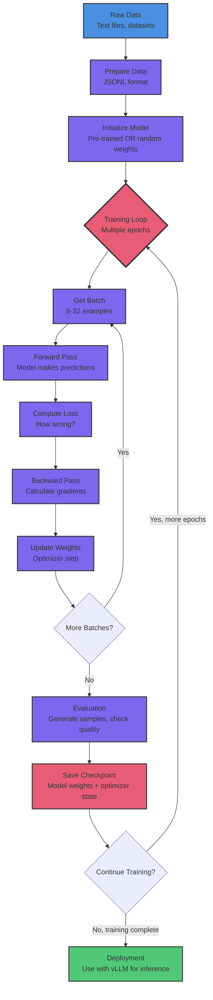

# Understanding Custom Training

Welcome to the Custom Training track. Elsewhere in this extension you've learned to **run** models — inference. This track is about **creating** them: teaching a network new behavior by adjusting its weights.

This lesson lays the groundwork before you touch a dataset or a training loop: what custom training is, when you actually need it, and which of the three ways to train on Tenstorrent hardware fits your goal.

## What You'll Learn

- What custom training is, and when you actually need it
- Fine-tuning vs. training from scratch — and how to pick
- The three ways to train on Tenstorrent hardware, and which one this track teaches
- Where to go if you'd rather build every piece — tokenizer, attention, the training loop itself — by hand

**Time:** 10-15 minutes | **Prerequisites:** Basic understanding of machine learning concepts

---

## Custom Training vs. Inference

### Inference (what you've done so far)
- Load a pre-trained model, feed it inputs, read outputs.
- Fast, predictable, production-ready.
- Like using a tool someone else built.

### Training (what this track builds)
- Adjust a model's weights so it does something it couldn't do before.
- Slower, and it takes experimentation.
- Like building the tool yourself.

**Key insight:** a model is a pile of numbers until training decides what those numbers should be. That's the whole job.

---

## Two Paths to a Custom Model

### Fine-tuning
Start with a pre-trained model and teach it something new.

**Reach for this when:**
- You want to specialize an existing model for a task or domain.
- You have somewhere between a hundred and tens of thousands of examples.
- You want results in hours, not days.

**Analogy:** hiring an experienced developer and onboarding them to your codebase, not teaching them to code from zero.

[Fine-tuning Basics](command:tenstorrent.showLesson?["ct4-finetuning-basics"]) is where this track puts a first training run into practice, end to end.

### Training from scratch
Build a model from random weights, with no pre-trained starting point.

**Reach for this when:**
- You want full architectural control, or you're researching a new design.
- You want to understand every piece of a model, not just call into one.
- You have the data and the compute time — usually far more of both than fine-tuning needs.

**Analogy:** teaching yourself programming from first principles instead of joining a team that already knows the codebase.

[Training from Scratch](command:tenstorrent.showLesson?["ct8-training-from-scratch"]) covers this later in the track: a small transformer trained from random initialization on Shakespeare text.

**Rule of thumb:** fine-tune unless you have a specific reason not to. Pre-trained models already understand language; training from scratch means re-deriving that from nothing, which costs real time and data.

---

## Three Ways to Train on Tenstorrent Hardware

There isn't one training stack on Tenstorrent hardware — there are three, and they solve different problems. Picking the wrong one for your goal is the most common source of confusion here, so it's worth being precise about what each actually is.

### tt-train / ttml — this track's stack

`tt-train` is the autograd training framework that lives inside TT-Metalium™'s source tree. Its Python bindings are called `ttml`. It supplies the piece TT-NN™ doesn't have on its own: a backward pass. TT-NN's ops (`ttnn.matmul`, `ttnn.rms_norm`, and so on) are forward-only — each one computes a result and hands it back, with nothing recording how to differentiate that computation. `ttml` wraps operations like these with a matching backward pass and an on-device `AdamW` optimizer, so a real training loop — forward, loss, backward, update — can run on Tenstorrent hardware instead of just inference.

**This is the framework the rest of this track uses.** Later lessons run `train_nanogpt.py` against it: real gradient descent, real loss curves dropping step by step, on real Tenstorrent silicon.

`ttml` is source-only — no pip wheel — and builds as a cmake subproject of TT-Metalium. If you don't already have a built `~/tt-metal` source tree (TT-QuietBox® 2 images ship TT-NN and vLLM pre-installed but not the tt-metal source tree), start with [Build TT-Metalium from Source](command:tenstorrent.showLesson?["build-tt-metal"]). Once that tree exists, the **Install tt-train** command in this extension automates the `ttml` build.

### tt-blacksmith — a separate stack, not this track

[tt-blacksmith](https://github.com/tenstorrent/tt-blacksmith) is a different, actively maintained repository of optimized training recipes — but built on the **TT-Forge™/TT-XLA compiler stack**, not on `tt-train`. It is not a configuration layer over `tt-train`, and the two projects don't share code or config format. If you're already working in the TT-Forge/TT-XLA world — see [JAX Inference with TT-XLA](command:tenstorrent.showLesson?["tt-xla-jax"]) — and want tuned recipes for that compiler stack, `tt-blacksmith` is the place to look. This track doesn't teach it: everything from here forward is `tt-train`/`ttml`.

### PyTorch / GPU — the familiar baseline

If you've trained models before, it was almost certainly PyTorch on a GPU: `loss.backward()`, an `Adam` optimizer, a `DataLoader`. That mental model transfers directly here — `ttml` mirrors it deliberately. The training loop you'll write in this track is the same four steps (forward, loss, backward, update) you'd write in PyTorch. What changes is the hardware underneath, and the library that knows how to run backward on it.

---

## Want to Build It Yourself, By Hand?

Everything above assumes a framework — `ttml` or `tt-blacksmith` — handles the backward pass and optimizer for you. If instead you want to build every one of those pieces yourself, tokenizer through training loop, with nothing hidden behind a framework call, that's a different track: **Build an LLM from Scratch**, starting from [Pick Your Altitude](command:tenstorrent.showLesson?["lfs-00-intro"]).

That arc builds a small Llama-style model TT-native from the first line: [Embeddings & the Residual Stream](command:tenstorrent.showLesson?["lfs-02-embeddings"]) writes the embedding table and RoPE by hand, [Attention from Scratch](command:tenstorrent.showLesson?["lfs-03-attention"]) hand-authors attention with a TT-Lang kernel, [The Transformer Block & the Model](command:tenstorrent.showLesson?["lfs-04-block-and-model"]) assembles the full block, and [Train It & Run for Real](command:tenstorrent.showLesson?["lfs-05-train-and-run"]) writes the training loop itself — cross-entropy, backprop, AdamW — before handing off to `ttml` to run it for real on Blackhole® hardware.

Come back to this track once you want the fast path: real training runs without hand-rolling every op first.

---

## Understanding the Training Process

Training a model is like teaching through repetition - show examples, measure mistakes, make corrections, repeat. Here's the complete flow:

```mermaid
graph TD
    A[Raw Data<br/>Text files, datasets] --> B[Prepare Data<br/>JSONL format]
    B --> C[Initialize Model<br/>Pre-trained OR random weights]

    C --> D{Training Loop<br/>Multiple epochs}

    D --> E[Get Batch<br/>8-32 examples]
    E --> F[Forward Pass<br/>Model makes predictions]
    F --> G[Compute Loss<br/>How wrong?]
    G --> H[Backward Pass<br/>Calculate gradients]
    H --> I[Update Weights<br/>Optimizer step]

    I --> J{More Batches?}
    J -->|Yes| E
    J -->|No| K[Evaluation<br/>Generate samples, check quality]

    K --> L[Save Checkpoint<br/>Model weights + optimizer state]

    L --> M{Continue Training?}
    M -->|Yes, more epochs| D
    M -->|No, training complete| N[Deployment<br/>Use with vLLM for inference]

    style A fill:#4A90E2,stroke:#333,stroke-width:2px
    style B fill:#7B68EE,stroke:#333,stroke-width:2px
    style C fill:#7B68EE,stroke:#333,stroke-width:2px
    style D fill:#E85D75,stroke:#333,stroke-width:3px
    style E fill:#7B68EE,stroke:#333,stroke-width:2px
    style F fill:#7B68EE,stroke:#333,stroke-width:2px
    style G fill:#7B68EE,stroke:#333,stroke-width:2px
    style H fill:#7B68EE,stroke:#333,stroke-width:2px
    style I fill:#7B68EE,stroke:#333,stroke-width:2px
    style K fill:#7B68EE,stroke:#333,stroke-width:2px
    style L fill:#E85D75,stroke:#333,stroke-width:2px
    style N fill:#50C878,stroke:#333,stroke-width:2px
```

**What each step does:**

### Step 1: Prepare Data
Transform raw text into training format (JSONL with prompt/response pairs). Quality matters more than quantity here.

### Step 2: Initialize Model
Either load pre-trained weights (fine-tuning) or start from random numbers (training from scratch). Most of the time, you'll fine-tune.

### Step 3: Training Loop (The Core)
This is where learning happens:
1. **Get Batch** - Load 8-32 examples from your dataset
2. **Forward Pass** - Model makes predictions based on current weights
3. **Compute Loss** - Measure how far predictions are from correct answers
4. **Backward Pass** - Calculate which direction to adjust each weight
5. **Update Weights** - Actually change the model's parameters
6. **Repeat** - Do this thousands of times

**Think of loss as:** A score that goes down as the model gets better. Loss of 2.5 → 1.2 → 0.5 means it's learning.

### Step 4: Evaluation
Generate sample outputs to see if the model is improving. This happens every few hundred steps, not every step.

### Step 5: Save Checkpoint
Store model weights and training state so you can resume if interrupted or pick the best version later.

### Step 6: Deployment
Once training is complete, use your trained model for inference. Integrate with [vLLM Production](command:tenstorrent.showLesson?["vllm-production"]) for production serving.

---

## Hardware Considerations

`ttml` builds and trains from source across the Wormhole™ and Blackhole® lineup. Treat p300c as a single Blackhole chip — identical to p100 — and remember that TT-QuietBox® 2's four p300c chips run as four independent single-chip devices, not a mesh.

### n150 / p100 / p300c (single chip)
- **Good for:** Fine-tuning small models (1-3B params), your first training runs.
- **Batch size:** 4-8, conservative for DRAM.
- **What you'll learn:** Core concepts, single-device patterns.

### n300 (dual Wormhole chips)
- **Good for:** Larger models, faster training via data-parallel splitting.
- **Batch size:** 16-32, distributed across chips.
- **What you'll learn:** DDP patterns, multi-device coordination.

### T3000 / Galaxy (multi-chip mesh)
- **Good for:** Large-scale training and experimentation.
- **Batch size:** 32+, highly parallel.
- **What you'll learn:** Scaling strategies, tensor parallelism.

**For this track:** the hands-on lessons target n150 and p300c/p100 first — everyone can follow along — with n300+ covered when the track reaches multi-device training.

---

## What's Ahead in This Track

- [Dataset Fundamentals](command:tenstorrent.showLesson?["ct2-dataset-fundamentals"]) and [Configuration Patterns](command:tenstorrent.showLesson?["ct3-configuration-patterns"]) — prepare a dataset (JSONL) and a training config (YAML) before you run anything.
- [Fine-tuning Basics](command:tenstorrent.showLesson?["ct4-finetuning-basics"]) — your first hands-on training run against `ttml`, with progressive learning stages you can watch happen.
- [Multi-Device Training](command:tenstorrent.showLesson?["ct5-multi-device-training"]) and [Experiment Tracking](command:tenstorrent.showLesson?["ct6-experiment-tracking"]) — scale across chips and track runs against each other.
- [Model Architecture Basics](command:tenstorrent.showLesson?["ct7-architecture-basics"]) and [Training from Scratch](command:tenstorrent.showLesson?["ct8-training-from-scratch"]) — understand every transformer component, then train one from random weights.

Each lesson is a concrete, runnable example chosen to teach a principle you can carry into your own domain — not just a script to copy.

---

## Common Questions

### "Should I fine-tune or train from scratch?"

Fine-tune, nearly always. It's faster (hours, not days or weeks), cheaper (less compute), and starts from a model that already understands language instead of nothing.

Train from scratch when you're researching a new architecture, need complete control, want to understand the fundamentals down to the training loop, or are building something genuinely novel.

### "How much data do I need?"

**For fine-tuning:**
- 50-200 examples: decent results for a narrow task
- 1,000-10,000 examples: strong performance
- 100,000+ examples: approaching pre-training scale

**For training from scratch:**
- Millions of examples for production-scale models.
- 10,000+ examples can still teach a tiny model — see [Training from Scratch](command:tenstorrent.showLesson?["ct8-training-from-scratch"]).

**Quality beats quantity:** 200 high-quality examples beat 10,000 mediocre ones.

### "Will fine-tuning erase what the model learned?"

No, if done correctly.

- Use a low learning rate (1e-4 to 1e-5).
- Don't over-train — watch validation loss.
- The model retains general knowledge while learning your task.

**Think of it as:** teaching someone new skills, not wiping their memory.

### "Can I use this for commercial projects?"

Yes, with caveats:

- **Qwen3-0.6B and similar small models:** typically permissively licensed — check the specific model card.
- **Your fine-tuned model:** you own the result.
- **Training code:** check TT-Metalium and `tt-train` licenses in their respective repos.
- **Hosting:** deploy with [vLLM Production](command:tenstorrent.showLesson?["vllm-production"]).

Always verify licenses for your specific use case.

---

## Key Takeaways

- Training creates models; inference uses them.
- Fine-tuning is the right default — reach for training from scratch only when you need full architectural control.
- **`tt-train`/`ttml`** is this track's framework: the autograd layer inside TT-Metalium that gives TT-NN a backward pass.
- **`tt-blacksmith`** is a separate project — optimized recipes on the TT-Forge/TT-XLA compiler stack, not a config layer over `tt-train`.
- Want to build every component by hand instead of using a framework? That's [Build an LLM from Scratch](command:tenstorrent.showLesson?["lfs-00-intro"]), not this track.
- Start on n150 or p300c/p100, scale to n300+ when a job actually needs it.
- Data quality matters more than data volume.

---

## Next Steps

Now that the concepts and the framework choice are settled, it's time to get hands-on. [Dataset Fundamentals](command:tenstorrent.showLesson?["ct2-dataset-fundamentals"]) has you:

1. Create your first training dataset (JSONL format).
2. Validate the dataset format.
3. Understand tokenization and batching.
4. See how data flows through training.

**Estimated time:** 15 minutes | **Prerequisites:** This lesson.

---

## Additional Resources

### Official Documentation
- [TT-Metalium GitHub](https://github.com/tenstorrent/tt-metal) — core SDK and the `tt-train` source tree (`tt-train/` inside this repo)
- [tt-blacksmith GitHub](https://github.com/tenstorrent/tt-blacksmith) — optimized training recipes on the TT-Forge/TT-XLA compiler stack (a separate project from `tt-train`, not covered in this track)

### Related Lessons
- [vLLM Production](command:tenstorrent.showLesson?["vllm-production"]) — serve a trained or fine-tuned model
- [JAX Inference with TT-XLA](command:tenstorrent.showLesson?["tt-xla-jax"]) — the compiler stack `tt-blacksmith` recipes target
- [Pick Your Altitude](command:tenstorrent.showLesson?["lfs-00-intro"]) — build every component of an LLM by hand, TT-native, instead of using a framework

### Community
- [Tenstorrent Discord](https://discord.gg/tenstorrent) — ask questions, share results
- [GitHub Discussions](https://github.com/tenstorrent/tt-metal/discussions) — technical discussions

---

**Ready to build your first dataset?** Continue to [Dataset Fundamentals](command:tenstorrent.showLesson?["ct2-dataset-fundamentals"]).
