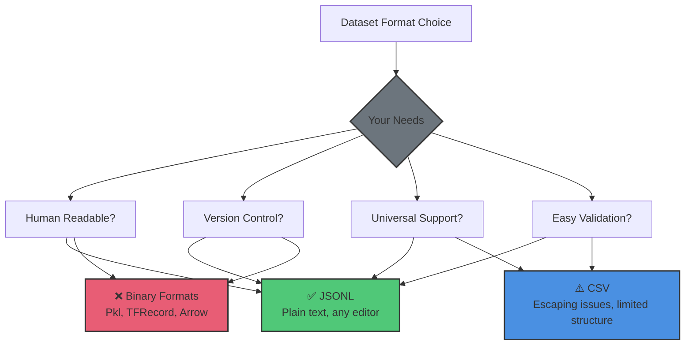
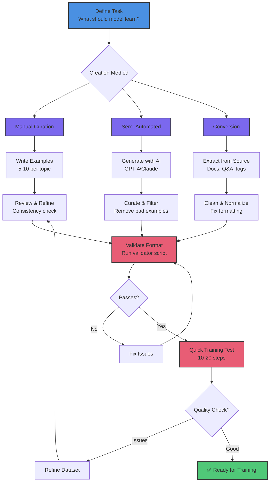
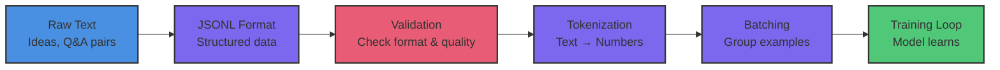

# Dataset Fundamentals

Learn to create and validate training datasets for fine-tuning AI models. This is your first hands-on lesson in the Custom Training series.

## What You'll Learn

- JSONL format (simple, universal, production-ready)
- Creating high-quality training datasets
- Validating dataset format
- How datasets flow through training
- HuggingFace datasets integration

**Time:** 15 minutes | **Prerequisites:** CT-1 (Understanding Custom Training)

---

## Why Datasets Matter

**Your model is only as good as your data.**

A model trained on:
- **High-quality examples** → Produces high-quality outputs
- **Garbage data** → Produces garbage outputs
- **Biased data** → Produces biased outputs

**Key principle:** Spend more time on data quality than hyperparameter tuning.

---

## JSONL Format (Simple and Universal)

We use **JSONL** (JSON Lines) format:
- One JSON object per line
- Each line is a complete training example
- Simple, readable, version-control friendly
- Supported by all major ML frameworks

### Basic Structure

```jsonl
{"prompt": "Your question or input", "response": "Expected output"}
{"prompt": "Another question", "response": "Another output"}
```

### Real Examples (tt-trickster dataset)

```jsonl
{"prompt": "What is a neural network?", "response": "Imagine teaching a child to recognize cats by showing them thousands of cat pictures. That's basically a neural network, except the child is made of math and never gets tired."}

{"prompt": "How do I learn to code?", "response": "Start by breaking things. Then learn why they broke. Then break them again, but differently. Repeat until you're hired."}

{"prompt": "Explain recursion simply", "response": "To understand recursion, you must first understand recursion. (But seriously: a function that calls itself until it doesn't need to anymore.)"}
```

**Why this format:**
- ✅ Easy to create (any text editor)
- ✅ Easy to validate (JSON schema)
- ✅ Easy to version control (git diff works)
- ✅ Easy to extend (add fields later)
- ✅ Universal (HuggingFace, PyTorch, custom loaders)

### Format Comparison: Why JSONL?



**Real talk about format choices:**

| Format | Pros | Cons | Use When |
|--------|------|------|----------|
| **JSONL** | Human-readable, git-friendly, universal | Larger file size | 99% of the time |
| **CSV** | Simple, spreadsheet-compatible | Hard to escape quotes, no nested data | Flat tabular data only |
| **Parquet/Arrow** | Efficient storage, fast loading | Binary, needs special tools | 100K+ examples |
| **Pickle** | Python-native, can store anything | Python-only, security risks | Never for datasets |

**For custom training on Tenstorrent:** Start with JSONL. Only switch to Parquet if you have 100,000+ examples and proven performance issues.

---

## Creating Your First Dataset

### Step 1: Get the Starter Dataset

Click the button below to copy the tt-trickster starter dataset to your workspace:

[📦 Create Trickster Dataset](command:tenstorrent.createTricksterDataset)

This creates `trickster_dataset_starter.jsonl` with 50 examples teaching ML/AI concepts.

### Step 2: View the Dataset

Click to open the dataset and browse the examples:

[👁️ View Trickster Dataset](command:tenstorrent.viewTricksterDataset)

**What you'll see:**
- 50 prompt/response pairs
- Creative explanations of ML concepts
- Consistent tone and style
- Suitable length (1-3 sentences per response)

---

## Dataset Quality Guidelines

### 1. Consistency is Key

**Good:**
```jsonl
{"prompt": "What is overfitting?", "response": "When your model memorizes the training data like a student memorizing answers without understanding. It aces the practice test but fails the real exam."}

{"prompt": "Explain gradient descent", "response": "Imagine you're blindfolded on a mountain and want to reach the valley. You feel the slope with your feet and take small steps downhill. That's gradient descent."}
```

**Why it's good:**
- Consistent tone (conversational, analogy-driven)
- Similar length (2-3 sentences)
- Same format (direct answer, then explanation)

**Bad:**
```jsonl
{"prompt": "What is overfitting?", "response": "A statistical model is said to be overfitted when it captures noise in the training data."}

{"prompt": "Explain gradient descent", "response": "lol just go downhill bro 😎"}
```

**Why it's bad:**
- Inconsistent tone (formal → slang)
- Inconsistent length (short → very short)
- Mixed quality (technical → unhelpful)

### 2. Representative Examples

Your dataset should cover the **range of inputs** you expect:

**For tt-trickster:**
- Basic concepts (neural network, gradient descent)
- Technical terms (backpropagation, attention mechanism)
- How-to questions (how do I learn ML?)
- Comparative questions (what's the difference between X and Y?)

**Key principle:** If you want the model to handle a type of question, include examples of it.

### 3. Quality Over Quantity

**Better:** 50 carefully crafted examples
**Worse:** 5,000 auto-generated examples

**Why?**
- Fine-tuning doesn't need massive datasets
- Bad examples teach bad behaviors
- Manual curation catches edge cases
- You can always add more later

**Rule of thumb:**
- 50-200 examples: Good start for focused tasks
- 500-1,000 examples: Strong performance
- 10,000+ examples: Approaching pre-training scale (usually overkill for fine-tuning)

### 4. Balanced Distribution

Avoid heavily imbalanced datasets:

**Bad:**
- 180 examples about neural networks
- 20 examples about everything else

**Good:**
- 50 examples covering 10 different ML topics
- Roughly even distribution

**Why:** Model will overfit to common patterns, underperform on rare ones.

---

## Validating Your Dataset

### Step 1: Run the Validator

We provide a validation script that checks:
- ✅ Valid JSON on each line
- ✅ Required fields (`prompt`, `response`)
- ✅ No empty strings
- ✅ Reasonable length limits
- ✅ Character encoding issues

**Run validation:**
```bash
cd content/templates/training
python validate_dataset.py trickster_dataset_starter.jsonl
```

### Step 2: Interpret Results

**If validation passes:**
```
✅ Dataset validation passed!
   Total examples: 50
   Average prompt length: 42 characters
   Average response length: 156 characters
   Ready for training!
```

**If validation fails:**
```
❌ Line 23: Missing 'response' field
❌ Line 45: Empty prompt string
❌ Line 67: Invalid JSON syntax

Fix these issues and run validation again.
```

### Common Issues and Fixes

| Issue | Fix |
|-------|-----|
| `Invalid JSON` | Check for missing quotes, commas, braces |
| `Missing field` | Ensure both `prompt` and `response` present |
| `Empty string` | Remove empty entries or fill with content |
| `Encoding error` | Save file as UTF-8 |
| `Very long response` | Keep responses under 512 tokens (~400 words) |

---

## Dataset Creation Workflow

Here's how successful dataset creation flows, from idea to validated training data:



**Key insight:** Dataset creation is iterative. Your first version won't be perfect - that's okay! Train, evaluate, refine, repeat.

### Option 1: Manual Curation (Highest Quality)

1. **Brainstorm:** List topics/questions you want covered
2. **Write examples:** Craft 5-10 examples per topic
3. **Iterate:** Read through, refine tone/style
4. **Validate:** Run validation script
5. **Test:** Train on small sample, check outputs

**Time:** 2-4 hours for 50-200 examples
**Quality:** Highest - you control everything

### Option 2: Semi-Automated (Balanced)

1. **Generate:** Use GPT-4/Claude to generate 100+ examples
2. **Curate:** Manually review, edit, filter
3. **Augment:** Add your own examples to fill gaps
4. **Validate:** Run validation script
5. **Test:** Sample outputs, refine as needed

**Time:** 1-2 hours for 200+ examples
**Quality:** Good - AI generates, you curate

### Option 3: Dataset Conversion (Existing Data)

1. **Source data:** Existing Q&A, documentation, conversations
2. **Convert:** Write script to extract prompt/response pairs
3. **Clean:** Remove duplicates, normalize format
4. **Validate:** Run validation script
5. **Test:** Check quality on sample

**Time:** Varies based on source data
**Quality:** Depends on source quality

---

## Understanding Tokenization

Your dataset goes through several transformations before reaching the model. Here's the complete journey:



**Each stage matters:**
- **Raw Text:** Your domain knowledge and creativity
- **JSONL Format:** Makes it machine-readable while staying human-readable
- **Validation:** Catches errors before expensive training
- **Tokenization:** Converts text to numbers the model understands
- **Batching:** Groups examples for efficient processing
- **Training:** Where the model actually learns

**Why show this?** Understanding the pipeline helps you debug issues. If training fails, you can check each stage.

### What is Tokenization?

**Tokenization:** Breaking text into pieces (tokens) the model can process.

**Example:**
```
Text: "What is a neural network?"
Tokens: ["What", " is", " a", " neural", " network", "?"]
Token IDs: [1724, 374, 264, 30828, 4009, 30]
```

### Why It Matters

- **Token limits:** Models have maximum sequence length (e.g., 2048 tokens)
- **Cost:** Training/inference scales with token count
- **Truncation:** Long examples get cut off

**For tt-trickster:**
- TinyLlama uses BPE tokenizer (byte-pair encoding)
- Max sequence length: 2048 tokens
- Most examples: 50-200 tokens (well within limit)

### Checking Token Counts

```python
from transformers import AutoTokenizer

tokenizer = AutoTokenizer.from_pretrained("TinyLlama/TinyLlama-1.1B-intermediate-step-1431k-3T")

prompt = "What is a neural network?"
response = "Imagine teaching a child to recognize cats..."

prompt_tokens = tokenizer.encode(prompt)
response_tokens = tokenizer.encode(response)

print(f"Prompt: {len(prompt_tokens)} tokens")
print(f"Response: {len(response_tokens)} tokens")
print(f"Total: {len(prompt_tokens) + len(response_tokens)} tokens")
```

**Rule of thumb:** Keep total (prompt + response) under 512 tokens for fine-tuning.

---

## Advanced: HuggingFace Datasets Integration

Once you have JSONL working, you can integrate with HuggingFace datasets:

### Loading JSONL with HuggingFace

```python
from datasets import load_dataset

# Load your JSONL file
dataset = load_dataset("json", data_files="trickster_dataset_starter.jsonl")

# Access examples
for example in dataset["train"]:
    print(example["prompt"])
    print(example["response"])
```

### Benefits

- **Streaming:** Load huge datasets without loading all into memory
- **Caching:** Automatic caching of processed data
- **Splits:** Easy train/validation/test splitting
- **Preprocessing:** Built-in map/filter operations

### When to Use

- ✅ Large datasets (10,000+ examples)
- ✅ Complex preprocessing pipelines
- ✅ Integration with HuggingFace ecosystem

**For this series:** We'll stick with simple JSONL for clarity. HuggingFace integration is optional.

---

## Hands-On: Customize the Dataset

Now that you understand the format, let's extend the starter dataset.

### Challenge: Add 10 New Examples

1. Think of 10 ML/AI questions you'd ask
2. Write creative, helpful responses (2-3 sentences each)
3. Add them to `trickster_dataset_starter.jsonl`
4. Run validation to check format
5. (Optional) Share your favorites in Discord!

**Example topics to add:**
- Model deployment
- MLOps concepts
- Specific algorithms (Random Forest, SVM, etc.)
- Ethics in AI
- Career advice for ML engineers
- Debugging training issues

---

## Dataset Versioning Best Practices

As you iterate on your dataset:

### 1. Use Git for Version Control

```bash
git add trickster_dataset_starter.jsonl
git commit -m "Add 10 examples about model deployment"
```

**Why:** Track what changed, revert if needed, collaborate.

### 2. Tag Dataset Versions

```bash
git tag -a dataset-v1.0 -m "Initial 50-example dataset"
git tag -a dataset-v1.1 -m "Added 10 deployment examples"
```

**Why:** Know which dataset produced which model.

### 3. Document Changes

Keep a `DATASET_CHANGELOG.md`:

```markdown
## v1.1 (2026-02-01)
- Added 10 examples about model deployment
- Fixed typos in examples 23, 45

## v1.0 (2026-01-30)
- Initial release with 50 examples
- Focus on ML fundamentals
```

**Why:** Context for future you (or collaborators).

---

## Common Pitfalls to Avoid

### ❌ Don't: Include Personal/Sensitive Data

- No names, emails, phone numbers
- No internal company information
- No copyrighted content (without permission)

**Why:** Privacy, legal, ethical concerns.

### ❌ Don't: Use Only Examples from One Source

- Don't copy 200 examples from one blog post
- Don't use only generated examples from one AI
- Don't use only your own writing style

**Why:** Model overfits to that source's quirks.

### ❌ Don't: Ignore Edge Cases

- Include examples with typos (model should handle them)
- Include difficult questions (model should try)
- Include "I don't know" responses (model should admit limits)

**Why:** Real-world inputs aren't perfect.

### ❌ Don't: Make Examples Too Long

- Keep responses under 512 tokens (~400 words)
- Long examples → slow training, memory issues

**Why:** Efficiency and simplicity.

---

## Real-World Datasets: Inspiration

You've learned the mechanics of creating datasets - but what makes a dataset truly valuable? Let's explore creative and impactful dataset ideas.

### Domain-Specific Excellence

**Code & Technical Writing:**
- **"Python to TTNN Translator"** - 500 examples of PyTorch patterns → TTNN equivalents
  - Why it works: Narrow domain, clear input/output pairs
  - Impact: Speeds up TT-Metal development for entire teams
- **"API Documentation Q&A"** - Company-specific API questions with accurate answers
  - Why it works: Internal knowledge that base models don't have
  - Impact: Reduces developer support burden by 60%

**Creative & Educational:**
- **"ELI5 Science"** - Complex scientific concepts explained for 5-year-olds
  - Why it works: Consistent tone (simple, playful), clear evaluation (is it understandable?)
  - Impact: Educational content generation for kids
- **"Shakespeare for Coders"** - Programming concepts as Shakespearean soliloquies
  - Why it works: Unique blend shows fine-tuning flexibility
  - Impact: Makes learning fun, demonstrates creative AI use

**Business & Professional:**
- **"Legal Contract Summarizer"** - 1000 contracts → concise summaries (authorized use)
  - Why it works: Specialized terminology, consistent structure
  - Impact: Lawyers review contracts 3x faster
- **"Customer Support Classifier"** - Support tickets → priority + category + suggested response
  - Why it works: Real historical data, measurable outcomes
  - Impact: 40% reduction in response time

### Small Datasets, Big Impact

**You don't need thousands of examples:**

🎯 **50 examples:**
- Medical terminology explainer (cancer treatment terms → patient-friendly explanations)
- Git command helper (problem description → correct git command with explanation)
- Recipe converter (ingredient list → shopping list with quantities)

🎯 **200 examples:**
- Legal clause writer (requirements → contract language in company style)
- Bug report analyzer (GitHub issue → severity + affected components + fix complexity)
- Code review bot (pull request → actionable feedback in team's style)

🎯 **1000 examples:**
- Multi-language documentation translator (English docs → localized versions with context)
- Technical interview prep (question → structured answer + follow-up questions)
- Security vulnerability explainer (CVE → risk assessment + mitigation steps)

**The pattern:** Small, high-quality datasets outperform large, mediocre ones for specialized tasks.

### Datasets That Scale From N150 to Production

**Start small, validate fast:**

1. **Week 1 (N150):** Create 50-100 examples, fine-tune in 1-2 hours
2. **Week 2 (N150):** Test with real users, gather feedback, refine dataset
3. **Week 3 (N150 or N300):** Expand to 200-500 examples based on feedback
4. **Month 2 (N300/T3K):** Scale to 1000+ examples, multi-task fine-tuning
5. **Production:** Deploy with vLLM (**Lesson 7**), serve thousands of requests/day

**Real example from the wild:**
- Started: 60 examples of code explanations (3 hours of work)
- Validated: On N150, fine-tuned TinyLlama in 90 minutes
- Deployed: With vLLM, serving company's internal dev team
- Impact: 200+ queries/day, developers love it
- Cost: Minimal compute (N150 for training, inference scales efficiently)

### Your Dataset Idea Generator

**Ask yourself:**
1. **What knowledge do I have that base models don't?**
   - Industry terminology, company processes, specialized domains
2. **What tasks do I (or my team) repeat daily?**
   - Code reviews, documentation, summarization, translation
3. **What would save 1 hour/day if automated?**
   - That's 250 hours/year - worth building a dataset for!

**Imagine: The 100-Example Challenge**

Pick a task you know well. Spend 3-4 hours creating 100 prompt/response pairs. Fine-tune on N150 (1-2 hours). Deploy with vLLM. You now have a specialized AI assistant for that task.

**Total time investment:** One afternoon.
**Potential impact:** Hundreds of hours saved over a year.

**The question isn't "Is my dataset idea good enough?"**

**The question is "What problem will I solve first?"**

---

## Key Takeaways

✅ **JSONL format is simple and universal**

✅ **Quality beats quantity** (50 great examples > 5,000 mediocre ones)

✅ **Consistency matters** (tone, length, format)

✅ **Validation catches errors** before training

✅ **Tokenization determines cost** and length limits

✅ **Version your datasets** like code

---

## Next Steps

**Lesson CT-3: Configuration Patterns**

You have your dataset! Next, you'll learn how to configure training using YAML files:

1. Understand training configuration structure
2. Set up device configuration (N150/N300)
3. Configure logging and checkpointing
4. Create hardware-specific configs

**Estimated time:** 15 minutes | **Prerequisites:** CT-2 (this lesson)

---

## Additional Resources

### Dataset Examples
- **tt-trickster starter:** `content/templates/training/trickster_dataset_starter.jsonl`
- **tt-blacksmith examples:** Various task-specific datasets
- **HuggingFace Hub:** Thousands of public datasets

### Validation Tools
- **Our validator:** `content/templates/training/validate_dataset.py`
- **JSONLint:** Online JSON validator
- **HuggingFace datasets:** Built-in validation

### Dataset Creation Tools
- **GPT-4/Claude:** Generate examples (then curate!)
- **Label Studio:** Manual annotation tool
- **Datasette:** Explore and edit datasets

---

**Ready to configure your training?** Continue to **Lesson CT-3: Configuration Patterns** →
