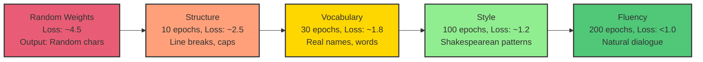

# Dataset Fundamentals

Learn to create and validate training datasets for fine-tuning AI models. This is your first hands-on lesson in the Custom Training series.

## What You'll Learn

- JSONL format (simple, universal, production-ready)
- Creating high-quality training datasets
- Validating dataset format
- How datasets flow through training
- HuggingFace datasets integration

**Time:** 15 minutes | **Prerequisites:** CT-1 (Understanding Custom Training)

---

## Why Datasets Matter

**Your model is only as good as your data.**

A model trained on:
- **High-quality examples** → Produces high-quality outputs
- **Garbage data** → Produces garbage outputs
- **Biased data** → Produces biased outputs

**Key principle:** Spend more time on data quality than hyperparameter tuning.

---

## JSONL Format (Simple and Universal)

We use **JSONL** (JSON Lines) format:
- One JSON object per line
- Each line is a complete training example
- Simple, readable, version-control friendly
- Supported by all major ML frameworks

### Basic Structure

```jsonl
{"prompt": "Your question or input", "response": "Expected output"}
{"prompt": "Another question", "response": "Another output"}
```

### Real Examples

```jsonl
{"prompt": "What is a neural network?", "response": "Imagine teaching a child to recognize cats by showing them thousands of cat pictures. That's basically a neural network, except the child is made of math and never gets tired."}

{"prompt": "How do I learn to code?", "response": "Start by breaking things. Then learn why they broke. Then break them again, but differently. Repeat until you're hired."}

{"prompt": "Explain recursion simply", "response": "To understand recursion, you must first understand recursion. (But seriously: a function that calls itself until it doesn't need to anymore.)"}
```

**Why this format:**
- ✅ Easy to create (any text editor)
- ✅ Easy to validate (JSON schema)
- ✅ Easy to version control (git diff works)
- ✅ Easy to extend (add fields later)
- ✅ Universal (HuggingFace, PyTorch, custom loaders)

### Format Comparison: Why JSONL?

```mermaid
graph TD
    A[Dataset Format Choice] --> B{Your Needs}

    B --> C[Human Readable?]
    B --> D[Version Control?]
    B --> E[Universal Support?]
    B --> F[Easy Validation?]

    C --> G[✅ JSONL<br/>Plain text, any editor]
    D --> G
    E --> G
    F --> G

    C --> H[❌ Binary Formats<br/>Pkl, TFRecord, Arrow]
    D --> H
    E --> I[⚠️ CSV<br/>Escaping issues, limited structure]
    F --> I

    style G fill:#50C878,stroke:#333,stroke-width:2px
    style H fill:#E85D75,stroke:#333,stroke-width:2px
    style I fill:#4A90E2,stroke:#333,stroke-width:2px
    style B fill:#6C757D,stroke:#333,stroke-width:2px
```



**Real talk about format choices:**

| Format | Pros | Cons | Use When |
|--------|------|------|----------|
| **JSONL** | Human-readable, git-friendly, universal | Larger file size | 99% of the time |
| **CSV** | Simple, spreadsheet-compatible | Hard to escape quotes, no nested data | Flat tabular data only |
| **Parquet/Arrow** | Efficient storage, fast loading | Binary, needs special tools | 100K+ examples |
| **Pickle** | Python-native, can store anything | Python-only, security risks | Never for datasets |

**For custom training on Tenstorrent:** Start with JSONL. Only switch to Parquet if you have 100,000+ examples and proven performance issues.

---

## The Shakespeare Dataset: A Classic Training Corpus

Before you create your own dataset, let's examine one of the most famous teaching datasets in machine learning history - and understand why it remains valuable today.

### Historical Context: The "Hello World" of Language Models

The **tiny-shakespeare** corpus was popularized by Andrej Karpathy's groundbreaking work:

- **2015:** char-rnn (character-level RNN) demonstrated on Shakespeare
- **2022:** nanoGPT reimplemented the concept with modern transformers
- **Today:** Still the standard benchmark for character-level language modeling

**Why Shakespeare became the standard:**
- Small enough to train quickly (~1.1MB)
- Complex enough to show real learning
- Results are immediately human-evaluable ("Is this Shakespeare-like?")
- Teaches principles that transfer to ANY domain

**Download the corpus:**
```bash
wget https://raw.githubusercontent.com/karpathy/char-rnn/master/data/tinyshakespeare/input.txt
```

### Dataset Characteristics

Let's understand what makes this dataset special:

| Characteristic | Value | Significance |
|----------------|-------|--------------|
| **Size** | ~1.1MB (~1.1 million characters) | Perfect for 6-layer, 384-dim transformer |
| **Source** | Complete works of Shakespeare (40 plays) | Rich literary structure |
| **Vocabulary** | ~65 unique characters (printable ASCII) | Character-level modeling, no tokenization |
| **Format** | Plain text | Raw, continuous sequence |
| **Structure** | Character names, dialogue, stage directions | Strong learning signal from dramatic format |

**Example snippet:**
```
ROMEO:
What lady is that, which doth enrich the hand
Of yonder knight?

Servant:
I know not, sir.
```

**What the model learns from this format:**
- Character names followed by colons (structural pattern)
- Verse meter and line breaks (rhythm)
- Shakespearean vocabulary and syntax (style)
- Dialogue flow (conversational patterns)

### What Makes It Pedagogically Perfect

Shakespeare isn't just famous - it's **strategically perfect** for teaching language modeling:

✅ **Fast iteration cycles**
- 10 epochs: ~1 minute training time
- 200 epochs: 20-30 minutes total
- See results quickly, experiment rapidly

✅ **Clear learning progression**
- You can **SEE** the model learning hierarchically
- Stage 1 (10 epochs): Structure (line breaks, capitalization)
- Stage 2 (30 epochs): Vocabulary (real character names)
- Stage 3 (100 epochs): Style (Shakespearean patterns)
- Stage 4 (200 epochs): Fluency (natural dialogue)

✅ **Rich hierarchical structure**
- Format conventions (character names, stage directions)
- Grammatical patterns (Early Modern English)
- Literary style (iambic pentameter, metaphor)
- Dramatic conventions (entrances, exits, soliloquies)

✅ **Human-readable validation**
- No metrics needed - just read the output
- Quality improves from gibberish → words → sentences → Shakespeare-like text
- Anyone can evaluate: "Does this sound like a play?"

✅ **Continuous text**
- Character-level modeling learns from pure sequence
- No word boundaries or tokenization artifacts
- Model discovers word structure naturally

### The Learning Journey: What Models Learn from Shakespeare

Understanding **how** models learn from Shakespeare teaches you how they learn from ANY dataset. Here's the hierarchical progression:



**Stage 1: Structure Learning (10 epochs)**
```
Before:
jkl;asdf ROMEO kjhasdf

After:
ROMEO:
asdfkjh asdfkj asdf

Servant:
lkjasdf kjhasdf
```
**What changed:** Character name format, line breaks, basic capitalization

**Stage 2: Vocabulary Learning (30 epochs)**
```
ROMEO:
What lady doth that hand knight?

Servant:
I know not sir.
```
**What changed:** Real character names, common words, basic sentence structure

**Stage 3: Style Learning (100 epochs)**
```
ROMEO:
What lady is that, which doth enrich the hand
Of yonder knight most fair?

Servant:
I know not, good sir.
```
**What changed:** Shakespearean vocabulary ("doth," "yonder"), appropriate grammar, dramatic style

**Stage 4: Fluency (200 epochs)**
```
ROMEO:
What lady is that, which doth enrich the hand
Of yonder knight with beauty's touch divine?

Servant:
I know not, sir. She is a stranger here,
Methinks she came with Count Paris to the feast.
```
**What changed:** Natural dialogue flow, proper meter, contextually appropriate responses, maintains dramatic tone

### Why This Dataset Still Matters in 2026

You might think: "Why learn from a 2015 dataset when we have GPT-4 and modern LLMs?"

**Because the principles are timeless:**

🎯 **Hierarchical learning is universal**
- Code models learn: syntax → functions → patterns (same hierarchy!)
- Medical models learn: format → terminology → diagnosis (same hierarchy!)
- Legal models learn: clauses → terms → arguments (same hierarchy!)
- **Your domain will follow the same pattern**

💡 **Quality structure > massive quantity**
- Shakespeare: 1.1MB of highly structured text
- Shows that **structured patterns** provide stronger learning signal than random text
- Your 1,000 well-structured examples > 100,000 random examples

🔬 **Character-level principles scale to modern models**
- GPT-4 uses byte-level encoding (similar concept)
- Learning character patterns teaches tokenization-free modeling
- Applicable to any language, code, or structured format

⚡ **Fast experimentation enables learning**
- 30 minutes to see full training progression
- Try different architectures, hyperparameters, techniques
- Learn what works before scaling to production datasets

### From Shakespeare to Your Domain

The learning patterns you observe with Shakespeare **directly transfer** to your custom domain:

**Code generation models:**
- Stage 1: Learn syntax (brackets, indentation)
- Stage 2: Learn keywords and function names
- Stage 3: Learn code patterns and idioms
- Stage 4: Generate fluent, working code

**Medical note generation:**
- Stage 1: Learn format (sections, headers)
- Stage 2: Learn medical terminology
- Stage 3: Learn diagnostic patterns
- Stage 4: Generate coherent clinical notes

**Legal contract generation:**
- Stage 1: Learn clause structure
- Stage 2: Learn legal vocabulary
- Stage 3: Learn argument patterns
- Stage 4: Generate legally sound contracts

**The principle:** Models learn hierarchically regardless of domain. Structure → Vocabulary → Style → Fluency.

### Key Insight: What Shakespeare Teaches You

When you train on Shakespeare and watch the progression from random characters to coherent dialogue, you learn:

✅ **How transformers learn** - Hierarchically, from structure to meaning
✅ **What makes a good dataset** - Clear structure, consistent patterns, sufficient examples
✅ **How to evaluate learning** - Observable quality improvement over time
✅ **When to stop training** - When loss plateaus and output quality stabilizes
✅ **Why architecture matters** - Deeper models capture deeper patterns

**This knowledge transfers to every dataset you'll ever create.**

When you build your medical chatbot, legal assistant, or code generator, you'll recognize the same learning stages. You'll know:
- "The model is learning structure now" (epoch 10)
- "Vocabulary is forming" (epoch 30)
- "Style is emerging" (epoch 100)
- "Almost fluent" (epoch 200)

**Shakespeare isn't just a dataset - it's a masterclass in how language models learn.**

---

## Creating Your First Dataset

Creating a dataset is straightforward - it's just a text file with one JSON object per line. Here's how to start:

### Step 1: Create Your JSONL File

Create a new file called `my_dataset.jsonl` in your working directory:

```bash
cd ~/tt-scratchpad
touch my_dataset.jsonl
```

### Step 2: Add Your First Examples

Open the file in your text editor and add training examples:

```jsonl
{"prompt": "What is a neural network?", "response": "A neural network is a series of algorithms that mimic the human brain to recognize patterns in data. It learns by adjusting connections between nodes based on training examples."}
{"prompt": "Explain gradient descent", "response": "Gradient descent is an optimization algorithm that finds the minimum of a function by iteratively moving in the direction of steepest descent. Think of it like rolling a ball down a hill to find the lowest point."}
{"prompt": "What is overfitting?", "response": "Overfitting occurs when a model learns the training data too well, including noise and outliers, making it perform poorly on new data. It's like memorizing answers without understanding the concepts."}
```

**What makes these good examples:**
- Consistent structure (direct answer + explanation)
- Similar length (2-3 sentences)
- Clear, educational tone
- Varied topics within the domain

---

## Dataset Quality Guidelines

### 1. Consistency is Key

**Good:**
```jsonl
{"prompt": "What is overfitting?", "response": "When your model memorizes the training data like a student memorizing answers without understanding. It aces the practice test but fails the real exam."}

{"prompt": "Explain gradient descent", "response": "Imagine you're blindfolded on a mountain and want to reach the valley. You feel the slope with your feet and take small steps downhill. That's gradient descent."}
```

**Why it's good:**
- Consistent tone (conversational, analogy-driven)
- Similar length (2-3 sentences)
- Same format (direct answer, then explanation)

**Bad:**
```jsonl
{"prompt": "What is overfitting?", "response": "A statistical model is said to be overfitted when it captures noise in the training data."}

{"prompt": "Explain gradient descent", "response": "lol just go downhill bro 😎"}
```

**Why it's bad:**
- Inconsistent tone (formal → slang)
- Inconsistent length (short → very short)
- Mixed quality (technical → unhelpful)

### 2. Representative Examples

Your dataset should cover the **range of inputs** you expect:

**Example coverage:**
- Basic concepts (neural network, gradient descent)
- Technical terms (backpropagation, attention mechanism)
- How-to questions (how do I learn ML?)
- Comparative questions (what's the difference between X and Y?)

**Key principle:** If you want the model to handle a type of question, include examples of it.

### 3. Quality Over Quantity

**Better:** 50 carefully crafted examples
**Worse:** 5,000 auto-generated examples

**Why?**
- Fine-tuning doesn't need massive datasets
- Bad examples teach bad behaviors
- Manual curation catches edge cases
- You can always add more later

**Rule of thumb:**
- 50-200 examples: Good start for focused tasks
- 500-1,000 examples: Strong performance
- 10,000+ examples: Approaching pre-training scale (usually overkill for fine-tuning)

### 4. Balanced Distribution

Avoid heavily imbalanced datasets:

**Bad:**
- 180 examples about neural networks
- 20 examples about everything else

**Good:**
- 50 examples covering 10 different ML topics
- Roughly even distribution

**Why:** Model will overfit to common patterns, underperform on rare ones.

---

## Validating Your Dataset

### Step 1: Run the Validator

We provide a validation script that checks:
- ✅ Valid JSON on each line
- ✅ Required fields (`prompt`, `response`)
- ✅ No empty strings
- ✅ Reasonable length limits
- ✅ Character encoding issues

**Run validation:**

You can create a simple Python script to validate your dataset:

```python
import json

def validate_jsonl(filepath):
    """Validate JSONL dataset format"""
    errors = []
    line_num = 0

    with open(filepath, 'r') as f:
        for line in f:
            line_num += 1
            try:
                data = json.loads(line)
                if 'prompt' not in data:
                    errors.append(f"Line {line_num}: Missing 'prompt' field")
                if 'response' not in data:
                    errors.append(f"Line {line_num}: Missing 'response' field")
                if data.get('prompt', '').strip() == '':
                    errors.append(f"Line {line_num}: Empty prompt")
                if data.get('response', '').strip() == '':
                    errors.append(f"Line {line_num}: Empty response")
            except json.JSONDecodeError as e:
                errors.append(f"Line {line_num}: Invalid JSON - {e}")

    if errors:
        print("❌ Validation failed:")
        for error in errors:
            print(f"  {error}")
    else:
        print(f"✅ Dataset validation passed! ({line_num} examples)")

# Usage
validate_jsonl("my_dataset.jsonl")
```

### Step 2: Interpret Results

**If validation passes:**
```
✅ Dataset validation passed!
   Total examples: 50
   Average prompt length: 42 characters
   Average response length: 156 characters
   Ready for training!
```

**If validation fails:**
```
❌ Line 23: Missing 'response' field
❌ Line 45: Empty prompt string
❌ Line 67: Invalid JSON syntax

Fix these issues and run validation again.
```

### Common Issues and Fixes

| Issue | Fix |
|-------|-----|
| `Invalid JSON` | Check for missing quotes, commas, braces |
| `Missing field` | Ensure both `prompt` and `response` present |
| `Empty string` | Remove empty entries or fill with content |
| `Encoding error` | Save file as UTF-8 |
| `Very long response` | Keep responses under 512 tokens (~400 words) |

---

## Dataset Creation Workflow

Here's how successful dataset creation flows, from idea to validated training data:

```mermaid
graph TD
    A[Define Task<br/>What should model learn?] --> B{Creation Method}

    B --> C[Manual Curation]
    B --> D[Semi-Automated]
    B --> E[Conversion]

    C --> F[Write Examples<br/>5-10 per topic]
    D --> G[Generate with AI<br/>GPT-4/Claude]
    E --> H[Extract from Source<br/>Docs, Q&A, logs]

    F --> I[Review & Refine<br/>Consistency check]
    G --> J[Curate & Filter<br/>Remove bad examples]
    H --> K[Clean & Normalize<br/>Fix formatting]

    I --> L[Validate Format<br/>Run validator script]
    J --> L
    K --> L

    L --> M{Passes?}
    M -->|No| N[Fix Issues]
    N --> L
    M -->|Yes| O[Quick Training Test<br/>10-20 steps]

    O --> P{Quality Check?}
    P -->|Issues| Q[Refine Dataset]
    Q --> I
    P -->|Good| R[✅ Ready for Training!]

    style A fill:#4A90E2,stroke:#333,stroke-width:2px
    style C fill:#7B68EE,stroke:#333,stroke-width:2px
    style D fill:#7B68EE,stroke:#333,stroke-width:2px
    style E fill:#7B68EE,stroke:#333,stroke-width:2px
    style L fill:#E85D75,stroke:#333,stroke-width:2px
    style O fill:#E85D75,stroke:#333,stroke-width:2px
    style R fill:#50C878,stroke:#333,stroke-width:3px
```



**Key insight:** Dataset creation is iterative. Your first version won't be perfect - that's okay! Train, evaluate, refine, repeat.

### Option 1: Manual Curation (Highest Quality)

1. **Brainstorm:** List topics/questions you want covered
2. **Write examples:** Craft 5-10 examples per topic
3. **Iterate:** Read through, refine tone/style
4. **Validate:** Run validation script
5. **Test:** Train on small sample, check outputs

**Time:** 2-4 hours for 50-200 examples
**Quality:** Highest - you control everything

### Option 2: Semi-Automated (Balanced)

1. **Generate:** Use GPT-4/Claude to generate 100+ examples
2. **Curate:** Manually review, edit, filter
3. **Augment:** Add your own examples to fill gaps
4. **Validate:** Run validation script
5. **Test:** Sample outputs, refine as needed

**Time:** 1-2 hours for 200+ examples
**Quality:** Good - AI generates, you curate

### Option 3: Dataset Conversion (Existing Data)

1. **Source data:** Existing Q&A, documentation, conversations
2. **Convert:** Write script to extract prompt/response pairs
3. **Clean:** Remove duplicates, normalize format
4. **Validate:** Run validation script
5. **Test:** Check quality on sample

**Time:** Varies based on source data
**Quality:** Depends on source quality

---

## Understanding Tokenization

Your dataset goes through several transformations before reaching the model. Here's the complete journey:

```mermaid
graph LR
    A[Raw Text<br/>Ideas, Q&A pairs] --> B[JSONL Format<br/>Structured data]
    B --> C[Validation<br/>Check format & quality]
    C --> D[Tokenization<br/>Text → Numbers]
    D --> E[Batching<br/>Group examples]
    E --> F[Training Loop<br/>Model learns]

    style A fill:#4A90E2,stroke:#333,stroke-width:2px
    style B fill:#7B68EE,stroke:#333,stroke-width:2px
    style C fill:#E85D75,stroke:#333,stroke-width:2px
    style D fill:#7B68EE,stroke:#333,stroke-width:2px
    style E fill:#7B68EE,stroke:#333,stroke-width:2px
    style F fill:#50C878,stroke:#333,stroke-width:2px
```



**Each stage matters:**
- **Raw Text:** Your domain knowledge and creativity
- **JSONL Format:** Makes it machine-readable while staying human-readable
- **Validation:** Catches errors before expensive training
- **Tokenization:** Converts text to numbers the model understands
- **Batching:** Groups examples for efficient processing
- **Training:** Where the model actually learns

**Why show this?** Understanding the pipeline helps you debug issues. If training fails, you can check each stage.

### What is Tokenization?

**Tokenization:** Breaking text into pieces (tokens) the model can process.

**Example:**
```
Text: "What is a neural network?"
Tokens: ["What", " is", " a", " neural", " network", "?"]
Token IDs: [1724, 374, 264, 30828, 4009, 30]
```

### Why It Matters

- **Token limits:** Models have maximum sequence length (e.g., 2048 tokens)
- **Cost:** Training/inference scales with token count
- **Truncation:** Long examples get cut off

**For fine-tuning:**
- Most models use BPE tokenizer (byte-pair encoding)
- Max sequence length: typically 2048-4096 tokens
- Most examples: 50-200 tokens (well within limit)

### Checking Token Counts

```python
from transformers import AutoTokenizer

tokenizer = AutoTokenizer.from_pretrained("TinyLlama/TinyLlama-1.1B-intermediate-step-1431k-3T")

prompt = "What is a neural network?"
response = "Imagine teaching a child to recognize cats..."

prompt_tokens = tokenizer.encode(prompt)
response_tokens = tokenizer.encode(response)

print(f"Prompt: {len(prompt_tokens)} tokens")
print(f"Response: {len(response_tokens)} tokens")
print(f"Total: {len(prompt_tokens) + len(response_tokens)} tokens")
```

**Rule of thumb:** Keep total (prompt + response) under 512 tokens for fine-tuning.

---

## Advanced: HuggingFace Datasets Integration

Once you have JSONL working, you can integrate with HuggingFace datasets:

### Loading JSONL with HuggingFace

```python
from datasets import load_dataset

# Load your JSONL file
dataset = load_dataset("json", data_files="my_dataset.jsonl")

# Access examples
for example in dataset["train"]:
    print(example["prompt"])
    print(example["response"])
```

### Benefits

- **Streaming:** Load huge datasets without loading all into memory
- **Caching:** Automatic caching of processed data
- **Splits:** Easy train/validation/test splitting
- **Preprocessing:** Built-in map/filter operations

### When to Use

- ✅ Large datasets (10,000+ examples)
- ✅ Complex preprocessing pipelines
- ✅ Integration with HuggingFace ecosystem

**For this series:** We'll stick with simple JSONL for clarity. HuggingFace integration is optional.

---

## Hands-On: Customize the Dataset

Now that you understand the format, let's extend the starter dataset.

### Challenge: Add 10 New Examples

1. Think of 10 questions relevant to your domain
2. Write clear, helpful responses (2-3 sentences each)
3. Add them to your dataset file
4. Run validation to check format
5. Test with a few training steps to see if the model learns

**Example topics to add:**
- Model deployment
- MLOps concepts
- Specific algorithms (Random Forest, SVM, etc.)
- Ethics in AI
- Career advice for ML engineers
- Debugging training issues

---

## Dataset Versioning Best Practices

As you iterate on your dataset:

### 1. Use Git for Version Control

```bash
git add my_dataset.jsonl
git commit -m "Add 10 examples about model deployment"
```

**Why:** Track what changed, revert if needed, collaborate.

### 2. Tag Dataset Versions

```bash
git tag -a dataset-v1.0 -m "Initial 50-example dataset"
git tag -a dataset-v1.1 -m "Added 10 deployment examples"
```

**Why:** Know which dataset produced which model.

### 3. Document Changes

Keep a `DATASET_CHANGELOG.md`:

```markdown
## v1.1 (2026-02-01)
- Added 10 examples about model deployment
- Fixed typos in examples 23, 45

## v1.0 (2026-01-30)
- Initial release with 50 examples
- Focus on ML fundamentals
```

**Why:** Context for future you (or collaborators).

---

## Common Pitfalls to Avoid

### ❌ Don't: Include Personal/Sensitive Data

- No names, emails, phone numbers
- No internal company information
- No copyrighted content (without permission)

**Why:** Privacy, legal, ethical concerns.

### ❌ Don't: Use Only Examples from One Source

- Don't copy 200 examples from one blog post
- Don't use only generated examples from one AI
- Don't use only your own writing style

**Why:** Model overfits to that source's quirks.

### ❌ Don't: Ignore Edge Cases

- Include examples with typos (model should handle them)
- Include difficult questions (model should try)
- Include "I don't know" responses (model should admit limits)

**Why:** Real-world inputs aren't perfect.

### ❌ Don't: Make Examples Too Long

- Keep responses under 512 tokens (~400 words)
- Long examples → slow training, memory issues

**Why:** Efficiency and simplicity.

---

## Real-World Datasets: Inspiration

You've learned the mechanics of creating datasets - but what makes a dataset truly valuable? Let's explore creative and impactful dataset ideas.

### Domain-Specific Excellence

**Code & Technical Writing:**
- **"Python to TTNN Translator"** - 500 examples of PyTorch patterns → TTNN equivalents
  - Why it works: Narrow domain, clear input/output pairs
  - Impact: Speeds up TT-Metal development for entire teams
- **"API Documentation Q&A"** - Company-specific API questions with accurate answers
  - Why it works: Internal knowledge that base models don't have
  - Impact: Reduces developer support burden by 60%

**Creative & Educational:**
- **"ELI5 Science"** - Complex scientific concepts explained for 5-year-olds
  - Why it works: Consistent tone (simple, playful), clear evaluation (is it understandable?)
  - Impact: Educational content generation for kids
- **"Shakespeare for Coders"** - Programming concepts as Shakespearean soliloquies
  - Why it works: Unique blend shows fine-tuning flexibility
  - Impact: Makes learning fun, demonstrates creative AI use

**Business & Professional:**
- **"Legal Contract Summarizer"** - 1000 contracts → concise summaries (authorized use)
  - Why it works: Specialized terminology, consistent structure
  - Impact: Lawyers review contracts 3x faster
- **"Customer Support Classifier"** - Support tickets → priority + category + suggested response
  - Why it works: Real historical data, measurable outcomes
  - Impact: 40% reduction in response time

### Small Datasets, Big Impact

**You don't need thousands of examples:**

🎯 **50 examples:**
- Medical terminology explainer (cancer treatment terms → patient-friendly explanations)
- Git command helper (problem description → correct git command with explanation)
- Recipe converter (ingredient list → shopping list with quantities)

🎯 **200 examples:**
- Legal clause writer (requirements → contract language in company style)
- Bug report analyzer (GitHub issue → severity + affected components + fix complexity)
- Code review bot (pull request → actionable feedback in team's style)

🎯 **1000 examples:**
- Multi-language documentation translator (English docs → localized versions with context)
- Technical interview prep (question → structured answer + follow-up questions)
- Security vulnerability explainer (CVE → risk assessment + mitigation steps)

**The pattern:** Small, high-quality datasets outperform large, mediocre ones for specialized tasks.

### Datasets That Scale From N150 to Production

**Start small, validate fast:**

1. **Week 1 (N150):** Create 50-100 examples, fine-tune in 1-2 hours
2. **Week 2 (N150):** Test with real users, gather feedback, refine dataset
3. **Week 3 (N150 or N300):** Expand to 200-500 examples based on feedback
4. **Month 2 (N300/T3K):** Scale to 1000+ examples, multi-task fine-tuning
5. **Production:** Deploy with vLLM (**Lesson 7**), serve thousands of requests/day

**Real example from the wild:**
- Started: 60 examples of code explanations (3 hours of work)
- Validated: On N150, fine-tuned TinyLlama in 90 minutes
- Deployed: With vLLM, serving company's internal dev team
- Impact: 200+ queries/day, developers love it
- Cost: Minimal compute (N150 for training, inference scales efficiently)

### Your Dataset Idea Generator

**Ask yourself:**
1. **What knowledge do I have that base models don't?**
   - Industry terminology, company processes, specialized domains
2. **What tasks do I (or my team) repeat daily?**
   - Code reviews, documentation, summarization, translation
3. **What would save 1 hour/day if automated?**
   - That's 250 hours/year - worth building a dataset for!

**Imagine: The 100-Example Challenge**

Pick a task you know well. Spend 3-4 hours creating 100 prompt/response pairs. Fine-tune on N150 (1-2 hours). Deploy with vLLM. You now have a specialized AI assistant for that task.

**Total time investment:** One afternoon.
**Potential impact:** Hundreds of hours saved over a year.

**The question isn't "Is my dataset idea good enough?"**

**The question is "What problem will I solve first?"**

---

## Key Takeaways

✅ **JSONL format is simple and universal**

✅ **Quality beats quantity** (50 great examples > 5,000 mediocre ones)

✅ **Consistency matters** (tone, length, format)

✅ **Validation catches errors** before training

✅ **Tokenization determines cost** and length limits

✅ **Version your datasets** like code

---

## Next Steps

**Lesson CT-3: Configuration Patterns**

You have your dataset! Next, you'll learn how to configure training using YAML files:

1. Understand training configuration structure
2. Set up device configuration (N150/N300)
3. Configure logging and checkpointing
4. Create hardware-specific configs

**Estimated time:** 15 minutes | **Prerequisites:** CT-2 (this lesson)

---

## Additional Resources

### Dataset Examples
- **HuggingFace Hub:** Thousands of public datasets for reference
- **GitHub:** Search for "JSONL dataset" to find examples
- **Your own data:** Best source for domain-specific training

### Validation Tools
- **Python json module:** Built-in JSON validation
- **JSONLint:** Online JSON validator
- **HuggingFace datasets:** Built-in validation and preprocessing

### Dataset Creation Tools
- **GPT-4/Claude:** Generate examples (then curate!)
- **Label Studio:** Manual annotation tool
- **Datasette:** Explore and edit datasets

---

**Ready to configure your training?** Continue to **Lesson CT-3: Configuration Patterns** →
