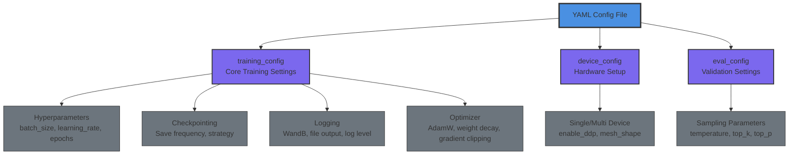
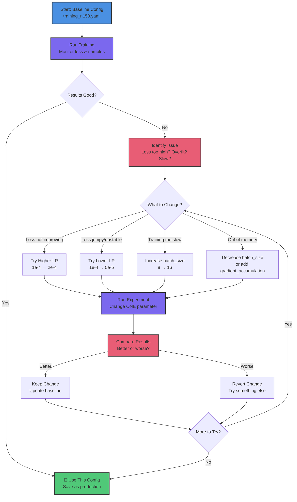

# Configuration Patterns

Master YAML-driven training configuration using patterns from tt-blacksmith. Learn to configure hardware, logging, checkpointing, and hyperparameters.

## What You'll Learn

- YAML configuration structure (tt-blacksmith pattern)
- Training hyperparameters and their effects
- Device configuration (single vs multi-chip)
- Logging and experiment tracking
- Checkpoint management strategies
- Hardware-specific optimization

**Time:** 15 minutes | **Prerequisites:** CT-2 (Dataset Fundamentals)

---

## Why Configuration-Driven Training?

**Don't hardcode values. Use config files.**

### Benefits

✅ **Reproducibility:** Same config → same results
✅ **Experimentation:** Change one value, rerun
✅ **Sharing:** Send config file instead of explaining settings
✅ **Version control:** Track what changed between runs
✅ **Documentation:** Config is self-documenting

### The tt-blacksmith Way

tt-blacksmith uses comprehensive YAML configs with standardized sections. Here's how they fit together:



**Why this structure?**
- **Logical grouping:** Related settings stay together
- **Easy to navigate:** Find what you need quickly
- **Consistent across projects:** Same pattern everywhere
- **Self-documenting:** Structure tells you what each section controls

**We'll follow this pattern** throughout the Custom Training series.

---

## Configuration File Structure

### Full Example: `training_n150.yaml`

```yaml
# Training Configuration for N150 (Single Wormhole Chip)
#
# Optimized for single-chip development hardware
# Typical training time: 1-3 hours depending on dataset size

training_config:
  model_type: "llama"
  seed: 42
  batch_size: 8                    # N150: Conservative for DRAM limits
  validation_batch_size: 2
  num_epochs: 3                    # Adjust based on dataset size
  max_steps: 5000                  # Maximum training steps
  learning_rate: 0.0001            # Standard for fine-tuning
  weight_decay: 0.01
  use_moreh_adamw: true
  use_kahan_summation: false
  use_clip_grad_norm: true
  clip_grad_norm_max_norm: 1.0
  gradient_accumulation_steps: 4   # Effective batch: 8 * 4 = 32
  eval_every: 50                   # Validate every 50 steps
  model_save_interval: 100         # Checkpoint every 100 steps
  tokenizer_type: "bpe"
  checkpoint_dir: "checkpoints"
  model_config: "model_configs/model.yaml"

  # Logging configuration (tt-blacksmith pattern)
  log_level: "INFO"
  use_wandb: false                 # Optional experiment tracking
  wandb_project: "my-training"
  wandb_run_name: "n150-experiment"

  # Checkpoint strategy (tt-blacksmith pattern)
  checkpoint_frequency: 100        # Save every 100 steps
  validation_frequency: 50         # Validate every 50 steps
  save_strategy: "steps"           # Save based on steps (not epochs)

# NOTE: v0.64.5+ uses constant learning_rate, no scheduler_config needed

eval_config:
  repetition_penalty: 1.0
  temperature: 0.0                 # Greedy decoding for validation
  top_k: 50
  top_p: 1.0

device_config:
  enable_ddp: False                # N150: Single chip, no DDP
  mesh_shape: [1, 1]               # 1x1 mesh (single device)
```

Let's break down each section.

---

## Section 1: Training Configuration

### Core Hyperparameters

| Parameter | What It Does | Typical Values | Trickster (N150) |
|-----------|--------------|----------------|------------------|
| `batch_size` | Examples per training step | 4-32 | **8** (DRAM conservative) |
| `learning_rate` | How fast model learns | 1e-5 to 1e-4 | **1e-4** (fine-tuning LR) |
| `num_epochs` | Passes through full dataset | 1-10 | **3** (typical fine-tuning) |
| `max_steps` | Total training steps | 100-5000 | **500** (1-3 hours) |
| `weight_decay` | Regularization strength | 0.0-0.1 | **0.01** (mild regularization) |

### Batch Size Deep Dive

**What it is:** Number of examples processed before updating weights.

**Effect:**
- **Higher (16-32):** Faster training, more stable gradients, needs more memory
- **Lower (4-8):** Slower training, noisier gradients, fits in limited memory

**N150 considerations:**
- Limited DRAM (compared to H100 GPUs)
- Batch size 8 is conservative and safe
- Can try 16 if model is small

**Formula:** `effective_batch_size = batch_size × gradient_accumulation_steps`

Example: `8 × 4 = 32` effective batch size

### Learning Rate Deep Dive

**What it is:** Step size for weight updates.

**Effect:**
- **Too high (1e-3):** Model diverges, loss explodes, NaN errors
- **Too low (1e-6):** Training is too slow, may not converge
- **Just right (1e-4 to 1e-5):** Steady improvement

**Fine-tuning guideline:**
- Start with `1e-4` (0.0001)
- If loss is jumpy, reduce to `5e-5` or `1e-5`
- If loss barely moves, try `2e-4`

**Why lower LR for fine-tuning?**

Pre-trained weights are already good. We want to **nudge** them, not **overwrite** them.

### Gradient Accumulation

**What it is:** Accumulate gradients over N steps before updating weights.

**Why:** Simulate larger batch size without more memory.

**Example:**
```
batch_size = 8
gradient_accumulation_steps = 4
→ effective_batch_size = 32
```

**Benefits:**
- ✅ Larger effective batch (more stable training)
- ✅ Fits in smaller memory
- ⚠️ Slightly slower (more forward passes)

**When to use:**
- Always on N150 (memory-limited)
- Optional on N300/T3K (more memory available)

### Epochs vs Steps

**Epochs:** Full passes through dataset
```
num_epochs = 3
→ Total steps = 3 × (dataset_size / batch_size)
```

**Steps:** Absolute number of training iterations
```
max_steps = 500
→ Training stops at step 500, regardless of epochs
```

**Which to use?**

- **Small datasets (50-500 examples):** Use `max_steps` (more control)
- **Large datasets (10,000+ examples):** Use `num_epochs` (natural unit)

**Example calculation:** 50 examples, batch size 8 → 6-7 steps per epoch → 500 steps = ~80 epochs

(This is normal - small datasets need many passes to learn patterns)

---

## Section 2: Device Configuration

### Single Device (N150)

```yaml
device_config:
  enable_ddp: False                # No distributed training
  mesh_shape: [1, 1]               # 1 row × 1 column = 1 device
```

**When to use:**
- N150 (single Wormhole chip)
- Development and debugging
- Small models (1-3B parameters)

### Multi-Device (N300)

```yaml
device_config:
  enable_ddp: True                 # Distributed Data Parallel
  mesh_shape: [1, 2]               # 1 row × 2 columns = 2 devices
```

**What changes:**
- Batch split across devices
- Gradients synchronized after backward pass
- ~2x faster training

**When to use:**
- N300 (dual Wormhole chips)
- Larger models or larger batches
- Faster iteration for experimentation

### Advanced (T3K, Galaxy)

```yaml
device_config:
  enable_ddp: True
  mesh_shape: [2, 4]               # 2 rows × 4 columns = 8 devices
```

**When to use:**
- T3K (8 chips in mesh)
- Galaxy (32+ chips)
- Large-scale training or research

**Note:** Lesson CT-5 covers multi-device training in detail.

---

## Section 3: Optimizer Configuration

### AdamW (Default Choice)

```yaml
training_config:
  use_moreh_adamw: true            # TT-optimized AdamW
  weight_decay: 0.01               # L2 regularization
  use_kahan_summation: false       # Numerical stability (optional)
```

**AdamW advantages:**
- ✅ Adaptive learning rates per parameter
- ✅ Momentum (better convergence)
- ✅ Weight decay (regularization)
- ✅ Industry standard for LLMs

**Alternatives:**
- **SGD:** Simpler, sometimes better for small models
- **AdamW with Kahan:** Better numerical precision (slower)

**Recommendation:** Stick with AdamW unless you have specific reasons not to.

### Gradient Clipping

```yaml
training_config:
  use_clip_grad_norm: true
  clip_grad_norm_max_norm: 1.0     # Clip gradients above this norm
```

**Why clip gradients?**

Prevents **exploding gradients** - when gradients become huge and cause NaN errors.

**When to use:**
- ✅ Always (it's a safety net)
- ✅ Especially with RNNs/Transformers
- ⚠️ If training is stable, can disable for slight speedup

**Typical values:** 0.5 to 1.0

---

## Section 4: Checkpointing Strategy

### Basic Checkpointing

```yaml
training_config:
  model_save_interval: 100         # Save every 100 steps
  checkpoint_dir: "checkpoints_n150"
```

**What gets saved:**
- Model weights (safetensors format)
- Optimizer state (for resuming)
- Training step number

**Why checkpoint?**
- ✅ Training crashes → resume from last checkpoint
- ✅ Epoch 47 was best → load that checkpoint
- ✅ Share checkpoints with collaborators

### Advanced Strategy (tt-blacksmith pattern)

```yaml
training_config:
  checkpoint_frequency: 100        # How often to save
  save_strategy: "steps"           # "steps" or "epoch"
  validation_frequency: 50         # Validate more often than save
```

**save_strategy options:**
- **"steps":** Save every N steps (fine-grained control)
- **"epoch":** Save after each epoch (natural for large datasets)

**Best practices:**
- Validate more frequently than saving (catch issues early)
- Keep last 3-5 checkpoints (disk space vs safety)
- Save final model separately (easy to find)

---

## Section 5: Logging Configuration

### Basic Logging (File-based)

```yaml
training_config:
  log_level: "INFO"                # INFO, DEBUG, WARNING, ERROR
  # File logging is always enabled
```

**What gets logged:**
- Training loss per step
- Validation loss
- Generated sample outputs
- Hyperparameters

**Output files:**
- `training.log` - All training output
- `validation.txt` - Sample generations
- `training_curves.png` - Loss visualization

### Advanced: WandB Integration (Optional)

```yaml
training_config:
  use_wandb: false                 # Enable for experiment tracking
  wandb_project: "my-training-project"
  wandb_run_name: "n150-experiment-1"
```

**What is WandB (Weights & Biases)?**

Cloud-based experiment tracking:
- 📊 Beautiful loss curves
- 🔍 Compare multiple runs
- 📝 Log hyperparameters automatically
- 🖼️ Visualize sample outputs
- 👥 Share with team

**When to use:**
- ✅ Multiple experiments to compare
- ✅ Collaborative projects
- ✅ Production ML workflows
- ⚠️ Requires internet, account (free tier available)

**When to skip:**
- Single experiment, local-only
- Offline environment
- Privacy-sensitive projects

**Note:** Lesson CT-6 covers experiment tracking in detail.

---

## Section 6: Evaluation Configuration

```yaml
eval_config:
  repetition_penalty: 1.0          # Penalize repeated tokens
  temperature: 0.0                 # Greedy (deterministic) sampling
  top_k: 50                        # Consider top-K tokens
  top_p: 1.0                       # Nucleus sampling threshold
```

### Sampling Parameters Explained

| Parameter | Effect | Validation | Inference |
|-----------|--------|------------|-----------|
| `temperature` | Randomness (0=greedy, 1+=creative) | **0.0** (deterministic) | 0.7-1.0 (varied) |
| `top_k` | Only consider top K tokens | 50 | 40-80 |
| `top_p` | Nucleus sampling (cumulative probability) | 1.0 (disabled) | 0.9-0.95 |
| `repetition_penalty` | Discourage repeating tokens | 1.0 (disabled) | 1.1-1.3 |

**For validation:**
- Use `temperature=0.0` (greedy) for consistent evaluation
- Same prompt always generates same output
- Easy to spot improvements

**For inference:**
- Use `temperature=0.7-1.0` for variety
- Adjust based on use case (creative vs factual)

---

## Hardware-Specific Configurations

### N150: Memory-Constrained

```yaml
training_config:
  batch_size: 8                    # Conservative
  gradient_accumulation_steps: 4   # Simulate batch_size=32

device_config:
  enable_ddp: False
  mesh_shape: [1, 1]
```

**Key trade-offs:**
- Slower training (smaller batch)
- Lower memory usage
- Single-device simplicity

### N300: Balanced Performance

```yaml
training_config:
  batch_size: 16                   # Larger batch with DDP
  gradient_accumulation_steps: 2   # Still effective_batch=32

device_config:
  enable_ddp: True
  mesh_shape: [1, 2]
```

**Key improvements:**
- ~2x faster training
- Better GPU utilization
- Minimal code changes

### T3K: High Performance

```yaml
training_config:
  batch_size: 32                   # Large batch
  gradient_accumulation_steps: 1   # No accumulation needed

device_config:
  enable_ddp: True
  mesh_shape: [2, 4]               # 8 devices
```

**Key advantages:**
- ~8x faster training
- Experiment rapidly
- Train larger models

---

## Common Configuration Mistakes

### ❌ Don't: Set Learning Rate Too High

```yaml
learning_rate: 0.001              # 10x too high for fine-tuning!
```

**Result:** Loss explodes, model forgets everything, NaN errors.

**Fix:** Use `0.0001` (1e-4) for fine-tuning.

### ❌ Don't: Disable Gradient Clipping

```yaml
use_clip_grad_norm: false         # Risky!
```

**Result:** Occasional training crashes from exploding gradients.

**Fix:** Keep it enabled unless you have good reason not to.

### ❌ Don't: Save Too Frequently

```yaml
model_save_interval: 1            # Save every step!
```

**Result:** Hundreds of checkpoints, disk space exhausted, slow I/O.

**Fix:** Save every 50-100 steps for small jobs, 500-1000 for large.

### ❌ Don't: Ignore Validation

```yaml
validation_frequency: 99999       # Never validate
```

**Result:** Model overfits, you don't notice until the end.

**Fix:** Validate every 50-100 steps, check sample outputs.

### ❌ Don't: Mix Single/Multi-Device Settings

```yaml
device_config:
  enable_ddp: True                # DDP enabled...
  mesh_shape: [1, 1]              # ...but only 1 device?
```

**Result:** Confusing errors or unexpected behavior.

**Fix:** `enable_ddp: False` for `[1,1]`, `enable_ddp: True` for `[1,2]` or larger.

---

## Configuration Experimentation Workflow

Experimentation is the heart of ML engineering. Here's how to systematically improve your models through config changes:



**Key principle: Change one thing at a time.**

### 1. Start with Baseline Config

Use a baseline config appropriate for your hardware as-is. This is your reference point.

### 2. Change One Thing at a Time

**Good approach:**
```
Run 1: batch_size=8, lr=1e-4
Run 2: batch_size=16, lr=1e-4  # Changed batch size only ✅
Run 3: batch_size=16, lr=5e-5  # Changed LR only ✅
```

**Bad approach:**
```
Run 1: batch_size=8, lr=1e-4, steps=500
Run 2: batch_size=16, lr=5e-5, steps=1000  # Changed everything! ❌
```

**Why?** If Run 2 is better, you won't know if it was the batch size, learning rate, or step count that made the difference. Scientific method requires isolating variables.

### 3. Track Results

Create `experiments.md`:

```markdown
## Experiment 1: Baseline
- Config: training_n150.yaml
- Final train loss: 2.34
- Final val loss: 2.56
- Sample output: "Good"

## Experiment 2: Higher Batch Size
- Config: batch_size=16
- Final train loss: 2.21
- Final val loss: 2.48
- Sample output: "Better!"
- **Conclusion:** Larger batch helps
```

### 4. Version Your Configs

```bash
configs/
  training_n150_v1.yaml          # Baseline
  training_n150_v2.yaml          # Higher batch
  training_n150_v3.yaml          # Lower LR
```

**Why:** Know which config produced which model.

---

## Configuration Templates

### Quick Start (Just Train!)

```yaml
training_config:
  batch_size: 8
  learning_rate: 0.0001
  max_steps: 5000
  model_config: "model_configs/model.yaml"
  checkpoint_dir: "checkpoints"

device_config:
  enable_ddp: False
  mesh_shape: [1, 1]
```

**Use when:** You want to get started quickly, no frills.

### Research (Maximum Visibility)

```yaml
training_config:
  batch_size: 8
  learning_rate: 0.0001
  max_steps: 5000
  validation_frequency: 25        # Validate often
  checkpoint_frequency: 50        # Save often
  use_wandb: true                 # Track everything
  log_level: "DEBUG"              # Verbose logging

device_config:
  enable_ddp: False
  mesh_shape: [1, 1]
```

**Use when:** Debugging, research, need full visibility.

### Production (Fast Iteration)

```yaml
training_config:
  batch_size: 16
  learning_rate: 0.0001
  max_steps: 500
  validation_frequency: 100       # Less frequent
  checkpoint_frequency: 250       # Only keep key checkpoints
  use_wandb: false                # Simple file logging

device_config:
  enable_ddp: True
  mesh_shape: [1, 2]
```

**Use when:** Iterating on production models, N300+ available.

---

## Real-World Configuration Scenarios

Configuration isn't just about technical settings - it's about solving real problems within constraints. Let's explore how different scenarios drive different config choices.

### Scenario 1: The Medical Chatbot (Privacy-First)

**Challenge:** Fine-tune a model for medical Q&A within HIPAA constraints.

**Configuration decisions:**
```yaml
training_config:
  batch_size: 4                    # Small batches (limited patient data)
  learning_rate: 5e-5              # Conservative to preserve medical knowledge
  checkpoint_frequency: 50         # Frequent saves (expensive hardware time)
  validation_frequency: 25         # Validate often (safety-critical)
  use_wandb: false                 # NO cloud logging (HIPAA compliance)
  log_level: "INFO"                # Local-only logging

device_config:
  enable_ddp: False                # On-premise N150 only
  mesh_shape: [1, 1]
```

**Result:** Production model in 2 hours on N150, deployable with vLLM (**Lesson 7**), fully compliant.

**Total time:** One afternoon of fine-tuning, months of value.

---

### Scenario 2: The Code Translator (Speed Matters)

**Challenge:** PyTorch → TTNN translator for internal dev team. Need fast iteration.

**Configuration decisions:**
```yaml
training_config:
  batch_size: 16                   # Larger batch on N300
  learning_rate: 1e-4              # Standard fine-tuning LR
  max_steps: 300                   # Shorter runs for rapid experiments
  checkpoint_frequency: 100        # Less frequent (iterate fast)
  validation_frequency: 50         # Regular quality checks
  use_wandb: true                  # Track 10+ experiments easily
  wandb_project: "pytorch-to-ttnn"

device_config:
  enable_ddp: True                 # N300 for 2x speedup
  mesh_shape: [1, 2]
```

**Result:** Iterate through 10 model versions in 2 days. Find winning config. Deploy.

**Impact:** 500 examples → model that saves team 5 hours/week.

---

### Scenario 3: The Research Experiment (Maximum Insight)

**Challenge:** Testing novel attention patterns. Need full visibility into training dynamics.

**Configuration decisions:**
```yaml
training_config:
  batch_size: 8                    # Standard for N150
  learning_rate: 1e-4
  max_steps: 1000                  # Longer run to see convergence
  checkpoint_frequency: 50         # Save often (expensive compute)
  validation_frequency: 25         # Validate very often
  use_wandb: true                  # Essential for analysis
  log_level: "DEBUG"               # Maximum visibility
  gradient_accumulation_steps: 4   # Simulate larger batch

eval_config:
  temperature: 0.0                 # Deterministic for fair comparison

device_config:
  enable_ddp: False                # Single device for simplicity
  mesh_shape: [1, 1]
```

**Result:** Rich training logs, beautiful WandB visualizations, clear insights into what works.

**Learning:** Config isn't just for training - it's for understanding.

---

### Scenario 4: The Production Pipeline (Reliability & Scale)

**Challenge:** Training custom models weekly for production deployment. Need consistency and speed.

**Configuration decisions:**
```yaml
training_config:
  batch_size: 32                   # T3K can handle it
  learning_rate: 1e-4
  max_steps: 500
  checkpoint_frequency: 250        # Only keep key checkpoints
  validation_frequency: 100        # Less frequent (known dataset quality)
  use_wandb: true                  # Track production runs
  use_clip_grad_norm: true         # Safety net
  gradient_accumulation_steps: 1   # No accumulation needed

device_config:
  enable_ddp: True                 # T3K mesh
  mesh_shape: [2, 4]               # 8 devices, 8x speedup
```

**Result:** Train multiple models per day. A/B test in production. Iterate based on user feedback.

**Scale:** From prototype (N150) → production (T3K) seamlessly. Same config pattern, different values.

---

### What These Scenarios Teach Us

**Configuration reflects your constraints:**
- **Privacy concerns** → No cloud logging, local-only
- **Speed requirements** → Multi-device, shorter runs, WandB tracking
- **Research goals** → Maximum logging, frequent checkpoints, careful validation
- **Production scale** → Large batches, fast hardware, reliability features

**The same tt-blacksmith pattern works for all scenarios.** Only the values change.

### Your Configuration Journey

**Week 1 (N150, Learning):**
- Use baseline configs from this extension
- Focus on understanding what each parameter does
- Experiment with one parameter at a time
- **Goal:** Build intuition

**Week 2-3 (N150, Iterating):**
- Apply lessons to your domain
- Create custom configs for your use case
- Track experiments systematically
- **Goal:** Find what works for your data

**Month 2+ (N300/T3K, Scaling):**
- Scale successful configs to faster hardware
- Run multiple experiments in parallel
- Build a library of proven configs
- **Goal:** Production-ready workflow

**The power isn't in any single config value.**

**The power is in systematic experimentation, guided by configuration.**

---

## Key Takeaways

✅ **Configuration-driven training is reproducible and shareable**

✅ **batch_size and learning_rate are your most important hyperparameters**

✅ **Gradient accumulation simulates larger batches**

✅ **Checkpoint frequently (but not too frequently)**

✅ **Validate more often than you save checkpoints**

✅ **Start with baseline config, change one thing at a time**

✅ **Use WandB for experiment tracking (optional but powerful)**

---

## Next Steps

**Lesson CT-4: Fine-tuning Basics**

You've prepared your dataset (CT-2) and configured your training (CT-3). Now it's time to **actually train a model!**

In CT-4, you'll:
1. Install tt-train
2. Launch your first fine-tuning job
3. Monitor training progress
4. Load and test your fine-tuned model
5. See your model in action!

**Estimated time:** 20-25 minutes (+ 1-3 hours training time)
**Prerequisites:** CT-2, CT-3

---

## Additional Resources

### Configuration Examples
- **tt-train examples:** Check `tt-metal/tt-train/sources/examples/` for sample configs
- **tt-blacksmith:** Reference patterns for config organization
- **Your experiments:** Build your own library of proven configs

### Deep Dives
- [Adam optimizer paper](https://arxiv.org/abs/1412.6980) - Understanding adaptive LR
- [Mixed precision training](https://arxiv.org/abs/1710.03740) - BF16/FP32 techniques
- [Learning rate schedules](https://arxiv.org/abs/1908.06477) - Advanced scheduling

### Tools
- **WandB:** [wandb.ai](https://wandb.ai) - Experiment tracking
- **TensorBoard:** Alternative to WandB (local-only)

---

**Ready to run your first training job?** Continue to **Lesson CT-4: Fine-tuning Basics** →
