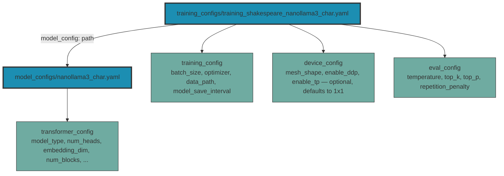

# Configuration Patterns

`tt-train` — the training library that ships inside `tt-metal`, with Python bindings called `ttml` — drives every training job from two YAML files: one describing the model's architecture, one describing how to train it. No Python code changes between runs. Change a number in a file, rerun, compare.

This lesson grounds you in the **real** config files that ship in `tt-metal/tt-train/configs/` — the same ones [Fine-tuning Basics](command:tenstorrent.showLesson?["ct4-finetuning-basics"]) runs against real hardware. Every YAML snippet below is quoted verbatim from a file in that directory, not a hypothetical schema.

## What You'll Learn

- The real `tt-train` config split: **model config** (architecture) vs. **training config** (everything else)
- Model architecture fields and their effects — `num_heads`, `num_groups`, `embedding_dim`, `num_blocks`, `vocab_size`, `max_sequence_length`, `theta`, `runner_type`
- Training hyperparameters and their effects — `batch_size`, `num_epochs`, `max_steps`, `data_path`, and the nested `optimizer` block (`AdamW`'s `lr`, `beta1`/`beta2`, `epsilon`, `weight_decay`)
- Single-chip vs. multi-chip device configuration (`mesh_shape`, `enable_ddp`)
- Checkpointing (`model_save_interval`, `--model_save_path`)
- How `train_nanogpt.py --config <yaml>` actually loads, resolves, and overrides these files

**Time:** 15 minutes | **Prerequisites:** [Dataset Fundamentals](command:tenstorrent.showLesson?["ct2-dataset-fundamentals"])

---

## Why Configuration-Driven Training?

**Don't hardcode values. Use config files.**

Think about cooking: would you rather memorize every ingredient quantity, or use a recipe you can share, modify, and perfect over time? Configuration files are your training recipes.

**Reproducibility is everything.** When you find a config that works, you want to recreate those exact results. Same config file → same training behavior → same model quality. No hunting through code to remember what learning rate you used three weeks ago.

**Experimentation becomes systematic.** Want to try a higher learning rate? Change one line in your config, rerun. Compare results. Keep the winner. No code changes, no risk of breaking something else.

**Sharing is effortless.** Instead of writing "I used batch size 64, learning rate 0.0003, AdamW with weight decay 0.01..." just send your config file. Everything's there.

**Version control tells the story.** When you track config files in git, you see exactly what changed between runs — and when a change made things better or worse.

### The `tt-train` Way: Two Files, Not One

Unlike a single monolithic config, `tt-train` splits configuration into two files that live in two directories:

```
tt-train/configs/
├── model_configs/       # Architecture only — model_type, num_heads, embedding_dim, ...
├── training_configs/    # Everything else — batch_size, optimizer, device mesh, eval sampling
└── README.md            # The real schema — every field, type, and default
```

The training config **points at** its model config by path. That's the whole relationship:


```mermaid
graph TD
    A[training_configs/training_shakespeare_nanollama3_char.yaml] -->|model_config: path| B[model_configs/nanollama3_char.yaml]
    A --> C[training_config<br/>batch_size, optimizer, data_path, model_save_interval]
    A --> D[device_config<br/>mesh_shape, enable_ddp, enable_tp — optional, defaults to 1x1]
    A --> E[eval_config<br/>temperature, top_k, top_p, repetition_penalty]
    B --> F[transformer_config<br/>model_type, num_heads, embedding_dim, num_blocks, ...]

    style A fill:#1B8EB1,stroke:#333,stroke-width:3px
    style B fill:#1B8EB1,stroke:#333,stroke-width:3px
    style C fill:#6FABA0,stroke:#333,stroke-width:1px
    style D fill:#6FABA0,stroke:#333,stroke-width:1px
    style E fill:#6FABA0,stroke:#333,stroke-width:1px
    style F fill:#6FABA0,stroke:#333,stroke-width:1px
```

Per `tt-train/configs/README.md`, there are four config *types*, though most files only use two or three of them:

- **Training Config** (`training_config:`) — hyperparameters and optimizer settings
- **Device Config** (`device_config:`) — device mesh and distributed training setup; *expected in the same file as the training config*
- **Model Config** (`transformer_config:`) — model type and architecture, in a **separate file**
- **MultiHost Config** (`multihost_config:`) — multi-process / pipeline-parallel settings (see [Multi-Device Training](command:tenstorrent.showLesson?["ct5-multi-device-training"]))

---

## A Real Pair: Character-Level LLaMA on Shakespeare

Here is `tt-train/configs/model_configs/nanollama3_char.yaml`, unedited:

```yaml
transformer_config:
  model_type: "llama"
  num_heads: 6
  num_groups: 3
  embedding_dim: 384
  dropout_prob: 0.0
  num_blocks: 6
  max_sequence_length: 256
  runner_type: default
  theta: 500000.0
```

And the training config that points at it, `tt-train/configs/training_configs/training_shakespeare_nanollama3_char.yaml`, unedited:

```yaml
training_config:
  project_name: "tt_train_nano_llama"
  seed: 5489
  model_save_interval: 500
  batch_size: 64
  num_epochs: 1
  max_steps: 5000
  use_clip_grad_norm: false
  clip_grad_norm_max_norm: 1.0
  data_path: "data/shakespeare.txt"
  model_config: "${TT_METAL_RUNTIME_ROOT}/tt-train/configs/model_configs/nanollama3_char.yaml"
  optimizer:
    type: AdamW
    lr: 0.0003
    beta1: 0.9
    beta2: 0.999
    epsilon: 1.0e-8
    weight_decay: 0.01
    amsgrad: false
    stochastic_rounding: false

eval_config:
  repetition_penalty: 1.0
  temperature: 0.7
  top_k: 50
  top_p: 1.0
```

Notice two things that matter:

1. **`model_config` is a path**, resolved through the `${TT_METAL_RUNTIME_ROOT}` environment variable — not an inline block. The two files are loaded and merged at runtime.
2. **There's no `device_config:` section at all.** When it's omitted, `tt-train` falls back to its defaults: `mesh_shape: [1, 1]`, `enable_ddp: false` — a single chip, no distribution. That's exactly right for n150, p150, or a single p300c.

---

## A Second Real Pair: BPE-Tokenized GPT-2

Character-level tokenization isn't the only option. Here's `model_configs/nanogpt.yaml`:

```yaml
transformer_config:
  model_type: "gpt2"
  num_heads: 6
  embedding_dim: 384
  dropout_prob: 0.2
  num_blocks: 6
  vocab_size: 50257
  max_sequence_length: 256
  positional_embedding_type: trainable
  experimental:
    use_composite_layernorm: false
```

And its paired training config, `training_configs/training_shakespeare_nanogpt.yaml`:

```yaml
training_config:
  project_name: "tt_train_nano_gpt"
  seed: 5489
  model_save_interval: 500
  batch_size: 2
  num_epochs: 1
  max_steps: 5000
  data_path: "data/tokenized_shakespeare.yaml"
  model_config: "${TT_METAL_RUNTIME_ROOT}/tt-train/configs/model_configs/nanogpt.yaml"
  optimizer:
    type: AdamW
    lr: 0.0003
    beta1: 0.9
    beta2: 0.999
    epsilon: 1.0e-8
    weight_decay: 0.01
    amsgrad: false

device_config:
  enable_ddp: false
  mesh_shape: [1,1]

eval_config:
  repetition_penalty: 1.0
  temperature: 0.7
  top_k: 50
  top_p: 1.0
```

**Compare the two pairs side by side** and a pattern falls out:

| | LLaMA / char-level | GPT-2 / BPE |
|---|---|---|
| `data_path` | `data/shakespeare.txt` (raw text) | `data/tokenized_shakespeare.yaml` (pre-tokenized) |
| `vocab_size` in model config | *omitted* | `50257` |
| Tokenizer | Built-in `CharTokenizer`, vocab derived from the text | Hugging Face BPE, pre-tokenized by `tools/dataset_to_tokens.py` |

That's not a coincidence — it's how `train_nanogpt.py` actually decides which path to take. The trainer checks the **file extension** of `data_path`:

```python
is_pretokenized = training_config.data_path.endswith((".yaml", ".yml"))
```

If it's `.yaml`/`.yml`, the trainer expects pre-tokenized integer IDs and **requires `vocab_size` in the model config** — omitting it raises `ValueError: Pre-tokenized data (...) requires vocab_size to be set in the model config`. If the data is plain text, `vocab_size` can be omitted entirely; `CharTokenizer` builds the vocabulary directly from the characters it finds. This is why `nanollama3_char.yaml` has no `vocab_size` field and `nanogpt.yaml` does — they're matched to different data pipelines, not to different model families.

There's a second real safety check worth knowing: if a pre-tokenized dataset contains a token ID that doesn't fit inside `vocab_size`, the trainer raises `ValueError: Tokenized data contains token ID X but model vocab_size is Y` rather than silently corrupting an embedding lookup. Getting `vocab_size` right isn't cosmetic — it's load-bearing.

---

## Model Config Fields

These live under `transformer_config:` in a `model_configs/*.yaml` file, per `tt-train/configs/README.md`:

| Field | Effect |
|---|---|
| `model_type` | `"llama"` or `"gpt2"` — which architecture gets built (RMSNorm + SwiGLU + RoPE vs. learned positional embeddings) |
| `num_heads` | Attention heads. More heads = more parallel attention "views," at the cost of more parameters |
| `num_groups` | **LLaMA-only.** Grouped-query attention groups — fewer than `num_heads` means several query heads share one KV head, cutting KV-cache size |
| `embedding_dim` | Hidden/embedding dimension — the width of the model |
| `num_blocks` | Transformer layers — the depth of the model |
| `vocab_size` | Tokenizer vocabulary size. Required when `data_path` is pre-tokenized; omit it for plain-text/char data |
| `max_sequence_length` | Context window in tokens. Directly sets memory use — doubling it roughly doubles attention memory |
| `theta` | **LLaMA-only.** RoPE base frequency; `500000.0` in the shipped char-level config |
| `runner_type` | `default` or `memory_efficient` — trades some speed for lower peak memory on tight DRAM budgets |
| `dropout_prob` | Regularization — `0.0` in the LLaMA example, `0.2` in the GPT-2 example |

More parameters exist for RoPE scaling (`rope_scaling.scaling_factor`, `high_freq_factor`, `low_freq_factor`, `original_context_length`) and LLaMA's feed-forward width (`intermediate_dim`) — see the full table in `tt-train/configs/README.md` for models larger than the nano examples here.

### `num_heads`, `embedding_dim`, `num_blocks` — the size dials

**Bigger isn't automatically better on your hardware.** The nano models in this lesson — 6 heads, 384-dim embeddings, 6 blocks — are deliberately tiny (a few million parameters), sized to compile and train fast enough for iteration on a single chip. [Training from Scratch](command:tenstorrent.showLesson?["ct8-training-from-scratch"]) walks through designing a slightly larger architecture (nano-trickster, ~11M params) and what changes when you scale these three numbers up.

---

## Training Config Fields

These live under `training_config:` in a `training_configs/*.yaml` file:

| Field | What it does |
|---|---|
| `project_name` | A label for this run. Not required for training to work — useful for keeping checkpoints and logs straight across experiments |
| `seed` | Random seed for reproducibility — same seed, same data order, same initialization |
| `batch_size` | Examples per training step. `64` in the LLaMA/char config, `2` in the GPT-2/BPE config — the right value depends on model size and sequence length, not a universal constant |
| `num_epochs` | Passes through the full dataset |
| `max_steps` | Hard cap on training steps, regardless of epoch count |
| `data_path` | Path to training data — raw text (char tokenizer) or a `.yaml`/`.yml` pre-tokenized file (BPE) |
| `model_config` | Path to the paired model config file (see above) |
| `model_save_interval` | Save a checkpoint every N steps |
| `use_clip_grad_norm` / `clip_grad_norm_max_norm` | Gradient-norm clipping toggle and threshold |
| `scheduler_type` | `"identity"` (constant learning rate, the default) or `"warmup_linear"` |
| `tokenizer_type` | `"char"` (default) or `"bpe"` — in practice this tracks the `data_path` extension check described above |
| `gradient_accumulation_steps` | Accumulate gradients over N steps before an optimizer update, simulating a larger effective batch. Defaults to `1`; none of the shipped Shakespeare configs use it, but it's real and documented |

**Note on `max_steps` and `num_epochs` both being set:** every shipped config here sets both. `max_steps` wins as the hard stop; `num_epochs: 1` just means the trainer won't cycle back through the dataset more than once before that cap. For a tiny dataset like Shakespeare's ~1.1M characters, one epoch at `batch_size: 64` and `max_sequence_length: 256` covers far fewer than 5,000 steps' worth of unique windows — in practice the loader wraps and re-samples, so `max_steps` is the number that actually determines training length here, not `num_epochs`.

### `batch_size` — sized to the model, not the hardware in the abstract

The LLaMA/char config uses `batch_size: 64` for a ~6-block, 384-dim model. The GPT-2/BPE config uses `batch_size: 2` for a similarly sized model but with a full `50257`-token vocabulary — that vocabulary alone makes the embedding and output-projection matrices far larger, eating the DRAM budget that would otherwise go to a bigger batch. **Read the model config before guessing at a batch size**; vocabulary size and sequence length both compete with batch size for the same memory.

---

## Optimizer Configuration

The optimizer is a nested block under `training_config.optimizer` — **not** top-level fields. This is a real, easy mistake to make if you're used to flatter config schemas: `lr` and `weight_decay` live *inside* `optimizer:`, never as siblings of `batch_size`.

```yaml
training_config:
  optimizer:
    type: AdamW
    lr: 0.0003
    beta1: 0.9
    beta2: 0.999
    epsilon: 1.0e-8
    weight_decay: 0.01
    amsgrad: false
    stochastic_rounding: false
```

| Field | Default | Effect |
|---|---|---|
| `type` | — | Optimizer implementation — see the table below |
| `lr` | `3e-4` | Learning rate. `0.0003` in every shipped Shakespeare config — a reasonable starting point for training a small model from scratch |
| `beta1` / `beta2` | `0.9` / `0.999` | Adam's first/second moment decay rates — the standard values, rarely worth changing |
| `epsilon` | `1e-8` | Numerical stability constant in the denominator |
| `weight_decay` | `1e-2` | L2-style regularization strength |
| `amsgrad` | `false` | AMSGrad variant of Adam |
| `stochastic_rounding` | `false` | Stochastic rounding for the bf16 optimizer state (`AdamW` only) |

`tt-train` ships more than one optimizer implementation, all selected via `type`:

| `type` | What it is |
|---|---|
| `AdamW` | Fused AdamW, bf16 state, single kernel per step. Default and recommended |
| `AdamWFullPrecision` | fp32 master weights/state, casts to bf16 for the forward pass — use if bf16 accumulation causes instability |
| `MorehAdamW` | AdamW via the Moreh team's `ttnn::moreh_adamw` kernel |
| `AdamWComposite` | AdamW built from individual TTNN ops (no custom kernel); supports Kahan summation |
| `SGD` / `SGDComposite` | Fused or composite SGD |
| `NoOp` | No parameter updates — useful for debugging a forward/backward pass in isolation |

### Gradient Clipping — the real default is *off*

```yaml
training_config:
  use_clip_grad_norm: false
  clip_grad_norm_max_norm: 1.0
```

Every shipped Shakespeare config sets `use_clip_grad_norm: false`. That's worth sitting with for a second: gradient clipping is a safety net for exploding gradients, but it isn't free — it's an extra reduction over every gradient tensor on every step. For these small, well-behaved nano models trained at `lr: 0.0003`, the shipped defaults simply don't need it. If you push the learning rate up, widen the model, or see loss spike into `NaN`, flip `use_clip_grad_norm: true` and start with `clip_grad_norm_max_norm: 1.0`.

---

## Device Configuration — Single-Chip vs. Multi-Chip

`device_config:` lives in the training config file, alongside `training_config:` — never in a separate file. Two fields matter here:

```yaml
device_config:
  enable_ddp: false
  mesh_shape: [1, 1]
```

Per `tt-train/configs/README.md`, the real device mesh shapes are:

| Hardware | `mesh_shape` |
|---|---|
| Single-device (n150, p150, single p300c) | `[1, 1]` |
| Dual-device (n300, p300) | `[1, 2]` |
| LoudBox | `[1, 8]` |
| Single Galaxy | `[1, 32]` |

For this lesson — and for [Fine-tuning Basics](command:tenstorrent.showLesson?["ct4-finetuning-basics"]) right after it — `[1, 1]` is the answer. p300c and p150 are both single Blackhole<sup>®</sup> chips; treat them exactly like a single-chip Wormhole<sup>™</sup> board here. Notice, too, that the LLaMA/char config earlier in this lesson **omits `device_config:` entirely** — when you don't specify it, `tt-train` defaults to `mesh_shape: [1, 1]`, `enable_ddp: false` anyway. Leaving it out on purpose for a single-chip run is a legitimate, minimal config.

Turning on `enable_ddp: true` with a `[1, 2]` or larger mesh splits the batch across devices and requires `batch_size` to be divisible by the device count — real constraints, real gradient synchronization, and a real gotcha if `enable_ddp` and `mesh_shape` disagree (`enable_ddp: true` on `[1, 1]` has nothing to synchronize with). The full story — data parallelism, tensor parallelism, and how they combine on a 2D mesh — belongs to [Multi-Device Training](command:tenstorrent.showLesson?["ct5-multi-device-training"]); this lesson stays single-chip on purpose.

---

## Checkpointing

`model_save_interval` in the training config sets how often a checkpoint gets written, in steps:

```yaml
training_config:
  model_save_interval: 500
```

That's the config-file half. The other half is a command-line flag on `train_nanogpt.py` itself — `--model_save_path`, which sets *where* checkpoints land:

```bash
python train_nanogpt.py \
  --config training_shakespeare_nanollama3_char.yaml \
  --model_save_path ~/tt-metal/tt-train/checkpoints/shakespeare
```

Checkpoints are written as `.pkl` files, named from that path plus the step number (`shakespeare_step_500.pkl`) or `_final.pkl` when training completes. Two more real flags round this out:

- `--resume <path>` — resume from a specific checkpoint (auto-detects the latest if you omit the path and don't pass `--fresh`)
- `--fresh` — start over, ignoring any existing checkpoint

[Fine-tuning Basics](command:tenstorrent.showLesson?["ct4-finetuning-basics"]) runs through several checkpoint-then-resume cycles as it trains in progressive stages — that's where `model_save_interval` and `--model_save_path` actually get exercised end to end.

---

## Evaluation Sampling and Logging

`eval_config:` doesn't control a validation *set* — `tt-train`'s nano examples don't hold out one. Every shipped config declares one anyway:

```yaml
eval_config:
  repetition_penalty: 1.0
  temperature: 0.7
  top_k: 50
  top_p: 1.0
```

**But `train_nanogpt.py` never reads it.** Grep the script and `eval_config` doesn't appear — it's present in the YAML schema but not wired into the generation path. The periodic text samples you'll see in Fine-tuning Basics come from `train_nanogpt.py`'s own `--temperature`/`--top_k` command-line flags, which default to `0.8` and `40` respectively (`--top_p` and `--repetition_penalty` aren't exposed as generation controls at all). If you want to change what those periodic samples look like, pass `--temperature`/`--top_k` on the command line — editing `eval_config:` in the YAML won't do anything.

**On logging:** there's no WandB or dashboard field in `tt-train`'s YAML schema — don't reach for `use_wandb:` or similar, it isn't real. Training progress today is stdout: per-step loss and timing, printed directly by `train_nanogpt.py`, plus whatever you capture yourself by redirecting output to a file. `project_name` in the training config is just a label; it doesn't wire up an external tracking service on its own.

---

## Running It: `train_nanogpt.py --config <yaml>`

This is the payoff — how the files above actually get consumed. `train_nanogpt.py` lives at `tt-metal/tt-train/sources/examples/nano_gpt/train_nanogpt.py` and takes `-c`/`--config`, a path resolved relative to `configs/training_configs/`:

```bash
cd ~/tt-metal/tt-train/sources/examples/nano_gpt
python train_nanogpt.py --config training_shakespeare_nanollama3_char.yaml
```

Leave `--config` off entirely and it falls back to a real default: `training_shakespeare_nanogpt_char.yaml` (paired with `nanogpt_char.yaml` — a GPT-2 architecture trained on plain-text, char-tokenized Shakespeare, no pre-tokenization step required). That's genuinely the config that runs if you type `python train_nanogpt.py` with no arguments at all.

A handful of fields can also be overridden directly on the command line, without editing the YAML — useful for one-off experiments:

```bash
python train_nanogpt.py \
  --config training_shakespeare_nanollama3_char.yaml \
  --batch_size 8 \
  --max_steps 1000 \
  --data_path ~/tt-scratchpad/training/data/my_corpus.txt
```

The real overridable flags are `--data_path`, `--batch_size`, `--max_steps`, `--num_epochs`, `--clip_grad_norm`, `--sequence_length`, and `--model_save_path`. **There is no `--learning_rate` flag** — to change `lr`, edit `optimizer.lr` in the training config YAML itself, or point `--config` at a different file. This matters because it's easy to assume every training-config field has a matching CLI override; only the seven listed above do.

If you'd rather not touch Python at all, the same YAML files also drive a native C++ binary (`nano_gpt`, built by `build_metal.sh` alongside everything else) with its own `--config`/`-c` flag — same config format, same two-file split, no `ttml` Python bindings required.

---

### A Note on `tt-blacksmith`

If that name is familiar: [tt-blacksmith](https://github.com/tenstorrent/tt-blacksmith) is a separate, actively maintained collection of optimized training recipes on the **TT-Forge<sup>™</sup>/TT-XLA compiler stack** — a different config format, a different project, unrelated to the `tt-train`/`ttml` files this lesson covers. [Understanding Custom Training](command:tenstorrent.showLesson?["ct1-understanding-training"]) has the full breakdown if you're deciding between the two stacks.

---

## Common Configuration Mistakes

### ❌ Pre-tokenized data without `vocab_size`

```yaml
training_config:
  data_path: "data/tokenized_shakespeare.yaml"   # .yaml → pre-tokenized

transformer_config:
  model_type: "gpt2"
  # vocab_size omitted
```

**Result:** `ValueError: Pre-tokenized data (...) requires vocab_size to be set in the model config.` — `vocab_size` is only optional for plain-text data.

**Fix:** set `vocab_size` to match the tokenizer that produced the `.yaml` file (`tools/dataset_to_tokens.py` reports it as `tokenizer_vocab_size` in that same file).

### ❌ `vocab_size` smaller than the tokenized data actually needs

**Result:** `ValueError: Tokenized data contains token ID X but model vocab_size is Y.`

**Fix:** match `vocab_size` to the tokenizer's real vocabulary, not a guessed round number.

### ❌ Flat `lr:` / `weight_decay:` instead of nested under `optimizer:`

```yaml
training_config:
  lr: 0.0003          # Wrong — this field doesn't exist here
  weight_decay: 0.01  # Wrong — same problem
```

**Result:** silently ignored; the optimizer falls back to its defaults (`lr: 3e-4`, `weight_decay: 1e-2`) instead of erroring, which can mask what actually changed between runs.

**Fix:** nest both under `optimizer:`.

### ❌ `enable_ddp: true` on a `[1, 1]` mesh

```yaml
device_config:
  enable_ddp: true    # Nothing to synchronize with...
  mesh_shape: [1, 1]  # ...only one device
```

**Fix:** `enable_ddp: false` for `[1, 1]`; `enable_ddp: true` only once `mesh_shape` names more than one device. See [Multi-Device Training](command:tenstorrent.showLesson?["ct5-multi-device-training"]) before flipping this on.

### ❌ Saving every step

```yaml
training_config:
  model_save_interval: 1   # A checkpoint on every single step
```

**Result:** hundreds of `.pkl` files, disk pressure, slower training from constant I/O.

**Fix:** `500` (the shipped default) is a reasonable starting point for a 5,000-step run; scale it to roughly 1% of `max_steps`.

---

## Key Takeaways

✅ **Two files, one relationship:** a model config (architecture) and a training config (everything else), linked by a `model_config:` path

✅ **`optimizer` is nested** — `lr`, `beta1`/`beta2`, `epsilon`, `weight_decay` live under `training_config.optimizer`, not at the top level

✅ **`vocab_size` is conditionally required** — omit it for plain-text/char data, set it exactly for pre-tokenized `.yaml`/`.yml` data

✅ **`device_config` is optional** — omitting it means single-chip, `mesh_shape: [1, 1]`, by default

✅ **Gradient clipping defaults to off** in every shipped Shakespeare config — it's a safety net, not a mandatory setting

✅ **`train_nanogpt.py --config <yaml>`** is the real entry point; seven fields (`--data_path`, `--batch_size`, `--max_steps`, `--num_epochs`, `--clip_grad_norm`, `--sequence_length`, `--model_save_path`) can be overridden on the command line — `lr` cannot

✅ **`tt-blacksmith` is a different project** on the TT-Forge/TT-XLA stack — not a config layer over `tt-train`

---

## Next Steps

You've prepared your dataset ([Dataset Fundamentals](command:tenstorrent.showLesson?["ct2-dataset-fundamentals"])) and now know exactly what's in a `tt-train` config and how it's loaded. Time to actually run one.

**Next: [Fine-tuning Basics](command:tenstorrent.showLesson?["ct4-finetuning-basics"])** — launch `train_nanogpt.py` for real, watch loss drop stage by stage, and generate text from your own checkpoints.

---

## Additional Resources

- **The real schema:** `tt-train/configs/README.md` — every field, type, and default, generated from the actual implementation
- **The real configs:** `tt-train/configs/model_configs/` and `tt-train/configs/training_configs/` — dozens of examples beyond the nano pair covered here, including LLaMA-8B, Galaxy pipeline-parallel, and MoE configs
- **The real trainer:** `tt-train/sources/examples/nano_gpt/train_nanogpt.py`
- [Multi-Device Training](command:tenstorrent.showLesson?["ct5-multi-device-training"]) — the full `mesh_shape`/`enable_ddp`/`enable_tp` story
- [Training from Scratch](command:tenstorrent.showLesson?["ct8-training-from-scratch"]) — designing a model config's architecture fields instead of borrowing the nano ones
