# Configuration Patterns

Master YAML-driven training configuration using patterns from tt-blacksmith. Learn to configure hardware, logging, checkpointing, and hyperparameters.

## What You'll Learn

- YAML configuration structure (tt-blacksmith pattern)
- Training hyperparameters and their effects
- Device configuration (single vs multi-chip)
- Logging and experiment tracking
- Checkpoint management strategies
- Hardware-specific optimization

**Time:** 15 minutes | **Prerequisites:** CT-2 (Dataset Fundamentals)

---

## Why Configuration-Driven Training?

**Don't hardcode values. Use config files.**

Think about cooking: Would you rather memorize every ingredient quantity, or use a recipe you can share, modify, and perfect over time? Configuration files are your training recipes.

### The Power of Configuration

**Reproducibility is everything.** When you find a config that works, you want to be able to recreate those exact results. Same config file → same training behavior → same model quality. No hunting through code to remember what learning rate you used three weeks ago.

**Experimentation becomes systematic.** Want to try a higher learning rate? Change one line in your config, rerun. Compare results. Keep the winner. No code changes, no risk of breaking something else. Configuration files let you experiment fearlessly.

**Sharing is effortless.** Instead of writing "I used batch size 8, learning rate 0.0001, AdamW optimizer with weight decay 0.01, gradient clipping at 1.0..." just send your config file. Everything's there. Your colleague runs the exact same setup in seconds.

**Version control tells the story.** When you track config files in git, you see exactly what changed between runs. "Oh, this commit lowered the learning rate from 1e-4 to 5e-5 - that's when training stabilized." The history writes itself.

**Documentation that never lies.** Comments in code get out of sync. Config files can't lie - they are what the training run actually used. Self-documenting by necessity.

### The tt-blacksmith Way

tt-blacksmith uses comprehensive YAML configs with standardized sections. Here's how they fit together:


**Why this structure?**
- **Logical grouping:** Related settings stay together
- **Easy to navigate:** Find what you need quickly
- **Consistent across projects:** Same pattern everywhere
- **Self-documenting:** Structure tells you what each section controls

**We'll follow this pattern** throughout the Custom Training series.

---

## Configuration File Structure

### Full Example: `training_n150.yaml`

```yaml
# Training Configuration for N150 (Single Wormhole Chip)
#
# Optimized for single-chip development hardware
# Typical training time: 1-3 hours depending on dataset size

training_config:
  model_type: "llama"
  seed: 42
  batch_size: 8                    # N150: Conservative for DRAM limits
  validation_batch_size: 2
  num_epochs: 3                    # Adjust based on dataset size
  max_steps: 5000                  # Maximum training steps
  learning_rate: 0.0001            # Standard for fine-tuning
  weight_decay: 0.01
  use_moreh_adamw: true
  use_kahan_summation: false
  use_clip_grad_norm: true
  clip_grad_norm_max_norm: 1.0
  gradient_accumulation_steps: 4   # Effective batch: 8 * 4 = 32
  eval_every: 50                   # Validate every 50 steps
  model_save_interval: 100         # Checkpoint every 100 steps
  tokenizer_type: "bpe"
  checkpoint_dir: "checkpoints"
  model_config: "model_configs/model.yaml"

  # Logging configuration (tt-blacksmith pattern)
  log_level: "INFO"
  use_wandb: false                 # Optional experiment tracking
  wandb_project: "my-training"
  wandb_run_name: "n150-experiment"

  # Checkpoint strategy (tt-blacksmith pattern)
  checkpoint_frequency: 100        # Save every 100 steps
  validation_frequency: 50         # Validate every 50 steps
  save_strategy: "steps"           # Save based on steps (not epochs)

# NOTE: v0.64.5+ uses constant learning_rate, no scheduler_config needed

eval_config:
  repetition_penalty: 1.0
  temperature: 0.0                 # Greedy decoding for validation
  top_k: 50
  top_p: 1.0

device_config:
  enable_ddp: False                # N150: Single chip, no DDP
  mesh_shape: [1, 1]               # 1x1 mesh (single device)
```

Let's break down each section.

---

## Section 1: Training Configuration

### Core Hyperparameters

| Parameter | What It Does | Typical Values | Example (N150) |
|-----------|--------------|----------------|----------------|
| `batch_size` | Examples per training step | 4-32 | **8** (DRAM conservative) |
| `learning_rate` | How fast model learns | 1e-5 to 1e-4 | **1e-4** (fine-tuning LR) |
| `num_epochs` | Passes through full dataset | 1-10 | **3** (typical fine-tuning) |
| `max_steps` | Total training steps | 100-5000 | **500** (1-3 hours) |
| `weight_decay` | Regularization strength | 0.0-0.1 | **0.01** (mild regularization) |

### Batch Size Deep Dive

Think of batch size like teaching multiple students at once versus one-on-one tutoring. **Batch size is how many training examples the model sees before updating its weights.**

**Larger batches (16-32) are like teaching a classroom.** You show 16 different examples, collect feedback from all of them, then make one consolidated update to the model. The advantage? You get more consistent, stable feedback across different perspectives. Training moves faster because each update is based on broader evidence. The downside? You need more resources - specifically, more memory to hold all those examples at once.

**Smaller batches (4-8) are like tutoring individuals.** You show 4 examples, update immediately. The feedback is noisier - each small batch might have quirks that don't represent the full dataset. Progress is slower because you're making more frequent, smaller updates. But here's the win: it works with limited resources.

**On N150, we're memory-constrained** compared to massive GPU clusters with 80GB+ VRAM. The N150's DRAM is fantastic for its purpose, but we're not running H100s here. Batch size 8 is our sweet spot - conservative enough to always work, large enough to make meaningful progress. Got a particularly small model? You might push to 16. But 8 is the safe starting point that won't exhaust your DRAM mid-training.

**Here's the clever trick:** `effective_batch_size = batch_size × gradient_accumulation_steps`

Example: `8 × 4 = 32` effective batch size

You can simulate the stability of batch size 32 while only holding 8 examples in memory at once! We'll cover gradient accumulation next.

### Learning Rate Deep Dive

Think of learning rate like adjusting the steering wheel when driving. **Learning rate controls how aggressively the model updates its weights after seeing each batch.**

**Too aggressive (1e-3, ten times too high)?** You overcorrect wildly. The model's loss starts bouncing all over the place, then explodes into NaN errors. It's like jerking the steering wheel hard left, then hard right, then harder left - you're not making progress, you're just creating chaos. The model literally forgets everything it knew and becomes useless.

**Too timid (1e-6, a hundred times too low)?** You barely turn the wheel at all. Training becomes painfully slow. After hours of compute, the loss has barely budged. You might not converge at all - the model never learns the patterns you're trying to teach it. Progress is so incremental that you're wasting time and electricity.

**Just right (1e-4 to 1e-5)?** Smooth, steady improvement. The loss curve descends consistently. The model absorbs your training data without catastrophic forgetting. You make measurable progress every few steps. This is the Goldilocks zone.

**Starting point: 1e-4 (0.0001).** This is the sweet spot for fine-tuning pre-trained models. Nine times out of ten, it just works.

**If your loss is jumpy and unstable,** the model is learning too aggressively. Lower the learning rate to `5e-5` or even `1e-5`. You'll see the loss curve smooth out and training stabilize.

**If your loss barely moves after 50-100 steps,** you're being too conservative. Bump it up to `2e-4`. Give the model permission to learn faster.

**Why do we use lower learning rates for fine-tuning than for training from scratch?**

Because the pre-trained weights are already good! They represent millions of dollars of compute and massive datasets. We're not starting from random noise - we're starting from a model that already speaks English (or code, or whatever domain). We want to **nudge** those weights toward our specific task, not **overwrite** them with aggressive updates. Think of it like editing a draft, not rewriting from scratch.

### Gradient Accumulation

This is one of the cleverest tricks in deep learning. **Gradient accumulation lets you simulate a large batch size while only holding a small batch in memory.**

Think of it like polling a large group before making a decision. You can't fit 32 people in your office at once, but you can interview them in groups of 8, collect all their feedback, then make one consolidated decision based on all 32 opinions. That's gradient accumulation.

**Here's how it works:**

You set `batch_size = 8` (fits in N150 DRAM) and `gradient_accumulation_steps = 4`. Now:

1. **Step 1:** Process batch of 8 examples, compute gradients, but **don't update weights yet** - just save the gradients
2. **Step 2:** Process another 8 examples, add their gradients to the saved ones
3. **Step 3:** Process another 8 examples, keep accumulating
4. **Step 4:** Process final 8 examples (32 total now), average all the gradients, **now update weights**

**Effective batch size: 8 × 4 = 32**

You get the training stability of a 32-example batch while only needing memory for 8 examples at once. It's like having your cake and eating it too.

**The benefits are clear:** Training becomes more stable (larger effective batch smooths out noise), and you don't run out of memory. The trade-off? Slightly slower training because you're doing 4 forward passes before each backward pass. But on memory-constrained hardware like N150, this trade-off is absolutely worth it.

**On N150, use gradient accumulation always.** Set `gradient_accumulation_steps = 4` as your default. On N300 or T3K with more memory available, you might not need it - you can just use larger actual batches. But even on big hardware, gradient accumulation remains useful when you want to push batch sizes beyond what physically fits in memory.

### Epochs vs Steps

Two ways to control how long training runs: count how many times you've seen the full dataset (epochs), or count how many training iterations you've done (steps). Both work, but they're useful in different situations.

**Epochs are like saying "read the entire textbook 3 times."** An epoch is one complete pass through your dataset. If you have 100 training examples and set `num_epochs = 3`, the model sees all 100 examples three times. The total number of training steps depends on your batch size:

```
num_epochs = 3
dataset_size = 100
batch_size = 8

→ steps_per_epoch = 100 / 8 = 12.5 (rounds to 12-13)
→ total_steps = 3 × 12 = 36 steps
```

**Steps are like saying "study for 500 minutes, regardless of how many chapters that covers."** With `max_steps = 500`, training runs for exactly 500 iterations, no matter how large or small your dataset is. You might see the full dataset dozens of times (small dataset) or only see a fraction of it (huge dataset).

**Which should you use?**

**For small datasets (50-500 examples),** use `max_steps` for better control. With a 50-example dataset and batch size 8, one epoch is only 6-7 steps. Setting `num_epochs = 3` would give you just 18-21 steps total - barely enough to learn anything. Instead, set `max_steps = 500` and let the model see those 50 examples many times over. Small datasets need repetition to extract patterns.

**For large datasets (10,000+ examples),** use `num_epochs` as your natural unit. With 10,000 examples and batch size 8, one epoch is 1,250 steps. Setting `num_epochs = 3` gives you 3,750 steps - substantial training. Epochs feel more intuitive here because they correspond to meaningful milestones.

**Example calculation for small dataset:** 50 examples, batch size 8 → 6-7 steps per epoch → 500 max_steps ≈ 80 epochs

**Don't panic at "80 epochs"!** This is completely normal for small datasets. The model needs to see those patterns dozens of times to internalize them. You're not overfitting - you're learning deeply from limited data.

---

## Section 2: Device Configuration

### Single Device (N150)

```yaml
device_config:
  enable_ddp: False                # No distributed training
  mesh_shape: [1, 1]               # 1 row × 1 column = 1 device
```

**When to use:**
- N150 (single Wormhole chip)
- Development and debugging
- Small models (1-3B parameters)

### Multi-Device (N300)

```yaml
device_config:
  enable_ddp: True                 # Distributed Data Parallel
  mesh_shape: [1, 2]               # 1 row × 2 columns = 2 devices
```

**What changes:**
- Batch split across devices
- Gradients synchronized after backward pass
- ~2x faster training

**When to use:**
- N300 (dual Wormhole chips)
- Larger models or larger batches
- Faster iteration for experimentation

### Advanced (T3K, Galaxy)

```yaml
device_config:
  enable_ddp: True
  mesh_shape: [2, 4]               # 2 rows × 4 columns = 8 devices
```

**When to use:**
- T3K (8 chips in mesh)
- Galaxy (32+ chips)
- Large-scale training or research

**Note:** Lesson CT-5 covers multi-device training in detail.

---

## Section 3: Optimizer Configuration

### AdamW (Default Choice)

```yaml
training_config:
  use_moreh_adamw: true            # TT-optimized AdamW
  weight_decay: 0.01               # L2 regularization
  use_kahan_summation: false       # Numerical stability (optional)
```

**AdamW advantages:**
- ✅ Adaptive learning rates per parameter
- ✅ Momentum (better convergence)
- ✅ Weight decay (regularization)
- ✅ Industry standard for LLMs

**Alternatives:**
- **SGD:** Simpler, sometimes better for small models
- **AdamW with Kahan:** Better numerical precision (slower)

**Recommendation:** Stick with AdamW unless you have specific reasons not to.

### Gradient Clipping

```yaml
training_config:
  use_clip_grad_norm: true
  clip_grad_norm_max_norm: 1.0     # Clip gradients above this norm
```

**Why clip gradients?**

Prevents **exploding gradients** - when gradients become huge and cause NaN errors.

**When to use:**
- ✅ Always (it's a safety net)
- ✅ Especially with RNNs/Transformers
- ⚠️ If training is stable, can disable for slight speedup

**Typical values:** 0.5 to 1.0

---

## Section 4: Checkpointing Strategy

### Basic Checkpointing

```yaml
training_config:
  model_save_interval: 100         # Save every 100 steps
  checkpoint_dir: "checkpoints_n150"
```

**What gets saved:**
- Model weights (safetensors format)
- Optimizer state (for resuming)
- Training step number

**Why checkpoint?**
- ✅ Training crashes → resume from last checkpoint
- ✅ Epoch 47 was best → load that checkpoint
- ✅ Share checkpoints with collaborators

### Advanced Strategy (tt-blacksmith pattern)

```yaml
training_config:
  checkpoint_frequency: 100        # How often to save
  save_strategy: "steps"           # "steps" or "epoch"
  validation_frequency: 50         # Validate more often than save
```

**save_strategy options:**
- **"steps":** Save every N steps (fine-grained control)
- **"epoch":** Save after each epoch (natural for large datasets)

**Best practices:**
- Validate more frequently than saving (catch issues early)
- Keep last 3-5 checkpoints (disk space vs safety)
- Save final model separately (easy to find)

---

## Section 5: Logging Configuration

### Basic Logging (File-based)

```yaml
training_config:
  log_level: "INFO"                # INFO, DEBUG, WARNING, ERROR
  # File logging is always enabled
```

**What gets logged:**
- Training loss per step
- Validation loss
- Generated sample outputs
- Hyperparameters

**Output files:**
- `training.log` - All training output
- `validation.txt` - Sample generations
- `training_curves.png` - Loss visualization

### Advanced: WandB Integration (Optional)

```yaml
training_config:
  use_wandb: false                 # Enable for experiment tracking
  wandb_project: "my-training-project"
  wandb_run_name: "n150-experiment-1"
```

**What is WandB (Weights & Biases)?**

Cloud-based experiment tracking:
- 📊 Beautiful loss curves
- 🔍 Compare multiple runs
- 📝 Log hyperparameters automatically
- 🖼️ Visualize sample outputs
- 👥 Share with team

**When to use:**
- ✅ Multiple experiments to compare
- ✅ Collaborative projects
- ✅ Production ML workflows
- ⚠️ Requires internet, account (free tier available)

**When to skip:**
- Single experiment, local-only
- Offline environment
- Privacy-sensitive projects

**Note:** Lesson CT-6 covers experiment tracking in detail.

---

## Section 6: Evaluation Configuration

```yaml
eval_config:
  repetition_penalty: 1.0          # Penalize repeated tokens
  temperature: 0.0                 # Greedy (deterministic) sampling
  top_k: 50                        # Consider top-K tokens
  top_p: 1.0                       # Nucleus sampling threshold
```

### Sampling Parameters Explained

| Parameter | Effect | Validation | Inference |
|-----------|--------|------------|-----------|
| `temperature` | Randomness (0=greedy, 1+=creative) | **0.0** (deterministic) | 0.7-1.0 (varied) |
| `top_k` | Only consider top K tokens | 50 | 40-80 |
| `top_p` | Nucleus sampling (cumulative probability) | 1.0 (disabled) | 0.9-0.95 |
| `repetition_penalty` | Discourage repeating tokens | 1.0 (disabled) | 1.1-1.3 |

**For validation:**
- Use `temperature=0.0` (greedy) for consistent evaluation
- Same prompt always generates same output
- Easy to spot improvements

**For inference:**
- Use `temperature=0.7-1.0` for variety
- Adjust based on use case (creative vs factual)

---

## Hardware-Specific Configurations

### N150: Memory-Constrained

```yaml
training_config:
  batch_size: 8                    # Conservative
  gradient_accumulation_steps: 4   # Simulate batch_size=32

device_config:
  enable_ddp: False
  mesh_shape: [1, 1]
```

**Key trade-offs:**
- Slower training (smaller batch)
- Lower memory usage
- Single-device simplicity

### N300: Balanced Performance

```yaml
training_config:
  batch_size: 16                   # Larger batch with DDP
  gradient_accumulation_steps: 2   # Still effective_batch=32

device_config:
  enable_ddp: True
  mesh_shape: [1, 2]
```

**Key improvements:**
- ~2x faster training
- Better GPU utilization
- Minimal code changes

### T3K: High Performance

```yaml
training_config:
  batch_size: 32                   # Large batch
  gradient_accumulation_steps: 1   # No accumulation needed

device_config:
  enable_ddp: True
  mesh_shape: [2, 4]               # 8 devices
```

**Key advantages:**
- ~8x faster training
- Experiment rapidly
- Train larger models

---

## Common Configuration Mistakes

### ❌ Don't: Set Learning Rate Too High

```yaml
learning_rate: 0.001              # 10x too high for fine-tuning!
```

**Result:** Loss explodes, model forgets everything, NaN errors.

**Fix:** Use `0.0001` (1e-4) for fine-tuning.

### ❌ Don't: Disable Gradient Clipping

```yaml
use_clip_grad_norm: false         # Risky!
```

**Result:** Occasional training crashes from exploding gradients.

**Fix:** Keep it enabled unless you have good reason not to.

### ❌ Don't: Save Too Frequently

```yaml
model_save_interval: 1            # Save every step!
```

**Result:** Hundreds of checkpoints, disk space exhausted, slow I/O.

**Fix:** Save every 50-100 steps for small jobs, 500-1000 for large.

### ❌ Don't: Ignore Validation

```yaml
validation_frequency: 99999       # Never validate
```

**Result:** Model overfits, you don't notice until the end.

**Fix:** Validate every 50-100 steps, check sample outputs.

### ❌ Don't: Mix Single/Multi-Device Settings

```yaml
device_config:
  enable_ddp: True                # DDP enabled...
  mesh_shape: [1, 1]              # ...but only 1 device?
```

**Result:** Confusing errors or unexpected behavior.

**Fix:** `enable_ddp: False` for `[1,1]`, `enable_ddp: True` for `[1,2]` or larger.

---

## Configuration Experimentation Workflow

Experimentation is the heart of ML engineering. Here's how to systematically improve your models through config changes:

```mermaid
graph TD
    A[Start: Baseline Config<br/>training_n150.yaml] --> B[Run Training<br/>Monitor loss & samples]

    B --> C{Results Good?}
    C -->|Yes| D[🎉 Use This Config<br/>Save as production]
    C -->|No| E[Identify Issue<br/>Loss too high? Overfit? Slow?]

    E --> F{What to Change?}

    F -->|Loss not improving| G[Try Higher LR<br/>1e-4 → 2e-4]
    F -->|Loss jumpy/unstable| H[Try Lower LR<br/>1e-4 → 5e-5]
    F -->|Training too slow| I[Increase batch_size<br/>8 → 16]
    F -->|Out of memory| J[Decrease batch_size<br/>or add gradient_accumulation]

    G --> K[Run Experiment<br/>Change ONE parameter]
    H --> K
    I --> K
    J --> K

    K --> L[Compare Results<br/>Better or worse?]

    L -->|Better| M[Keep Change<br/>Update baseline]
    L -->|Worse| N[Revert Change<br/>Try something else]

    M --> O{More to Try?}
    N --> O

    O -->|Yes| F
    O -->|No| D

    style A fill:#4A90E2,stroke:#333,stroke-width:2px
    style B fill:#7B68EE,stroke:#333,stroke-width:2px
    style D fill:#50C878,stroke:#333,stroke-width:3px
    style E fill:#E85D75,stroke:#333,stroke-width:2px
    style K fill:#7B68EE,stroke:#333,stroke-width:2px
    style L fill:#E85D75,stroke:#333,stroke-width:2px
```



**Key principle: Change one thing at a time.**

### 1. Start with Baseline Config

Use a baseline config appropriate for your hardware as-is. This is your reference point.

### 2. Change One Thing at a Time

**Good approach:**
```
Run 1: batch_size=8, lr=1e-4
Run 2: batch_size=16, lr=1e-4  # Changed batch size only ✅
Run 3: batch_size=16, lr=5e-5  # Changed LR only ✅
```

**Bad approach:**
```
Run 1: batch_size=8, lr=1e-4, steps=500
Run 2: batch_size=16, lr=5e-5, steps=1000  # Changed everything! ❌
```

**Why?** If Run 2 is better, you won't know if it was the batch size, learning rate, or step count that made the difference. Scientific method requires isolating variables.

### 3. Track Results

Create `experiments.md`:

```markdown
## Experiment 1: Baseline
- Config: training_n150.yaml
- Final train loss: 2.34
- Final val loss: 2.56
- Sample output: "Good"

## Experiment 2: Higher Batch Size
- Config: batch_size=16
- Final train loss: 2.21
- Final val loss: 2.48
- Sample output: "Better!"
- **Conclusion:** Larger batch helps
```

### 4. Version Your Configs

```bash
configs/
  training_n150_v1.yaml          # Baseline
  training_n150_v2.yaml          # Higher batch
  training_n150_v3.yaml          # Lower LR
```

**Why:** Know which config produced which model.

---

## Configuration Templates

### Quick Start (Just Train!)

```yaml
training_config:
  batch_size: 8
  learning_rate: 0.0001
  max_steps: 5000
  model_config: "model_configs/model.yaml"
  checkpoint_dir: "checkpoints"

device_config:
  enable_ddp: False
  mesh_shape: [1, 1]
```

**Use when:** You want to get started quickly, no frills.

### Research (Maximum Visibility)

```yaml
training_config:
  batch_size: 8
  learning_rate: 0.0001
  max_steps: 5000
  validation_frequency: 25        # Validate often
  checkpoint_frequency: 50        # Save often
  use_wandb: true                 # Track everything
  log_level: "DEBUG"              # Verbose logging

device_config:
  enable_ddp: False
  mesh_shape: [1, 1]
```

**Use when:** Debugging, research, need full visibility.

### Production (Fast Iteration)

```yaml
training_config:
  batch_size: 16
  learning_rate: 0.0001
  max_steps: 500
  validation_frequency: 100       # Less frequent
  checkpoint_frequency: 250       # Only keep key checkpoints
  use_wandb: false                # Simple file logging

device_config:
  enable_ddp: True
  mesh_shape: [1, 2]
```

**Use when:** Iterating on production models, N300+ available.

---

## Real-World Configuration Scenarios

Configuration isn't just about technical settings - it's about solving real problems within constraints. Let's explore how different scenarios drive different config choices.

### Scenario 1: The Medical Chatbot (Privacy-First)

**Challenge:** Fine-tune a model for medical Q&A within HIPAA constraints.

**Configuration decisions:**
```yaml
training_config:
  batch_size: 4                    # Small batches (limited patient data)
  learning_rate: 5e-5              # Conservative to preserve medical knowledge
  checkpoint_frequency: 50         # Frequent saves (expensive hardware time)
  validation_frequency: 25         # Validate often (safety-critical)
  use_wandb: false                 # NO cloud logging (HIPAA compliance)
  log_level: "INFO"                # Local-only logging

device_config:
  enable_ddp: False                # On-premise N150 only
  mesh_shape: [1, 1]
```

**Result:** Production model in 2 hours on N150, deployable with vLLM (**Lesson 7**), fully compliant.

**Total time:** One afternoon of fine-tuning, months of value.

---

### Scenario 2: The Code Translator (Speed Matters)

**Challenge:** PyTorch → TTNN translator for internal dev team. Need fast iteration.

**Configuration decisions:**
```yaml
training_config:
  batch_size: 16                   # Larger batch on N300
  learning_rate: 1e-4              # Standard fine-tuning LR
  max_steps: 300                   # Shorter runs for rapid experiments
  checkpoint_frequency: 100        # Less frequent (iterate fast)
  validation_frequency: 50         # Regular quality checks
  use_wandb: true                  # Track 10+ experiments easily
  wandb_project: "pytorch-to-ttnn"

device_config:
  enable_ddp: True                 # N300 for 2x speedup
  mesh_shape: [1, 2]
```

**Result:** Iterate through 10 model versions in 2 days. Find winning config. Deploy.

**Impact:** 500 examples → model that saves team 5 hours/week.

---

### Scenario 3: The Research Experiment (Maximum Insight)

**Challenge:** Testing novel attention patterns. Need full visibility into training dynamics.

**Configuration decisions:**
```yaml
training_config:
  batch_size: 8                    # Standard for N150
  learning_rate: 1e-4
  max_steps: 1000                  # Longer run to see convergence
  checkpoint_frequency: 50         # Save often (expensive compute)
  validation_frequency: 25         # Validate very often
  use_wandb: true                  # Essential for analysis
  log_level: "DEBUG"               # Maximum visibility
  gradient_accumulation_steps: 4   # Simulate larger batch

eval_config:
  temperature: 0.0                 # Deterministic for fair comparison

device_config:
  enable_ddp: False                # Single device for simplicity
  mesh_shape: [1, 1]
```

**Result:** Rich training logs, beautiful WandB visualizations, clear insights into what works.

**Learning:** Config isn't just for training - it's for understanding.

---

### Scenario 4: The Production Pipeline (Reliability & Scale)

**Challenge:** Training custom models weekly for production deployment. Need consistency and speed.

**Configuration decisions:**
```yaml
training_config:
  batch_size: 32                   # T3K can handle it
  learning_rate: 1e-4
  max_steps: 500
  checkpoint_frequency: 250        # Only keep key checkpoints
  validation_frequency: 100        # Less frequent (known dataset quality)
  use_wandb: true                  # Track production runs
  use_clip_grad_norm: true         # Safety net
  gradient_accumulation_steps: 1   # No accumulation needed

device_config:
  enable_ddp: True                 # T3K mesh
  mesh_shape: [2, 4]               # 8 devices, 8x speedup
```

**Result:** Train multiple models per day. A/B test in production. Iterate based on user feedback.

**Scale:** From prototype (N150) → production (T3K) seamlessly. Same config pattern, different values.

---

### What These Scenarios Teach Us

**Configuration reflects your constraints:**
- **Privacy concerns** → No cloud logging, local-only
- **Speed requirements** → Multi-device, shorter runs, WandB tracking
- **Research goals** → Maximum logging, frequent checkpoints, careful validation
- **Production scale** → Large batches, fast hardware, reliability features

**The same tt-blacksmith pattern works for all scenarios.** Only the values change.

### Your Configuration Journey

**Week 1 (N150, Learning):**
- Use baseline configs from this extension
- Focus on understanding what each parameter does
- Experiment with one parameter at a time
- **Goal:** Build intuition

**Week 2-3 (N150, Iterating):**
- Apply lessons to your domain
- Create custom configs for your use case
- Track experiments systematically
- **Goal:** Find what works for your data

**Month 2+ (N300/T3K, Scaling):**
- Scale successful configs to faster hardware
- Run multiple experiments in parallel
- Build a library of proven configs
- **Goal:** Production-ready workflow

**The power isn't in any single config value.**

**The power is in systematic experimentation, guided by configuration.**

---

## Key Takeaways

✅ **Configuration-driven training is reproducible and shareable**

✅ **batch_size and learning_rate are your most important hyperparameters**

✅ **Gradient accumulation simulates larger batches**

✅ **Checkpoint frequently (but not too frequently)**

✅ **Validate more often than you save checkpoints**

✅ **Start with baseline config, change one thing at a time**

✅ **Use WandB for experiment tracking (optional but powerful)**

---

## Next Steps

**Lesson CT-4: Fine-tuning Basics**

You've prepared your dataset (CT-2) and configured your training (CT-3). Now it's time to **actually train a model!**

In CT-4, you'll:
1. Install tt-train
2. Launch your first fine-tuning job
3. Monitor training progress
4. Load and test your fine-tuned model
5. See your model in action!

**Estimated time:** 20-25 minutes (+ 1-3 hours training time)
**Prerequisites:** CT-2, CT-3

---

## Additional Resources

### Configuration Examples
- **tt-train examples:** Check `tt-metal/tt-train/sources/examples/` for sample configs
- **tt-blacksmith:** Reference patterns for config organization
- **Your experiments:** Build your own library of proven configs

### Deep Dives
- [Adam optimizer paper](https://arxiv.org/abs/1412.6980) - Understanding adaptive LR
- [Mixed precision training](https://arxiv.org/abs/1710.03740) - BF16/FP32 techniques
- [Learning rate schedules](https://arxiv.org/abs/1908.06477) - Advanced scheduling

### Tools
- **WandB:** [wandb.ai](https://wandb.ai) - Experiment tracking
- **TensorBoard:** Alternative to WandB (local-only)

---

**Ready to run your first training job?** Continue to **Lesson CT-4: Fine-tuning Basics** →
