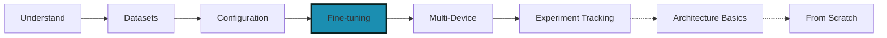

# Fine-tuning Basics

This lesson's title says "fine-tuning." Let's be precise about what that word means before running anything: **fine-tuning is continuing training from weights you already have, instead of starting from random numbers.** Mechanically, that's it — load a checkpoint, keep taking gradient steps, save a new checkpoint.

`train_nanogpt.py` (the trainer this whole track runs — see [Understanding Custom Training](command:tenstorrent.showLesson?["ct1-understanding-training"])) supports that mechanic directly: `--resume <checkpoint>` loads a saved model and keeps training it; `--fresh` throws that away and starts from random initialization. There's no pretrained checkpoint for this particular architecture sitting on the internet waiting to be downloaded, so this lesson builds one first with a short run, then does the thing the title promises: **continues training that checkpoint instead of restarting it.** That continue-from-a-checkpoint command is exactly what you'd run against a real pretrained model, too — same flags, same mechanic, different starting weights.

Every number and every generated sample below is copied verbatim from a real training run against this extension's verified `ttml` build, on a Blackhole<sup>®</sup> p300c. Nothing here is projected or rounded to a nicer-looking curve.

## What You'll Learn

- Building `ttml` (tt-train's Python bindings) and running its verified trainer, `train_nanogpt.py`
- Watching a real cross-entropy loss curve drop, step by step, on Tenstorrent hardware
- The actual mechanic behind "fine-tuning": `--resume` a checkpoint instead of `--fresh`-starting one — and a real gotcha it produces
- Reading generated text honestly: what a ~10.8M-parameter character model can and can't do after a few thousand steps
- The one flag people expect that doesn't exist (`--learning_rate`), and where `lr` actually lives

**Time:** 20-25 minutes | **Prerequisites:** [Configuration Patterns](command:tenstorrent.showLesson?["ct3-configuration-patterns"]) (the YAML this lesson runs), a Shakespeare corpus from [Dataset Fundamentals](command:tenstorrent.showLesson?["ct2-dataset-fundamentals"])

---

## Where This Fits in the Track


```mermaid
graph LR
    A[Understand] --> B[Datasets]
    B --> C[Configuration]
    C --> D[Fine-tuning]
    D --> E[Multi-Device]
    E --> F[Experiment Tracking]
    F -.-> G[Architecture Basics]
    G -.-> H[From Scratch]

    style D fill:#1B8EB1,stroke:#092221,stroke-width:3px
```

---

## Install `ttml`

`ttml` is source-only — there's no pip wheel. If you don't already have a built `~/tt-metal` source tree, do [Build TT-Metalium<sup>™</sup> from Source](command:tenstorrent.showLesson?["build-tt-metal"]) first. This matters especially on a TT-QuietBox<sup>®</sup> 2: those images ship TT-NN<sup>™</sup> and vLLM pre-installed, but **not** the tt-metal source tree — there's nothing to build `ttml` against until that tree exists.

Once you have a tt-metal build, this extension's **Install tt-train** command builds `ttml` for you:

[📦 Install tt-train](command:tenstorrent.installTtTrain)

Behind that button: configuring tt-train as a tt-metal subproject, building the `_ttml` Python bindings, then **rebuilding `ttnn`'s `_ttnn.so`** and wiring `ttml` onto your Python environment with a `.pth` file (there's no `tt-train/pyproject.toml`, so `pip install .` doesn't apply). That rebuild step is the fix for `import ttml` raising `std::bad_cast` — every pre-built tt-metal image, including TT-QuietBox 2's, ships an `_ttnn.so` built before `tt-train` was enabled, and the two binaries disagree about the shape of `ttnn`'s enum registry until you rebuild one against the other. The full recipe, with every gotcha hit during verification, lives in [`content/templates/llm-from-scratch/BUILD_TTML.md`](https://github.com/tenstorrent/tt-vscode-toolkit/blob/main/content/templates/llm-from-scratch/BUILD_TTML.md).

**How long this takes:** with a warm ccache, this build takes about 5 minutes. If this is your first-ever `tt-metal` build — no ccache yet — budget far longer; see [Build TT-Metalium from Source](command:tenstorrent.showLesson?["build-tt-metal"]) before you start the clock.

Verify it worked:

```bash
python -c "import ttnn, ttml; print('ttml + ttnn OK')"
```

---

## The Config This Lesson Runs

[Configuration Patterns](command:tenstorrent.showLesson?["ct3-configuration-patterns"]) already walked the real YAML files `train_nanogpt.py` reads. This lesson runs the one it falls back to when you pass no `--config` at all: `training_shakespeare_nanogpt_char.yaml`, paired with the model config `nanogpt_char.yaml`.

The shapes that matter:

| Setting | Value |
|---|---|
| Architecture | 6 transformer blocks, 384-dim embeddings, 6 attention heads, 256-token context |
| Parameters | 10,819,584 |
| Tokenizer | Character-level — vocabulary auto-detected from the text, then rounded up to a tile-friendly 96 |
| Optimizer | AdamW, `lr: 0.0003`, `weight_decay: 0.01` |
| Batch size | 64 |
| Checkpoint interval | every 500 steps (`model_save_interval: 500`) |
| Device mesh | `[1, 1]` — single chip. p300c and p100 both count as one chip here, exactly like n150 |

Set your environment the way [Train It & Run for Real](command:tenstorrent.showLesson?["lfs-05-train-and-run"]) does — honoring a user-supplied `TT_METAL_ARCH_NAME` instead of overwriting it:

```bash
export TT_METAL_HOME="${TT_METAL_HOME:-$HOME/tt-metal}"
export TT_METAL_RUNTIME_ROOT="$TT_METAL_HOME"
: "${TT_METAL_ARCH_NAME:=wormhole_b0}"   # set to blackhole for p100 / p150 / p300c
export TT_METAL_ARCH_NAME
export TT_LOGGER_LEVEL=FATAL
cd ~/tt-metal/tt-train/sources/examples/nano_gpt
```

You'll also want the Shakespeare corpus from [Dataset Fundamentals](command:tenstorrent.showLesson?["ct2-dataset-fundamentals"]) at `~/tt-scratchpad/training/data/shakespeare.txt`. (`tt-metal` also ships its own copy of the same tiny-shakespeare corpus at `tt-train/data/shakespeare.txt`, which is what the verified run below actually used — either path works, it's the same text.)

---

## Run 1: Build a Checkpoint

There's no pretrained checkpoint for this architecture to fine-tune yet, so the first run makes one — a fresh start, from random weights:

```bash
python train_nanogpt.py \
  --config training_shakespeare_nanogpt_char.yaml \
  --data_path ~/tt-scratchpad/training/data/shakespeare.txt \
  --max_steps 3000 \
  --fresh \
  --model_save_path ~/tt-metal/tt-train/checkpoints/ct4_shakespeare
```

`--fresh` is the flag that matters here: it says "ignore any existing checkpoint, start from random initialization." That's the opposite of fine-tuning — and it's the right choice for this first run, since there's nothing yet to fine-tune.

### The real loss curve

This ran on this extension's Blackhole p300c. Total wall clock: **3 minutes 58 seconds**, including a one-time ~7.5 second kernel-compile on the very first step. Steady state after that: **~74 ms/step, ~220,000 tokens/sec, ~16 TFLOPS, ~10.7% MFU.**

| Step | Loss | Checkpoint written |
|---|---|---|
| 1 | 4.656 | — |
| 500 | 2.297 | `ct4_shakespeare_step_500.pkl` |
| 1000 | 1.867 | `ct4_shakespeare_step_1000.pkl` |
| 1500 | 1.609 | `ct4_shakespeare_step_1500.pkl` |
| 2000 | 1.516 | `ct4_shakespeare_step_2000.pkl` |
| 2500 | 1.445 | `ct4_shakespeare_step_2500.pkl` |
| 3000 (final) | 1.406 | `ct4_shakespeare_final.pkl` |

Loss 4.656 at step 1 is close to `ln(96)` ≈ 4.56 — the entropy of guessing uniformly at random among 96 possible next characters. That's the honest random baseline this model started from. By step 3000 it's cut that error by two-thirds. `model_save_interval: 500` is why a checkpoint lands on disk every 500 steps automatically — you don't have to ask for it.

---

## Watch It Learn: Real Checkpoints, Real Generations

Because checkpoints were saved every 500 steps, you can generate from *several points along the same run* and watch the model change — without running training three separate times. Same prompt, same sampling settings, three different checkpoints:

```bash
python train_nanogpt.py \
  --prompt "ROMEO:" \
  --model_path ~/tt-metal/tt-train/checkpoints/ct4_shakespeare_step_500.pkl \
  --max_new_tokens 400 --temperature 0.8 --top_k 40
```

**Step 500 (loss 2.297) — actual output:**
```
antlastolptatcsamthartosiga mabomantarsaemoowouatheatouomarathanoouarearanawarouranouanoonarorofoururave,
INare I matolo tone.
BENGHA:
Tonot wit ithald weat thay theard.

KINGE:
Whe hame hee the athe weas hing heas atot theste sho wanct,
Tald aner hand, thind mithen igind ourd mand
My a sthitit he ou that ber betheands,
Frend theree wit thas ofurs spet a we an histhers
Ande ind you cat atherter th
```

**Step 1500 (loss 1.609) — actual output** (same command, `_step_1500.pkl`):
```
tspafrttwathofarantttorarorasthatorororitoretoshreamawinytoucanowinayonanunanousoreiseonofasayonouro anouroura meather,
Yor withe, tha wenon wano herde.

SENGERDI:
Tow towall wawind yownthonger mates this tiedern,
Ther till thint and inou ind her thant
Whous therr tomer ithe,

Sor mee, theast thea and I tand yof myore an sever aneander
Mun thant herond therity sthang sothed isthy than bulerd
Wetin
```

**Step 3000 (loss 1.406) — actual output** (same command, `_final.pkl`):
```
ytmtatpatofasttanfabanadrtofriorthouandeithonatino theayorearanunearananonoounanouroorowareanaroratorouree inorenod.
WEBUCHELARI:
I ie mod hadeste, hand ast wame, souce mee,
And tar we lorer ave a ho and heand ayow off fon.

KIUSTHA:
Nat the o the yothast.


SENTENINCE:
I cas sit I t ithat thee pethe deats yof are
Ho at for thit thether se sethofee sthe wine dont ceas
I yo le sou dere yow hen orer
```

### Read this honestly

Do **not** read this as "the model is learning to write Shakespeare." At loss 1.4, on a 10.8M-parameter character model trained for a few minutes, what actually improves is *structure*: ALL-CAPS speaker names followed by a colon, line breaks, dialogue layout, capitalization — the visual shape of a play script. A handful of real function words show up ("the", "and", "for", "we", "off", "are"), but the vocabulary is overwhelmingly invented syllables. This is **not coherent text and not real words** at any of these three checkpoints. If you want to see a model actually produce readable language, that requires a much larger model, much more data, and far more compute than this lesson runs — not a claim this lesson makes.

One more honest note: the first ~130 characters of each sample run together with no spaces. That's not a training bug — `sample_greedy` left-pads the short `"ROMEO:"` prompt with spaces to fill the model's full 256-character context window, and line/word structure only reappears once enough real generated tokens have pushed the padding out of that window.

---

## Run 2: Continue Training — What "Fine-tuning" Actually Does

Now the payoff. Instead of starting over, **continue** training the checkpoint you just built:

```bash
python train_nanogpt.py \
  --config training_shakespeare_nanogpt_char.yaml \
  --data_path ~/tt-scratchpad/training/data/shakespeare.txt \
  --resume ~/tt-metal/tt-train/checkpoints/ct4_shakespeare_final.pkl \
  --max_steps 3500 \
  --model_save_path ~/tt-metal/tt-train/checkpoints/ct4_shakespeare_ft
```

Three flags, and the difference between them is the whole lesson:

- **`--resume <path>`** — load this checkpoint's weights and keep training. Omit the path and drop `--fresh`, and `train_nanogpt.py` auto-detects the latest checkpoint at `--model_save_path` for you.
- **`--fresh`** — the opposite: ignore any checkpoint, start from random weights. This is what Run 1 used.
- **`--model_path <path>`** — only for inference (`--prompt` + `--model_path`, no training). This is the flag Run 1's generation samples used above.

`--max_steps` is an **absolute** target, not "how many more steps" — `--max_steps 3500` after resuming from step 3000 trains 500 additional steps (`3500 - 3000`), not 3500 more.

### The real resumed loss curve — and a genuine gotcha

Resuming worked cleanly: `train_nanogpt.py` printed `Resumed from step 3000`, reloaded all 10,819,584 parameters, and picked the run back up. But watch the loss right after resuming:

| Step | Loss |
|---|---|
| 3000 (pre-resume) | 1.406 |
| 3001 | 2.281 |
| 3002 | 3.016 |
| 3010 | 2.563 |
| 3050 | 2.313 |
| 3100 | 2.203 |
| 3200 | 2.172 |
| 3300 | 2.063 |
| 3400 | 1.977 |
| 3500 (final) | 1.914 |

It **jumped**, from 1.406 to over 3.0, before easing back down toward 1.9 across the next 500 steps — and it hadn't caught back up to the pre-resume 1.406 by the time this run stopped. (500 steps, 38.08 seconds total — the same ~76 ms/step steady state as Run 1, so hardware performance didn't change; only the loss trajectory did.)

**This is a real fine-tuning gotcha, not a bug in this lesson's commands.** `--resume` reloads the *model's* weights from the checkpoint, but not AdamW's momentum and variance state — that gets recreated fresh. For 3000 steps, AdamW had built up momentum tuned to the exact loss landscape around this converged model; resuming hands the same learning rate (`0.0003`, unchanged) to a cold optimizer standing on ground that already-converged weights are sensitive to, and the first few steps overshoot before things resettle. This is exactly why real fine-tuning workflows often use a **lower learning rate** or a brief **warmup** when continuing from a checkpoint — the loss spike above is the concrete reason that practice exists, not just a rule of thumb.

If you see a loss spike right after your own `--resume` run, don't panic and don't assume the checkpoint is corrupt — check whether it's recovering over the following few hundred steps, the way it is here.

### There is still no `--learning_rate` flag

If you want to try mitigating the spike above with a lower learning rate, you can't do it on the command line — as [Configuration Patterns](command:tenstorrent.showLesson?["ct3-configuration-patterns"]) already established, `train_nanogpt.py` has no `--learning_rate` override. `lr` lives in the training config YAML's `optimizer:` block. To resume with a different learning rate, copy `training_shakespeare_nanogpt_char.yaml`, edit `optimizer.lr`, and point `--config` at your copy.

---

## What This Lesson Didn't Do (On Purpose)

This lesson resumed the **same** checkpoint on the **same** Shakespeare corpus — that's "continued pretraining," a clean way to see the resume mechanic without a second dataset in the way. Real fine-tuning usually swaps in a *different*, smaller, task-specific dataset at the `--resume` step — same three flags, same mechanic, just a different `--data_path`. Once you're comfortable with the loss curve above, that swap is the only thing that changes.

If you want the deeper story — a transformer built and trained entirely from random initialization, with the architecture-capacity questions that come with it — that's [Training from Scratch](command:tenstorrent.showLesson?["ct8-training-from-scratch"]). And if you want to build the trainer itself, gradient by gradient, instead of calling into `ttml`, that's [Train It & Run for Real](command:tenstorrent.showLesson?["lfs-05-train-and-run"]) in the Build an LLM from Scratch track.

---

## Troubleshooting

### `ImportError: No module named 'ttml'` or `std::bad_cast` on `import ttml`

Covered above under **Install `ttml`** — the fix is rebuilding `_ttnn.so` after enabling tt-train, not a partial `--target _ttml` build. See `BUILD_TTML.md` for the full recipe.

### Loss spikes right after `--resume`

Expected, for the reason explained above — AdamW's optimizer state isn't restored, only model weights are. Give it a few hundred steps to resettle, or resume with a lower `optimizer.lr` in your config.

### `RuntimeError: Device out of memory`

Reduce `--batch_size` (default here is 64, set in the YAML — override it on the command line, e.g. `--batch_size 32`).

### No checkpoint file after training

Make sure the checkpoint directory exists first — `train_nanogpt.py` doesn't create parent directories for `--model_save_path`:

```bash
mkdir -p ~/tt-metal/tt-train/checkpoints
```

### `train_nanogpt.py --learning_rate ...` fails with "unrecognized arguments"

That flag doesn't exist — see **There is still no `--learning_rate` flag** above.

---

## Key Takeaways

- **Fine-tuning = continuing training from existing weights.** `--resume` does that; `--fresh` does the opposite.
- Real numbers from this p300c: loss `4.656 → 1.406` over 3000 steps, ~74 ms/step, ~3 min 58 s total.
- Resuming a checkpoint can cause a real, temporary loss spike — AdamW's optimizer state isn't saved, only the model's weights are. This is a genuine fine-tuning gotcha, verified here, not folklore.
- At loss ~1.4 on a 10.8M-parameter character model, you get Shakespeare-shaped **structure** — speaker names, colons, line breaks — not coherent text and not real vocabulary. Don't oversell what a short run at this scale actually produces.
- There is no `--learning_rate` flag. `lr` lives in the training config's `optimizer:` block.
- `model_save_interval` in the YAML plus `--model_save_path` on the command line means you get multiple checkpoints from a single run for free — useful for watching a model change without re-running training.

---

## What's Next

Now that a single-chip run and the resume mechanic are both concrete, [Multi-Device Training](command:tenstorrent.showLesson?["ct5-multi-device-training"]) scales the same `train_nanogpt.py` entry point across chips with Data Parallel. Or, if you'd rather stop guessing at loss numbers scrolling past in a terminal, [Experiment Tracking](command:tenstorrent.showLesson?["ct6-experiment-tracking"]) captures runs like the two above to a file (or Weights & Biases) so you can compare them properly.

---

## Additional Resources

- [`train_nanogpt.py`](https://github.com/tenstorrent/tt-metal/blob/main/tt-train/sources/examples/nano_gpt/train_nanogpt.py) — the trainer this lesson runs, in the `tt-metal` GitHub repository
- [tt-train source](https://github.com/tenstorrent/tt-metal/tree/main/tt-train) — the framework behind `ttml`
- [NanoGPT (Karpathy)](https://github.com/karpathy/nanoGPT) — the original architecture this example follows
