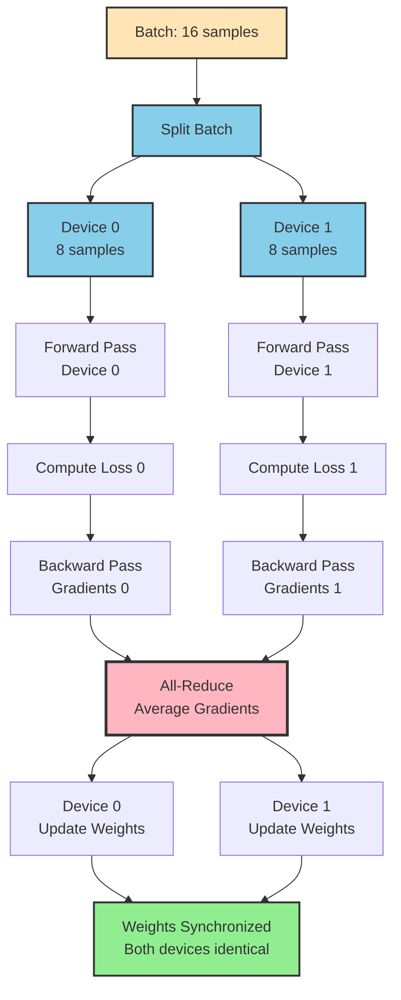
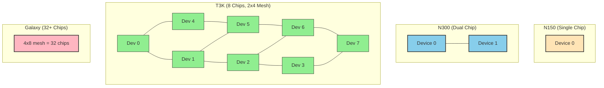

# Multi-Device Training

Scale your training to multiple Tenstorrent chips using Data Parallel (DDP) patterns. Learn to train faster while maintaining results quality.

## What You'll Learn

- Data Parallel (DDP) training fundamentals
- Scaling from N150 to N300, T3K, and beyond
- Device mesh configuration
- Performance optimization
- Multi-device debugging

**Time:** 15 minutes | **Prerequisites:** CT-4 (Fine-tuning Basics)

---

## Why Multi-Device Training?

### Single Device (N150) Limitations

- ✅ Simple, easy to debug
- ⚠️ Slower training (1-3 hours for trickster)
- ⚠️ Smaller batch sizes (memory-limited)

### Multi-Device (N300+) Benefits

- ✅ ~2x faster on N300 (30-60 minutes for trickster)
- ✅ ~8x faster on T3K (8 chips)
- ✅ Larger effective batch sizes
- ✅ Better hardware utilization
- ⚠️ Slightly more complex setup

**Key insight:** With proper configuration, multi-device training produces identical results to single-device, just faster.

---

## Data Parallel (DDP) Explained

### How DDP Works

Data Parallel training splits your batch across multiple devices, processes in parallel, then synchronizes. Here's the visual flow:



**Single vs Multi-Device comparison:**

| Step | Single Device (N150) | Multi-Device DDP (N300) |
|------|---------------------|------------------------|
| **Input** | Batch of 8 | Batch of 16 (split 8+8) |
| **Forward** | Device 0 processes all | Both devices in parallel |
| **Backward** | Calculate gradients | Calculate gradients in parallel |
| **Sync** | No sync needed | **All-reduce averages gradients** |
| **Update** | Update weights | Both devices update identically |
| **Time** | 1.0x | ~0.5x (2x faster) |

**Key insight:** The all-reduce synchronization is the "magic" that keeps devices in sync while processing different data.

**Key points:**
- Each device processes a portion of the batch
- Gradients are averaged across devices (all-reduce operation)
- All devices stay in sync (identical weights after update)
- Training is parallelized (faster throughput)
- Results match single-device training (if configured correctly)

### When to Use DDP

**Use DDP when:**
- ✅ You have N300 (2 chips) or T3K (8 chips)
- ✅ You want faster iteration
- ✅ Your model fits on one device (we're not doing model parallelism)

**Skip DDP when:**
- ⚠️ You only have N150 (single chip)
- ⚠️ Debugging training issues (simpler to debug on 1 device)
- ⚠️ Very small datasets (overhead not worth it)

---

## Configuration Changes for DDP

### N150 (Single Device) - Baseline

```yaml
training_config:
  batch_size: 8
  gradient_accumulation_steps: 4
  # Effective batch: 8 × 4 = 32

device_config:
  enable_ddp: False
  mesh_shape: [1, 1]               # 1 device
```

### N300 (Dual Chips) - DDP Enabled

```yaml
training_config:
  batch_size: 16                   # 2x larger (split across devices)
  gradient_accumulation_steps: 2   # Reduced (same effective batch)
  # Effective batch: 16 × 2 = 32 (same as N150!)

device_config:
  enable_ddp: True                 # Enable DDP
  mesh_shape: [1, 2]               # 1 row × 2 columns = 2 devices
```

**What changed:**
- `batch_size` doubled (16 instead of 8)
- `gradient_accumulation_steps` halved (2 instead of 4)
- `enable_ddp: True`
- `mesh_shape: [1, 2]` (two devices)

**Key principle:** Keep `batch_size × gradient_accumulation_steps` constant for fair comparison.

---

## Training on N300 with DDP

### Step 1: Verify Hardware

Check that both chips are detected:

```bash
tt-smi
```

**Expected output:**
```
Device 0: Wormhole (N300)
Device 1: Wormhole (N300)
```

### Step 2: Launch Training

[🚀 Start Fine-tuning (N300)](command:tenstorrent.startFineTuningN300Trickster)

**What this does:**
1. Uses `configs/trickster_n300.yaml` (DDP config)
2. Initializes both devices
3. Launches training with DDP enabled

### Step 3: Monitor DDP Training

**Initial setup:**
```
🎭 Trickster Fine-tuning
============================================================

Loading config: configs/trickster_n300.yaml
Initializing 2 devices...                    # ← DDP initialization
Device mesh: [1, 2]                          # ← 2 devices configured
Creating model...
Loading weights from ~/models/tinyllama_safetensors
Loaded 50 examples from trickster_dataset_starter.jsonl

Training configuration:
  Devices: 2                                 # ← DDP active
  Batch size: 16 (per-device: 8)             # ← Split across devices
  Gradient accumulation: 2
  Effective batch size: 32
```

**Training progress:**
```
Training:  20%|████▌                   | 100/500 [00:08<00:32, 3.1 it/s, loss=2.12]
```

**Notice:** `3.1 it/s` (iterations per second) should be ~2x higher than N150.

---

## Performance Comparison

### Expected Speedup

| Hardware | Devices | Batch Size | Training Time | Speedup |
|----------|---------|------------|---------------|---------|
| N150     | 1       | 8          | 1.5-3 hours   | 1x (baseline) |
| N300     | 2       | 16         | 45-90 min     | ~2x |
| T3K      | 8       | 64         | 15-30 min     | ~6-8x |

**Why not perfect linear scaling?**
- Communication overhead (gradient synchronization)
- Batch size scaling (larger batches → fewer steps → less benefit)
- Hardware utilization (not all operations parallelize perfectly)

**Real-world:** Expect 1.8-2.0x speedup on N300, 6-7x on T3K.

---

## Advanced: T3K and Galaxy

### T3K Configuration (8 Devices)

```yaml
training_config:
  batch_size: 64                   # 8x larger
  gradient_accumulation_steps: 1   # No accumulation needed
  # Effective batch: 64 × 1 = 64

device_config:
  enable_ddp: True
  mesh_shape: [2, 4]               # 2 rows × 4 columns = 8 devices
```

**Device Mesh Visualization:**



**Mesh shape explained:**
- **[1, 1]** = 1 row × 1 column = 1 device (N150)
- **[1, 2]** = 1 row × 2 columns = 2 devices (N300)
- **[2, 4]** = 2 rows × 4 columns = 8 devices (T3K)
- **[4, 8]** = 4 rows × 8 columns = 32 devices (Galaxy)

**Trade-offs:**
- ✅ Much faster training (~6-8x speedup)
- ⚠️ Larger effective batch (may need LR adjustment)
- ⚠️ More communication overhead

**LR scaling rule:** If you scale batch size by N, consider scaling LR by √N.

Example: Batch 32 → 64 (2x), try LR 1e-4 → 1.4e-4 (√2 ≈ 1.4x)

### Galaxy Configuration (32+ Devices)

```yaml
device_config:
  enable_ddp: True
  mesh_shape: [4, 8]               # 32 devices (4 rows × 8 columns)
```

**Use cases:**
- Large-scale training (billions of parameters)
- Research experiments (fast iteration)
- Production training pipelines

**Note:** Galaxy-scale training requires careful hyperparameter tuning and is beyond the scope of this intro lesson.

---

## Troubleshooting Multi-Device Issues

### Issue 1: DDP Initialization Fails

**Symptoms:**
```
RuntimeError: Failed to initialize DDP
Device 1 not found
```

**Fixes:**
1. Check `tt-smi` - are all devices detected?
2. Restart devices: `tt-smi -r all`
3. Check mesh_shape matches available devices
4. Verify no other processes using devices

### Issue 2: Gradients Not Synchronizing

**Symptoms:**
- Devices show different loss values
- Training diverges
- Inconsistent results

**Fixes:**
1. Verify `enable_ddp: True` in config
2. Check gradient synchronization logs
3. Ensure all devices running same code version
4. Profile with `ttnn.profiler`

### Issue 3: Performance Not Scaling

**Symptoms:**
- N300 training is only 1.2x faster (not 2x)
- Low device utilization

**Possible causes:**
- Batch size too small (increase if memory allows)
- Communication bottleneck (check network)
- Unbalanced workload (check per-device metrics)

**Fixes:**
1. Increase batch size to utilize devices fully
2. Profile communication overhead
3. Check device memory utilization
4. Adjust gradient accumulation

### Issue 4: OOM with Larger Batch

**Symptoms:**
```
RuntimeError: Device out of memory
```

**Fixes:**
1. Reduce batch_size (try 12 instead of 16)
2. Increase gradient_accumulation_steps
3. Check that batch is properly split across devices
4. Verify device memory with `tt-smi -m`

---

## DDP Best Practices

### 1. Keep Effective Batch Constant

When scaling devices, adjust batch_size and gradient_accumulation_steps to maintain:

```
effective_batch = batch_size × gradient_accumulation_steps × num_devices
```

**Example:**
```
N150: 8 × 4 × 1 = 32
N300: 16 × 2 × 2 = 64  # Oops, doubled effective batch!

Better N300: 8 × 2 × 2 = 32  # Same effective batch
```

### 2. Validate Results Match

After DDP training, verify that:
- ✅ Final loss similar to single-device
- ✅ Model quality similar (test on same examples)
- ✅ Training curves look similar (scaled by speedup)

**If results differ significantly:**
- Check learning rate (may need adjustment)
- Verify gradient synchronization working
- Compare checkpoints at same effective step

### 3. Monitor Per-Device Metrics

Use logging to track:
- Per-device loss
- Memory usage per device
- Communication time vs compute time

**Tools:**
- `tt-smi` - Real-time device monitoring
- `ttnn.profiler` - Performance profiling
- WandB (CT-6) - Multi-run comparison

### 4. Start Small, Scale Up

**Recommended progression:**
1. Debug on N150 (single device)
2. Validate on N300 (2 devices)
3. Scale to T3K (8 devices) when ready
4. Consider Galaxy for production

**Why:** Easier to debug on fewer devices, then scale with confidence.

---

## Gradient Synchronization Deep Dive

### What Gets Synchronized?

**After each backward pass:**
1. Each device computes local gradients
2. All-reduce operation averages gradients across devices
3. Each device gets the averaged gradient
4. Optimizer updates weights using averaged gradient

### Communication Patterns

**Ring All-Reduce (efficient for large models):**
```
Device 0 ←→ Device 1 ←→ ... ←→ Device N
```

**Why it matters:**
- Large models → more gradients → more communication
- Communication time should be < compute time
- Network bandwidth matters for multi-node setups

### Profiling Communication

```python
# In training script (advanced)
import ttnn

with ttnn.profile() as prof:
    # Training step
    loss.backward()
    optim.step()

# Analyze communication vs compute time
print(prof.summary())
```

**Ideal ratio:** Communication < 10% of total time.

---

## Scaling Your Ambitions: From Prototype to Production

You've learned the mechanics of multi-device training. But what does scaling really enable? Let's explore how multi-device training transforms what you can build.

### The Scaling Journey

**Week 1: Prototype on N150**
- Build your model concept
- Validate with 50-200 training examples
- Training time: 1-3 hours per experiment
- **Goal:** Prove the concept works

**Week 2: Iterate on N300**
- 2x faster iteration (30-90 min per experiment)
- Run 3-5 experiments per day instead of 1-2
- Test multiple hyperparameter configurations
- **Goal:** Find optimal configuration

**Month 2: Scale on T3K**
- 6-8x faster training (10-20 min per experiment)
- Train on larger datasets (1000+ examples)
- Multi-task learning (multiple skills in one model)
- **Goal:** Production-ready models

**Production: Deploy with confidence**
- Models validated on multiple hardware configurations
- Proven performance characteristics
- Scalable training pipeline
- **Goal:** Serve real users

### Real-World Scaling Success Stories

🚀 **"Code Review Bot" (Startup → Enterprise)**
- **N150 phase:** Trained on 100 team PRs, 2-hour iterations
- **N300 phase:** Expanded to 500 PRs, tested 10 prompt variations in a day
- **T3K phase:** Full company history (5000+ PRs), multi-task (style + security + performance)
- **Impact:** From team tool (10 devs) → company standard (200+ devs)
- **Training time:** 3 hours → 90 min → 15 min per full model

💼 **"Legal Document Generator" (Consulting → SaaS)**
- **N150 phase:** 50 contract templates, proved concept
- **N300 phase:** 200 templates across 3 practice areas, found winning config
- **T3K phase:** 1000+ examples, 10 specialized models (corporate, IP, employment, etc.)
- **Impact:** Consultancy internal tool → multi-tenant SaaS product
- **Revenue:** $0 → $50k MRR from faster iteration

🎮 **"Game NPC Dialogue" (Indie → AAA)**
- **N150 phase:** Single character archetype (100 dialogue lines)
- **N300 phase:** 5 character types, varied personalities
- **T3K phase:** 50+ unique NPCs, context-aware responses
- **Impact:** Hand-written dialogues → AI-augmented content at scale
- **Cost savings:** $100k+ in writing/voice acting budget

🏥 **"Medical Report Assistant" (Research → Clinical)**
- **N150 phase:** Single specialty (dermatology), 100 report examples
- **N300 phase:** 3 specialties, validation by clinicians
- **T3K phase:** 10+ specialties, multi-lingual support
- **Impact:** Research project → deployed in 20+ hospitals
- **Time saved:** 30 min/report → 5 min/report (doctors can see more patients)

### What Multi-Device Training Really Gives You

**It's not just about speed. It's about:**

✨ **Experimentation velocity**
- N150: Try 1-2 ideas per day
- N300: Try 5-10 ideas per day
- T3K: Try 20-30 ideas per day
- **Result:** Find winning approaches 10x faster

🎯 **Dataset scale**
- N150: Validate with 50-200 examples
- N300: Train on 500-1000 examples
- T3K: Handle 10,000+ examples
- **Result:** Better models from more data

🚀 **Model complexity**
- N150: Single-task models
- N300: Multi-task learning
- T3K: Ensemble of specialists
- **Result:** More capable, versatile models

💰 **Economic viability**
- Prototype on N150: Low upfront cost
- Prove value before scaling: Validate before investing
- Scale to T3K when revenue justifies: Grow hardware with business
- **Result:** Sustainable business model

### Your Multi-Device Roadmap

**Month 1 (N150 - Learning):**
- Master single-device training
- Build intuition for hyperparameters
- Create baseline model
- **Investment:** N150 hardware, your time

**Month 2 (N300 - Optimizing):**
- 2x faster iteration unlocks experimentation
- Test architectural variations
- Expand dataset strategically
- **Investment:** N300 hardware (~2x N150 cost)

**Month 3+ (T3K - Scaling):**
- Production-quality models in hours
- Multiple models for different use cases
- Continuous improvement pipeline
- **Investment:** T3K hardware, justified by production value

**Production (Right-sized hardware):**
- Training pipeline optimized for your scale
- Deploy on hardware that matches your needs
- Continuous retraining as data grows
- **ROI:** Revenue/savings >> hardware costs

### The Power Law of Training Scale

**Here's what most developers don't realize:**

- **1x hardware (N150)** = Good for learning and prototypes
- **2x hardware (N300)** = 4x more experiments (because iteration is faster, you try more)
- **8x hardware (T3K)** = 30x more experiments (speed enables entirely different workflows)

**Why the multiplier effect?**
- Faster training → More courage to experiment
- More experiments → Better intuition
- Better intuition → Smarter choices
- Smarter choices → Faster progress

**It's not linear. It's exponential.**

### From Learning to Leading

**You now understand:**
- ✅ How DDP works (gradient synchronization, device meshes)
- ✅ How to configure for different hardware (N150 → N300 → T3K → Galaxy)
- ✅ How to debug multi-device issues (synchronization, performance, memory)
- ✅ How scaling enables exponentially more experimentation

**The question isn't "Should I scale to multi-device?"**

**The question is "How fast do I want to iterate and learn?"**

- **N150:** Learn fundamentals, prove concepts (essential first step)
- **N300:** Iterate 2x faster, find winning approaches (when you're serious)
- **T3K:** Move at production speed, build real products (when you're committed)
- **Galaxy:** Research-scale innovation, push boundaries (when you're leading)

**Start where you are. Scale when you're ready. The path is clear.**

---

## Key Takeaways

✅ **DDP scales training to multiple devices efficiently**

✅ **N300 provides ~2x speedup over N150**

✅ **Keep effective batch size constant for fair comparison**

✅ **Gradient synchronization ensures all devices stay in sync**

✅ **Start with single device, scale up after validation**

✅ **Monitor per-device metrics to catch issues early**

---

## Next Steps

**Lesson CT-6: Experiment Tracking**

You've learned to train on single and multiple devices. Next, learn to track and compare experiments:

1. WandB integration for experiment tracking
2. Compare hyperparameter variations
3. Visualize training curves
4. Share results with team

**Estimated time:** 10-15 minutes
**Prerequisites:** CT-4, CT-5

**Or skip to:**

**Lesson CT-7: Model Architecture Basics**

Understand transformer components before training from scratch.

---

## Additional Resources

### Documentation
- [DDP in PyTorch](https://pytorch.org/tutorials/intermediate/ddp_tutorial.html) - Conceptual foundation
- [tt-train DDP](https://github.com/tenstorrent/tt-metal/tree/main/tt-train) - TT implementation
- [Efficient DDP](https://arxiv.org/abs/2006.15704) - Research paper

### Configuration Examples
- **N300:** `content/templates/training/configs/trickster_n300.yaml`
- **Multi-device guide:** `content/templates/training/multi_device_guide.md` (coming soon)

### Profiling Tools
- `tt-smi` - Device monitoring
- `ttnn.profiler` - Performance analysis

---

**Ready to track your experiments?** Continue to **Lesson CT-6: Experiment Tracking** →
