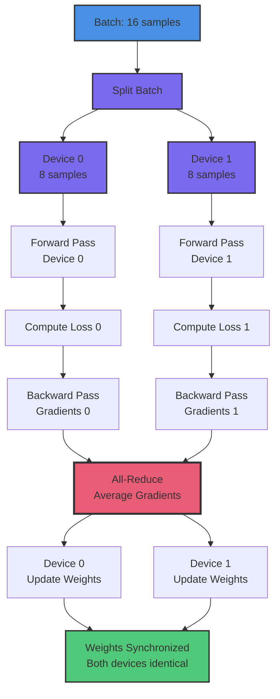

# Multi-Device Training

Scale `tt-train` across multiple Tenstorrent chips with Data Parallel (DDP) — split a batch across devices, average gradients, keep every device's weights identical.

## Verified: Multi-Chip DDP Works on a TT-QuietBox 2

We **tested this on a TT-QuietBox<sup>®</sup> 2** (2× p300c dual-ASIC boards = 4 Blackhole<sup>®</sup> chips, tt-metal v0.73), and the result is good news: **multi-chip `tt-train` DDP works, at 2 chips and at 4, with near-linear scaling.** The box's physical topology is a **2×2 ring mesh** — `ClusterType::P300_X2` — not four independent chips: board A holds chips 0/1, board B holds chips 2/3, and the cross-board Ethernet links close the ring `0↔1↔2↔3↔0`. Every earlier statement in this lesson describing a QB2 as "four independent p300c" was wrong for this framing — it's one mesh.

**Measured scaling** (nanogpt, char tokenizer, seq len 256, per-device batch 64, steady-state over steps 10–50, tt-metal v0.73.0-dev on a P300_X2 QB2):

| Chips | Mesh | ms/step | tokens/s | Scaling | Efficiency |
|---|---|---|---|---|---|
| 1 | `[1,1]` | 74.4 | 220,283 | 1.00× | 100% |
| 2 | `[1,2]` | 76.3 | 429,479 | 1.95× | 97% |
| 4 | `[1,4]` | 74.8 | 876,341 | 3.98× | 99.5% |

Peak TFLOPS scaled almost exactly N×: 148.5 → 297 → 594. Loss decreased at every chip count (e.g. the 4-chip run: 4.65 → 3.03 over 50 steps) — DDP is producing real, correct training, not just running without crashing.

**The catch, and the fix:** out of the box, a 2-chip run on this hardware died at `Fabric Router Sync: Timeout` during mesh open, and this **survived both `tt-smi -r` and a full host reboot** — it looked like a genuine hardware or firmware fault. It wasn't. `ttml` only ships a *default* mesh graph descriptor (MGD) for 8-device (T3000) and 32-device (Galaxy) topologies; for 2- or 4-device Blackhole it silently falls back to a descriptor-less fabric config that mis-initializes the routers. Pointing `TT_MESH_GRAPH_DESC_PATH` at the right descriptor — no source changes, no firmware flash — fixed both the 2-chip and 4-chip case. The full recipe is in [Making the Mesh Initialize on a QB2](#making-the-mesh-initialize-on-a-qb2-the-mgd-fix) below.

A firmware-bundle mismatch (19.11.0 installed vs. 19.5.0 last fully tested for Blackhole) showed up as a warning during this testing and was a suspect for a while — it turned out to be a red herring; the MGD was the actual root cause.

So what follows is **both**: the documented `tt-train` pattern for n300, T3000 (also called LoudBox), and Galaxy — read from `tt-metal/tt-train/configs/README.md` and the actual YAML configs shipped in `tt-metal/tt-train/configs/training_configs/` — **and** the QB2-specific MGD fix and measured scaling above, verified end to end on Blackhole p300c hardware. If you hit something different on your own n300+ or QB2 hardware, the community would benefit from your results — file them against this lesson.

## What You'll Learn

- Data Parallel (DDP) training fundamentals
- The real `mesh_shape` values for n300, T3000/LoudBox, and Galaxy
- Coordinated multi-device init/teardown (`CreateDevices`/`CloseDevices`) — and why per-chip loops break
- Performance and scaling considerations for DDP

**Time:** 15 minutes | **Prerequisites:** [Fine-tuning Basics](command:tenstorrent.showLesson?["ct4-finetuning-basics"])

---

## Where This Fits in the Track


```mermaid
graph LR
    A[Understand] --> B[Datasets]
    B --> C[Configuration]
    C --> D[Fine-tuning]
    D --> E[Multi-Device]
    E --> F[Experiment Tracking]
    F -.-> G[Architecture Basics]
    G -.-> H[From Scratch]

    style E fill:#1B8EB1,stroke:#092221,stroke-width:3px
```

---

## Why Multi-Device Training?

### Single Device (n150, p150, p300c) — No DDP Here

A single chip is one node in a mesh of size 1. There's nothing to split a batch across and nothing to synchronize gradients with. `enable_ddp: true` on a single-chip mesh has no effect — [Configuration Patterns](command:tenstorrent.showLesson?["ct3-configuration-patterns"]) covers this exact misconfiguration.

- ✅ Simple, easy to debug — the workflow [Fine-tuning Basics](command:tenstorrent.showLesson?["ct4-finetuning-basics"]) walks through
- ⚠️ One device's worth of throughput — that's it

### Multi-Device (n300, T3000/LoudBox, Galaxy, QB2/p300c) — Where DDP Applies

- ✅ Batch splits across chips; gradients average via all-reduce
- ✅ More devices → more throughput, up to communication overhead
- ✅ Larger effective batch sizes without exhausting one chip's DRAM
- ✅ Verified on a TT-QuietBox 2 (2×2 ring mesh of Blackhole p300c, tt-metal v0.73): near-linear scaling to 4 chips, once the mesh graph descriptor is supplied — see [Verified: Multi-Chip DDP Works on a TT-QuietBox 2](#verified-multi-chip-ddp-works-on-a-tt-quietbox-2) above

**Key insight:** correctly configured DDP produces the same results as single-device training, just faster. It doesn't change what the model learns — only how many chips do the work.

---

## Data Parallel (DDP) Explained

### How DDP Works

Data Parallel training splits your batch across multiple devices, processes in parallel, then synchronizes. Here's the visual flow:


```mermaid
graph TD
    A[Batch: 16 samples] --> B[Split Batch]

    B --> C[Device 0<br/>8 samples]
    B --> D[Device 1<br/>8 samples]

    C --> E[Forward Pass<br/>Device 0]
    D --> F[Forward Pass<br/>Device 1]

    E --> G[Compute Loss 0]
    F --> H[Compute Loss 1]

    G --> I[Backward Pass<br/>Gradients 0]
    H --> J[Backward Pass<br/>Gradients 1]

    I --> K[All-Reduce<br/>Average Gradients]
    J --> K

    K --> L[Device 0<br/>Update Weights]
    K --> M[Device 1<br/>Update Weights]

    L --> N[Weights Synchronized<br/>Both devices identical]
    M --> N

    style A fill:#4A90E2,stroke:#333,stroke-width:2px
    style B fill:#7B68EE,stroke:#333,stroke-width:2px
    style C fill:#7B68EE,stroke:#333,stroke-width:2px
    style D fill:#7B68EE,stroke:#333,stroke-width:2px
    style K fill:#E85D75,stroke:#333,stroke-width:3px
    style N fill:#50C878,stroke:#333,stroke-width:2px
```

**Single vs Multi-Device comparison:**

| Step | Single Device (n150) | Multi-Device DDP (n300) |
|------|---------------------|------------------------|
| **Input** | Batch of 8 | Batch of 16 (split 8+8) |
| **Forward** | Device 0 processes all | Both devices in parallel |
| **Backward** | Calculate gradients | Calculate gradients in parallel |
| **Sync** | No sync needed | **All-reduce averages gradients** |
| **Update** | Update weights | Both devices update identically |
| **Time** | 1.0x | ~0.5x (2x faster, ideal case) |

**Key insight:** The all-reduce synchronization is the "magic" that keeps devices in sync while processing different data. Real speedup is always somewhat less than ideal — see [Performance and Scaling Considerations](#performance-and-scaling-considerations) below.

**Key points:**
- Each device processes a portion of the batch
- Gradients are averaged across devices (all-reduce operation)
- All devices stay in sync (identical weights after update)
- Training is parallelized (faster throughput)
- Results match single-device training (if configured correctly)

### When to Use DDP

**Use DDP when:**
- ✅ You have n300, T3000/LoudBox, Galaxy, or a QB2 (2 or 4 Blackhole chips) — real multi-chip interconnect
- ✅ You want faster iteration
- ✅ Your model fits on one device (this is data parallelism, not model/tensor parallelism — see the tensor-parallel note further down)

**Skip DDP when:**
- ⚠️ You have a single chip — n150, p150, or a single p300c not paired into a QB2. There's nothing to split a batch across.
- ⚠️ Debugging training issues (simpler to debug on 1 device)
- ⚠️ Very small datasets (overhead not worth it)
- ⚠️ You're on a QB2 and haven't set `TT_MESH_GRAPH_DESC_PATH` yet — see the MGD fix below; without it, multi-chip mesh open fails at fabric-router sync

---

## Real `mesh_shape` Values

`device_config` — the same block [Configuration Patterns](command:tenstorrent.showLesson?["ct3-configuration-patterns"]) introduced for single-chip runs — has two fields that matter for DDP: `enable_ddp` and `mesh_shape`. Per `tt-train/configs/README.md`, the real device mesh shapes are:

| Hardware | `mesh_shape` |
|---|---|
| Single-device (n150, p150, single p300c) | `[1, 1]` |
| Dual-device (n300, p300, or 2 chips of a QB2) | `[1, 2]` |
| LoudBox (T3000, 8 chips) | `[1, 8]` |
| Full TT-QuietBox 2 (2× p300c boards, 4 Blackhole chips) | `[1, 4]` |
| Single Galaxy (32 chips) | `[1, 32]` |

These are the whole-mesh shapes for the hardware itself — not a choice you make freely. `mesh_shape` for an n300 is `[1, 2]` because an n300 physically has two chips; it isn't `[2, 4]` or anything else. Earlier drafts of this lesson had that table wrong (`[2, 4]` for T3000, `[4, 8]` for Galaxy) — those numbers don't correspond to any real hardware configuration and are corrected here. On a QB2, `mesh_shape: [1, 4]` is the plain-DDP shape across all 4 chips — see the MGD fix below for why this needs a custom mesh graph descriptor to actually open.

### Single-Chip Baseline

```yaml
device_config:
  enable_ddp: false
  mesh_shape: [1, 1]
```

As [Configuration Patterns](command:tenstorrent.showLesson?["ct3-configuration-patterns"]) notes, this is also `tt-train`'s default when `device_config` is omitted entirely.

### n300 — DDP Enabled (real shipped config)

This is quoted verbatim from `tt-metal/tt-train/configs/training_configs/training_shakespeare_nanogpt_ddp_n300.yaml`:

```yaml
training_config:
  project_name: "tt_train_nano_gpt"
  seed: 5489
  model_save_interval: 500
  batch_size: 256
  num_epochs: 1
  max_steps: 5000
  use_clip_grad_norm: false
  clip_grad_norm_max_norm: 1.0
  model_config: "${TT_METAL_RUNTIME_ROOT}/tt-train/configs/model_configs/nanogpt.yaml"
  optimizer:
    type: AdamW
    lr: 0.0003
    beta1: 0.9
    beta2: 0.999
    epsilon: 1.0e-8
    weight_decay: 0.01
    amsgrad: false
    stochastic_rounding: false

device_config:
  enable_ddp: true
  mesh_shape: [1,2]

eval_config:
  repetition_penalty: 1.0
  temperature: 0.7
  top_k: 50
  top_p: 1.0
```

**What changed from the single-chip config:** `enable_ddp: true`, `mesh_shape: [1, 2]` — that's it. `batch_size: 256` here is the *total* batch across both devices (128 per chip); `tt-train` requires `batch_size` to be divisible by the number of DDP devices, per the README's constraints section.

**Key principle:** when you compare timings across hardware, keep `batch_size × gradient_accumulation_steps` (the effective batch) constant, or you're not measuring the same experiment.

---

## Training on n300 with DDP

### Step 1: Verify Hardware

Check that both chips are detected:

```bash
tt-smi
```

**Expected output:**
```
Device 0: Wormhole<sup>™</sup> (n300)
Device 1: Wormhole (n300)
```

### Step 2: Launch Training

Same entry point [Fine-tuning Basics](command:tenstorrent.showLesson?["ct4-finetuning-basics"]) uses on a single chip — `train_nanogpt.py` — just pointed at the DDP config:

```bash
python tt-metal/tt-train/sources/examples/nano_gpt/train_nanogpt.py \
  --config tt-metal/tt-train/configs/training_configs/training_shakespeare_nanogpt_ddp_n300.yaml
```

**What this does:**
1. Loads the config above, including its `device_config`
2. Opens both devices in the mesh as a coordinated unit (see the next section — never a per-chip loop)
3. Launches training with DDP enabled across both devices; each step splits the batch, computes gradients in parallel, and all-reduces them before the optimizer step

### Step 3: What to Expect

This is the shape of output you should see — **illustrative, not a captured log from a verified run**:

```
Loading config: training_shakespeare_nanogpt_ddp_n300.yaml
Device mesh: [1, 2]                          # ← 2 devices, matches mesh_shape
Creating model...
Loading data...

Training configuration:
  Devices: 2                                 # ← DDP active
  Batch size: 256 (per-device: 128)          # ← split across devices
  Effective batch size: 256
```

```
Training:  20%|████▌                   | 1000/5000 [00:08<00:32, 3.1 it/s, loss=2.12]
```

`it/s` should be higher than the equivalent single-chip run — by how much depends on communication overhead; see the next section.

---

## Coordinated Device Management: `CreateDevices`/`CloseDevices`

If you're writing custom multi-device TTNN code (rather than letting `tt-train`'s `device_config` handle it), how you open and close devices matters. `tt-train` itself never opens chips one at a time: internally, its `MeshDevice` wrapper calls `ttnn::distributed::open_mesh_device(...)` once for the whole mesh, and `close_mesh_device(...)` once to tear it all down (`tt-train/sources/ttml/core/mesh_device.cpp`).

The public TTNN equivalent for a multi-device script is `ttnn.CreateDevices`/`ttnn.CloseDevices` — this repo's own particle-life template uses exactly this pattern (`content/templates/cookbook/particle_life/particle_life_multi_device.py`):

```python
num_devices = ttnn.GetNumAvailableDevices()
device_ids = list(range(num_devices))
devices = []

try:
    # Opens the whole set of devices as one coordinated unit
    devices = ttnn.CreateDevices(device_ids)
    print(f"Opened {len(devices)} devices using CreateDevices API")

    # ... run your workload across `devices` ...

finally:
    # Coordinated shutdown of all devices at once
    if devices:
        ttnn.CloseDevices(devices)
```

**Never do this instead:**

```python
# BROKEN: opens/closes chips independently
devices = []
for id in range(num_devices):
    devices.append(ttnn.open_device(device_id=id))
for device in devices:
    ttnn.close_device(device)   # crashes with a dispatch core error
```

Per-chip open/close loops race against each other during teardown and reliably crash with dispatch core errors on multi-device systems. `CreateDevices`/`CloseDevices` (or `tt-train`'s `open_mesh_device`/`close_mesh_device`) treat the mesh as one unit for both init and shutdown.

**One more trap in the same neighborhood:** never pass `ttnn.DispatchCoreConfig(ttnn.DispatchCoreType.WORKER, ttnn.DispatchCoreAxis.ROW)` explicitly — `DispatchCoreAxis.ROW` crashes on Blackhole. Leave the axis unset (`ttnn.DispatchCoreConfig(ttnn.DispatchCoreType.WORKER)`, or no `dispatch_core_config` argument at all, which is what both `CreateDevices` and `tt-train`'s `MeshDevice` do by default) and TT-NN<sup>™</sup> auto-detects the right axis — COL on Blackhole, ROW on Wormhole.

---

## Making the Mesh Initialize on a QB2 (the MGD Fix)

If you point `tt-train`'s DDP config straight at 2 or 4 chips on a TT-QuietBox 2 without doing anything else, mesh open fails. A 2-chip attempt dies during `ttml.open_device_mesh` with:

```
WARNING: TT_MESH_GRAPH_DESC_PATH not set, skipping MGD validation
RuntimeError: TT_THROW @ .../fabric_firmware_initializer.cpp:263: tt::exception
info:
Fabric Router Sync: Timeout after 10000 ms on Device 2: expected status 0xa2b2c2d2.
Master chan=2 got 0xa0b0c0d0. ...
```

This looks like a hardware fault, and it isn't: the same failure reproduces identically after `tt-smi -r` **and** after a full host reboot, while the physical Ethernet ring (`0↔1↔2↔3↔0`, confirmed via UMD's `system_health` tool) stays healthy throughout. A 4-chip attempt (before the fix) instead clears fabric init but hangs during optimizer compilation without reaching a training step.

**Root cause:** `ttml`'s `enable_fabric()` (`tt-train/sources/ttml/ttnn_fixed/distributed/tt_metal.cpp`, `get_mgd_path`) only ships a *default* mesh graph descriptor (MGD) for **8-device (T3000)** and **32-device (Galaxy)** topologies. For 2 or 4 Blackhole devices with `TT_MESH_GRAPH_DESC_PATH` unset, it returns no descriptor, tt-metal falls back to `SetFabricConfig(FABRIC_2D)` with no MGD, and the auto-discovered fabric-router config doesn't match this box's actual topology — hence the router-sync timeout. The `TT_MESH_GRAPH_DESC_PATH not set, skipping MGD validation` warning is the exact tell that you're missing this.

**The fix is config only — no source edits, no firmware flash.** Supply the right MGD and set `TT_MESH_GRAPH_DESC_PATH` before launching:

### 2-chip `[1,2]` — use the shipped p300 descriptor

```bash
export TT_MESH_GRAPH_DESC_PATH="$TT_METAL_HOME/tt_metal/fabric/mesh_graph_descriptors/p300_mesh_graph_descriptor.textproto"

python tt-metal/tt-train/sources/examples/nano_gpt/train_nanogpt.py \
  --config train_ddp_2chip.yaml --fresh
```

This descriptor's `dims` are `[1, 2]`, matching a 2-chip mesh exactly. `ttml` infers `FABRIC_2D` from it, mesh open succeeds, and training reaches steady state (peak 297 TFLOPS in our run).

### 4-chip `[1,4]` — needs a custom descriptor with a RING on the DP axis

The 4-chip case needs a descriptor that doesn't ship by default: `dims [1, 4]` with **`dim_types [LINE, RING]`**. The `RING` on the data-parallel axis is what makes `ttml` infer `FABRIC_2D_TORUS_Y` — a torus config that matches the box's physical 0-1-2-3-0 ring. Without it (plain `FABRIC_2D`, no torus), the 4-chip run stalls on the collective instead of hanging cleanly — this was exactly what the earlier, pre-fix spike hit.

Key fields of the working descriptor (`qb2_1x4_ring.textproto`):

```protobuf
device_topology {
  dims: [1, 4]
  dim_types: [LINE, RING]
}
channels {
  count: 2
  policy: RELAXED
}
```

Then:

```bash
export TT_MESH_GRAPH_DESC_PATH=/path/to/qb2_1x4_ring.textproto

python tt-metal/tt-train/sources/examples/nano_gpt/train_nanogpt.py \
  --config train_ddp_4chip.yaml --fresh
```

Mesh opens as `(1, 4)`, `ttml` validates the descriptor against the requested `mesh_shape`, and training reaches steady state (peak 594 TFLOPS in our run).

**Why you need a matching descriptor per device count:** `ttml`'s `_validate_mgd` requires the descriptor's `device_topology.dims` to exactly equal the requested `mesh_shape`. A `[1,2]` descriptor won't validate against a 4-chip run and vice versa — each device count needs its own file.

**One more wrinkle:** a `p300_x2` (2×2) descriptor exists in tt-metal, but plain DDP rejects a genuinely 2D mesh shape — DDP needs a `1×N` shape (DDP+TP is what consumes a real 2D mesh). That's why the 4-chip fix above is a `[1,4]` descriptor with a `RING` dim type, not a `[2,2]` one — it's a 1D DDP mesh whose fabric config happens to route over the physical 2×2 hardware ring.

**Status of this gap:** as of tt-metal v0.73, this is a genuine upstream gap — `ttml`'s `get_mgd_path` should ship default MGDs for 2/4-device Blackhole (`P300`/`P300_X2`) the same way it does for T3000 and Galaxy, so `TT_MESH_GRAPH_DESC_PATH` isn't a manual step on a QB2. Until it does, the export above is the workaround.

---

## Performance and Scaling Considerations

### Measured Scaling on a TT-QuietBox 2 (Verified)

The table below **is** a set of measurements from this hardware — a TT-QuietBox 2, 2×2 ring mesh of Blackhole p300c, tt-metal v0.73.0-dev, with the MGD fix above applied. Workload: nanogpt (char tokenizer), sequence length 256, **per-device** batch size 64 (weak scaling — total batch grows with chip count), steady state averaged over steps 10–50:

| Chips | Mesh | ms/step | tokens/s | Scaling | Efficiency |
|---|---|---|---|---|---|
| 1 | `[1,1]` | 74.4 | 220,283 | 1.00× | 100% |
| 2 | `[1,2]` | 76.3 | 429,479 | 1.95× | 97% |
| 4 | `[1,4]` | 74.8 | 876,341 | 3.98× | 99.5% |

Peak TFLOPS scaled almost exactly N×: 148.5 (1 chip) → 297 (2 chips) → 594 (4 chips). MFU held steady around 10.5% at every chip count — scaling efficiency this close to linear means the ring topology and all-reduce aren't the bottleneck at this model size and batch. Loss decreased at every chip count over the run (1 chip: 4.66→3.05; 2 chip: 4.66→2.89; 4 chip: 4.65→3.03), confirming DDP is training correctly, not just running fast.

This is a weak-scaling measurement (fixed per-device batch, not fixed total batch) — ms/step staying roughly flat while tokens/s scales linearly is exactly the expected signature of near-ideal weak scaling.

For n300, T3000/LoudBox, and Galaxy — hardware we have not benchmarked — the pattern below is the documented expectation from `tt-train`'s design, not a measurement:

| Hardware | Devices | `mesh_shape` | Speedup (typical, ideal case) |
|----------|---------|--------------|--------------------------------|
| n300 / p300 | 2 | `[1, 2]` | ~2x (matches our measured 1.95× on QB2) |
| T3000 / LoudBox | 8 | `[1, 8]` | ~6-8x |
| Single Galaxy | 32 | `[1, 32]` | well under 32x — see below |

**Why scaling is never perfectly linear:**
- **Communication overhead** — every step's all-reduce has to move gradients between chips; more chips means more data crossing the interconnect
- **Batch size scaling** — a fixed dataset run in fewer, larger steps hits diminishing returns per additional device
- **Utilization** — not every operation in a training step parallelizes equally well across the mesh

Our QB2 measurements landed close enough to ideal (97-99.5% efficiency) that communication overhead wasn't yet the limiting factor at 4 chips and this model size — that changes at larger scale (T3000, Galaxy), where the ~6-8x and well-under-32x expectations above come from.

**LR scaling rule of thumb:** if you scale the effective batch size by N, consider scaling the learning rate by √N (e.g. batch 32 → 64 is N=2, try `lr` × 1.4). Validate rather than assume — the actual right scaling factor depends on the model and optimizer.

### Combining DDP with Tensor Parallelism (Advanced)

`device_config` supports `enable_tp` alongside `enable_ddp` on the same 2D mesh — DDP uses one axis, tensor parallelism the other. Two real examples from `tt-metal/tt-train/configs/training_configs/`:

```yaml
# training_llama8b_dp2_tp4.yaml — 8 devices total
device_config:
  enable_tp: true
  enable_ddp: true
  mesh_shape: [2, 4]  # axis 0 = 2 DP groups, axis 1 = 4 TP devices per group
```

```yaml
# training_llama8b_tp_ddp_galaxy.yaml — 32 devices (Galaxy)
device_config:
  enable_tp: true
  enable_ddp: true
  mesh_shape: [8, 4]  # 4 DP groups x 8 TP devices = 32 devices
```

Notice `[2, 4]` and `[8, 4]` show up here — those are the *combined* DDP+TP shapes for specific models (LLaMA-8B), not the plain-DDP shapes from the table above. Which axis means what is set by axis order and the model config, per `tt-train/configs/README.md`'s constraints section — this is genuinely advanced territory, and beyond what this intro lesson can verify. If you need tensor parallelism, read those two files directly before writing your own config.

---

## Troubleshooting Multi-Device Issues

### Issue 0: `Fabric Router Sync: Timeout` at Mesh Open (QB2)

**Symptoms:**
```
WARNING: TT_MESH_GRAPH_DESC_PATH not set, skipping MGD validation
RuntimeError: TT_THROW @ .../fabric_firmware_initializer.cpp:263: tt::exception
Fabric Router Sync: Timeout after 10000 ms on Device N: expected status 0xa2b2c2d2 ...
```

**This is not a hardware fault** — it survives both `tt-smi -r` and a full reboot on a QB2 with healthy physical Ethernet links. It means `ttml` has no mesh graph descriptor for a 2- or 4-device Blackhole mesh and mis-initialized the fabric routers.

**Fix:** set `TT_MESH_GRAPH_DESC_PATH` to the matching descriptor before launching — see [Making the Mesh Initialize on a QB2](#making-the-mesh-initialize-on-a-qb2-the-mgd-fix) above for the 2-chip and 4-chip descriptors.

### Issue 1: DDP Initialization Fails

**Symptoms:**
```
RuntimeError: Failed to initialize DDP
Device 1 not found
```

**Fixes:**
1. Check `tt-smi` - are all devices detected?
2. Restart devices: `tt-smi -r all`
3. Check `mesh_shape` matches the number of devices actually available
4. Verify no other processes are holding devices open

### Issue 2: Gradients Not Synchronizing

**Symptoms:**
- Devices show different loss values
- Training diverges
- Inconsistent results

**Fixes:**
1. Verify `enable_ddp: true` in config
2. Check gradient synchronization logs
3. Ensure all devices running same code version
4. Profile with `ttnn.profiler`

### Issue 3: Performance Not Scaling

**Symptoms:**
- n300 training is only 1.2x faster (not 2x)
- Low device utilization

**Possible causes:**
- Batch size too small (increase if memory allows)
- Communication bottleneck (check network)
- Unbalanced workload (check per-device metrics)

**Fixes:**
1. Increase batch size to utilize devices fully
2. Profile communication overhead
3. Check device memory utilization
4. Adjust gradient accumulation

### Issue 4: OOM with Larger Batch

**Symptoms:**
```
RuntimeError: Device out of memory
```

**Fixes:**
1. Reduce `batch_size`
2. Increase `gradient_accumulation_steps` to compensate
3. Check that the batch divides evenly across DDP devices (a `tt-train` requirement — see the constraints in `tt-train/configs/README.md`)
4. Check per-device memory in `tt-smi`'s interactive telemetry view (there's no `-m` flag; `tt-smi -s` dumps a snapshot including memory if you need it non-interactively)

---

## DDP Best Practices

### 1. Keep Effective Batch Constant

When scaling devices, adjust batch_size and gradient_accumulation_steps to maintain:

```
effective_batch = batch_size × gradient_accumulation_steps × num_devices
```

**Example:**
```
n150: 8 × 4 × 1 = 32
n300: 16 × 2 × 2 = 64  # Oops, doubled effective batch!

Better n300: 8 × 2 × 2 = 32  # Same effective batch
```

### 2. Validate Results Match

After DDP training, verify that:
- ✅ Final loss similar to single-device
- ✅ Model quality similar (test on same examples)
- ✅ Training curves look similar (scaled by speedup)

**If results differ significantly:**
- Check learning rate (may need adjustment)
- Verify gradient synchronization working
- Compare checkpoints at same effective step

### 3. Monitor Per-Device Metrics

Use logging to track:
- Per-device loss
- Memory usage per device
- Communication time vs compute time

**Tools:**
- `tt-smi` - Real-time device monitoring
- `ttnn.profiler` - Performance profiling
- [Experiment Tracking](command:tenstorrent.showLesson?["ct6-experiment-tracking"]) - multi-run comparison, including across hardware configurations

### 4. Start Small, Scale Up

**Recommended progression:**
1. Debug on a single chip (n150, p150, or single p300c) — no `enable_ddp`, `mesh_shape: [1, 1]`
2. Validate the same config with `enable_ddp: true` on n300 (2 devices)
3. Scale to T3000/LoudBox (8 devices) once the n300 run checks out
4. Consider Galaxy only once you have a real workload that needs it

**Why:** it's much easier to debug on fewer devices, then scale up with a config you already trust.

---

## Gradient Synchronization Deep Dive

### What Gets Synchronized?

**After each backward pass:**
1. Each device computes local gradients
2. All-reduce operation averages gradients across devices
3. Each device gets the averaged gradient
4. Optimizer updates weights using averaged gradient

### Communication Patterns

**Ring All-Reduce (efficient for large models):**
```
Device 0 ←→ Device 1 ←→ ... ←→ Device N
```

**Why it matters:**
- Large models → more gradients → more communication
- Communication time should be < compute time
- Network bandwidth matters for multi-node setups

### Profiling Communication

`ttml` ships a real profiler (`ttml.core.TTProfiler`, reachable via `AutoContext.get_profiler()`) rather than a PyTorch-style context manager — check `tt-train/sources/ttml/core/tt_profiler.hpp` for its actual `enable()`/`disable()`/marker API before wiring profiling into a training script. At the TTNN level, `ttnn.profiler` exposes Tracy-zone hooks (`start_tracy_zone`/`stop_tracy_zone`) for the same purpose. Either way, what you're looking for is the same: time spent in the all-reduce versus time spent in compute.

**Ideal ratio:** communication well under compute time. If it isn't, batch size is usually too small for the mesh you're running on.

---

## Key Takeaways

✅ **DDP splits a batch across devices and averages gradients by all-reduce — same math, same results as single-device, just parallelized**

✅ **The real `mesh_shape` values are `[1, 1]` (single-chip), `[1, 2]` (n300 or 2 QB2 chips), `[1, 4]` (full QB2), `[1, 8]` (T3000/LoudBox), `[1, 32]` (single Galaxy)** — read from `tt-train/configs/README.md`, not guessed

✅ **Coordinated device management (`CreateDevices`/`CloseDevices`, or `tt-train`'s internal `open_mesh_device`/`close_mesh_device`) treats the whole mesh as one unit — never open or close chips in a per-device loop**

✅ **Never pass `DispatchCoreAxis.ROW` explicitly — it crashes on Blackhole. Leave the axis unset and let TT-NN auto-detect it**

✅ **Keep effective batch size (`batch_size × gradient_accumulation_steps`) constant when comparing hardware configurations**

✅ **Verified on a TT-QuietBox 2 (2×2 ring mesh, tt-metal v0.73): multi-chip DDP works, with near-linear scaling to 4 chips (97-99.5% efficiency), once you supply the right mesh graph descriptor via `TT_MESH_GRAPH_DESC_PATH` — see the MGD fix section above**

---

## Next Steps

**Next: [Experiment Tracking](command:tenstorrent.showLesson?["ct6-experiment-tracking"])**

Whether you trained on one chip or eight, the next problem is the same: keeping track of what you ran and what it produced. That lesson covers file-based logging and WandB integration for comparing runs — including runs across different hardware configurations, which is exactly what multi-device training gives you more of.

**Or, if you'd rather go deeper on the model itself:** [Model Architecture Basics](command:tenstorrent.showLesson?["ct7-architecture-basics"]) covers transformer components before [Training from Scratch](command:tenstorrent.showLesson?["ct8-training-from-scratch"]) designs a full architecture.

---

## Additional Resources

### Documentation
- [DDP in PyTorch](https://pytorch.org/tutorials/intermediate/ddp_tutorial.html) — conceptual foundation (PyTorch's DDP, not `tt-train`'s, but the same underlying idea)
- [tt-train](https://github.com/tenstorrent/tt-metal/tree/main/tt-train) — the actual implementation this lesson describes
- [Efficient DDP](https://arxiv.org/abs/2006.15704) — background research paper on the all-reduce pattern

### Configuration Examples
- **The real schema:** `tt-train/configs/README.md` — the source for every `mesh_shape`/`enable_ddp`/`enable_tp` value in this lesson
- **The real configs:** `tt-train/configs/training_configs/training_shakespeare_nanogpt_ddp_n300.yaml` (plain DDP), `training_llama8b_dp2_tp4.yaml` and `training_llama8b_tp_ddp_galaxy.yaml` (DDP+TP combined)
- **Mesh graph descriptors:** `tt_metal/fabric/mesh_graph_descriptors/p300_mesh_graph_descriptor.textproto` (shipped, use for QB2 2-chip DDP) — the 4-chip `[1,4]`/`RING` descriptor used in this lesson isn't shipped yet; build it from the key fields in the MGD fix section above
- [Configuration Patterns](command:tenstorrent.showLesson?["ct3-configuration-patterns"]) — the full single-chip config schema this lesson builds on

### Profiling Tools
- `tt-smi` - Device monitoring and reset
- `ttml.core.TTProfiler` / `ttnn.profiler` - Performance analysis
