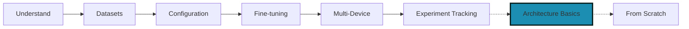
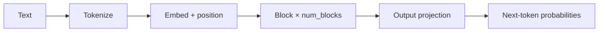
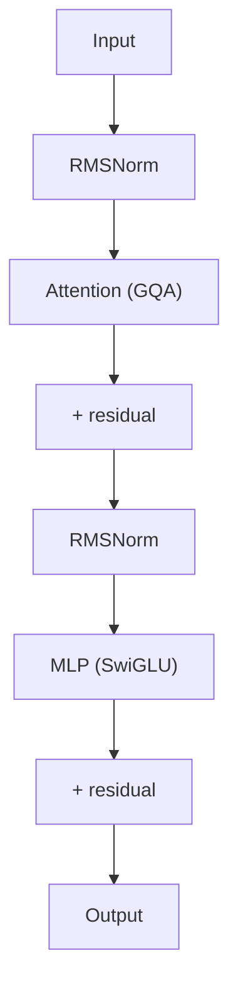

# Model Architecture Basics

Every field you've been editing under `transformer_config:` in [Configuration Patterns](command:tenstorrent.showLesson?["ct3-configuration-patterns"]) — `num_heads`, `embedding_dim`, `num_blocks`, `num_groups`, `theta` — names a real piece of the model. This lesson is the map: what each piece does, and why it exists, so those fields stop being magic numbers before you set your own for a from-scratch run in [Training from Scratch](command:tenstorrent.showLesson?["ct8-training-from-scratch"]).

This is a **conceptual tour**, not a build. If you want to write every one of these components by hand — RoPE, grouped-query attention, SwiGLU, a TT-Lang kernel — that's the from-scratch arc, linked throughout and again at the end.

## What You'll Learn

- The five pieces every decoder-only transformer is made of, and the order they run in
- Why modern models favor RoPE over learned position tables, GQA over plain multi-head attention, SwiGLU over ReLU, and RMSNorm over LayerNorm
- How each concept maps to a real `transformer_config:` field you'll set in the next lesson

**Time:** 20 minutes | **Prerequisites:** [Understanding Custom Training](command:tenstorrent.showLesson?["ct1-understanding-training"]) and [Configuration Patterns](command:tenstorrent.showLesson?["ct3-configuration-patterns"])

---

## Where This Fits in the Track


```mermaid
graph LR
    A[Understand] --> B[Datasets]
    B --> C[Configuration]
    C --> D[Fine-tuning]
    D --> E[Multi-Device]
    E --> F[Experiment Tracking]
    F -.-> G[Architecture Basics]
    G -.-> H[From Scratch]

    style G fill:#1B8EB1,stroke:#092221,stroke-width:3px
```

---

## The Shape of a Transformer

Text goes in, a token comes out, and in between the same block repeats `num_blocks` times:


```mermaid
graph LR
    A[Text] --> B[Tokenize]
    B --> C[Embed + position]
    C --> D["Block × num_blocks"]
    D --> E[Output projection]
    E --> F[Next-token probabilities]
```

Each block does the same two jobs, in order — gather context, then think about what was gathered:


```mermaid
graph TD
    A[Input] --> B[RMSNorm]
    B --> C["Attention (GQA)"]
    C --> D["+ residual"]
    D --> E[RMSNorm]
    E --> F["MLP (SwiGLU)"]
    F --> G["+ residual"]
    G --> H[Output]
```

The `+ residual` arrows matter as much as the boxes: each sub-layer's output is *added* back onto its input, not used to replace it. That's what lets you stack `num_blocks` of these without gradients vanishing on the way back down. Five components make up everything above: tokenization, embeddings, attention, the MLP, and normalization.

---

## 1. Tokenization

A model can't consume raw text — it consumes integer IDs from a fixed vocabulary. Two ends of a spectrum:

- **Character-level** — tiny vocabulary (a few dozen–hundred IDs), long sequences. What the tiny models in this track use.
- **Byte-Pair Encoding (BPE)** — a learned vocabulary of common subwords (tens of thousands of IDs), short sequences. What production models like Llama use.

The trade-off is direct: vocabulary size sets the size of the embedding table (below) and the final output layer — both scale with `vocab_size`. Want to see a BPE tokenizer built from raw bytes, merges and all? That's [Tokenizer & Data](command:tenstorrent.showLesson?["lfs-01-tokenizer"]) in the from-scratch arc.

## 2. Embeddings and Position

Two lookups feed every model, combined into one vector per token:

- **Token embedding** — a table of `vocab_size` learned vectors, one per token ID. *What* the token means.
- **Position information** — *where* the token sits in the sequence. Without it, "cat sat" and "sat cat" look identical to attention.

Older models (GPT-2, BERT) learned a fixed table of position vectors, added to the token embedding. Modern models — Llama and its descendants — use **RoPE (Rotary Position Embeddings)** instead: position is encoded as a rotation applied directly to the query and key vectors inside attention, not as a separate table added up front. RoPE generalizes better to sequence lengths longer than anything seen in training, and it's why `theta` (RoPE's base frequency) is a `transformer_config:` field instead of a learned parameter.

Build the embedding table and RoPE's rotation math by hand in [Embeddings & the Residual Stream](command:tenstorrent.showLesson?["lfs-02-embeddings"]).

## 3. Attention

Attention is how a token gathers context from every other token in the sequence before deciding what it means. Each token projects itself into a **query** (what am I looking for), a **key** (what can I offer), and a **value** (what information do I actually carry). Every query is scored against every key; the scores become weights over the values.

**Multi-head** attention runs several of these in parallel — splitting the embedding dimension across `num_heads` — so different heads can specialize in different kinds of relationships (syntax, coreference, long-range dependency) instead of averaging them all into one.

Modern models add one more move: **grouped-query attention (GQA)**. Instead of giving every query head its own key/value heads, several query heads share one KV head — `num_groups` of them instead of `num_heads`. Fewer KV heads means a smaller KV cache at inference time, for a small accuracy cost. It's why Llama-3 and the models in this track use GQA, and why `num_groups` is a field you set alongside `num_heads` rather than a fixed multiple of it.

Full derivation — Q·Kᵀ, scaling, causal masking, softmax, the GQA head-sharing, and a hand-authored TT-Lang kernel for the whole thing — lives in [Attention from Scratch](command:tenstorrent.showLesson?["lfs-03-attention"]).

> **`num_groups` quietly decides which hardware you can serve on.** This is the one place in this tour where an architecture choice reaches all the way into deployment, so it's worth knowing before you pick a number rather than after.
>
> To split attention across a multi-chip mesh, the serving stack shards by head — which means both the query heads and the KV heads have to divide evenly by the number of mesh columns. `tt_transformers` asserts exactly that (`models/tt_transformers/tt/model_config.py:687-691`, re-asserted in `attention.py:234-237`):
>
> ```python
> assert n_heads % cluster_shape[1] == 0
> assert n_kv_heads % cluster_shape[1] == 0   # <- the one that bites
> ```
>
> `num_heads` is usually a friendly power of two. **`num_groups` often isn't** — and it's the smaller number, so it constrains harder. The companion project [tt-nanollama3](https://github.com/tsingletaryTT/tt-nanollama3) chose `num_groups: 3`, a perfectly reasonable 2:1 sharing ratio against 6 query heads. The consequence:
>
> | Mesh | Columns | 3 KV heads divide evenly? |
> |---|---|---|
> | N150 / P150 (single chip) | 1 | ✅ |
> | N300 / P300 | 2 | ❌ |
> | T3000 | 8 | ❌ |
> | Galaxy | configurable submesh (e.g. 1×8) | ❌ unless the width is 1 or 3 |
>
> (`cluster_shape` is read from the live `mesh_device.shape` at `model_config.py:532`, so it follows whatever submesh you open rather than a fixed per-board constant.)
>
> That model can only be served on a **single chip** — not because it's too small to benefit from a mesh, but because 3 shares no factor with any commonly used mesh width except 1. Nothing about the architecture is wrong, and the model trains fine; the constraint only appears at serving time, as an assertion failure that says nothing about GQA.
>
> Choosing `num_groups: 2` or `4` instead would have kept the multi-chip door open at essentially the same quality. If you know you'll want to serve across a mesh, **pick `num_groups` divisible by your target mesh width** while it's still a one-line config decision.

## 4. The MLP (Feed-Forward Network)

Where attention mixes information *across* tokens, the MLP processes each token's vector *individually* — a small two-layer network applied at every position. It's unglamorous, but it's where most of a model's parameters actually live: in models this size, the MLP typically accounts for well over half the total parameter count, because its inner dimension is usually several times `embedding_dim`.

Older models used a plain ReLU or GELU activation between the two linear layers. Modern models use **SwiGLU** — a gated variant that's more expressive at the same parameter count, at the cost of a third weight matrix. It's the default in Llama-family models, and in the block you'll assemble in the from-scratch arc.

## 5. Normalization

Stacking `num_blocks` layers means activations can drift or explode as they pass through. A normalization step before each sub-layer keeps values in a stable range so training doesn't diverge.

- **LayerNorm** (GPT-2 era) — normalizes by mean and variance.
- **RMSNorm** (modern default) — normalizes by root-mean-square only, skipping the mean. Faster, and empirically just as effective, which is why Llama-family models — and `ttml`'s `transformer_config:` — use it exclusively.

Normalization has almost no parameters (one scale value per dimension), so it doesn't move your parameter count. It moves whether your loss curve is a smooth descent or a spike.

---

## Build It Yourself: The From-Scratch Arc

Everything above is the concept. If you want the *code* — every matrix multiply, every rotation, every softmax, written out and then re-expressed as a TT-Lang kernel — that's a different track, starting from [Pick Your Altitude](command:tenstorrent.showLesson?["lfs-00-intro"]):

- [Embeddings & the Residual Stream](command:tenstorrent.showLesson?["lfs-02-embeddings"]) — the token embedding table and RoPE's rotation math, hand-written.
- [Attention from Scratch](command:tenstorrent.showLesson?["lfs-03-attention"]) — grouped-query attention with RoPE'd Q/K, derived fully and authored as a TT-Lang kernel.
- [The Transformer Block & the Model](command:tenstorrent.showLesson?["lfs-04-block-and-model"]) — the SwiGLU MLP, RMSNorm, and residuals assembled into a full, runnable model.
- [Train It & Run for Real](command:tenstorrent.showLesson?["lfs-05-train-and-run"]) — a from-scratch training loop (cross-entropy, backprop, AdamW), run for real on Blackhole<sup>®</sup> hardware.

That arc builds the exact same `nanollama3` architecture — RoPE, GQA, SwiGLU, RMSNorm — that `ttml` runs for you in this track. Same design, two altitudes: use the framework, or write the framework's insides yourself.

---

## From Concepts to Config

Every concept above already has a name in `transformer_config:` — that mapping, plus the full field reference, safety checks, and worked examples, lives in [Configuration Patterns](command:tenstorrent.showLesson?["ct3-configuration-patterns"]):

| Concept | Field |
|---|---|
| Attention heads (multi-head) | `num_heads` |
| GQA key/value groups | `num_groups` |
| Embedding width | `embedding_dim` |
| Depth (blocks stacked) | `num_blocks` |
| RoPE base frequency | `theta` |
| Vocabulary size | `vocab_size` |

Bigger `embedding_dim` and more `num_blocks` mean more parameters, more memory, and more compute — in roughly the trade-offs you'd expect: width scales every matrix in a block, depth scales linearly. In [Training from Scratch](command:tenstorrent.showLesson?["ct8-training-from-scratch"]), you'll pick actual values for these fields and watch a model this small learn from nothing.

---

## Key Takeaways

✅ **Five components, in a repeating loop:** tokenize once, then embed → attend → process (MLP) → normalize, `num_blocks` times, then project to output.

✅ **Residual connections carry the signal forward** — each sub-layer adds to its input rather than replacing it, which is what makes deep stacks trainable.

✅ **Modern models made four specific upgrades:** RoPE over learned position tables, GQA over plain multi-head attention, SwiGLU over ReLU, RMSNorm over LayerNorm. All four show up in `ttml`'s config, and all four get built by hand in the from-scratch arc.

✅ **The MLP holds most of the parameters** — attention decides *what* to look at, the MLP does most of the actual work.

✅ **Every concept here is a `transformer_config:` field** — this lesson explains the "why," [Configuration Patterns](command:tenstorrent.showLesson?["ct3-configuration-patterns"]) is the authoritative "how."

---

## Next Steps

**Next: [Training from Scratch](command:tenstorrent.showLesson?["ct8-training-from-scratch"])** — set real values for `num_heads`, `embedding_dim`, and `num_blocks`, initialize a model from random weights, and watch it learn from nothing.

**Or build every piece by hand:** start the from-scratch arc at [Pick Your Altitude](command:tenstorrent.showLesson?["lfs-00-intro"]) and work through the embedding table, attention kernel, and transformer block yourself, TT-Lang and all.

---

## Additional Resources

- [Attention Is All You Need](https://arxiv.org/abs/1706.03762) — the original transformer paper
- [The Illustrated Transformer](https://jalammar.github.io/illustrated-transformer/) — visual walkthrough of the same components covered here
- [LLaMA](https://arxiv.org/abs/2302.13971) — the paper behind RoPE + GQA + SwiGLU + RMSNorm as a combined recipe
