# Model Architecture Basics

Understand the building blocks of transformer models before training from scratch. This conceptual lesson prepares you for CT-8.

## What You'll Learn

- Transformer architecture components
- Tokenization (character vs BPE vs WordPiece)
- Embedding layers and positional encoding
- Attention mechanisms (self-attention, multi-head)
- Feed-forward networks
- Why these components matter for training

**Time:** 20 minutes | **Prerequisites:** CT-1 through CT-6

---

## Why Learn Architecture?

### You've Fine-Tuned, Now What?

In CT-4, you fine-tuned TinyLlama without thinking about its internals. That works for most use cases!

**But to train from scratch (CT-8), you need to understand:**
- What components make up a transformer
- How many parameters each component adds
- Where memory and compute are spent
- How to design a small model that fits on your hardware

**This lesson is your architecture primer.**

---

## The Transformer Architecture (High Level)

### Input → Output Flow


**Key insight:** Most of the "magic" happens in the transformer blocks, repeated N times.

### Inside a Transformer Block

**Each transformer block contains:**

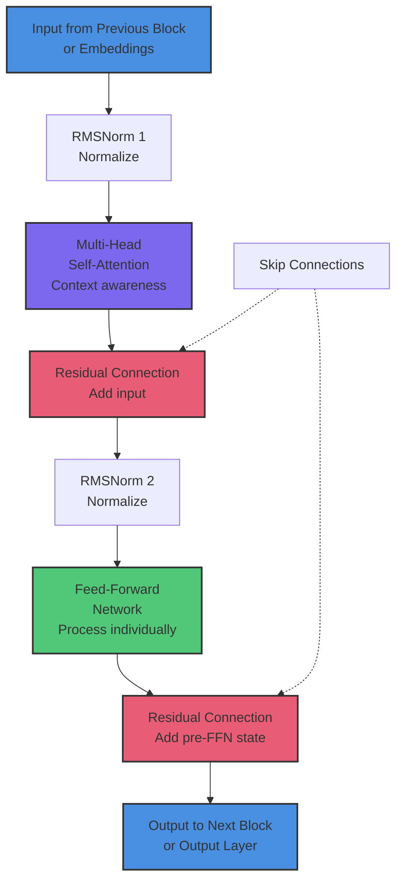

**Key components:**
1. **RMSNorm** - Stabilize values
2. **Multi-Head Attention** - Learn context
3. **Residual Connections** - Enable deep networks (prevent vanishing gradients)
4. **Feed-Forward Network** - Transform representations

**This block repeats N times** (6 for nano-trickster, 22 for TinyLlama).

---

## Component 1: Tokenization

### What Is a Token?

**Token:** A piece of text the model can process.

**Options:**
1. **Character-level:** Each character is a token
   - `"Hello"` → `['H', 'e', 'l', 'l', 'o']`
   - Pros: Small vocabulary (26 letters + punctuation)
   - Cons: Long sequences (every character counts)

2. **Word-level:** Each word is a token
   - `"Hello world"` → `['Hello', 'world']`
   - Pros: Meaningful units
   - Cons: Huge vocabulary (every word needs an ID)

3. **Subword (BPE/WordPiece):** Hybrid approach
   - `"unbelievable"` → `['un', 'believ', 'able']`
   - Pros: Balance vocabulary size and sequence length
   - Cons: More complex to train

**TinyLlama uses BPE (Byte-Pair Encoding):** 32,000 token vocabulary.

### Why It Matters for Training

**Vocabulary size = first layer size:**
- 32,000 vocab = 32,000 × hidden_dim parameters in embedding layer
- Character-level: 256 vocab (much smaller!)
- Word-level: 50,000+ vocab (much larger!)

**Trade-off:**
- Small vocab → more tokens per sentence → longer sequences
- Large vocab → fewer tokens per sentence → bigger embedding layer

---

## Component 2: Embeddings

### What Is an Embedding?

**Embedding:** Convert token IDs (integers) to dense vectors (floats).

```python
Token ID: 1234
    ↓
Embedding Layer (lookup table)
    ↓
Vector: [0.23, -0.45, 0.12, ..., 0.67]  # size = hidden_dim
```

**Example:**
- Vocab size: 32,000 tokens
- Hidden dim: 256
- Embedding parameters: 32,000 × 256 = **8.2M parameters**

**This is often the largest single layer!**

### Token Embeddings vs Position Embeddings

**Token embedding:** What is the token?
- `"cat"` → `[0.1, 0.9, ...]` (semantic meaning)

**Position embedding:** Where is the token?
- Position 0 → `[1.0, 0.0, ...]`
- Position 1 → `[0.9, 0.1, ...]`

**Combined:** `token_embedding + position_embedding`

This tells the model both **what** the word is and **where** it appears.

---

## Component 3: Self-Attention

### The Core Idea

**Self-Attention:** Let each word look at every other word to understand context.

**Example:**
```
Sentence: "The cat sat on the mat"

When processing "sat":
- Look at "The" → not very relevant (weight: 0.1)
- Look at "cat" → very relevant! (weight: 0.9)
- Look at "on" → somewhat relevant (weight: 0.3)
- Look at "mat" → relevant (weight: 0.5)
```

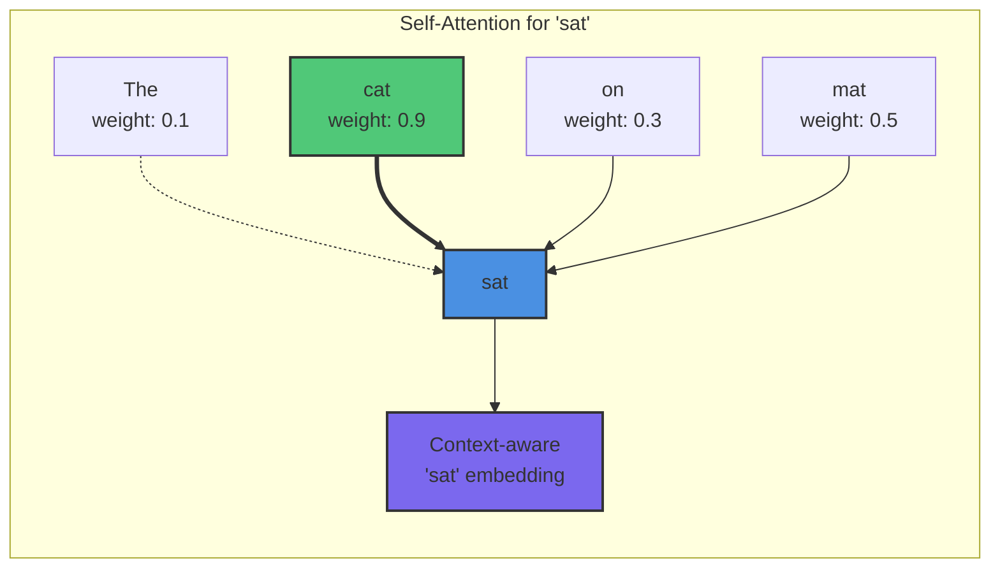

**The model learns these weights during training.**

### Query, Key, Value (QKV)

**Think of it like a search engine:**

1. **Query:** What am I looking for?
   - `"sat"` asks: "What's the subject?"

2. **Key:** What can I offer?
   - `"cat"` says: "I'm a noun, I can be a subject!"

3. **Value:** What information do I have?
   - `"cat"` provides its semantic meaning

**Math (simplified):**
```
attention_weight = softmax(Query · Key)
output = attention_weight · Value
```

```mermaid
graph TD
    A[Input Word Embedding] --> B1[Query Matrix W_Q]
    A --> B2[Key Matrix W_K]
    A --> B3[Value Matrix W_V]

    B1 --> C1[Query Vector]
    B2 --> C2[Key Vector]
    B3 --> C3[Value Vector]

    C1 & C2 --> D[Compute Attention Scores<br/>Query · Key^T]
    D --> E[Softmax<br/>Get Attention Weights]
    E & C3 --> F[Weighted Sum<br/>Attention × Value]
    F --> G[Context-Aware Output]

    style A fill:#4A90E2,stroke:#333,stroke-width:2px
    style G fill:#7B68EE,stroke:#333,stroke-width:2px
```

**Parameters:**
- 3 weight matrices (Q, K, V): 3 × hidden_dim × hidden_dim
- For hidden_dim=256: 3 × 256 × 256 = **196K parameters per attention head**

### Multi-Head Attention

**Instead of one attention mechanism, use multiple in parallel:**

```mermaid
graph TD
    A[Input Embedding<br/>hidden_dim = 256] --> B[Split into 8 Heads<br/>32 dims each]

    B --> H1[Head 1<br/>Syntax patterns<br/>Q/K/V: 32×32]
    B --> H2[Head 2<br/>Semantic relations<br/>Q/K/V: 32×32]
    B --> H3[Head 3<br/>Long-range deps<br/>Q/K/V: 32×32]
    B --> H4[Head 4-8<br/>Other patterns<br/>Q/K/V: 32×32]

    H1 --> C[Concatenate Results<br/>8 heads × 32 = 256]
    H2 --> C
    H3 --> C
    H4 --> C

    C --> D[Output Projection<br/>256 → 256]
    D --> E[Context-Rich Embedding]

    style A fill:#4A90E2,stroke:#333,stroke-width:2px
    style E fill:#7B68EE,stroke:#333,stroke-width:2px
    style H1 fill:#50C878,stroke:#333,stroke-width:2px
    style H2 fill:#50C878,stroke:#333,stroke-width:2px
    style H3 fill:#50C878,stroke:#333,stroke-width:2px
    style H4 fill:#50C878,stroke:#333,stroke-width:2px
```

**Why multiple heads?**
- Each head can specialize in different patterns
- Head 1 might learn syntax, Head 2 might learn semantics
- Head 3 might capture long-range dependencies
- More expressive than single attention

**Parameters:**
- 8 heads × 196K = **1.57M parameters per multi-head attention layer**

---

## Component 4: Feed-Forward Networks

### What Does It Do?

After attention tells us **which** words matter, the feed-forward network **processes** each word individually.

**Structure:**

```mermaid
graph TD
    A[Input from Attention<br/>hidden_dim = 256] --> B[Linear Layer 1<br/>256 → 1024<br/>262K params]
    B --> C[Activation Function<br/>SwiGLU or ReLU<br/>Non-linearity]
    C --> D[Linear Layer 2<br/>1024 → 256<br/>262K params]
    D --> E[Output<br/>hidden_dim = 256]

    F[Parameter Breakdown] --> G[Layer 1: 256 × 1024 = 262K]
    F --> H[Layer 2: 1024 × 256 = 262K]
    F --> I[Total: 524K params per FFN]

    style A fill:#4A90E2,stroke:#333,stroke-width:2px
    style E fill:#7B68EE,stroke:#333,stroke-width:2px
    style C fill:#E85D75,stroke:#333,stroke-width:2px
    style G fill:#6C757D,stroke:#333,stroke-width:2px
    style H fill:#6C757D,stroke:#333,stroke-width:2px
    style I fill:#50C878,stroke:#333,stroke-width:2px
```

**Typical sizing:**
- `mlp_dim = 4 × hidden_dim`
- For hidden_dim=256: mlp_dim = 1024

**Parameters:**
- Layer 1: 256 × 1024 = 262K
- Layer 2: 1024 × 256 = 262K
- Total: **524K parameters per FFN**

### Why It Matters

**Feed-forward networks are where most parameters live in large models:**
- TinyLlama (1.1B params): ~70% in FFN layers
- Llama-3.1 (8B params): ~75% in FFN layers

**Trade-off:**
- Larger mlp_dim → more expressive → more parameters
- Smaller mlp_dim → faster → less capacity

---

## Component 5: Normalization

### Why Normalize?

**Problem:** As you stack layers, activations can explode or vanish.

**Solution:** Normalize after each sub-layer.

**Two common approaches:**

1. **LayerNorm (older models like GPT-2):**
   ```
   normalized = (x - mean) / std
   ```

2. **RMSNorm (modern models like TinyLlama):**
   ```
   normalized = x / rms(x)
   ```

**RMSNorm is faster and works just as well.**

**Parameters:**
- Very few! Just a scale parameter per dimension
- For hidden_dim=256: **256 parameters**

---

## Component 6: Output Layer

### From Hidden States to Predictions

**Final step:** Convert hidden vectors back to token probabilities.

```
Hidden state: [0.23, -0.45, ..., 0.67]  # size = hidden_dim
    ↓
Linear layer (hidden_dim → vocab_size)
    ↓
Softmax
    ↓
Probabilities: [0.01, 0.02, ..., 0.85]  # size = vocab_size
```

**Parameters:**
- hidden_dim × vocab_size
- For 256 × 32,000 = **8.2M parameters**

**Often ties weights with embedding layer** to save parameters:
- Embedding: vocab → hidden
- Output: hidden → vocab
- Use same weights, transposed!

---

## Putting It All Together: TinyLlama

### Architecture Summary

```yaml
TinyLlama-1.1B:
  vocab_size: 32,000
  hidden_dim: 2048
  num_layers: 22
  num_heads: 32
  mlp_dim: 5632  # ~2.75 × hidden_dim
  max_seq_len: 2048
```

### Parameter Breakdown

**Per transformer block:**
- Multi-head attention: ~16.8M parameters
- Feed-forward network: ~23.1M parameters
- Normalization: ~4K parameters
- **Total per block: ~40M parameters**

**Full model:**
- Embedding: 65.5M
- 22 transformer blocks: 22 × 40M = 880M
- Output layer: 65.5M (weight-tied with embedding)
- **Total: ~1.1B parameters**

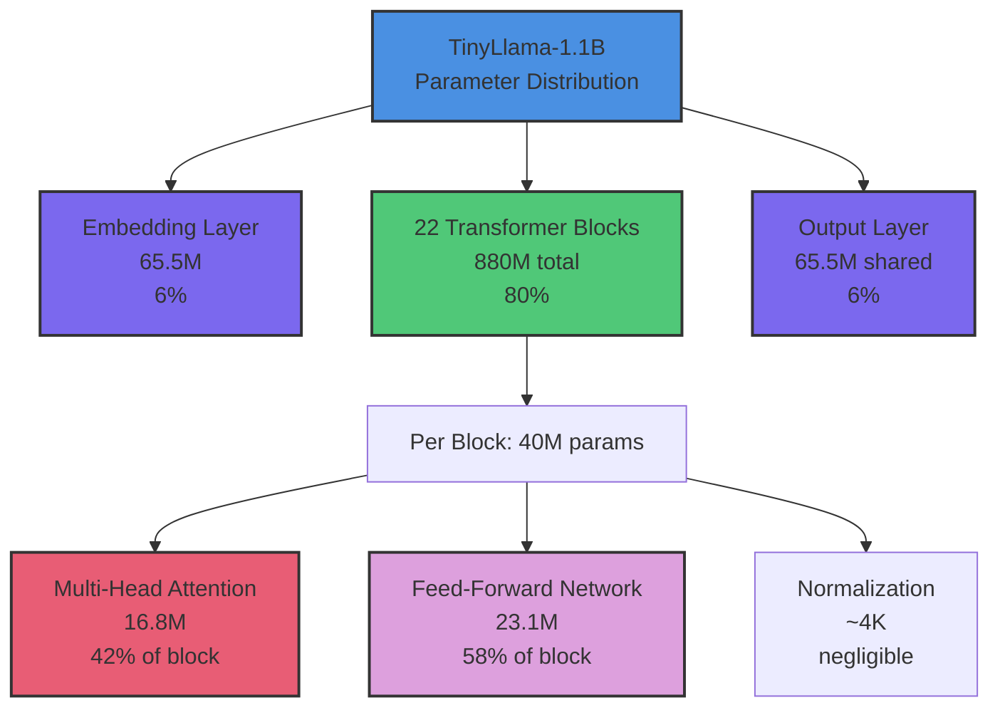

**Key insight:** ~70% of all parameters are in the feed-forward networks!

### Why This Matters

**For fine-tuning (CT-4):**
- You don't change the architecture
- All 1.1B parameters are there
- You just adjust their values slightly

**For training from scratch (CT-8):**
- You choose every number above
- Smaller numbers → faster, but less capable
- This is why we'll build a 10-20M param model!

---

## Designing Your Own Architecture

### The Scaling Laws

**Rule of thumb for compute:**
```
Training cost ∝ (num_params) × (num_tokens) × (context_length)
```

**Trade-offs:**

| Parameter | Effect if Increased | Cost if Increased |
|-----------|---------------------|-------------------|
| `hidden_dim` | More expressive embeddings | All layers bigger |
| `num_layers` | Deeper understanding | Linear scaling |
| `num_heads` | Richer attention patterns | Minimal (heads are split) |
| `mlp_dim` | More capacity per layer | Significant (most params) |
| `vocab_size` | Better tokenization | Bigger embedding/output |

### Example: Nano-Trickster (CT-8)

**Goal:** Build a 10-20M parameter model for N150.

**Design:**
```yaml
nano-trickster:
  vocab_size: 256        # Character-level (simple!)
  hidden_dim: 256        # Small but workable
  num_layers: 6          # Shallow (6× faster than TinyLlama)
  num_heads: 8           # Decent parallelism
  mlp_dim: 768           # 3× hidden_dim
  max_seq_len: 512       # Short context (fine for our task)
```

**Parameter count:**
- Embedding: 256 × 256 = 65K
- Per block: ~1.8M
- 6 blocks: 6 × 1.8M = 10.8M
- Output: 65K (weight-tied)
- **Total: ~11M parameters**

```mermaid
graph LR
    A[Model Size Comparison] --> B[Nano-Trickster<br/>11M params]
    A --> C[TinyLlama<br/>1.1B params]

    B --> B1[vocab: 256<br/>char-level]
    B --> B2[hidden: 256<br/>small]
    B --> B3[layers: 6<br/>shallow]
    B --> B4[Training: 30-60 min<br/>N150 ✓]

    C --> C1[vocab: 32,000<br/>BPE]
    C --> C2[hidden: 2048<br/>large]
    C --> C3[layers: 22<br/>deep]
    C --> C4[Training: Many hours<br/>N300+ recommended]

    style B fill:#7B68EE,stroke:#333,stroke-width:2px
    style C fill:#4A90E2,stroke:#333,stroke-width:2px
    style B4 fill:#50C878,stroke:#333,stroke-width:2px
    style C4 fill:#E85D75,stroke:#333,stroke-width:2px
```

**Why this works:**
- Fits easily on N150 (low memory)
- Trains in 30-60 minutes (fast iteration)
- Large enough to learn patterns (not a toy)
- Small enough to understand (debuggable)

---

## Memory and Compute Considerations

### Memory Requirements

**Model size (inference):**
```
memory = num_params × bytes_per_param
```

For BF16 (2 bytes): 1.1B params = 2.2GB

**Training memory (much higher):**
```
memory = num_params × (
    2 bytes (model weights) +
    2 bytes (gradients) +
    8 bytes (optimizer state, e.g., AdamW) +
    4 bytes (activations per layer per token)
)
```

For 1.1B params + batch_size=8 + seq_len=512:
- Model + gradients + optimizer: ~13GB
- Activations: ~4GB
- **Total: ~17GB**

```mermaid
graph LR
    A[Training Memory<br/>for 1.1B params] --> B[Model Weights<br/>2.2GB<br/>BF16 format]
    A --> C[Gradients<br/>2.2GB<br/>same size as weights]
    A --> D[Optimizer State<br/>8.8GB<br/>AdamW momentum]
    A --> E[Activations<br/>4GB<br/>batch × layers]

    F[Total: ~17GB] --> G[N150: Tight<br/>DRAM limits]
    F --> H[N300: Comfortable<br/>Distributed memory]
    F --> I[Nano-model 10-20M: Easy<br/>~200MB total]

    style A fill:#4A90E2,stroke:#333,stroke-width:2px
    style D fill:#E85D75,stroke:#333,stroke-width:2px
    style G fill:#FF6B6B,stroke:#333,stroke-width:2px
    style H fill:#50C878,stroke:#333,stroke-width:2px
    style I fill:#7B68EE,stroke:#333,stroke-width:2px
```

**This is why:**
- N150 is tight for 1.1B models (DRAM limits)
- N300 gives more headroom (distributed memory)
- Smaller models (10-20M) train comfortably on N150

### Compute Bottlenecks

**Where time is spent during training:**
1. **Attention: ~30%** (sequence_length² operations)
2. **Feed-forward: ~60%** (matrix multiplications)
3. **Other: ~10%** (normalization, activations, etc.)


```mermaid
graph TD
    A[Scaling Impacts] --> B[Double Sequence Length<br/>seq_len: 512 → 1024]
    B --> B1[Attention Cost: 4×<br/>quadratic scaling]
    B --> B2[FFN Cost: Same<br/>no sequence dependency]

    A --> C[Double Hidden Dimension<br/>hidden_dim: 256 → 512]
    C --> C1[Attention Cost: 4×<br/>QKV matrices scale]
    C --> C2[FFN Cost: 4×<br/>matrix sizes scale]

    A --> D[Double Num Layers<br/>num_layers: 6 → 12]
    D --> D1[All Costs: 2×<br/>linear scaling]

    style B1 fill:#E85D75,stroke:#333,stroke-width:2px
    style C1 fill:#E85D75,stroke:#333,stroke-width:2px
    style C2 fill:#E85D75,stroke:#333,stroke-width:2px
    style D1 fill:#50C878,stroke:#333,stroke-width:2px
```

**Scaling considerations:**
- Double sequence length → 4× attention cost
- Double hidden_dim → 4× FFN cost
- Double num_layers → 2× everything

---

## Key Architectural Innovations

### Why Modern Models Use These

**RoPE (Rotary Position Embeddings):**
- Better than learned position embeddings
- Generalizes to longer sequences than trained on
- Used by: Llama, TinyLlama, many others

**SwiGLU (Gated Linear Units):**
- Better than ReLU activation
- More expressive for same parameter count
- Used by: Llama family

**RMSNorm:**
- Faster than LayerNorm
- Same performance, fewer operations
- Used by: Modern efficient models

**Multi-Query Attention (MQA) / Grouped-Query Attention (GQA):**
- Shares keys/values across heads
- Reduces memory for long sequences
- Used by: Llama-3.1, TinyLlama (in some variants)

---

## Practical Implications for Training

### From CT-4 (Fine-tuning) to CT-8 (From Scratch)

**Fine-tuning (what you did in CT-4):**
```python
# Load pre-trained model
model = load_pretrained("TinyLlama-1.1B")

# All architecture decisions already made:
# - 22 layers
# - 2048 hidden_dim
# - 32 attention heads
# - etc.

# Just adjust weights
train(model, your_dataset)
```

**Training from scratch (CT-8):**
```python
# YOU decide the architecture
model = TransformerModel(
    vocab_size=256,      # Your choice!
    hidden_dim=256,      # Your choice!
    num_layers=6,        # Your choice!
    num_heads=8,         # Your choice!
    mlp_dim=768,         # Your choice!
)

# Initialize weights randomly
model.init_weights()

# Train from zero
train(model, your_dataset)
```

**Key difference:** You control every architectural decision.

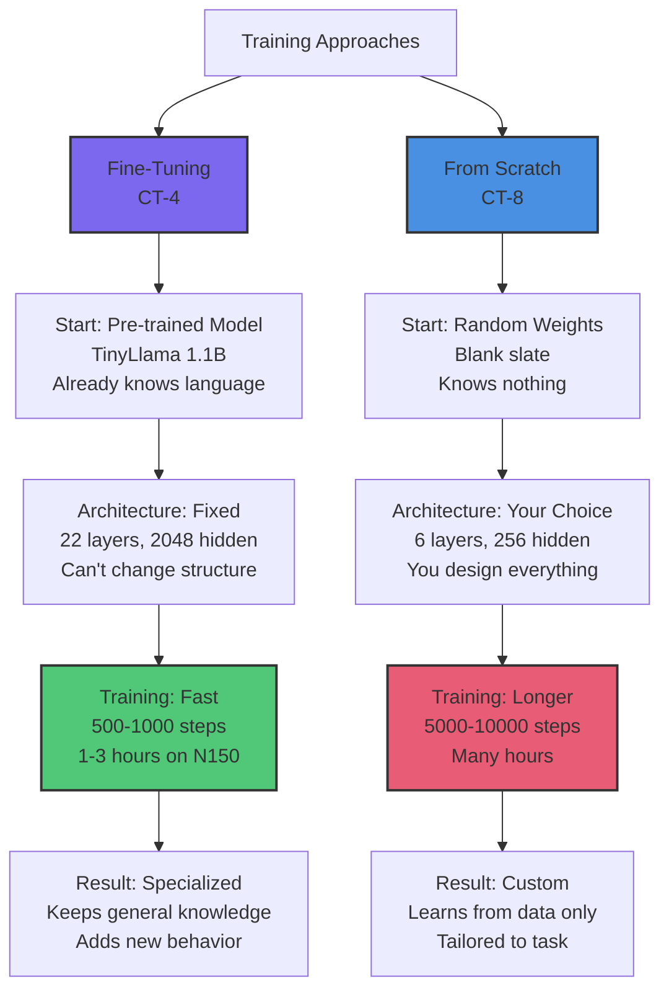

---

## Common Architecture Mistakes

### ❌ Don't: Make Everything Big

```yaml
# This will OOM on N150 and train forever
bad-design:
  hidden_dim: 4096    # Too big!
  num_layers: 24      # Too many!
  mlp_dim: 16384      # Way too big!
  # Result: 2B+ parameters
```

### ✅ Do: Start Small, Scale Up

```yaml
# This will work on N150
good-design:
  hidden_dim: 256     # Reasonable
  num_layers: 6       # Manageable
  mlp_dim: 768        # 3× hidden_dim
  # Result: ~11M parameters
```

### ❌ Don't: Use Incompatible Dimensions

```yaml
bad-design:
  hidden_dim: 256
  num_heads: 7        # Not a divisor of 256!
  # Error: hidden_dim must be divisible by num_heads
```

### ✅ Do: Keep Dimensions Compatible

```yaml
good-design:
  hidden_dim: 256
  num_heads: 8        # 256 / 8 = 32 (perfect!)
```

---

## Architecture Cheat Sheet

### For Quick Reference

| Component | Typical Range | Nano-Trickster (CT-8) | TinyLlama |
|-----------|---------------|----------------------|-----------|
| `vocab_size` | 256-50,000 | 256 (char-level) | 32,000 (BPE) |
| `hidden_dim` | 128-4096 | 256 | 2048 |
| `num_layers` | 4-32 | 6 | 22 |
| `num_heads` | 4-32 | 8 | 32 |
| `mlp_dim` | 2-4× hidden | 768 (3×) | 5632 (2.75×) |
| `max_seq_len` | 128-4096 | 512 | 2048 |
| **Total params** | - | ~11M | ~1.1B |
| **Training time (N150)** | - | 30-60 min | Many hours |

---

## Beyond This Lesson: Architecting the Future of AI

You've learned how transformers work under the hood. But what can you build with this architectural knowledge? Let's explore how understanding architecture unlocks the ability to design specialized models that solve real problems.

### What Developers Have Designed

**Real architectures built by developers who understood the fundamentals:**

🎯 **"Code Completion Specialist" (Startup engineer)**
- **Challenge:** Existing models too slow for real-time autocomplete
- **Architecture insight:** Reduced num_layers from 12 → 4, hidden_dim from 768 → 256
- **Result:** 10M parameter model with 5ms latency (vs 300ms for GPT-2)
- **Trade-off:** Narrower knowledge but specialized for Python syntax
- **Impact:** Shipped real-time code completion to 5000+ developers

🔬 **"Protein Sequence Analyzer" (Biotech researcher)**
- **Challenge:** Amino acid sequences need different tokenization than text
- **Architecture choice:** Character-level (20 amino acids), 8-layer transformer
- **Innovation:** Custom positional encoding for sequence distance
- **Result:** 50M parameter model outperformed 1B general models on protein tasks
- **Insight:** Domain knowledge + right architecture > brute force scale

🎮 **"Game Dialogue Generator" (Indie studio)**
- **Challenge:** 1B models too big for game runtime (memory constraints)
- **Design:** 30M params, 6 layers, 384 hidden_dim, character-level
- **Optimization:** Shared weights between encoder/decoder (20% size reduction)
- **Result:** Fits in 60MB, runs on console hardware, generates unique NPC dialogue
- **Win:** Architecture designed for deployment constraints from day 1

💼 **"Legal Document Parser" (LegalTech company)**
- **Challenge:** Legal text has 10x longer documents than typical LLMs handle
- **Architecture innovation:** Sparse attention (attend to every 4th token for long range)
- **Result:** 8K context window in 200M model (vs 2K in comparable dense models)
- **Impact:** Parse entire contracts in one pass, not chunked
- **Learning:** Attention pattern matters as much as model size

### Specialized Architectures Beat General Models

**Why architectural choices matter more than you think:**

📊 **Medical Q&A Model (100M params, specialized)**
- Trained on 50K medical Q&A pairs
- Custom tokenizer for medical terminology
- 8 layers, 512 hidden_dim, medical-specific embeddings
- **Performance:** 85% accuracy on medical exams
- **Comparison:** GPT-3 (175B params): 60% accuracy on same exams
- **Lesson:** 100M specialized beats 175B general-purpose for niche domains

🔧 **Hardware Verilog Generator (20M params)**
- Character-level for Verilog syntax
- 4 layers, 256 hidden_dim (tiny!)
- Trained on 10K hardware designs
- **Performance:** Generates syntactically correct Verilog 92% of the time
- **Comparison:** GPT-4: 45% syntactically correct (not trained on enough Verilog)
- **Lesson:** Smaller, specialized models trained on quality data > huge general models

📝 **Meeting Notes Summarizer (40M params)**
- Encoder-decoder architecture (not decoder-only like GPT)
- 6 encoder layers, 4 decoder layers
- Custom attention for timestamp/speaker tracking
- **Performance:** Summarizes 1-hour meeting in 30 seconds
- **Comparison:** Claude 3 Opus does it too, but costs $0.50/summary vs $0.01
- **Lesson:** Specialized architecture enables cost-effective deployment

### Architectural Patterns to Learn From

**Design patterns that solve real problems:**

🚀 **Tiny Transformers (1-50M params)**
**When to use:**
- Real-time applications (autocomplete, chat suggestions)
- Edge deployment (mobile, embedded)
- Low-latency requirements (<10ms)

**Architecture choices:**
- 4-8 layers (shallow but fast)
- 128-384 hidden_dim (small embeddings)
- Character or small vocab (reduce embedding size)
- **Example:** MobileBERT (25M params), DistilBERT (66M)

🎯 **Long-Context Transformers (50-500M params)**
**When to use:**
- Document analysis (legal, research papers)
- Code repositories (understand full files)
- Conversation history (multi-turn chat)

**Architecture choices:**
- Sparse attention patterns (Longformer, BigBird)
- Memory-efficient attention (FlashAttention)
- Sliding window + global attention
- **Example:** Longformer (148M params, 4K context)

🔬 **Domain-Specific Transformers (20-200M params)**
**When to use:**
- Specialized vocabulary (medical, legal, code)
- Narrow but deep knowledge
- High accuracy > broad knowledge

**Architecture choices:**
- Custom tokenizer (domain-specific vocabulary)
- Embeddings pre-trained on domain data
- Architecture sized for task complexity
- **Example:** BioBERT (110M), CodeBERT (125M)

💡 **Efficient Inference Transformers (10-100M params)**
**When to use:**
- Production deployment at scale
- Cost-sensitive applications
- High throughput requirements

**Architecture choices:**
- Knowledge distillation (student learns from teacher)
- Quantization-friendly designs
- Smaller FFN layers (reduce 75% of params)
- **Example:** TinyLlama (1.1B → efficient for hardware)

### Your Architecture Design Journey

**From understanding to creation:**

**Week 1 (Understanding - this lesson):**
- Study how attention works
- Calculate parameter counts
- Understand memory/compute trade-offs
- **Goal:** Read architectures and understand choices

**Week 2 (Experimentation - CT-8):**
- Train nano-trickster (11M params)
- Modify hidden_dim, see effect on performance
- Try different num_heads
- **Goal:** Build intuition through hands-on experience

**Month 2 (Specialization):**
- Design model for your specific task
- Choose tokenization strategy
- Size architecture for your hardware
- **Goal:** Create custom architecture that fits your needs

**Month 3+ (Innovation):**
- Experiment with novel attention patterns
- Custom position encodings
- Efficient architectural tricks
- **Goal:** Push boundaries, contribute new ideas

### Architectural Decisions That Changed Everything

**Real examples of how architectural choices enable breakthroughs:**

🌟 **Rotary Position Embeddings (RoPE)**
- **Old way:** Learned position embeddings (fixed max length)
- **Innovation:** Rotate embeddings based on position
- **Impact:** Models generalize beyond training length
- **Adoption:** LLaMA, TinyLlama, most modern models
- **Lesson:** Better position encoding = longer contexts for free

⚡ **Grouped-Query Attention (GQA)**
- **Old way:** Every head has its own keys/values (memory intensive)
- **Innovation:** Share keys/values across groups of heads
- **Impact:** 30% memory reduction, minimal accuracy loss
- **Adoption:** LLaMA-3, Mistral
- **Lesson:** Attention efficiency unlocks longer contexts

🎯 **SwiGLU Activation**
- **Old way:** ReLU activation (simple but limited)
- **Innovation:** Gated linear units with swish
- **Impact:** Better gradient flow, more expressive
- **Adoption:** LLaMA family, PaLM
- **Lesson:** Activation function choice matters

🔧 **RMSNorm vs LayerNorm**
- **Old way:** LayerNorm (compute mean and variance)
- **Innovation:** RMSNorm (just RMS, skip mean)
- **Impact:** 10-15% faster, same performance
- **Adoption:** LLaMA, TinyLlama, modern efficient models
- **Lesson:** Small optimizations compound across layers

### Imagine: Models You Could Design

**With your architectural knowledge, you could build:**

🚀 **Real-Time Code Autocomplete (5M params)**
- 3 layers, 128 hidden_dim, character-level
- Optimized for <5ms latency
- Specialized for Python/JavaScript syntax
- **Deployment:** Developer tools, IDE plugins

📊 **Financial Report Analyzer (30M params)**
- 6 layers, 384 hidden_dim, financial terminology tokenizer
- Custom attention for table parsing
- **Deployment:** Analyst workflows, automated reporting

🎨 **Style Transfer Text Rewriter (15M params)**
- Encoder-decoder (6+4 layers)
- Style embeddings (formal, casual, technical)
- **Deployment:** Content marketing, email assistants

🔬 **Scientific Paper Summarizer (50M params)**
- 8 layers, 512 hidden_dim, academic vocabulary
- Long-context attention (8K tokens)
- **Deployment:** Research tools, literature review

🎮 **Game Narrative Generator (20M params)**
- 5 layers, 256 hidden_dim, fantasy/sci-fi vocabulary
- Character-aware generation
- **Deployment:** Game studios, interactive fiction

### The Architecture Decision Tree

**How to design your model:**

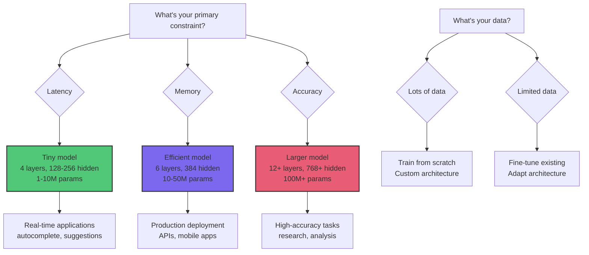

**Your design process:**
1. **Define constraints** (latency, memory, accuracy requirements)
2. **Choose base architecture** (decoder-only, encoder-decoder, etc.)
3. **Size the model** (layers, hidden_dim based on task complexity)
4. **Select components** (attention type, activation, normalization)
5. **Iterate** (train small, evaluate, adjust)

### From CT-7 to CT-8: Your Design in Action

**What you'll do in the next lesson:**
- Take architectural knowledge from this lesson
- Design nano-trickster (11M params) from scratch
- See how each component contributes to learning
- **Outcome:** Practical experience with architectural decisions

**The progression:**
- **CT-7 (Now):** Understand components conceptually
- **CT-8 (Next):** Build and train your design
- **Future:** Design specialized models for your domains

**You now have:**
- ✅ Mental models for architecture trade-offs
- ✅ Understanding of where parameters live
- ✅ Knowledge of memory/compute costs
- ✅ Ability to evaluate architecture choices

**The question isn't "Can I design a custom architecture?"**

**The question is "What specialized model will I design first?"**

**Imagine:**
- A 10M model that solves your specific problem better than GPT-4
- An architecture optimized for your hardware constraints
- A model that runs in production at 1/10th the cost
- A design that becomes the foundation for your product

**Architecture isn't just theory. It's power to build exactly what you need.**

---

## Key Takeaways

✅ **Transformers have 6 key components:** tokenization, embeddings, attention, FFN, normalization, output

✅ **Most parameters live in FFN layers** (60-70% of total)

✅ **Architecture decisions affect training time and memory** significantly

✅ **Start small (10-20M params), scale up** when you understand the trade-offs

✅ **Modern improvements (RoPE, SwiGLU, RMSNorm)** make models more efficient

✅ **hidden_dim and num_layers are your main scaling knobs**

---

## Next Steps

**Lesson CT-8: Training from Scratch**

You now understand the components. In CT-8, you'll:

1. Design a nano-trickster architecture (10-20M params)
2. Initialize it from scratch
3. Train on tiny-shakespeare dataset
4. See a model learn language from random initialization
5. Compare to random baseline (prove learning happened!)

**Estimated time:** 30 minutes (setup) + 30-60 minutes (training)
**Prerequisites:** CT-7 (this lesson)

---

## Additional Resources

### Papers
- [Attention Is All You Need](https://arxiv.org/abs/1706.03762) - Original transformer paper
- [BERT](https://arxiv.org/abs/1810.04805) - Bidirectional transformers
- [GPT-2](https://d4mucfpksywv.cloudfront.net/better-language-models/language_models_are_unsupervised_multitask_learners.pdf) - Decoder-only architecture
- [LLaMA](https://arxiv.org/abs/2302.13971) - Modern efficient architecture

### Interactive Visualizations
- [The Illustrated Transformer](https://jalammar.github.io/illustrated-transformer/) - Visual explanations
- [Transformer Explainer](https://poloclub.github.io/transformer-explainer/) - Interactive visualization

### Code References
- [nanoGPT](https://github.com/karpathy/nanoGPT) - Minimal GPT implementation
- [TinyLlama](https://github.com/jzhang38/TinyLlama) - Training logs and architecture
- [tt-train](https://github.com/tenstorrent/tt-metal/tree/main/tt-train) - TT-specific training framework

---

**Ready to build your first model from scratch?** Continue to **Lesson CT-8: Training from Scratch** →
