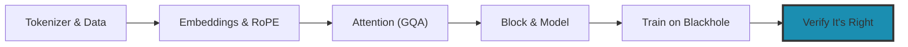

# Prove It's Right: Verifying a Model You Trained

[Train It & Run for Real](command:tenstorrent.showLesson?["lfs-05-train-and-run"])
ended where most from-scratch write-ups end: **you trained it.** The loss
dropped, the process exited 0, the chips got warm. That's a real
accomplishment, and it is also the exact moment the arc stops being able to
help you — because a dropping loss answers "did the machinery run?" and not
"is the model computing the function I think it is?"

Those are different questions, and the second one is where the expensive
mistakes live. The frozen-gamma bug at the end of the previous lab is the mild
version: thirteen normalization layers learned nothing across 3000 steps and
the loss curve looked textbook the whole way. This lab is about the
instruments that would have caught it, and the harder cases they were built
for.

**You are here:**



## The organizing idea

**"It loads" and "it generates fluent text" are not evidence of correctness.**

That sentence is the spine of this whole lab, and here is the evidence for it.
A companion project, [tt-nanollama3](https://github.com/tsingletaryTT/tt-nanollama3),
took the architecture this arc builds past where the lessons stop: it trained
the model for real on Blackhole<sup>®</sup>, converted the result to Hugging
Face format, and built numerical verification for the conversion. The
converted model passed **four independent checks** and was still computing the
wrong function:

| Check | Result | Verdict |
|---|---|---|
| Loads as `LlamaForCausalLM` | 22.025088M params | passed |
| Embedding and `lm_head` tied | `torch.equal` true | passed |
| Next-token entropy | 4.75 nats (uniform = 10.37) | passed |
| Generated text | *"Once upon a time, there was a little girl named Lily…"* | passed |
| **Held-out loss vs the training run** | **3.20 vs 1.8781** | **wrong** |

The cause was a **RoPE row-layout mismatch**. `ttml` rotates *interleaved*
pairs — `(x[2i], x[2i+1])` — and Hugging Face's Llama rotates *split halves* —
`(x[i], x[i+d/2])`. Same shapes, same dtypes, same parameter count, different
function. Converting between the two conventions means permuting `q` and `k`
rows per head, and **only** `q` and `k`, since RoPE touches nothing else.

Read the table again with that cause in mind, because this is the part worth
internalizing: **every check above is structurally incapable of seeing that
bug.** A rotary embedding applied with the wrong pairing still produces a
model that loads, still has tied weights, still has confident low-entropy
predictions, and still writes plausible sentences. Four passes, zero
information.

**The generalization:** for any check you rely on, ask what class of error it
*cannot* see — then go find an instrument that can. Agreement among checks
that share a blind spot is not corroboration.

## Coming from CUDA: you don't have a reference implementation

On CUDA, verifying a model is usually a diff. You have a reference — the
upstream PyTorch implementation, a published checkpoint, someone else's
`transformers` model card — and correctness reduces to
`torch.allclose(mine, theirs)`. The reference is the oracle, and the hard part
is tolerance selection.

When you built the model, **you are the reference.** There is no known-good
checkpoint of your architecture at your vocabulary trained on your data, so
there is nothing to diff against. That changes the job from *comparing* to
*manufacturing evidence*: you have to construct quantities whose correct
values you can predict from first principles, and then check that your model
produces them. The five techniques below are five ways to do exactly that,
ordered roughly by cost.

## Technique 1: `ln(vocab_size)` at initialization

The cheapest check in this entire lab, and it costs **one training step**.

A freshly initialized model's output distribution is close to uniform over the
vocabulary, and cross-entropy against a uniform distribution over `V` classes
is exactly `ln(V)`.
[The Transformer Block & the Model](command:tenstorrent.showLesson?["lfs-04-block-and-model"])
already used this to check the forward pass; the point here is that it also
verifies something no shape assertion can — that **your model, your tokenizer,
and your vocabulary all agree with each other.**

For a 32000-token vocabulary that target is `ln(32000)` = **10.37**. The
companion project's first loss was **10.6875**. Close enough to be evidence.

How to read a miss:

- **Much higher than `ln(vocab)`** — initialization is wrong, or your real
  vocabulary is larger than your config thinks it is.
- **Much lower** — you may be accidentally resuming from weights, or the
  number you're printing isn't the loss you think it is.

Do the mirror check at the other end of training: a model that has learned
something should show next-token entropy well **below** `ln(vocab)`. The
companion model's was 4.75 nats. Note carefully what that did and didn't buy —
4.75 against a uniform 10.37 is exactly the entropy of a model that learned a
great deal, and it was measured on the model with the RoPE bug. This check
catches catastrophe, not correctness.

## Technique 2: compare against the training run's own held-out loss

**This is the single most valuable check available**, and it costs nothing if
you recorded the number during training. Your training run measured a loss on
held-out data. Any later artifact — a resumed run, a converted checkpoint, a
reimplementation — should reproduce it. The RoPE bug in the table above was
caught by exactly this and nothing else: **3.20 against the training run's
1.8781.**

There are two traps, and both of them produce numbers that look like a broken
model when nothing is broken.

**Trap one: do not pre-shift the labels.** `LlamaForCausalLM` shifts labels
internally, so passing an already-shifted pair double-shifts:

```python
# WRONG — double-shifts, because HF shifts internally.
# Reports ~9.0 nats on a model that is completely correct.
out = model(x[:, :-1], labels=x[:, 1:])

# Correct — hand it the same sequence twice and let HF do the shift.
out = model(x, labels=x)
```

The companion project hit this twice, once in a plan's example command and
once by accident while verifying the fix for the *actual* bug. ~9.0 nats on a
correct model reads as catastrophic failure rather than as a measurement
error, which is what makes it expensive.

**Trap two: know your noise floor before you interpret a gap.** Held-out loss
is a sample statistic. The companion project's per-window standard deviation
was ≈ **0.29 nats**, so an 8-window mean carries a standard error of ≈
**0.11**. That single number decides how to read every comparison you make: a
0.05-nat difference means nothing at all, and the 1.3-nat difference that
exposed the RoPE bug is decisive. Compute the standard error *first*, and
then interpret. A gate whose tolerance is tighter than its own noise floor is
worse than no gate, because every failure becomes ambiguous between "the model
is wrong" and "the gate was impossible."

A related discipline that costs nothing: when comparing two implementations,
evaluate them on **identical inputs** rather than on independent samples. That
turns a noisy two-sample comparison into a paired one and can improve
resolution by an order of magnitude.

## Technique 3: resume continuity

If you're running long jobs — and past a few thousand steps you will be —
you're going to resume from a checkpoint. **A resumed run's first loss should
land near the previous run's last loss.** The companion project's: run 1 ended
at **9.5000**, and the resumed run began at **9.3125**. That continuity *is*
the evidence.

If a resumed run instead restarts near `ln(vocab)`, the weights did not load,
and here is why this check earns its own section: **the checkpoint file will
still exist, still be a plausible size, and still have a valid header.**
Nothing about the file is detectably wrong. The loss curve is the only
instrument that sees it.

One adjacent trap worth designing out before it bites: if checkpoint filenames
embed an unpadded step number, sorting them lexicographically gives
`step10 < step100 < step9`, so "load the latest checkpoint" silently loads
step 9 after step 100. Zero-pad the step (`step00003000`).

## Technique 4: ablation — break it on purpose and measure

**This is the highest-value technique in this lab.** Everything above tells you
whether a check *passed*. Ablation tells you whether that check could ever have
*failed* — which is the only thing that makes a pass meaningful.

The method: in a scratch copy, deliberately introduce the defect your check is
supposed to catch. Re-run. Record the number. If the check doesn't move, it is
not protecting you; it's a comfort blanket. Here are the companion project's
real measurements, against a correct held-out loss of **1.84**:

| Deliberate defect | Loss impact |
|---|---|
| RoPE flipped to split-halves | 3.13 (vs 1.84) |
| K/V split order reversed | 7.59 |
| `tile` instead of `repeat_interleave` for GQA | 3.72 |
| One layer's `q_proj` left un-permuted | +0.69 |
| gate and up projections swapped | +0.43 |
| **Two RMSNorm layers swapped** | **+0.0000** ← the blind spot |

Read that table as a calibration curve for your gate. A held-out-loss check
with a **0.2-nat** tolerance catches everything above the line and **nothing**
below it. Knowing exactly where your floor sits is the difference between a
test and a ritual.

And that last row is the punchline of the whole lab. Swapping two RMSNorm
layers changed the loss by **exactly zero** — because, as
[Train It & Run for Real](command:tenstorrent.showLesson?["lfs-05-train-and-run"])
established, all thirteen gammas were frozen at exactly 1.0. **No
value-comparison check can validate a tensor whose values are all identical.**
Swapping two indistinguishable tensors is undetectable by construction. If you
need to validate ordering or assignment of tensors like those, do it with a
synthetic fixture carrying distinct values, not with the real checkpoint.

### The follow-up experiment — and why the obvious fix isn't one

The natural next thought is: *fix the frozen gammas, and the blind spot closes.*
The companion project ran exactly that experiment. **It doesn't.**

Retraining with `stochastic_rounding: true` gave all thirteen gammas real
learned values (sd `0.047`–`0.158` instead of exactly `0.0`). Re-measuring the
same swap on the new checkpoint:

| Norm swap, measured on the retrained model | Loss impact |
|---|---|
| Frozen-gamma baseline (for reference) | **exactly 0.0000** |
| Block 0 ↔ block 1 (real gammas) | **+0.0065** |
| Block 3 `attention_norm` ↔ `mlp_norm` (real gammas) | **+0.0018** |

Non-zero at last — the tensors are now distinguishable, so the defect is no
longer invisible *by construction*. But look at the magnitude against the same
calibration curve: **+0.0065 is about 31× below the 0.2-nat gate** and 45× below
the model's own per-window noise (sd `0.29`). On the smaller swap, 10 of 32
evaluation windows actually got *better*.

So the honest conclusion is uncomfortable and worth sitting with: **a norm
mis-mapping still slips past every loss-based gate — before the fix because the
tensors were identical, after the fix because the effect is real but tiny.** Two
independent causes, and repairing the dramatic one did nothing for the second.

This is the most transferable lesson in the lab. A check that reads `0.0000` is
obviously broken and you will investigate it. A check that reads `+0.0065` looks
like it's working — it moved, it's the right sign, it's even statistically
significant (t ≈ 5.6 across 32 windows). It is still **31× too small to gate
on**. "The number moved" and "the number moved enough to catch the bug" are
different claims, and only the second one protects you.

The instrument that does catch this class of defect is the next technique.

## Technique 5: independent reimplementation

The strongest correctness evidence available is **two implementations, derived
by different routes, agreeing numerically.**

The companion project did this: it wrote a pure-NumPy forward pass of the
`ttml` model directly from the C++ source — reading
`llama_block.cpp`, `rms_norm_module.cpp`, and the RoPE kernel, deriving each
op's semantics from the code that runs on the device — and compared its logits
against the Hugging Face path. Agreement came out at ≈ **1e-5**, which is the
level where you're looking at floating-point accumulation order and nothing
else. That is the check that finally made the conversion trustworthy, and it's
the one the four passing checks in the opening table could never substitute
for.

**The trap is what makes or breaks it.** The second implementation has to be
derived *independently*. The NumPy forward pass above was written from the C++
sources and deliberately **never** from the converter it was meant to check.
If you write implementation two by reading implementation one, it inherits
every misunderstanding baked into the first and then agrees with it by
construction — a perfect `allclose` that proves nothing except that you copied
carefully. This is the single easiest way to build an expensive verification
suite with zero diagnostic power.

The same logic applies to how you establish a convention in the first place.
The companion project pinned `ttml`'s RoPE layout four separate ways, and the
strongest argument was the one that didn't depend on anyone's intent: the
device kernel applies one 32×32 matrix per tile independently, so with
`head_dim = 64`, split-halves would have to pair column `i` with column
`i + 32` — **across a tile boundary**, which is structurally impossible for
that kernel. Evidence from the hardware's own constraints beats evidence from
documentation. (Tiles, again — the 32×32 unit from
[Pick Your Altitude](command:tenstorrent.showLesson?["lfs-00-intro"]) turns out
to be a correctness argument, not just a performance one.)

## Checks and what they cannot see

Worth keeping as a table, because the second column is the one people skip:

| Check | Catches | Blind to |
|---|---|---|
| Model loads | missing or misshaped tensors | any value or layout error |
| Shape assertions | structural mistakes | permutations and swaps within a shape |
| Weight-tying assertion | untied when it should be tied | *which* tensor got tied |
| Entropy vs `ln(vocab)` | catastrophically broken models | layout errors (ours: 4.75, and wrong) |
| Generated text reads well | gross failure | ~1.3-nat errors |
| Held-out loss vs training | most layout errors (>0.2 nats) | anything under the noise floor; frozen-value tensors entirely |
| Logits vs an independent implementation | nearly everything | whatever both implementations get wrong |

### The deeper reason that table has a second column

Every check above measures something **continuous** — a loss in nats, a PCC, a relative
error. What you actually ship is `argmax`: a **step function**. At a near-tie the map from
logits to tokens is a *discontinuity*, and no amount of agreement in the smooth quantity
carries across it.

The companion project hit this exactly. Its served model diverged from the CPU reference at
a step where the top two logits were:

```
' She'   12.3750   p = 0.574
' Lily'  11.9375   p = 0.370     margin 0.4375 logits, about 9 bfloat16 ulps
```

Continuous analysis calls a 9-ulp perturbation a rounding artefact. Token space calls it a
different sentence. **PCC 0.9940–0.9998 and "the generated text is wrong" were both true at
the same time.**

Three things make this bite harder on Tenstorrent than the arithmetic alone suggests:

- **Block float is not independent noise.** `bfp8`/`bfp4` share one exponent across a tile
  of 32 values, so one large activation degrades the precision of its 31 neighbours. Error is
  data-dependent and *correlated between neighbours* — the assumption ordinary error
  propagation relies on. Treat "raise the precision" as a hypothesis and A/B it: on that
  project, moving attention to `BFLOAT16` and the MLP off `BFLOAT4_B` bought about **one
  token** of agreement.
- **Decode is a feedback loop.** Prefill is one pass with bounded error; decode feeds its own
  output back, so the model's dynamics amplify whatever was wrong. This is exactly why
  teacher-forced decode checks pass while real generation degrades — teacher forcing breaks
  the loop.
- **Small models sit on a knife edge.** A ~22M model trained on a fraction of an epoch has a
  flat next-token distribution: **21% of positions within 0.5 logits**. An 8B production model
  is sharp enough that the same absolute error flips nothing. The hardware is no less accurate
  for a small model — the small model is simply where that accuracy becomes visible.

One counter-intuitive measurement worth carrying: training the same architecture properly
made the distribution **flatter**, not sharper — near-ties rose from 21% to 32%. Lower loss
means better *probability assignment*, not wider top-1/top-2 gaps. A well-calibrated model
spreads probability where a continuation is genuinely ambiguous; an undertrained one is
blunt and overconfident, which is precisely why it commits so hard to repetitive output.

**The rule:** if the deliverable is tokens, measure tokens. Generate N tokens on device,
generate N on the reference from the same prompt, and compare the sequences. It is the only
check whose failure mode matches the product's.

## Conversion gotchas worth knowing before you hit them

If you take your trained model out of `ttml` and into Hugging Face format —
which is what makes it servable, and what the companion project did — three
structural surprises are worth knowing in advance. Each one is silent.

- **Weight tying means there is no `tok_emb` tensor.** With tying enabled,
  `ttml` registers only `llama/fc/weight`. A converter that goes looking for an
  embedding table finds nothing, and produces a model with a
  randomly initialized embedding — with no error at all. Write `fc/weight` to
  **both** `model.embed_tokens.weight` and `lm_head.weight`. The general rule
  that prevents the whole family of these: **raise on any unmapped tensor,
  never `continue`.**
- **`kv_linear` is a fused K+V projection.** `ttml` packs both into one weight
  with output dimension `num_groups × head_dim × 2`; Hugging Face wants
  separate `k_proj` and `v_proj`, and the split is **K first**. Getting the
  order backwards cost 7.59 nats in the ablation table above — loud, this time,
  but validate the row count rather than trusting that it always will be.
- **Checkpoint tensors stream in declaration order, not sorted order.** `ttml`
  writes tensor records in the order its module walk emitted them — the
  companion project's checkpoint starts at **block 5**, with block 0 arriving
  at record 21. Pairing a *sorted* list of names against that stream
  mis-assigns **every tensor**, and it is entirely shape-silent, because
  `q_linear`, `kv_linear`, and `out_linear` are all `(1, 1, 384, 384)`. The
  model loads, and generates nonsense. Walk the manifest in insertion order.

These are three entries from a much longer set of field notes. The full
collection — organized by symptom, with the numbers each one produced — is the
companion project's
[model development troubleshooting guide](https://github.com/tsingletaryTT/tt-nanollama3/blob/main/docs/model-development-troubleshooting.md).
Read it before your first conversion, not after.

## The honest caveat, stated plainly

Same standard as the previous lab. **None of the numbers above are an upstream
claim.** They are the companion project's own verification: one model, one
architecture, one Blackhole box, all measured and written down. Upstream TT-Metalium<sup>™</sup>
runs no continuous-integration training tests for Blackhole, so there is
nothing to check them against; treat them as calibration for your own
measurements rather than as constants.

And be clear-eyed about what the companion model is. It has **~22M parameters**,
saw **0.43 of one epoch**, and was trained on **TinyStories** — a synthetic
corpus of deliberately simple prose. It demonstrates a *pipeline*: train
TT-native, convert, verify numerically, serve. It is not a capable model, and
the fluent sample in the opening table should be read as an indictment of
fluency as evidence rather than as a result. That is, in fact, the lab's whole
argument: the nicest-looking output in this document came from the broken
model.

One last thing the techniques above imply and that's easy to skip: **if a step
produces a number that decides pass or fail, make it a test.** The companion
project predicted the RoPE trap in advance, in writing, and still shipped the
bug — because the check that would have caught it lived in a shell command
someone had to remember to run, instead of in the test suite.

## Where next

You've now done the full arc, plus the part that comes after "it trains":

- [Pick Your Altitude](command:tenstorrent.showLesson?["lfs-00-intro"]) — the
  TT-NN<sup>™</sup> ↔ TT-Lang ladder and the 32×32 tile.
- [Tokenizer & Data](command:tenstorrent.showLesson?["lfs-01-tokenizer"]) — a
  tokenizer from scratch.
- [Embeddings & the Residual Stream](command:tenstorrent.showLesson?["lfs-02-embeddings"])
  — embeddings, the residual stream, RoPE.
- [Attention from Scratch](command:tenstorrent.showLesson?["lfs-03-attention"])
  — grouped-query attention and a from-scratch TT-Lang kernel.
- [The Transformer Block & the Model](command:tenstorrent.showLesson?["lfs-04-block-and-model"])
  — SwiGLU, RMSNorm, and the full six-block model.
- [Train It & Run for Real](command:tenstorrent.showLesson?["lfs-05-train-and-run"])
  — the from-scratch training loop, run on Blackhole hardware.
- **Prove It's Right** (this lab) — the instruments that tell you whether any
  of it is correct.

Where to take it from here:

- **Go read the companion project.**
  [tt-nanollama3](https://github.com/tsingletaryTT/tt-nanollama3) is this arc
  carried through to a converted, numerically verified, servable model —
  including the pure-NumPy `ttml` forward reference and every ablation quoted
  above.
- **Serve what you converted.** Once a model is in Hugging Face format and you
  trust it, [Production Inference with vLLM](command:tenstorrent.showLesson?["vllm-production"])
  and [Production Inference with TT-Inference-Server](command:tenstorrent.showLesson?["tt-inference-server"])
  are the paths that put it behind an endpoint. One thing to carry over from the
  field notes: pin your serving context length from `max_position_embeddings` in
  the model config, never from the tokenizer — `model_max_length` in
  `tokenizer_config.json` is frequently the "no limit" sentinel, which yields a
  stack that cheerfully accepts 4k contexts from a model trained to 256.
- **Track the numbers properly.**
  [Experiment Tracking](command:tenstorrent.showLesson?["ct6-experiment-tracking"])
  is where the held-out loss in Technique 2 stops being a number you remember
  and becomes a number you recorded. One caveat from the field notes that
  applies directly: check whether your framework actually *computes* validation
  loss — `ttml`'s `train()` carries a placeholder that copies the training loss
  forward, so if train and val agree to the last decimal, they are the same
  number wearing different labels.

## You know how to tell whether it's right

Six labs ago this arc started with a 32×32 tile and the claim that you could
build a real, modern language model TT-native without ever leaving Tenstorrent
ground. You did that, and then you trained it. What this lab adds is the part
that makes any of it *count*: a set of instruments — `ln(vocab)`, held-out loss
against a recorded number, resume continuity, deliberate ablation, and an
independently derived second implementation — that can distinguish a model
which works from a model which merely runs.

The model that passed four checks and failed the fifth is the one to remember.
Fluency is not evidence. Loading is not evidence. A dropping loss is not
evidence. Measured agreement with something you predicted independently is.
