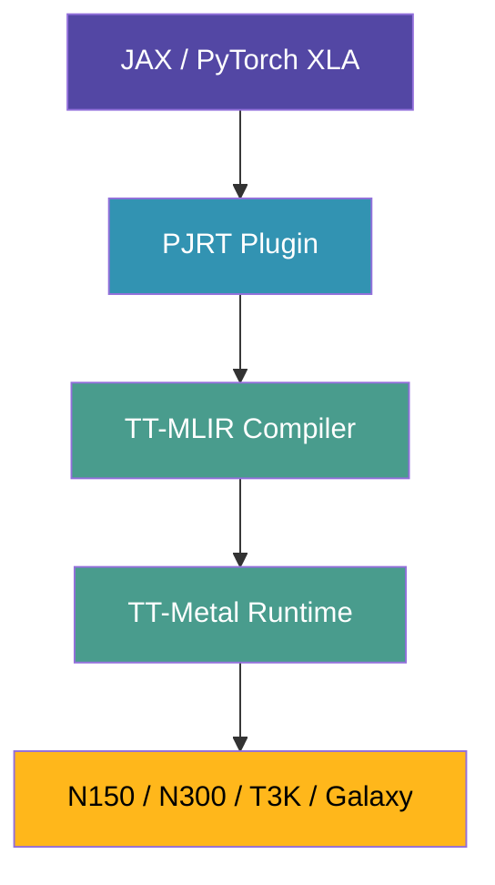

# Lesson 12: JAX Inference with TT-XLA

## Welcome to Production-Ready Multi-Chip Inference! 🚀

You've explored TT-Metal (low-level), vLLM (LLM serving), and TT-Forge (experimental PyTorch, as of December 2025). Now meet **TT-XLA**: Tenstorrent's **production-ready XLA-based compiler** that brings JAX and PyTorch models to TT hardware with multi-chip support.

**The Goal:**
```python
import jax
import jax.numpy as jnp

# JAX automatically uses TT hardware via PJRT plugin
x = jnp.array([1.0, 2.0, 3.0])
y = jnp.array([4.0, 5.0, 6.0])

result = jnp.dot(x, y)
print(f"Result: {result}")
print(f"Device: {result.device()}")  # TtDevice(id=0)
```

**Why TT-XLA?**
- ✅ **Production-ready:** Most mature compiler for TT hardware
- ✅ **Multi-chip support:** Tensor parallelism across N150/N300/T3K/Galaxy
- ✅ **Framework flexibility:** Supports both JAX and PyTorch/XLA
- ✅ **Simple installation:** Install via wheel (no building from source)
- ✅ **Python 3.10+ compatible:** Works with standard Python versions

---

## What is TT-XLA?

**TT-XLA** is Tenstorrent's XLA-based compiler that provides production-grade inference for JAX and PyTorch models:



**Key Advantages:**
- ✅ **Production-tested:** Most mature compiler in the stack
- ✅ **Multi-chip ready:** Tensor parallelism (TP) and data parallelism (DP)
- ✅ **No tt-metal rebuild:** Works with your existing installation
- ✅ **Wheel-based install:** Simple `pip install`, no compilation

---

## TT-XLA vs TT-Forge vs TT-Metal

| Feature | TT-XLA | TT-Forge | TT-Metal |
|---------|--------|----------|----------|
| **Maturity** | Production | Beta/Experimental (as of December 2025) | Stable |
| **Installation** | Wheel (easy) | Build from source | Already installed |
| **Python version** | 3.10+ | 3.11+ | Any |
| **Multi-chip** | ✅ Yes (TP/DP) | ❌ Single-chip | ✅ Yes |
| **Frameworks** | JAX, PyTorch/XLA | PyTorch, ONNX | Direct API |
| **Use case** | Production inference | Experimental models | Low-level kernels |
| **This lesson** | **✅ Focus** | Lesson 11 | Lessons 1-10 |

**Recommendation:** Use TT-XLA for production workloads on multi-chip systems (N300, T3K, Galaxy).

---

## Step 1: Install TT-XLA

**Prerequisites:**
- tt-metal already installed at `~/tt-metal` (from Lessons 1-10)
- Ubuntu system (these instructions are Ubuntu-specific)
- Sudo access for Python 3.11 installation

**⚠️ Important:** TT-XLA requires **Python 3.11** and a **clean environment** (no conflicting TT-Metal variables).

### Installation

**Step 1.1: Install Python 3.11**

Ubuntu 22.04 ships with Python 3.10, but TT-XLA works best with Python 3.11:

```bash
sudo add-apt-repository ppa:deadsnakes/ppa && \
  sudo apt-get update && \
  sudo apt-get install -y python3.11 python3.11-dev python3.11-venv python3.11-distutils
```

**What this does:**
- Adds deadsnakes PPA (provides newer Python versions)
- Installs Python 3.11 with development headers
- Includes venv and distutils modules

**Step 1.2: Unset TT-Metal Environment Variables**

**CRITICAL:** TT-XLA uses its own bundled TT-Metal runtime. Existing TT-Metal environment variables cause conflicts:

```bash
unset TT_METAL_HOME
unset LD_LIBRARY_PATH
```

**Why this is necessary:**
- TT-XLA bundles its own TT-Metal libraries with the PJRT plugin
- Your `~/tt-metal` installation is for direct TT-Metal API usage (Lessons 1-10)
- TT-XLA and direct TT-Metal use different compilation paths
- Mixing environments causes cryptic library errors

**Note:** Don't worry - your `~/tt-metal` installation is unchanged. You're just isolating TT-XLA in its own environment.

**Step 1.3: Create Virtual Environment**

Create a clean Python 3.11 environment:

```bash
python3.11 -m venv ~/tt-xla-venv
source ~/tt-xla-venv/bin/activate
```

**Step 1.4: Install TT-XLA PJRT Plugin**

Install the PJRT plugin (includes TT-XLA compiler + runtime):

```bash
pip install pjrt-plugin-tt --pre --upgrade --extra-index-url https://pypi.eng.aws.tenstorrent.com/
```

**Flags explained:**
- `--pre`: Install pre-release (latest features, most tested)
- `--upgrade`: Ensure latest version
- `--extra-index-url`: Tenstorrent's private PyPI server

**What this installs:**
- TT-XLA PJRT plugin (JAX hardware integration)
- TT-MLIR compiler (bundled with plugin)
- TT-Metal runtime libraries (compatible with plugin)
- Compatible JAX version

[🚀 Install TT-XLA PJRT Plugin](command:tenstorrent.installTtXla)

---

## Step 2: Test Installation

**Quick sanity check:**

Create a test script to verify TT-XLA is working:

```python
#!/usr/bin/env python3
"""
Test TT-XLA installation with a simple JAX example.
"""
import jax
import jax.numpy as jnp

# Check available devices
print("Available JAX devices:")
print(jax.devices())

# Try a simple computation
x = jnp.array([1.0, 2.0, 3.0])
y = jnp.array([4.0, 5.0, 6.0])

result = jnp.dot(x, y)
print(f"\nDot product result: {result}")
print(f"Result device: {result.device()}")

print("\n✓ TT-XLA is working!")
```

**Run test:**
```bash
cd ~
source tt-xla-venv/bin/activate
python3 test-tt-xla.py
```

**Expected output:**
```python
Available JAX devices:
[TtDevice(id=0)]

Dot product result: 32.0
Result device: TtDevice(id=0)

✓ TT-XLA is working!
```

[🧪 Create and Run TT-XLA Test](command:tenstorrent.testTtXlaInstall)

---

## Step 3: Clone tt-forge Repository

TT-XLA demos live in the `tt-forge` repository (alongside TT-Forge demos):

```bash
cd ~ && \
  git clone https://github.com/tenstorrent/tt-forge.git && \
  cd tt-forge && \
  git submodule update --init --recursive && \
  export PYTHONPATH=$(pwd)
```

**What this does:**
- Clones the tt-forge repo (contains both TT-Forge and TT-XLA demos)
- Initializes submodules (includes `third_party/tt_forge_models` with pre-trained models)
- Sets PYTHONPATH so demos can import from the repo

**Repository structure:**
```python
tt-forge/
├── demos/
│   ├── tt-forge-fe/    # TT-Forge (MLIR) demos (Lesson 11)
│   ├── tt-xla/         # TT-XLA demos (this lesson)
│   │   ├── cnn/        # CNN demos (ResNet, MobileNet, etc.)
│   │   └── nlp/        # NLP demos (GPT-2, ALBERT, OPT)
│   │       ├── jax/    # JAX demos
│   │       └── pytorch/ # PyTorch/XLA demos
│   └── tt-torch/       # PyTorch demos
└── third_party/
    └── tt_forge_models/ # Pre-trained model implementations
```

**Why clone the full repo?**
- Gets all demos with proper dependencies
- Includes submodules (pre-trained models from tt_forge_models)
- Demos reference models via relative imports

---

## Step 4: Run GPT-2 Demo

Now run the GPT-2 demo with all its dependencies:

```bash
cd ~/tt-forge/demos/tt-xla/nlp/jax && \
  source ~/tt-xla-venv/bin/activate && \
  pip install -r requirements.txt && \
  python gpt_demo.py
```

**What this does:**
1. **Navigates to demo directory** (`demos/tt-xla/nlp/jax/`)
2. **Activates venv** (TT-XLA environment)
3. **Installs demo dependencies** (JAX 0.7.1, Flax, sentencepiece, EasyDeL, eformer)
4. **Runs GPT-2 demo** (tests GPT-2 Base, Medium, Large, XL)

**What the demo does:**
- Loads GPT-2 models via Flax (JAX's neural network library)
- Compiles models with JAX JIT for TT hardware
- Runs inference on TT accelerators
- Predicts next token + shows top-20 token probabilities

**Expected output:**
```text
Model Variant: GPT2Variant.BASE
Prompt: Gravity Gravity Gravity Gravity Gravity
Next token: ' Gravity' (id: 24532)
Probability: 0.9876

Rank  Token ID   Token           Probability
---------------------------------------------
1     24532      ' Gravity'      0.9876
2     338        ' is'           0.0045
3     25         ','             0.0023
...

============================================================
Model Variant: GPT2Variant.MEDIUM
...
```

**Demo features:**
- ✅ Tests 4 GPT-2 variants (Base: 117M, Medium: 345M, Large: 774M, XL: 1.5B params)
- ✅ Shows predicted token + probability
- ✅ Lists top-20 token candidates
- ✅ Validates inference quality across model sizes

[🎯 Run TT-XLA GPT-2 Demo](command:tenstorrent.runTtXlaDemo)

---

## What's Next? Model Bring-Up with TT-XLA

**You now have a working TT-XLA installation!** But is everything ready for model bring-up?

**What you can do now:**

### 1. **Explore Validated Demos**

The tt-forge repo has many working examples:

```bash
# CNN demos (computer vision)
cd ~/tt-forge/demos/tt-xla/cnn/
ls -la  # ResNet, MobileNet, etc.

# NLP demos (language models)
cd ~/tt-forge/demos/tt-xla/nlp/jax/
ls -la  # gpt_demo.py, albert_demo.py, opt_demo.py

# PyTorch/XLA demos
cd ~/tt-forge/demos/tt-xla/nlp/pytorch/
ls -la  # PyTorch/XLA equivalents
```

**Try these next:**
- `albert_demo.py` - ALBERT model (efficient BERT variant)
- `opt_demo.py` - OPT model (Meta's open pre-trained transformer)
- CNN demos - Image classification tasks

### 2. **Understand the Workflow**

**For model bring-up with TT-XLA, you need:**

**A. Model in JAX or PyTorch/XLA format:**
```python
# JAX example (using Flax)
from flax import nnx
model = MyModel(...)  # Your model

# PyTorch/XLA example
import torch_xla.core.xla_model as xm
model = MyPyTorchModel()
device = xm.xla_device()  # TT device
```

**B. JAX JIT compilation:**
```python
import jax

# Compile for TT hardware
compiled_fn = jax.jit(my_forward_function)

# Run inference
output = compiled_fn(inputs)
```

**C. Model implementation in tt_forge_models:**
```bash
# Check existing models
ls ~/tt-forge/third_party/tt_forge_models/

# Structure:
tt_forge_models/
├── gpt2/              # GPT-2 implementation
├── albert/            # ALBERT implementation
├── opt/               # OPT implementation
└── ...                # More models
```

### 3. **Model Bring-Up Checklist**

**To bring up a new model with TT-XLA:**

- [ ] **Model exists in JAX/Flax or PyTorch/XLA?**
  - If yes: Adapt existing JAX/PyTorch code
  - If no: Port model to JAX first

- [ ] **Model architecture supported by TT-XLA?**
  - Check: Does it use standard transformers/CNN ops?
  - TT-XLA supports: Attention, MLP, Conv2D, BatchNorm, LayerNorm, etc.
  - Unsupported ops will fall back to CPU

- [ ] **Model fits in memory?**
  - N150: ~8GB DRAM (small models only)
  - N300: ~16GB DRAM (medium models)
  - T3K/Galaxy: ~64GB DRAM (large models, multi-chip)

- [ ] **Test with simple input first:**
  - Start with shape inference (forward pass with dummy input)
  - Check device placement (`result.device()`)
  - Verify output correctness vs. reference

- [ ] **Optimize for TT hardware:**
  - Use JAX sharding for multi-chip (see Step 5 below)
  - Profile with JAX profiler
  - Tune batch size and sequence length

### 4. **Learning Resources**

**Official docs:**
- **TT-XLA GitHub:** [github.com/tenstorrent/tt-xla](https://github.com/tenstorrent/tt-xla)
- **TT-Forge demos:** Browse `~/tt-forge/demos/tt-xla/`
- **JAX documentation:** [jax.readthedocs.io](https://jax.readthedocs.io)

**Example workflow (study these demos):**
1. `gpt_demo.py` - Shows model loading, compilation, inference
2. `albert_demo.py` - Demonstrates tokenization + post-processing
3. CNN demos - Show image preprocessing

**Community:**
- Tenstorrent Discord - #tt-xla channel
- GitHub Issues - Report bugs or ask questions

---

## Summary: Is TT-XLA Ready for Model Bring-Up?

**✅ Yes, if:**
- Your model is already in JAX/Flax or PyTorch/XLA
- Model uses standard transformer/CNN operations
- You can reference working demos (GPT-2, ALBERT, OPT, etc.)
- You have multi-chip hardware for larger models

**⚠️ Not yet, if:**
- Your model uses exotic/unsupported ops (need to check compatibility)
- Model is in a different framework (TensorFlow, ONNX) - port to JAX first
- Model is too large for your hardware (need larger device or sharding)

**Next steps:**
1. ✅ Run all demos (`gpt_demo.py`, `albert_demo.py`, `opt_demo.py`)
2. ✅ Study demo code to understand patterns
3. ✅ Identify a target model to bring up
4. ✅ Check if model architecture is similar to working demos
5. ✅ Start with simple inference on single chip (N150)
6. ✅ Expand to multi-chip (N300/T3K) with sharding (see Step 5)

---

## Step 5: Multi-Chip Configuration (Advanced)

**Quick Check:** Want to know your hardware type?

[🔍 Detect Hardware](command:tenstorrent.runHardwareDetection)

---

**Configure JAX for your hardware:**

<details open style="border: 1px solid var(--vscode-panel-border); border-radius: 6px; padding: 12px; margin: 8px 0; background: var(--vscode-editor-background);">
<summary style="cursor: pointer; font-weight: bold; padding: 4px; margin: -12px -12px 12px -12px; background: var(--vscode-sideBar-background); border-radius: 4px 4px 0 0; border-bottom: 1px solid var(--vscode-panel-border);"><b>🔧 N150 (Wormhole - Single Chip)</b></summary>

```python
import jax

# Single chip - default configuration
jax.config.update('jax_platform_name', 'tt')
# No mesh config needed for single chip
```

**Best for:** Development, learning JAX on TT hardware

</details>

<details style="border: 1px solid var(--vscode-panel-border); border-radius: 6px; padding: 12px; margin: 8px 0; background: var(--vscode-editor-background);">
<summary style="cursor: pointer; font-weight: bold; padding: 4px; margin: -12px -12px 12px -12px; background: var(--vscode-sideBar-background); border-radius: 4px 4px 0 0; border-bottom: 1px solid var(--vscode-panel-border);"><b>🔧 N300 (Wormhole - Dual Chip)</b></summary>

```python
import jax

# Configure for N300 (2 chips)
jax.config.update('jax_platform_name', 'tt')
jax.config.update('jax_tt_mesh', '1x2')  # 2 chips in tensor parallelism
```

**Benefits:**
- Tensor parallelism for larger models (layers split across chips)
- Data parallelism for batch processing (batches split across chips)
- ~2x speedup for compatible workloads

</details>

<details style="border: 1px solid var(--vscode-panel-border); border-radius: 6px; padding: 12px; margin: 8px 0; background: var(--vscode-editor-background);">
<summary style="cursor: pointer; font-weight: bold; padding: 4px; margin: -12px -12px 12px -12px; background: var(--vscode-sideBar-background); border-radius: 4px 4px 0 0; border-bottom: 1px solid var(--vscode-panel-border);"><b>🔧 T3K (Wormhole - 8 Chips)</b></summary>

```python
import jax

# Configure for T3K (8 chips)
jax.config.update('jax_platform_name', 'tt')
jax.config.update('jax_tt_mesh', '1x8')  # 8 chips in tensor parallelism
```

**Benefits:**
- Support for large models (70B+)
- High throughput for production workloads
- Flexible parallelism strategies

</details>

<details style="border: 1px solid var(--vscode-panel-border); border-radius: 6px; padding: 12px; margin: 8px 0; background: var(--vscode-editor-background);">
<summary style="cursor: pointer; font-weight: bold; padding: 4px; margin: -12px -12px 12px -12px; background: var(--vscode-sideBar-background); border-radius: 4px 4px 0 0; border-bottom: 1px solid var(--vscode-panel-border);"><b>🔧 Galaxy (32 Chips)</b></summary>

```python
import jax

# Configure for Galaxy (32 chips)
jax.config.update('jax_platform_name', 'tt')
jax.config.update('jax_tt_mesh', '8x4')  # 8x4 mesh (32 chips total)
```

**Benefits:**
- Massive parallelism for largest models
- Production-scale inference and training
- Optimal for data center deployments

</details>

---

**💡 Tip:** Start with single-chip (N150) to learn JAX fundamentals, then scale to multi-chip for production workloads.

---

## Understanding the Architecture

### Why TT-XLA Works Without Rebuilding tt-metal

**The key insight:** The `pjrt-plugin-tt` wheel includes:
1. **TT-MLIR compiler** (bundled)
2. **PJRT interface** (connects JAX to hardware)
3. **Runtime compatibility layer** (interfaces with tt-metal)

```bash
Your Code (JAX)
    ↓
TT-XLA PJRT Plugin (pjrt-plugin-tt wheel)
    ↓
TT-MLIR Compiler (bundled in wheel)
    ↓
TT-Metal (your existing ~/tt-metal)
    ↓
Hardware
```

The wheel is designed to work across tt-metal versions, avoiding version mismatch issues.

### PJRT: The Magic Layer

**PJRT (Portable JAX Runtime)** is Google's standard interface for connecting JAX to hardware backends:

- Introduced by Google in 2023 to simplify hardware integration
- Used by TPUs, GPUs, and now Tenstorrent accelerators
- Provides consistent API regardless of underlying hardware
- Enables automatic device selection and compilation

---

## Step 5: Try Image Classification with JAX/Flax

**Build on what you learned:**

```python
import jax
import jax.numpy as jnp
from flax import linen as nn
import torchvision  # For loading ImageNet models

# Define a simple CNN in Flax
class CNN(nn.Module):
    @nn.compact
    def __call__(self, x):
        x = nn.Conv(features=32, kernel_size=(3, 3))(x)
        x = nn.relu(x)
        x = nn.avg_pool(x, window_shape=(2, 2), strides=(2, 2))
        x = x.reshape((x.shape[0], -1))  # Flatten
        x = nn.Dense(features=10)(x)
        return x

# Initialize and run
model = CNN()
params = model.init(jax.random.PRNGKey(0), jnp.ones([1, 28, 28, 1]))
output = model.apply(params, input_image)
```

**For production models:**
Browse validated examples in the tt-forge repository:
https://github.com/tenstorrent/tt-forge/tree/main/demos/tt-xla

---

## What You Just Accomplished 🎉

**You learned:**
- ✅ TT-XLA is the production-ready compiler for TT hardware
- ✅ Simple installation via PJRT plugin wheel
- ✅ JAX automatically uses TT hardware via PJRT interface
- ✅ Multi-chip support for N300/T3K/Galaxy systems
- ✅ No need to rebuild tt-metal or manage version conflicts

**Key advantages over other approaches:**
- **vs TT-Forge:** Production-ready, multi-chip support
- **vs TT-Metal:** Higher-level API, automatic optimization
- **vs vLLM:** General-purpose (not just LLMs), research-friendly

---

## Next Steps

### 1. Explore More JAX Examples

Browse the tt-forge demos directory:
```bash
git clone https://github.com/tenstorrent/tt-forge.git
cd tt-forge/demos/tt-xla
```

**Available demos:**
- GPT-2 text generation (JAX)
- BERT inference (JAX)
- Vision models (JAX/Flax)
- ResNet classification (JAX/Flax)

### 2. Try PyTorch via PyTorch/XLA (Future)

TT-XLA also supports PyTorch via PyTorch/XLA (still in development as of December 2025):

```python
import torch
import torch_xla.core.xla_model as xm

# Get TT device
device = xm.xla_device()

# PyTorch model
model = torch.nn.Linear(10, 5).to(device)
x = torch.randn(1, 10).to(device)

# Inference on TT hardware
output = model(x)
```

**Note:** PyTorch/XLA support is still maturing. JAX is the primary supported framework.

### 3. Multi-Chip Experiments

If you have N300/T3K/Galaxy hardware, experiment with:
- Tensor parallelism configurations
- Data parallelism strategies
- Large model sharding
- Distributed training (future support)

---

## Troubleshooting

### "No TT devices found"

Check hardware is configured:
```bash
tt-smi
```

If tt-smi fails, your hardware isn't set up correctly.

### "Module not found: pjrt_plugin_tt"

The wheel didn't install correctly. Try:
```bash
pip uninstall pjrt-plugin-tt
pip install pjrt-plugin-tt --extra-index-url https://pypi.eng.aws.tenstorrent.com/ --force-reinstall
```

### "Version mismatch with tt-metal"

The wheel is designed to work across tt-metal versions. If you see errors:
1. Check your tt-metal SHA: `cd ~/tt-metal && git rev-parse HEAD`
2. Try the nightly wheel: `pip install --pre pjrt-plugin-tt ...`
3. Report issue: https://github.com/tenstorrent/tt-xla/issues

### "ImportError: undefined symbol"

This usually means JAX version incompatibility. Reinstall JAX:
```bash
pip uninstall jax jaxlib
pip install pjrt-plugin-tt --extra-index-url https://pypi.eng.aws.tenstorrent.com/
```

The wheel should pull the correct JAX version automatically.

---

## Resources

**Official Documentation:**
- **TT-XLA Docs:** https://docs.tenstorrent.com/tt-xla/
- **TT-XLA Repo:** https://github.com/tenstorrent/tt-xla
- **TT-Forge Demos:** https://github.com/tenstorrent/tt-forge/tree/main/demos/tt-xla
- **PJRT Overview:** https://opensource.googleblog.com/2023/05/pjrt-simplifying-ml-hardware-and-framework-integration.html

**JAX Resources:**
- **JAX Documentation:** https://jax.readthedocs.io/
- **Flax (Neural Networks):** https://flax.readthedocs.io/
- **JAX Tutorials:** https://jax.readthedocs.io/en/latest/notebooks/quickstart.html

**Community:**
- Discord: https://discord.gg/tenstorrent
- GitHub Issues: Report bugs, check known issues

---

## Summary

**For production workloads (especially multi-chip):**

✅ **Use TT-XLA** - Simple installation, production-ready, multi-chip support

**Installation:**
```bash
python3 -m venv tt-xla-venv
source tt-xla-venv/bin/activate
pip install pjrt-plugin-tt --extra-index-url https://pypi.eng.aws.tenstorrent.com/
pip install jax flax transformers
python3 gpt_demo.py  # Test with official demo
```

**Why TT-XLA for your cloud image:**
- ✅ Works with Python 3.10.12 (no version change needed)
- ✅ Works with your existing tt-metal SHA (no rebuild needed)
- ✅ Simple wheel installation (no complex build process)
- ✅ Production-ready and most mature compiler

This is the simplest, most production-ready path for your constraints. 🚀
