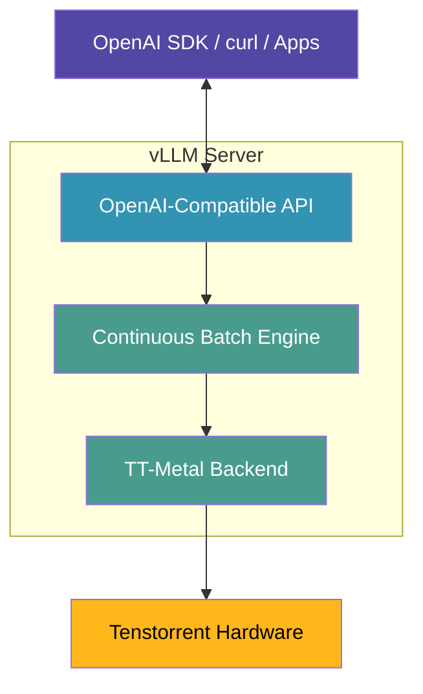

# Production Inference with vLLM

**⚠️ Note:** vLLM requires the HuggingFace model format. If you downloaded the model in Lesson 3 before this update, you may need to re-download to get both Meta and HuggingFace formats. The latest Lesson 3 downloads the complete model with all formats.

Take your AI deployment to the next level with vLLM - a production-grade inference engine that provides OpenAI-compatible APIs, continuous batching, and enterprise features for Tenstorrent hardware.

## What is vLLM?

**vLLM** is an open-source LLM serving library designed for high-throughput, low-latency inference. Tenstorrent maintains a fork that brings vLLM's advanced features to Tenstorrent hardware.

**Why vLLM?**
- 🚀 **OpenAI-compatible API** - drop-in replacement for OpenAI's API
- ⚡ **Continuous batching** - efficiently serve multiple users simultaneously
- 📊 **Production-tested** - used by companies at scale
- 🔧 **Advanced features** - request queuing, priority scheduling, streaming
- 🎯 **Easy deployment** - standardized server interface

## Journey So Far

- **Lesson 3:** One-shot inference demo
- **Lesson 4:** Interactive chat (custom app, model in memory)
- **Lesson 5:** Flask HTTP API (basic server)
- **Lesson 6:** vLLM (production-grade serving) ← **You are here**

## vLLM vs. Your Flask Server

| Feature | Flask (Lesson 5) | vLLM (Lesson 6) |
|---------|------------------|-----------------|
| Model Loading | Manual | Automatic |
| API Compatibility | Custom | OpenAI-compatible |
| Multiple Users | Sequential | Continuous batching |
| Request Queuing | Manual | Built-in |
| Streaming | Manual | Built-in |
| Production-Ready | Basic | Enterprise-grade |
| Learning Curve | Easy | Moderate |

**When to use what:**
- **Flask (Lesson 5):** Learning, prototyping, simple use cases
- **vLLM (Lesson 6):** Production, multiple users, scalability

## Architecture



## Prerequisites

- tt-metal installed and working (latest main branch - see Step 0 below if you need to update)
- Model downloaded (Llama-3.1-8B-Instruct)
- Python 3.10+ recommended
- ~20GB disk space for vLLM installation

## Starting Fresh?

If you're jumping directly to this lesson, verify your setup first:

**Quick prerequisite checks:**
```bash
# Hardware detected?
tt-smi

# tt-metal working?
python3 -c "import ttnn; print('✓ tt-metal ready')"

# Model downloaded?
ls ~/models/Llama-3.1-8B-Instruct/config.json

# Python version?
python3 --version  # Need 3.10+
```

**If any checks fail:**
- **No hardware?** → See [Hardware Detection](command:tenstorrent.showLesson?%7B%22lessonId%22%3A%22hardware-detection%22%7D)
- **No tt-metal?** → See [Verify Installation](command:tenstorrent.showLesson?%7B%22lessonId%22%3A%22verify-installation%22%7D)
- **No model?** → See [Download Model](command:tenstorrent.showLesson?%7B%22lessonId%22%3A%22download-model%22%7D) or download now:
  ```bash
  huggingface-cli download meta-llama/Llama-3.1-8B-Instruct \
    --local-dir ~/models/Llama-3.1-8B-Instruct
```

---

## The Perfect Starting Model: Qwen3-0.6B

**Why start with Qwen3-0.6B?**

You don't need 8B parameters for production AI. Qwen3-0.6B is a **game-changer** for development and many production use cases:

**🚀 Key Strengths:**
- ✅ **Dual Thinking Modes** - Switches between fast chat and deep reasoning automatically
- ✅ **Reasoning Excellence** - Outperforms many larger models on logic and math (MMLU-Redux: 55.6, MATH-500: 77.6)
- ✅ **Ultra-Lightweight** - 0.6B params (13x smaller than 8B models)
- ✅ **Blazing Fast** - Sub-millisecond inference, 10,000+ QPS capable
- ✅ **Multilingual** - Strong performance across many languages
- ✅ **N150-Perfect** - Guaranteed to work on DRAM-constrained systems
- ✅ **32K Context** - Long conversations, document analysis
- ✅ **Cost-Effective** - Minimal compute requirements

**Download Qwen3-0.6B:**

```bash
huggingface-cli download Qwen/Qwen3-0.6B --local-dir ~/models/Qwen3-0.6B
```


**No HuggingFace token needed!** Downloads in ~2-3 minutes.

---

## ⭐ Best Model for Coding Assistants: Qwen2.5-Coder-1.5B

**Building AI coding assistants (Aider, Continue, etc.)?** Use Qwen2.5-Coder - it's **specialized for code generation**:

**🎯 Why Qwen2.5-Coder-1.5B is Perfect for Coding:**
- ✅ **Code-Specialized Training** - Trained specifically on code datasets (Python, JavaScript, C++, etc.)
- ✅ **Excellent Code Completion** - Better code suggestions than general-purpose models
- ✅ **Strong Code Understanding** - Understands code structure, APIs, and patterns
- ✅ **1.5B params** - Small enough for N150, large enough for quality results
- ✅ **Fast Iteration** - Quick responses for coding workflows
- ✅ **N150-Perfect** - Fits comfortably on single-chip hardware
- ✅ **No Token Required** - Open weights, freely available

**Download Qwen2.5-Coder-1.5B-Instruct:**

```bash
huggingface-cli download Qwen/Qwen2.5-Coder-1.5B-Instruct --local-dir ~/models/Qwen2.5-Coder-1.5B-Instruct
```

**Takes ~2-3 minutes to download.** Perfect for:
- AI coding assistants (Aider, Continue)
- Code completion and generation
- Code explanation and documentation
- Bug fixing and refactoring
- Learning programming with AI

**Need even more code power?** Try **Qwen2.5-Coder-7B-Instruct** (requires N300+):

```bash
huggingface-cli download Qwen/Qwen2.5-Coder-7B-Instruct --local-dir ~/models/Qwen2.5-Coder-7B-Instruct
```

---

**Need more power? Other options:**

**📥 Gemma 3-1B-IT** - Slightly larger, Google quality

```bash
huggingface-cli download google/gemma-3-1b-it --local-dir ~/models/gemma-3-1b-it
```

- **1B params** (8x smaller than 8B)
- **140+ languages** supported
- **32K context** window
- Good for N150, works on N300

---

**📥 Llama-3.1-8B-Instruct** - For N300/T3K/P100 only

```bash
huggingface-cli download meta-llama/Llama-3.1-8B-Instruct --local-dir ~/models/Llama-3.1-8B-Instruct
```

**Requirements:**
- HuggingFace token (gated model)
- N300/T3K/P100 hardware (NOT recommended for N150)
- Higher DRAM usage

---

## Step 0: Update and Build TT-Metal (If Needed)

**⚠️ Important:** vLLM dev branch requires the latest tt-metal. If you get an `InputRegistry` error or "sfpi not found" error, update and rebuild tt-metal:

```bash
cd ~/tt-metal && \
  git checkout main && \
  git pull origin main && \
  git submodule update --init --recursive && \
  sudo ./install_dependencies.sh && \
  ./build_metal.sh
```

[🔧 Update and Build TT-Metal](command:tenstorrent.updateTTMetal)

**What this does:**
- Updates tt-metal to latest main branch
- Updates all submodules (including SFPI libraries)
- **Installs/updates system dependencies** (libraries, drivers, build tools)
- Rebuilds tt-metal with latest changes
- Takes ~5-15 minutes depending on hardware and system state

**When to do this:**
- First time setting up vLLM
- After updating tt-metal with `git pull`
- If you see "sfpi not found" errors
- If you see "InputRegistry" or other API compatibility errors
- After system updates or fresh installations

**Why install_dependencies.sh?** tt-metal requires specific system libraries, kernel modules, and build tools. This script ensures all dependencies are installed before building. Skipping this step can cause build failures or runtime errors.

**Why rebuild?** tt-metal includes compiled components (like SFPI) that must be built after code updates. The `build_metal.sh` script handles all necessary compilation steps.

---

## Verify vLLM Components

Before proceeding, let's check what you already have installed:

```bash
# Check if vLLM is cloned
[ -d ~/tt-vllm ] && echo "✓ vLLM repo found" || echo "✗ vLLM repo missing"

# Check if venv exists (correct location integrated with tt-metal)
[ -d ~/tt-metal/build/python_env_vllm ] && echo "✓ vLLM venv found" || echo "✗ vLLM venv missing"

# Check if activation script exists
[ -f ~/activate-vllm-env.sh ] && echo "✓ Activation script found" || echo "✗ Activation script missing"

# Check if server script exists
[ -f ~/tt-scratchpad/start-vllm-server.py ] && echo "✓ Server script found" || echo "✗ Server script missing"
```

**All checks passed?** You can skip to [Step 4: Start the Server](#step-4-start-the-openai-compatible-server).

**Some checks failed?** Continue with Step 2 (environment setup) below.

---

## Step 1: Clone TT vLLM Fork

First, get Tenstorrent's vLLM fork:

```bash
cd ~ && \
  git clone --branch dev https://github.com/tenstorrent/vllm.git tt-vllm && \
  cd tt-vllm
```

[📦 Clone TT vLLM Repository](command:tenstorrent.cloneVllm)

**What this does:**
- Clones the `dev` branch (Tenstorrent's main branch)
- Creates `~/tt-vllm` directory
- Takes ~1-2 minutes depending on connection

## Step 2: Set Up vLLM Environment (Critical!)

**⚠️ Important:** vLLM requires a specific Python environment with exact dependency versions for Tenstorrent hardware compatibility. The most common issue is PyTorch version mismatches.

### Automated Setup (Recommended) ⚡

**The fastest and most reliable way:**

```bash
bash ~/tt-scratchpad/setup-vllm-env.sh
```

**What this script does:**
1. ✅ Validates prerequisites (tt-metal installed, paths correct)
2. ✅ Creates Python venv at the CORRECT location (`${TT_METAL_HOME}/build/python_env_vllm`)
3. ✅ Installs PyTorch 2.5.0+cpu (exact version required for TT hardware)
4. ✅ Builds vLLM from source with TT hardware support
5. ✅ Installs all required dependencies (ttnn, pytest, fairscale, etc.)
6. ✅ Validates the installation (tests imports)
7. ✅ Creates convenient activation script (`~/activate-vllm-env.sh`)

**Time:** ~5-10 minutes (downloads + compilation)

**After completion:**
```bash
source ~/activate-vllm-env.sh
```

---

### Why This Matters

**Common issue:** vLLM on TT hardware requires:
- **PyTorch 2.5.0+cpu** (not 2.7.1, not 2.4.x)
- Environment integrated with tt-metal (not standalone venv)
- Exact versions from `requirements/tt.txt`

**Without the correct environment, you'll see:**
```
TypeError: must be called with a dataclass type or instance
# ... torch/_inductor/runtime/hints.py errors
```

**The automated script ensures everything is configured correctly!**

---

### Manual Setup (Alternative)

**If you prefer to do it manually:**

```bash
# 1. Set up environment variables
cd ~/tt-vllm
export vllm_dir=$(pwd)
source $vllm_dir/tt_metal/setup-metal.sh

# 2. Create Python venv at correct location
python3 -m venv $PYTHON_ENV_DIR
source $PYTHON_ENV_DIR/bin/activate

# 3. Install PyTorch 2.5.0+cpu (specific version!)
pip install --upgrade pip
pip install --index-url https://download.pytorch.org/whl/cpu \
    torch==2.5.0+cpu \
    torchvision==0.20.0 \
    torchaudio==2.5.0

# 4. Install dependencies
pip install --upgrade ttnn pytest
pip install fairscale termcolor loguru blobfile fire pytz llama-models==0.0.48

# 5. Install vLLM from source
cd $vllm_dir
pip install -e . --extra-index-url https://download.pytorch.org/whl/cpu
```

**Validate installation:**
```bash
python3 -c "import torch; print('✓ torch', torch.__version__)"
python3 -c "import vllm; print('✓ vllm import successful')"
python3 -c "import ttnn; print('✓ ttnn import successful')"
```

---

## Understanding the Starter Script

**The extension automatically creates** `~/tt-scratchpad/start-vllm-server.py` for you. This production-ready script makes vLLM incredibly easy to use!

**✨ New in v0.0.101: Hardware Auto-Detection!**
**✨ New in v0.0.99: Smart Defaults!**

Just specify the model - everything else is auto-configured:

```bash
# Minimal command (recommended):
python ~/tt-scratchpad/start-vllm-server.py --model ~/models/Qwen3-0.6B

# Script automatically detects and configures:
# Hardware Detection:
#   → Runs tt-smi -s to detect hardware type
#   → Sets MESH_DEVICE (N150/N300/T3K/P100/P150/GALAXY)
#   → Sets TT_METAL_ARCH_NAME=blackhole (for P100/P150)
#   → Sets TT_METAL_HOME=~/tt-metal (if not already set)
#
# Model Configuration:
#   → --served-model-name Qwen/Qwen3-0.6B
#   → --max-model-len 2048
#   → --max-num-seqs 16
#   → --block-size 64
```

**Override any setting as needed:**

```bash
# Override hardware detection:
export MESH_DEVICE=N300
python ~/tt-scratchpad/start-vllm-server.py --model ~/models/Qwen3-0.6B

# Override defaults:
python ~/tt-scratchpad/start-vllm-server.py \
  --model ~/models/Qwen3-0.6B \
  --max-model-len 8192
```

**What the script does automatically:**

1. **Detects hardware** - Runs tt-smi to identify N150/N300/T3K/P100/P150
2. **Sets environment variables** - MESH_DEVICE, TT_METAL_ARCH_NAME, TT_METAL_HOME
3. **Registers TT-optimized models** - TTLlamaForCausalLM for hardware acceleration
4. **Sets HF_MODEL** - Auto-detects org prefix (Qwen/, google/, meta-llama/)
5. **Sets served-model-name** - Clean API names (no directory paths)
6. **Applies sensible defaults** - Good for development, prevents OOM

**Works with any Llama-compatible model:**
- ✅ Qwen3-0.6B, Qwen3-8B, Qwen-2.5-7B-Coder
- ✅ Gemma 3-1B-IT, Gemma 3-4B-IT
- ✅ Llama-3.1-8B-Instruct, Llama-3.1-70B-Instruct
- ✅ Mistral-7B-Instruct, Mistral family
- ✅ Any Llama-compatible architecture

**Key insight:** Qwen, Gemma, and Mistral **use Llama architecture internally**, so they automatically benefit from the TT-optimized Llama implementation!

**Want to see the script?** Open `~/tt-scratchpad/start-vllm-server.py` - it's well-documented and shows exactly how everything works.

---

## Step 3: Create the vLLM Starter Script

Before starting the server, create the script that registers TT models with vLLM:

[📝 Create vLLM Starter Script](command:tenstorrent.createVllmStarter)

**What this does:**
- Creates `~/tt-scratchpad/start-vllm-server.py`
- Registers TT-optimized model implementations (TTLlamaForCausalLM)
- Works with Llama, Gemma, Qwen, Mistral, and other Llama-compatible models
- Opens the file so you can see how it works

**Why you need this:**
- vLLM doesn't automatically know about Tenstorrent's custom model implementations
- Without this script, vLLM will fail with: `ValidationError: Cannot find model module 'TTLlamaForCausalLM'`
- This script must run before vLLM starts

---

## Quick Start: Try It Now!

**✨ New in v0.0.101:** Ultra-simple one-command start with full hardware auto-detection!

```bash
source ~/activate-vllm-env.sh && \
  python ~/tt-scratchpad/start-vllm-server.py --model ~/models/Qwen3-0.6B
```

**That's literally it!** The activation script sets up the environment and the starter script auto-detects and configures:
- ✅ **Hardware type** (N150/N300/T3K/P100/P150) via tt-smi
- ✅ **MESH_DEVICE** environment variable
- ✅ **TT_METAL_ARCH_NAME** (blackhole for P100/P150)
- ✅ **TT_METAL_HOME** (defaults to ~/tt-metal)
- ✅ **Served model name** (`Qwen/Qwen3-0.6B`)
- ✅ **Sensible defaults** (2048 context, 16 seqs, 64 block size)

Model served as `Qwen/Qwen3-0.6B` with sensible defaults. Works on any hardware!

**Want more control?** Continue to Step 4 below for hardware-specific configurations with optimized settings.

---

## Step 4: Start the OpenAI-Compatible Server

Now start vLLM with your chosen model and hardware configuration. These commands show all parameters explicitly for learning purposes, but remember - you can use the minimal command above and override only what you need!

**✅ Start here:** Qwen3-0.6B is the **recommended** model for N150 - tiny, fast, and smart!

**Choose your hardware:**

---

### N150 (Wormhole - Single Chip) - Most common for development

**✅ Recommended: Qwen3-0.6B** - Tiny, fast, reasoning-capable!

**Command (tested and working):**

```bash
source ~/activate-vllm-env.sh && \
  python ~/tt-scratchpad/start-vllm-server.py \
    --model ~/models/Qwen3-0.6B \
    --served-model-name Qwen/Qwen3-0.6B \
    --host 0.0.0.0 \
    --port 8000 \
    --max-model-len 2048 \
    --max-num-seqs 16 \
    --block-size 64
```

**💡 What you get:**
- **~16 concurrent users** with 2K context each
- **Sub-second inference** - perfect for development
- **Reasoning capabilities** - dual thinking modes
- **Zero DRAM issues** - guaranteed to work on N150
- **Clean model name**: `Qwen/Qwen3-0.6B` (not `/home/user/models/...`)

**Note:** HF_MODEL is auto-detected! The script automatically sets `HF_MODEL=Qwen/Qwen3-0.6B` from your --model path.

---

**Alternative: Gemma 3-1B-IT** (slightly larger, 32K context)

```bash
source ~/activate-vllm-env.sh && \
  python ~/tt-scratchpad/start-vllm-server.py \
    --model ~/models/gemma-3-1b-it \
    --served-model-name google/gemma-3-1b-it \
    --host 0.0.0.0 \
    --port 8000 \
    --max-model-len 2048 \
    --max-num-seqs 12 \
    --block-size 64
```

---

**⚠️ Not recommended for N150: Llama-3.1-8B**

Llama-3.1-8B typically exhausts DRAM on N150. Use Qwen3-0.6B or Gemma 3-1B-IT instead for reliable operation.

If you must try Llama on N150:

```bash
source ~/activate-vllm-env.sh && \
  python ~/tt-scratchpad/start-vllm-server.py \
    --model ~/models/Llama-3.1-8B-Instruct \
    --served-model-name meta-llama/Llama-3.1-8B-Instruct \
    --host 0.0.0.0 \
    --port 8000 \
    --max-model-len 2048 \
    --max-num-seqs 2 \
    --block-size 64
```

[🚀 Start vLLM with Llama (N150 - Not Recommended)](command:tenstorrent.startVllmServerWithHardware?%7B%22hardware%22%3A%22N150%22%7D)

**Warning:** Expect DRAM exhaustion errors. Qwen3-0.6B is 13x smaller and works reliably.

---

### N300 (Wormhole - Dual Chip)

```bash
source ~/activate-vllm-env.sh && \
  python ~/tt-scratchpad/start-vllm-server.py \
    --model ~/models/Llama-3.1-8B-Instruct \
    --served-model-name meta-llama/Llama-3.1-8B-Instruct \
    --host 0.0.0.0 \
    --port 8000 \
    --max-model-len 131072 \
    --max-num-seqs 32 \
    --block-size 64 \
    --tensor-parallel-size 2
```

[🚀 Start vLLM Server (N300)](command:tenstorrent.startVllmServerWithHardware?%7B%22hardware%22%3A%22N300%22%7D)

---

### T3K (Wormhole - 8 Chips)

```bash
source ~/activate-vllm-env.sh && \
  python ~/tt-scratchpad/start-vllm-server.py \
    --model ~/models/Llama-3.1-70B-Instruct \
    --served-model-name meta-llama/Llama-3.1-70B-Instruct \
    --host 0.0.0.0 \
    --port 8000 \
    --max-model-len 131072 \
    --max-num-seqs 64 \
    --block-size 64 \
    --tensor-parallel-size 8
```

[🚀 Start vLLM Server (T3K)](command:tenstorrent.startVllmServerWithHardware?%7B%22hardware%22%3A%22T3K%22%7D)

**Note:** This uses the 70B model. Make sure you've downloaded it first.

---

### P100 (Blackhole - Single Chip)

```bash
source ~/activate-vllm-env.sh && \
  python ~/tt-scratchpad/start-vllm-server.py \
    --model ~/models/Llama-3.1-8B-Instruct \
    --served-model-name meta-llama/Llama-3.1-8B-Instruct \
    --host 0.0.0.0 \
    --port 8000 \
    --max-model-len 8192 \
    --max-num-seqs 4 \
    --block-size 64
```

[🚀 Start vLLM Server (P100)](command:tenstorrent.startVllmServerWithHardware?%7B%22hardware%22%3A%22P100%22%7D)

**⚠️ Remember:** P100 requires `TT_METAL_ARCH_NAME=blackhole` environment variable.

**💡 Memory Tip:** These settings use 8K context to avoid OOM errors. For longer context (16K), use `--max-model-len 16384 --max-num-seqs 1`.

---

---

**First time setup?** Create the starter script before using any of the commands above:

[📝 Create vLLM Starter Script](command:tenstorrent.createVllmStarter)

This creates `~/tt-scratchpad/start-vllm-server.py` which registers TT models with vLLM. The hardware-specific buttons above will create this automatically if it doesn't exist, but you can also create it manually with this button.

---

### Why a Custom Starter Script?

**The Problem:** vLLM doesn't automatically know about Tenstorrent's custom model implementations (like `TTLlamaForCausalLM`). Without registration, vLLM will fail with:
```yaml
ValidationError: Cannot find model module 'TTLlamaForCausalLM'
```

**The Solution:** A production-ready starter script that:
1. **Registers TT models** with vLLM's `ModelRegistry` API before the server starts
2. **Self-contained** - No dependency on fragile `examples/` directory
3. **Production-ready** - Can be version controlled, deployed, and maintained

**What the script does:**
```python
from vllm import ModelRegistry

# Register TT Llama implementation
ModelRegistry.register_model(
    "TTLlamaForCausalLM",
    "models.tt_transformers.tt.generator_vllm:LlamaForCausalLM"
)

# Then start vLLM server with all your flags
```

**Why not use `python -m vllm.entrypoints.openai.api_server` directly?**
- ❌ TT models not registered → ValidationError
- ❌ Falls back to slow HuggingFace Transformers (CPU)
- ❌ No way to register via CLI flags or environment variables

**Why not import from examples/?**
- ❌ `examples/` is not production code (may change/move/break)
- ❌ Creates fragile dependency on repository structure
- ❌ Not suitable for deployment or version control

**✅ Our approach:** Self-contained, production-ready script with inline registration

**The extension creates this script automatically** when you use any of the "Start vLLM Server" buttons above, or you can create it manually with the "Create vLLM Starter Script" button. You can also view/customize it at `~/tt-scratchpad/start-vllm-server.py`.

---

### Understanding the Configuration

**Environment variables (all hardware types need these):**
- `TT_METAL_HOME=~/tt-metal` - Points to tt-metal installation (required by setup-metal.sh)
- `MESH_DEVICE=<your-hardware>` - Targets your specific hardware (N150, N300, T3K, P100)
- `TT_METAL_ARCH_NAME=<architecture>` - **Required for Blackhole (P100)**: Set to `blackhole`. Wormhole chips (N150/N300/T3K) auto-detect but P100 needs explicit specification.
- `PYTHONPATH=$TT_METAL_HOME` - Required so Python can import TT model classes from tt-metal

**vLLM flags (vary by hardware):**
- `--model` - Local model path (downloaded in Lesson 3)
- `--max-model-len` - Context limit (64K for single-chip, 128K for multi-chip)
- `--max-num-seqs` - Maximum concurrent sequences (higher on multi-chip)
- `--block-size` - KV cache block size (typically 64)
- `--tensor-parallel-size` - Number of chips to use (only for multi-chip)

**What you'll see:**

```yaml
INFO: Loading model meta-llama/Llama-3.1-8B-Instruct
INFO: Initializing TT-Metal backend...
INFO: Model loaded successfully
INFO: Started server process
INFO: Waiting for application startup.
INFO: Application startup complete.
INFO: Uvicorn running on http://0.0.0.0:8000 (Press CTRL+C to quit)
```

**Server is ready!** Leave this terminal open.

---

## DIY: Switch Models Manually

**Want to try a different model?** It's easy! Just change the `--model` path in the command.

**Example: Switch from Llama to Qwen on N150:**

```bash
# Stop the current server (Ctrl+C in the server terminal)

# Start with Qwen instead
source ~/activate-vllm-env.sh && \
  python ~/tt-scratchpad/start-vllm-server.py \
    --model ~/models/Qwen3-8B \
    --host 0.0.0.0 \
    --port 8000 \
    --max-model-len 8192 \
    --max-num-seqs 4 \
    --block-size 64
```

**That's it!** The same script automatically detects Qwen is Llama-compatible and uses the TT-optimized implementation. Same performance, different model.

**Try comparing:**
1. Ask Llama: "Write hello world in Python"
2. Stop server (Ctrl+C)
3. Switch to Qwen (command above)
4. Ask Qwen the same question
5. Notice Qwen might give more detailed code comments (it's optimized for coding!)

**For other hardware:** Just copy the Qwen command from the [Hardware Configuration](#hardware-configuration) section above.

---

## Step 5: Test with OpenAI SDK

Open a **second terminal** and test with the OpenAI Python SDK:

```python
# Install OpenAI SDK if needed
# pip install openai

from openai import OpenAI

# Point to your vLLM server
client = OpenAI(
    base_url="http://localhost:8000/v1",
    api_key="dummy-key"  # vLLM doesn't require auth by default
)

# Chat completion with Qwen3-0.6B
response = client.chat.completions.create(
    model="Qwen/Qwen3-0.6B",
    messages=[
        {"role": "user", "content": "What is machine learning?"}
    ],
    max_tokens=128
)

print(response.choices[0].message.content)
```

[💬 Test with OpenAI SDK](command:tenstorrent.testVllmOpenai)

**Response:**
```bash
Machine learning is a subset of artificial intelligence that involves
training algorithms to learn from data and make predictions or decisions...
```

**Why this is powerful:** Your code is **identical** to code that calls OpenAI's API. Just change the `base_url`!

## Step 6: Test with curl

You can also use curl (same API as OpenAI):

```bash
curl http://localhost:8000/v1/chat/completions \
  -H "Content-Type: application/json" \
  -d '{
    "model": "Qwen/Qwen3-0.6B",
    "messages": [
      {"role": "user", "content": "Explain neural networks"}
    ],
    "max_tokens": 128
  }'
```

[🔧 Test with curl](command:tenstorrent.testVllmCurl)

**Response:**
```json
{
  "id": "cmpl-xxx",
  "object": "chat.completion",
  "created": 1234567890,
  "model": "Qwen/Qwen3-0.6B",
  "choices": [
    {
      "index": 0,
      "message": {
        "role": "assistant",
        "content": "Neural networks are computing systems inspired by..."
      },
      "finish_reason": "stop"
    }
  ],
  "usage": {
    "prompt_tokens": 5,
    "completion_tokens": 45,
    "total_tokens": 50
  }
}
```

## OpenAI-Compatible Endpoints

vLLM implements the OpenAI API specification:

### POST /v1/chat/completions

Chat-style completions (like ChatGPT):

```bash
curl http://localhost:8000/v1/chat/completions \
  -H "Content-Type: application/json" \
  -d '{
    "model": "Qwen/Qwen3-0.6B",
    "messages": [
      {"role": "system", "content": "You are a helpful assistant."},
      {"role": "user", "content": "What is AI?"}
    ],
    "temperature": 0.7,
    "max_tokens": 256
  }'
```

### POST /v1/completions

Text completions (continue a prompt):

```bash
curl http://localhost:8000/v1/completions \
  -H "Content-Type: application/json" \
  -d '{
    "model": "Qwen/Qwen3-0.6B",
    "prompt": "Once upon a time",
    "max_tokens": 100
  }'
```

### GET /v1/models

List available models:

```bash
curl http://localhost:8000/v1/models
```

Response:
```json
{
  "object": "list",
  "data": [
    {
      "id": "Qwen/Qwen3-0.6B",
      "object": "model",
      "owned_by": "tenstorrent"
    }
  ]
}
```

## Streaming Responses

vLLM supports streaming (tokens arrive as they're generated):

```python
from openai import OpenAI

client = OpenAI(base_url="http://localhost:8000/v1", api_key="dummy")

stream = client.chat.completions.create(
    model="Qwen/Qwen3-0.6B",
    messages=[{"role": "user", "content": "Write a story"}],
    stream=True,  # Enable streaming
    max_tokens=200
)

for chunk in stream:
    if chunk.choices[0].delta.content is not None:
        print(chunk.choices[0].delta.content, end='', flush=True)
```

Output appears word-by-word as it's generated!

## Continuous Batching Demo

vLLM's killer feature: serve multiple users efficiently:

```python
import asyncio
from openai import OpenAI

client = OpenAI(base_url="http://localhost:8000/v1", api_key="dummy")

async def query(prompt_id, prompt):
    """Send a query"""
    print(f"[{prompt_id}] Sending request...")
    response = client.chat.completions.create(
        model="Qwen/Qwen3-0.6B",
        messages=[{"role": "user", "content": prompt}],
        max_tokens=50
    )
    print(f"[{prompt_id}] Got response: {response.choices[0].message.content[:50]}...")

async def main():
    """Send 5 requests simultaneously"""
    tasks = [
        query(1, "What is AI?"),
        query(2, "Explain Python"),
        query(3, "What is quantum computing?"),
        query(4, "Tell me about space"),
        query(5, "How do computers work?")
    ]
    await asyncio.gather(*tasks)

asyncio.run(main())
```

**vLLM handles all 5 requests efficiently** using continuous batching - much better than sequential processing!

---

## Step 7: Showcase - Test Qwen3-0.6B's Reasoning

**Qwen3-0.6B's secret weapon:** Dual thinking modes! It automatically switches between fast chat and deep reasoning.

**Let's test its reasoning capabilities with a classic logic puzzle:**

```python
from openai import OpenAI

client = OpenAI(base_url="http://localhost:8000/v1", api_key="dummy")

# Classic reasoning test
response = client.chat.completions.create(
    model="Qwen/Qwen3-0.6B",
    messages=[{
        "role": "user",
        "content": "A farmer has 17 sheep. All but 9 die. How many sheep are left? Think step by step."
    }],
    max_tokens=256
)

print(response.choices[0].message.content)
```


**Expected output:**
```text
Let me think through this carefully:

1. The farmer starts with 17 sheep
2. "All but 9 die" means that 9 sheep survive
3. The sheep that die = 17 - 9 = 8 sheep
4. Therefore, 9 sheep remain alive

Answer: 9 sheep are left.
```

**Why this works:** Qwen3-0.6B recognizes this requires reasoning and automatically engages its "thinking mode" - even though it's only 0.6B parameters!

**Try more reasoning challenges:**

```python
# Math reasoning
response = client.chat.completions.create(
    model="Qwen/Qwen3-0.6B",
    messages=[{
        "role": "user",
        "content": "If a train travels 60 miles in 45 minutes, what is its speed in miles per hour?"
    }],
    max_tokens=128
)
```

```python
# Pattern recognition
response = client.chat.completions.create(
    model="Qwen/Qwen3-0.6B",
    messages=[{
        "role": "user",
        "content": "What comes next in this sequence: 2, 4, 8, 16, __?"
    }],
    max_tokens=64
)
```


**What makes Qwen3-0.6B special:**
- 🧠 **Dual Thinking Modes** - Automatically engages deep reasoning when needed
- 🎯 **Reasoning Benchmarks** - MMLU-Redux: 55.6, MATH-500: 77.6 (impressive for 0.6B!)
- ⚡ **Still Fast** - Thinking mode adds minimal latency
- 💰 **Best Value** - Sub-1B parameters with reasoning capabilities

This is why Qwen3-0.6B punches way above its weight class!

---

## Advanced Configuration

### Custom Parameters

```bash
python -m vllm.entrypoints.openai.api_server \
  --model meta-llama/Llama-3.1-8B-Instruct \
  --host 0.0.0.0 \
  --port 8000 \
  --max-model-len 2048 \           # Max sequence length
  --max-num-seqs 16 \              # Max concurrent sequences
  --disable-log-requests \          # Reduce logging
  --trust-remote-code              # Allow custom models
```

### Environment Variables

```bash
# Control tensor parallelism
export MESH_DEVICE=T3K  # or N150, N300, etc.

# Set cache directory
export HF_HOME=~/hf_cache

# Enable debug logging
export VLLM_LOGGING_LEVEL=DEBUG
```

## Deployment Patterns

### Pattern 1: Single Server

Simple deployment for moderate load:

```bash
python -m vllm.entrypoints.openai.api_server \
  --model $HF_MODEL \
  --host 0.0.0.0 \
  --port 8000
```

**Good for:** Dev/test, small teams, moderate QPS

### Pattern 2: Docker Container

Containerized deployment:

```dockerfile
FROM tenstorrent/tt-metal:latest

RUN pip install vllm

CMD python -m vllm.entrypoints.openai.api_server \
    --model meta-llama/Llama-3.1-8B-Instruct \
    --host 0.0.0.0 \
    --port 8000
```

**Good for:** Consistent environments, easier scaling

### Pattern 3: Load Balanced

Multiple vLLM servers behind nginx:

```text
nginx (load balancer)
  ├── vLLM server 1 (port 8001)
  ├── vLLM server 2 (port 8002)
  └── vLLM server 3 (port 8003)
```

**Good for:** High availability, horizontal scaling

## Performance Tuning

**Tips for best performance:**

1. **Set appropriate batch size:**
```bash
--max-num-seqs 32  # Higher = more throughput, more memory
```

2. **Optimize sequence length:**
```bash
--max-model-len 2048  # Match your use case
```

3. **Enable GPU memory optimization:**
```bash
--gpu-memory-utilization 0.9  # Use 90% of GPU memory
```

4. **Monitor metrics:**
- Watch request latency
- Track throughput (requests/sec)
- Monitor GPU/NPU utilization

## Monitoring and Observability

vLLM provides metrics endpoints:

```bash
# Prometheus metrics
curl http://localhost:8000/metrics

# Health check
curl http://localhost:8000/health

# Server stats
curl http://localhost:8000/v1/models
```

**Integration with monitoring tools:**
- Prometheus for metrics collection
- Grafana for visualization
- Custom alerting on latency/throughput

## Comparison: Your Journey

| Approach | Speed | Control | Prod-Ready | Use Case |
|----------|-------|---------|------------|----------|
| **Lesson 3: One-shot** | Slow | Low | ❌ | Testing |
| **Lesson 4: Direct API** | Fast | High | ⚠️ | Learning |
| **Lesson 5: Flask** | Fast | High | ⚠️ | Prototyping |
| **Lesson 6: vLLM** | Fast | Medium | ✅ | Production |

**Summary:**
- **Lessons 3-4:** Learn how inference works
- **Lesson 5:** Build custom APIs
- **Lesson 6:** Deploy at scale

Each approach serves a purpose - choose based on your needs.

## Troubleshooting

Don't worry if you hit issues - they're usually straightforward to fix. Here are common solutions:

### Server Won't Start

**Check your environment:**
```bash
# Activate environment
source ~/activate-vllm-env.sh

# Verify model path
ls ~/models/Llama-3.1-8B-Instruct/config.json
```

**PyTorch dataclass errors (TypeError: must be called with a dataclass type or instance):**
This is the most common environment issue - wrong PyTorch version!

```bash
# Check your PyTorch version
source ~/activate-vllm-env.sh
python3 -c "import torch; print('PyTorch version:', torch.__version__)"
```

**If you see anything other than 2.5.0+cpu, recreate your environment:**
```bash
# Run the automated setup script
bash ~/tt-scratchpad/setup-vllm-env.sh
```

**Import errors (e.g., "No module named 'llama_models'", "No module named 'fairscale'", "No module named 'pytz'", etc.):**
These usually mean the environment wasn't set up correctly. Best solution: recreate it.

```bash
# Run the automated setup script
bash ~/tt-scratchpad/setup-vllm-env.sh
```

**Out of Memory / DRAM Exhausted (N150 Users):**
If larger models (8B params) exhaust your DRAM on N150, use smaller models:

**Recommended small models:**
- **Qwen3-0.6B** - 0.6B params (13x smaller than 8B) ✅ **Best for N150**
  ```bash
  # Download and run Qwen3-0.6B
  huggingface-cli download Qwen/Qwen3-0.6B --local-dir ~/models/Qwen3-0.6B

  # Start server (use N150 command from Step 4 above)
  python ~/tt-scratchpad/start-vllm-server.py --model ~/models/Qwen3-0.6B ...
```

- **Gemma 3-1B-IT** - 1B params (8x smaller than 8B)
  ```bash
  # Download and run Gemma 3-1B-IT
  huggingface-cli download google/gemma-3-1b-it --local-dir ~/models/gemma-3-1b-it

  # Start server (use N150 command from Step 4 above)
  python ~/tt-scratchpad/start-vllm-server.py --model ~/models/gemma-3-1b-it ...
```

**Why small models work better on N150:**
- **Minimal DRAM usage** - Fits comfortably in N150's memory
- **Faster inference** - Smaller model = faster generation
- **Same API** - Works with all the same commands
- **Perfect for development** - Ideal for testing and iteration

**AttributeError: 'InputRegistry' object has no attribute 'register_input_processor':**
**Error: sfpi not found at /home/user/tt-metal/runtime/sfpi:**
These errors indicate tt-metal needs to be updated and rebuilt. Solution:
```bash
# Update and rebuild tt-metal (Step 0)
cd ~/tt-metal
./build_metal.sh --clean       # Clean old build artifacts first
git checkout main
git pull origin main
git submodule update --init --recursive
sudo ./install_dependencies.sh      # Install/update system dependencies
./build_metal.sh               # Build tt-metal

# Then recreate vLLM environment with updated ttnn
bash ~/tt-scratchpad/setup-vllm-env.sh
```

**Why `--clean`?** Removes all cached build artifacts to prevent conflicts between old and new versions. This forces a complete rebuild from scratch.

**Why install_dependencies.sh?** Ensures all system libraries, kernel modules, and build tools are installed before building. Prevents build failures and runtime errors.

**Why rebuild?** tt-metal includes compiled components (SFPI libraries, kernels) that must be built after code updates. The vLLM dev branch expects the latest tt-metal APIs.

**RuntimeError: Failed to infer device type (Blackhole P100):**
The `start-vllm-server.py` script now auto-detects P100 and sets `TT_METAL_ARCH_NAME=blackhole` automatically!

**If auto-detection fails, you can override:**
```bash
export TT_METAL_ARCH_NAME=blackhole
export MESH_DEVICE=P100
source ~/activate-vllm-env.sh && \
  python ~/tt-scratchpad/start-vllm-server.py \
    --model ~/models/Llama-3.1-8B-Instruct
```

**Why this happens:** Blackhole hardware (P100) requires explicit architecture specification. The starter script detects this via tt-smi and sets it automatically. If detection fails, set manually as shown above.

**ValidationError: Cannot find model module 'TTLlamaForCausalLM':**
This error means vLLM cannot find the TT model implementation. Solution:
```bash
# Use the starter script (Step 4) which registers TT models
python ~/tt-scratchpad/start-vllm-server.py --model ~/models/Llama-3.1-8B-Instruct
```

**Why this happens:** vLLM needs to explicitly register TT models using `ModelRegistry.register_model()` before starting. The starter script does this automatically. Do NOT call `python -m vllm.entrypoints.openai.api_server` directly - it will fail because TT models aren't registered.

**Verify your starter script exists:**
```bash
ls -la ~/tt-scratchpad/start-vllm-server.py
# If missing, use the extension button "Create vLLM Server Starter Script" in Lesson 6
```

**Other import errors or virtual environment issues (e.g., "No module named 'xyz'"):**
Best solution: recreate the environment with the automated script.

```bash
# Recreate the vLLM environment (will prompt before removing existing)
bash ~/tt-scratchpad/setup-vllm-env.sh
```

This ensures:
- ✅ Correct PyTorch version (2.5.0+cpu)
- ✅ Correct environment location (integrated with tt-metal)
- ✅ All dependencies installed properly
- ✅ Environment validated before completion

**Slow inference:**
- Check `--max-num-seqs` setting
- Monitor GPU/NPU utilization
- Reduce `--max-model-len` if not needed

**Out of memory:**
- Reduce `--max-num-seqs`
- Reduce `--max-model-len`
- Close other programs

---

## What You Learned

- ✅ How to install and configure vLLM for Tenstorrent
- ✅ OpenAI-compatible API usage
- ✅ Continuous batching for efficient serving
- ✅ Streaming responses
- ✅ Production deployment patterns
- ✅ Performance monitoring and tuning

**Key takeaway:** vLLM bridges the gap between custom code and production deployment, giving you enterprise features while maintaining compatibility with standard APIs.

---

## Bonus Lap: AI Coding Agents - Build Something Right Now!

**You just got vLLM running - let's immediately put it to work!** 🚀

Now that your local model server is running, you can connect AI coding agents to build projects with AI assistance. This is 100% private (your code never leaves your machine), zero API costs, and surprisingly capable.

### Why This Matters

- **100% Private** - All AI runs locally on your Tenstorrent hardware
- **Zero Cost** - No OpenAI/Anthropic API fees
- **Fast** - Specialized hardware acceleration
- **Full Control** - See exactly how the AI assists you
- **Educational** - Learn by watching AI write code

### Prerequisites

Before starting, make sure:
- ✅ vLLM server is running from the previous steps (test with `curl http://localhost:8000/health`)
- ✅ Model is loaded and responding
- ✅ You have Python 3.9+ and git installed

### Option 1: Aider CLI Agent (Recommended)

**Aider** is a powerful CLI tool that edits your code files directly with full git integration.

#### Quick Setup (Automated) ⚡

**The fastest way!** Run our automated setup script:

```bash
bash ~/tt-scratchpad/setup-aider.sh
```

**This script automatically:**
- ✅ Creates Python virtual environment (`~/aider-venv`)
- ✅ Installs aider-chat
- ✅ Configures Aider for Qwen2.5-Coder
- ✅ Creates wrapper script (`aider-tt`)
- ✅ Tests connection to vLLM server

**Takes ~2 minutes.** After completion, just run `aider-tt` to start!

---

#### Manual Setup (Alternative)

**Prefer to do it manually?** Follow these steps:

```bash
# Create dedicated virtual environment for Aider
python3 -m venv ~/aider-venv
source ~/aider-venv/bin/activate

# Install Aider
pip install aider-chat

# Verify installation
aider --version
```

#### Configure Aider for Your Local Model

Create Aider's configuration file:

```bash
# Create config directory
mkdir -p ~/.aider

# Create config file
cat > ~/.aider/aider.conf.yml << 'EOF'
# Aider configuration for local vLLM server

# Use OpenAI-compatible API format with Qwen2.5-Coder (code-specialized model!)
model: openai/Qwen/Qwen2.5-Coder-1.5B-Instruct

# Point to your local vLLM server
openai-api-base: http://localhost:8000/v1

# No API key needed for local server
openai-api-key: sk-no-key-required

# Model settings optimized for Qwen2.5-Coder
max-tokens: 2048
temperature: 0.6

# Git settings
auto-commits: false
dirty-commits: true
EOF

echo "✓ Aider configuration created at ~/.aider/aider.conf.yml"
```

**Why Qwen2.5-Coder?** It's specifically trained for coding tasks and will give you much better results than general-purpose models for code generation, refactoring, and bug fixing!

#### Test Aider Connection

```bash
# Activate Aider environment
source ~/aider-venv/bin/activate

# Quick connection test (will exit immediately)
aider --model openai/Qwen/Qwen2.5-Coder-1.5B-Instruct \
      --openai-api-base http://localhost:8000/v1 \
      --openai-api-key sk-no-key-required \
      --yes \
      --message "/exit"
```

If you see the Aider prompt, you're connected! ✅

#### Your First AI-Assisted Project

Let's build a simple task manager to see Aider in action:

```bash
# Create project directory
mkdir -p ~/ai-projects/task-manager
cd ~/ai-projects/task-manager

# Initialize git (Aider loves git!)
git init
git config user.name "Your Name"
git config user.email "you@example.com"

# Create initial README
cat > README.md << 'EOF'
# Task Manager CLI

A command-line task manager built with AI assistance.
EOF

git add README.md
git commit -m "Initial commit"

# Start Aider with code-specialized model
aider --model openai/Qwen/Qwen2.5-Coder-1.5B-Instruct \
      --openai-api-base http://localhost:8000/v1 \
      --openai-api-key sk-no-key-required
```

**Now you're in Aider! Try these prompts:**

```
Aider> Create a task_manager.py file that implements a CLI task manager with add, list, and complete commands using argparse. Store tasks in a JSON file.

Aider> Add error handling for file operations

Aider> /diff
# Shows what changes were made

Aider> /run python task_manager.py add "Test task"
# Test your code!

Aider> /commit
# Commits changes with AI-generated commit message

Aider> /exit
```

#### Create a Convenient Wrapper Script (Optional)

Make Aider easier to launch:

```bash
# Create wrapper script
mkdir -p ~/bin
cat > ~/bin/aider-tt << 'EOF'
#!/bin/bash
# Aider wrapper for Tenstorrent local models

source ~/aider-venv/bin/activate

# Check if server is running
if ! curl -s http://localhost:8000/health > /dev/null 2>&1; then
    echo "ERROR: vLLM server is not running at http://localhost:8000"
    echo "Start the server first (see Lesson 6)."
    exit 1
fi

# Run Aider with local code-specialized model
exec aider \
    --model openai/Qwen/Qwen2.5-Coder-1.5B-Instruct \
    --openai-api-base http://localhost:8000/v1 \
    --openai-api-key sk-no-key-required \
    "$@"
EOF

chmod +x ~/bin/aider-tt

# Add to PATH
echo 'export PATH="$HOME/bin:$PATH"' >> ~/.bashrc
source ~/.bashrc

# Now you can just type: aider-tt
```

#### Useful Aider Commands

```bash
# Inside Aider prompt
/help                 # Show all commands
/add <file>          # Add file to chat context
/drop <file>         # Remove file from context
/diff                # Show pending changes
/undo                # Undo last change
/commit              # Commit with AI message
/run <command>       # Run shell command
/exit                # Exit Aider

# Starting Aider with specific files
aider file1.py file2.py    # Add files immediately to context
```

### Option 2: Continue VSCode Extension

**Continue** brings AI assistance directly into VSCode. Great if you prefer IDE workflows.

#### Install Continue

1. Open VSCode
2. Go to Extensions (Ctrl+Shift+X / Cmd+Shift+X)
3. Search for "Continue"
4. Click "Install"

#### Configure Continue

1. Click the Continue icon in the sidebar
2. Click the gear icon (⚙️) to open settings
3. Replace the config with:

```json
{
  "models": [
    {
      "title": "Qwen2.5-Coder 1.5B (Local TT - Code Specialist)",
      "provider": "openai",
      "model": "Qwen/Qwen2.5-Coder-1.5B-Instruct",
      "apiBase": "http://localhost:8000/v1",
      "apiKey": "sk-no-key-required"
    }
  ],
  "tabAutocompleteModel": {
    "title": "Llama 3.2 3B (Local TT)",
    "provider": "openai",
    "model": "meta-llama/Llama-3.2-3B-Instruct",
    "apiBase": "http://localhost:8000/v1",
    "apiKey": "sk-no-key-required"
  },
  "allowAnonymousTelemetry": false
}
```

4. Save (Ctrl+S / Cmd+S)
5. Reload window: Ctrl+Shift+P → "Developer: Reload Window"

#### Using Continue

**Chat Interface:**
- Click Continue icon in sidebar
- Select model from dropdown
- Start chatting about your code

**Inline Editing:**
- Highlight code in editor
- Press Ctrl+I (Cmd+I on Mac)
- Type instructions (e.g., "Add error handling")
- Press Enter

**Tab Autocomplete:**
- Just start typing
- Continue suggests completions
- Press Tab to accept

### Example Workflow: Build a Weather CLI

Let's build a complete project using your local AI:

```bash
# Setup
mkdir -p ~/ai-projects/weather-cli
cd ~/ai-projects/weather-cli
git init

# Start Aider
source ~/aider-venv/bin/activate
aider --model openai/meta-llama/Llama-3.2-3B-Instruct \
      --openai-api-base http://localhost:8000/v1 \
      --openai-api-key sk-no-key-required
```

**Step-by-step prompts in Aider:**

```
1. Create a weather.py file that fetches weather data from wttr.in using the requests library.

2. Add a CLI interface using click that accepts a city name and displays temperature and conditions.

3. Add colored output using colorama to make it visually appealing.

4. Create a requirements.txt with all dependencies.

5. Add error handling for network failures and invalid cities.

6. Create a README.md with installation and usage instructions.

7. Create tests in test_weather.py using pytest.
```

**Test your app:**
```bash
# Install dependencies
pip install -r requirements.txt

# Run the app
python weather.py "San Francisco"
python weather.py "Tokyo"
```

### Best Practices for AI-Assisted Coding

**1. Start Small**
```bash
# Good: Specific, focused request
"Add input validation to the login function"

# Too broad: Vague, hard to implement
"Make the app better"
```

**2. Iterate Incrementally**
```bash
# Step 1
"Create a basic user class with name and email fields"

# Step 2
"Add password hashing to the user class"

# Step 3
"Add validation for email format"
```

**3. Provide Context**
```bash
# Good: Provides context
"Add error handling to the API call in fetch_data(). Handle network timeouts, 404s, and JSON decode errors."

# Less effective: Lacks context
"Add error handling"
```

**4. Use Git Effectively**
```bash
# Commit frequently with Aider
Aider> /commit

# Review changes before committing
Aider> /diff

# Undo if needed
Aider> /undo
```

**5. Test as You Go**
```bash
# Test after each feature
Aider> /run pytest
Aider> /run python app.py --test-mode
```

### Troubleshooting

**Issue: "Connection refused" to local model**

```bash
# Check if server is running
curl http://localhost:8000/health

# If not running, restart from Step 4 of this lesson
# Go back to the server terminal and verify it's running
```

**Issue: Slow responses from model**

```bash
# Reduce max_tokens in Aider config
# Edit ~/.aider/aider.conf.yml
max-tokens: 512  # Instead of 2048

# Use shorter, more focused prompts
```

**Issue: Model gives poor suggestions**

```bash
# Be more specific in your instructions
"Add error handling for FileNotFoundError and PermissionError when reading config.json"

# Provide examples
"Create a function similar to this: [paste example code]"

# Iterate with feedback
"The previous code had a bug where X. Fix it by doing Y."
```

**Issue: Aider won't start**

```bash
# Ensure virtual environment is activated
source ~/aider-venv/bin/activate

# Reinstall if needed
pip install --upgrade aider-chat

# Check Python version (must be 3.9+)
python --version
```

### Example Projects to Try

**Beginner: Todo List App**
- CLI with add/list/complete/delete commands
- JSON file storage
- Tests with pytest
- ~30 minutes with AI assistance

**Intermediate: REST API**
- FastAPI server with CRUD endpoints
- SQLite database
- Request validation
- Basic authentication
- ~60 minutes with AI assistance

**Advanced: Data Analyzer**
- Read CSV files
- Data analysis with pandas
- Generate visualizations with matplotlib
- Export reports
- ~90 minutes with AI assistance

### Comparing Aider vs Continue

| Feature | Aider (CLI) | Continue (VSCode) |
|---------|-------------|-------------------|
| **Interface** | Command line | VSCode integrated |
| **Git Integration** | Excellent (auto-commits) | Manual |
| **Multi-file Editing** | Native support | Context-based |
| **Tab Completion** | No | Yes |
| **Inline Editing** | No | Yes |
| **Best For** | Focused coding sessions | Continuous development |

**Recommendation:**
- Use **Aider** for: New projects, refactoring, focused feature work
- Use **Continue** for: Daily development, quick edits, exploration

## Next Steps

**You've completed the walkthrough!** 🎉

**Where to go from here:**

1. **Build Applications:**
   - Integrate with your existing services
   - Build chat interfaces
   - Create AI-powered features

2. **Optimize Performance:**
   - Tune batch sizes for your workload
   - Implement caching strategies
   - Monitor and optimize

3. **Scale Up:**
   - Deploy multiple instances
   - Add load balancing
   - Implement autoscaling

4. **Explore More Models:**
   - Try different Llama variants
   - Test Mistral, Qwen, etc.
   - Fine-tune for your use case

## Learn More

- **TT vLLM Fork:** [github.com/tenstorrent/vllm](https://github.com/tenstorrent/vllm/tree/dev)
- **vLLM Docs:** [docs.vllm.ai](https://docs.vllm.ai/en/latest/)
- **OpenAI API Reference:** [platform.openai.com/docs](https://platform.openai.com/docs/api-reference)
- **TT-Metal Docs:** [docs.tenstorrent.com](https://docs.tenstorrent.com/)

## Community & Support

- **GitHub Issues:** Report bugs and request features
- **Discord:** Join the Tenstorrent community
- **Documentation:** Check the tt-metal README

**Thank you for completing this walkthrough!** You now have the knowledge to build, deploy, and scale AI applications on Tenstorrent hardware. 🚀
