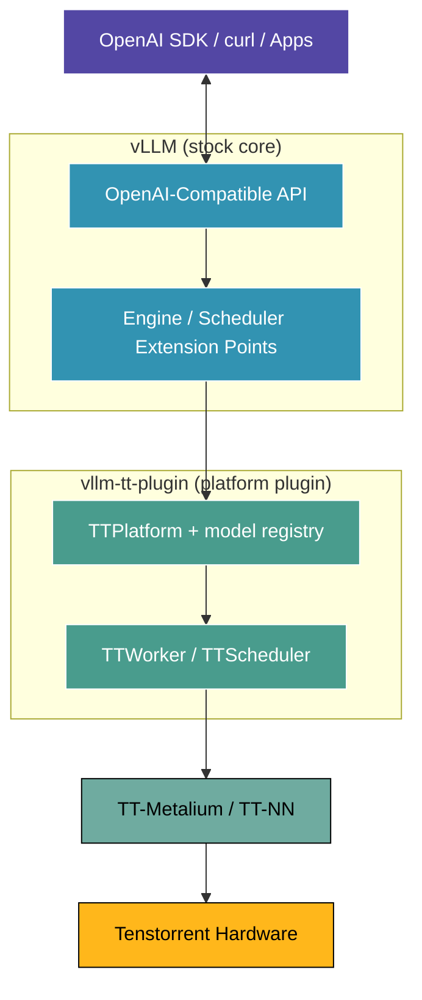

# Production Inference with vLLM

**⚠️ Note:** vLLM requires the HuggingFace model format. If you downloaded the model in Lesson 3 before this update, you may need to re-download to get both Meta and HuggingFace formats. The latest Lesson 3 downloads the complete model with all formats.

Take your AI deployment to the next level with vLLM - a production-grade inference engine that provides OpenAI-compatible APIs, continuous batching, and enterprise features for Tenstorrent hardware.

## What is vLLM?

**vLLM** is an open source LLM serving library designed for high-throughput, low-latency inference.

**Why vLLM?**
- 🚀 **OpenAI-compatible API** - drop-in replacement for OpenAI's API
- ⚡ **Continuous batching** - efficiently serve multiple users simultaneously
- 📊 **Production-tested** - used by companies at scale
- 🔧 **Advanced features** - request queuing, priority scheduling, streaming
- 🎯 **Easy deployment** - standardized server interface

## How Tenstorrent Plugs Into vLLM

Tenstorrent support is delivered as a **vLLM platform plugin** — a package named
`vllm-tt-plugin`, importable as `vllm_tt_plugin` — built on vLLM's standard out-of-tree
plugin mechanism. It registers two entry points:

| Entry point group | Name | Target |
|---|---|---|
| `vllm.platform_plugins` | `tt` | `vllm_tt_plugin.entrypoints:platform_plugin` |
| `vllm.general_plugins` | `tt_model_registry` | `vllm_tt_plugin.entrypoints:register` |

The key behaviour: `platform_plugin()` returns the TT platform **only when `ttnn` is
importable**. That single check does two jobs at once — it means the TT platform is
selected automatically when you are on Tenstorrent hardware with tt-metal available, and
it means the plugin never hijacks an ordinary vLLM environment that happens to have it
installed.

Everything TT-specific lives inside the plugin: model registration, platform detection,
request validation, scheduling, worker execution, model loading, and multi-host launch
orchestration. **Nothing TT-specific needs to touch vLLM core.**

### Why this matters to you

Under the older architecture, the TT model classes had to be registered by hand with
`ModelRegistry.register_model()` before the server started, which is why earlier versions
of this lesson had you generate a custom Python starter script. **That is no longer
necessary.** Model registration happens through the `tt_model_registry` entry point, so
the ordinary `vllm serve` command line works, and this lesson uses it throughout.

### Honest status (verified 2026-08-03)

Be aware of what this is and is not, so you don't go looking for things that don't exist:

- ✅ It is a **technically conformant out-of-tree platform plugin** using vLLM's documented
  entry-point mechanism, and it installs against **upstream vLLM**. There is **no
  Tenstorrent fork of vLLM** anywhere in this path.
- ✅ Its official home is the standalone repository
  **[`github.com/tenstorrent/vllm-tt-plugin`](https://github.com/tenstorrent/vllm-tt-plugin)**.
  The installer there pins **stock `vllm==0.24.0`** and builds it from the source
  distribution. Other vLLM versions are untested.
- ❌ Tenstorrent is **not** listed in upstream vLLM's docs, its README hardware-plugin
  list, or `vllm/platforms/`. There is **no** TT plugin published on PyPI, so
  `pip install vllm-tt-plugin` does **not** work — don't try it.
- 🔧 Installation is therefore still **from source**: clone the plugin repo and run its
  installer inside an activated tt-metal environment. That's Step 1 and Step 2 below.

**Superseded: the in-fork plugin.** Until recently the plugin shipped *inside* the
`tenstorrent/vllm` fork on its `dev` branch, at `plugins/vllm-tt-plugin`, and earlier
versions of this lesson documented that path. **That path is being retired.** If you have an
older `~/tt-vllm` checkout, stop installing from it and switch to the standalone repo — see
[Migrating from an older `~/tt-vllm` checkout](#migrating-from-an-older-tt-vllm-checkout).
tt-metal's README still links to the in-fork copy at the time of writing; treat that link as
lagging rather than authoritative.

**What did *not* change.** Everything after the install is identical: `vllm serve`,
`MESH_DEVICE`, `--additional-config '{"tt": {...}}'`, the two entry point names, and the
operational constraints. Only the install step moved.

## Journey So Far

- **Lesson 3:** One-shot inference demo
- **Lesson 4:** Interactive chat (custom app, model in memory)
- **Lesson 5:** Flask HTTP API (basic server)
- **Lesson 6:** vLLM (production-grade serving) ← **You are here**

## vLLM vs. Your Flask Server

| Feature | Flask (Lesson 5) | vLLM (Lesson 6) |
|---------|------------------|-----------------|
| Model Loading | Manual | Automatic |
| API Compatibility | Custom | OpenAI-compatible |
| Multiple Users | Sequential | Continuous batching |
| Request Queuing | Manual | Built-in |
| Streaming | Manual | Built-in |
| Production-Ready | Basic | Enterprise-grade |
| Learning Curve | Easy | Moderate |

**When to use what:**
- **Flask (Lesson 5):** Learning, prototyping, simple use cases
- **vLLM (Lesson 6):** Production, multiple users, scalability

## Architecture


```mermaid
graph TB
    Clients[OpenAI SDK / curl / Apps]

    subgraph vLLM["vLLM (stock core)"]
        API[OpenAI-Compatible API]
        Batch[Engine / Scheduler Extension Points]

        API --> Batch
    end

    subgraph Plugin["vllm-tt-plugin (platform plugin)"]
        Platform[TTPlatform + model registry]
        Worker[TTWorker / TTScheduler]

        Platform --> Worker
    end

    Metal[TT-Metalium / TT-NN]
    Hardware[Tenstorrent Hardware]

    Clients <--> API
    Batch --> Platform
    Worker --> Metal
    Metal --> Hardware

    style Clients fill:#5347a4,stroke:#fff,color:#fff
    style API fill:#3293b2,stroke:#fff,color:#fff
    style Batch fill:#3293b2,stroke:#fff,color:#fff
    style Platform fill:#499c8d,stroke:#fff,color:#fff
    style Worker fill:#499c8d,stroke:#fff,color:#fff
    style Metal fill:#6FABA0,stroke:#000,color:#000
    style Hardware fill:#ffb71b,stroke:#000,color:#000
```

**Read the diagram as the architecture story:** vLLM core is unmodified. The plugin hooks in
through vLLM's documented extension points and owns everything below them — platform
selection, model registration, scheduling, and worker execution — then talks to TT-Metalium
and your hardware.

## Prerequisites

- An environment with an importable `ttnn` plus a tt-metal `models/` tree — either the published `ttnn` wheel or a TT-Metalium source build. See Step 0; it takes seconds via the wheel.
- **An activated tt-metal Python environment** — the installer expects to run inside one
- Model downloaded (Llama-3.1-8B-Instruct, or Qwen3-0.6B for a quick first run)
- **Python `>=3.10,<3.14`** — the range upstream vLLM 0.24.0 accepts. Python 3.10.12 is the
  default `python3` on Ubuntu 22.04.
- ~20GB free disk space — vLLM is built from its source distribution, which is not cheap

## Starting Fresh?

If you're jumping directly to this lesson, verify your setup first:

**Quick prerequisite checks:**
```bash
# Hardware detected?
tt-smi

# TT-Metalium working?
python3 -c "import ttnn; print('✓ tt-metal ready')"

# Model downloaded?
ls ~/models/Llama-3.1-8B-Instruct/config.json

# Python version?
python3 --version  # Need 3.10+
```

**If any checks fail:**

- **No hardware?** → See [Hardware Detection](command:tenstorrent.showLesson?["hardware-detection"])
- **No TT-Metalium?** → See [Verify Installation](command:tenstorrent.showLesson?["verify-installation"])
- **No model?** → See [Download Model](command:tenstorrent.showLesson?["download-model"]) or download now:

  ```bash
  hf download meta-llama/Llama-3.1-8B-Instruct \
    --local-dir ~/models/Llama-3.1-8B-Instruct
  ```

---

## The Easiest Starting Model: Qwen3-0.6B

Qwen3-0.6B is the **smallest, fastest thing to get running** on this path, which makes it a
good first target while you are still proving out your install. It is small enough to load
in seconds and small enough that DRAM is never the thing that fails.

**🚀 What it gives you:**
- ✅ **Dual thinking modes** - switches between fast chat and deeper reasoning
- ✅ **Strong for its size** - upstream reports MMLU-Redux 55.6, MATH-500 77.6
- ✅ **Ultra-lightweight** - 0.6B params, roughly 13× smaller than an 8B model
- ✅ **Fast to load** - short model-load and compile time, so your feedback loop is quick
- ✅ **Multilingual**, **32K context**
- ✅ **No HuggingFace token needed** - open weights, downloads in ~2-3 minutes

**Download Qwen3-0.6B:**

```bash
hf download Qwen/Qwen3-0.6B --local-dir ~/models/Qwen3-0.6B
```

### ⚠️ Be honest about what Qwen3-0.6B is (verified 2026-08-03)

**Qwen3-0.6B is not on tt-metal's supported-model list, and we are not claiming it as
validated on this path.** The specifics, so you can judge for yourself:

- The plugin maps models to TT classes **by HF architecture**, so a Qwen3 checkpoint of any
  size resolves to `TTQwen3ForCausalLM` and will load and run.
- But `tt-metal/models/tt_transformers/` contains **no `0.6B` model parameters at all**. The
  only Qwen3 size tt-transformers carries tuned parameters for is **Qwen3-32B**
  (LoudBox/QuietBox-class hardware). So 0.6B runs on generic defaults, not on anything
  anyone tuned or measured.
- Practically: expect it to work for smoke tests and API plumbing, and do **not** treat its
  throughput, accuracy, or stability as representative.

**The documented choices**, if you want a model that tt-metal actually supports and pins:

| Model | Hardware | Why |
|---|---|---|
| **Llama-3.1-8B-Instruct** | n150\* / n300 / p100 / p150 | The most thoroughly documented tt-transformers model; per-device settings exist |
| **Qwen3-32B** | Wormhole QuietBox (T3K) / Galaxy | The only Qwen3 with tt-transformers model parameters |
| **Llama-3.1-70B-Instruct** | T3K / Galaxy | Well-covered multi-chip reference |

\* **On n150, Llama-3.1-8B is tight.** The plugin's own docs give it a reduced context on
`N150`, and in our experience it can still exhaust DRAM depending on your other settings. Read
the n150 subsection of [Step 4](#step-4-start-the-openai-compatible-server) before you commit
to it.

Cross-check any model against the **LLMs table in tt-metal's README**, which pins a tt-metal
release and vLLM commit **per model and per device configuration**.

---

## ⭐ Best Model for Coding Assistants: Qwen2.5-Coder-1.5B

**Building AI coding assistants (Aider, Continue, etc.)?** Use Qwen2.5-Coder - it's **specialized for code generation**:

**🎯 Why Qwen2.5-Coder-1.5B is Perfect for Coding:**
- ✅ **Code-Specialized Training** - Trained specifically on code datasets (Python, JavaScript, C++, etc.)
- ✅ **Excellent Code Completion** - Better code suggestions than general-purpose models
- ✅ **Strong Code Understanding** - Understands code structure, APIs, and patterns
- ✅ **1.5B params** - Small enough for n150, large enough for quality results
- ✅ **Fast Iteration** - Quick responses for coding workflows
- ✅ **n150-Perfect** - Fits comfortably on single-chip hardware
- ✅ **No Token Required** - Open weights, freely available

**Download Qwen2.5-Coder-1.5B-Instruct:**

```bash
hf download Qwen/Qwen2.5-Coder-1.5B-Instruct --local-dir ~/models/Qwen2.5-Coder-1.5B-Instruct
```

**Takes ~2-3 minutes to download.** Perfect for:
- AI coding assistants (Aider, Continue)
- Code completion and generation
- Code explanation and documentation
- Bug fixing and refactoring
- Learning programming with AI

**Need even more code power?** Try **Qwen2.5-Coder-7B-Instruct** (requires n300+):

```bash
hf download Qwen/Qwen2.5-Coder-7B-Instruct --local-dir ~/models/Qwen2.5-Coder-7B-Instruct
```

---

**Need more power? Other options:**

**📥 Gemma 3-1B-IT** - Slightly larger, Google quality

```bash
hf download google/gemma-3-1b-it --local-dir ~/models/gemma-3-1b-it
```

- **1B params** (8x smaller than 8B)
- **140+ languages** supported
- **32K context** window
- Good for n150, works on n300

---

**📥 Llama-3.1-8B-Instruct** - For n300/T3000/p100 only

```bash
hf download meta-llama/Llama-3.1-8B-Instruct --local-dir ~/models/Llama-3.1-8B-Instruct
```

**Requirements:**
- HuggingFace token (gated model)
- n300/T3000/p100 hardware (NOT recommended for n150)
- Higher DRAM usage

---

## Step 0: Get a Working TT-Metalium (If Needed)

> **Check first — you may not need this step at all.** Run this in the environment you intend
> to serve from:
>
> ```bash
> python3 -c "import ttnn; print('ttnn OK')" && \
> python3 -c "import models.tt_transformers.tt.generator_vllm; print('models OK')"
> ```
>
> **If both print OK, skip to Step 1.** A TT-QuietBox<sup>®</sup> 2 and any tt-metal source
> build already satisfy this, and on those **installing a `ttnn` wheel would make things
> worse** — see the warning in Option A.
>
> If the second line fails while the first succeeds, that is usually a stale vLLM on the path
> rather than a missing `models/` tree — see
> [Migrating from an older vLLM setup](#migrating-from-an-older-vllm-setup).

**⚠️ Important:** the plugin binds directly to tt-metal's model implementations, so it needs a
current TT-Metalium. What it actually requires is two things in the same environment:

| What | Why | Where it comes from |
|---|---|---|
| an importable `ttnn` | the plugin claims the `tt` platform **only** when `ttnn` imports | source build **or** the published wheel |
| the `models/` tree | the plugin registers model classes by dotted path into `models.*` | tt-metal **source checkout** (always) |

There are two ways to satisfy the first one. Pick based on whether you need to build
TT-Metalium for other reasons.

### Option A: the published `ttnn` wheel (fast)

If you only need to *serve* models, you do not have to compile TT-Metalium at all. `ttnn` is
published on PyPI, and installing the wheel that matches a tt-metal release tag takes seconds
instead of tens of minutes:

```bash
# Pick a tt-metal release tag, then use the same version for both halves.
TT_METAL_TAG=v0.75.0

# 1. the compiled runtime, from the wheel
pip install "ttnn==${TT_METAL_TAG#v}"

# 2. the model implementations, from a shallow source checkout at the SAME tag
git clone --depth 1 --branch "$TT_METAL_TAG" \
  https://github.com/tenstorrent/tt-metal.git ~/tt-metal

# 3. put only the tt-metal ROOT on sys.path so `models` resolves
python3 -c "import sysconfig,pathlib; \
  pathlib.Path(sysconfig.get_paths()['purelib'], 'tt-metal-models.pth') \
    .write_text('$HOME/tt-metal\n')"
```

Two details that matter:

- **The wheel does not ship `models/`.** Its top level is `ttnn`, `tt_lib`, `tracy` and
  `triage`. That is why step 2 is not optional — but the checkout does not need compiling.
- **Add only the tt-metal root to `sys.path`, not `<root>/ttnn`.** That subdirectory has no
  `__init__.py`, so listing it registers a namespace portion for `ttnn`. Python still prefers
  the wheel's real package, but leaving it out removes the ambiguity.

Keep both halves on the same tag. A wheel and a `models/` tree from different releases import
fine and then misbehave at the model level, which is a miserable thing to debug.

> **⚠️ Do not do this on a machine that already has a working `ttnn`.** On a TT-QuietBox 2,
> `ttnn` is typically an *editable* install linked to a `~/tt-metal` source tree. Installing a
> wheel replaces that link, and you end up with a wheel from one release driving a `models/`
> tree from another — which imports fine and then misbehaves at the model level. That is the
> worst kind of bug to chase. Check the gate at the top of this step first.
>
> **Who this option is actually for:** environments with no compiled `ttnn` at all. In
> `tt-developer-image` terms that means the **standard** and **QB2 image variants** built in
> their default `TT_METAL_BUILD=checkout` mode — the image names, not QB2 hardware. The
> **"latest metal"** variant already ships this exact arrangement, so skip Step 0 there.

### Option B: build TT-Metalium from source

Choose this if you are also doing TT-Metalium or TTNN development, or you hit an
`InputRegistry` error or "sfpi not found":

```bash
cd ~/tt-metal && \
  git checkout main && \
  git pull origin main && \
  git submodule update --init --recursive && \
  sudo ./install_dependencies.sh && \
  ./build_metal.sh
```

[🔧 Update and Build TT-Metalium](command:tenstorrent.updateTTMetal)

**What this does:**
- Updates TT-Metalium to latest main branch
- Updates all submodules (including SFPI libraries)
- **Installs/updates system dependencies** (libraries, drivers, build tools)
- Rebuilds TT-Metalium with latest changes
- Takes ~5-15 minutes depending on hardware and system state

**When to do this:**
- First time setting up vLLM
- After updating TT-Metalium with `git pull`
- If you see "sfpi not found" errors
- If you see "InputRegistry" or other API compatibility errors
- After system updates or fresh installations

**Why install_dependencies.sh?** TT-Metalium requires specific system libraries, kernel modules, and build tools. This script ensures all dependencies are installed before building. Skipping this step can cause build failures or runtime errors.

**Why rebuild?** TT-Metalium includes compiled components (like SFPI) that must be built after code updates. The `build_metal.sh` script handles all necessary compilation steps.

**📌 A note on versions:** "latest main" is the right default for getting started, but if you
are targeting a *specific* model, check the **LLMs table in tt-metal's README** — it pins the
tt-metal release and vLLM commit each model was validated against. That pinning is **per
model**, not one global pair, so don't go looking for a single blessed combination.

---

## Verify vLLM Components

Before proceeding, let's check what you already have installed:

```bash
# Check if the plugin repo is cloned
[ -d ~/vllm-tt-plugin ] && echo "✓ plugin repo found" || echo "✗ plugin repo missing (see Step 1)"

# Check if vLLM is importable from the active venv — should report 0.24.0
python3 -c "import vllm; print('✓ vLLM importable, version:', getattr(vllm, '__version__', '(unknown)'))" 2>/dev/null \
  || echo "✗ vLLM not importable — activate the tt-metal/vLLM venv first (see below)"

# Check that the plugin itself is installed and discoverable
python3 -c "import vllm_tt_plugin; print('✓ plugin installed:', vllm_tt_plugin.__file__)" 2>/dev/null \
  || echo "✗ vllm_tt_plugin not importable — plugin not installed (see Step 2)"

# Check that ttnn is importable — this is what triggers TT platform selection
python3 -c "import ttnn; print('✓ ttnn available')" 2>/dev/null \
  || echo "✗ ttnn not importable — TT platform will NOT be selected (see Step 0)"

# Check the tt-metal models/ tree resolves. The ttnn wheel does not ship it, so on a
# wheel-based setup this is a separate failure mode from the check above.
python3 -c "import models.tt_transformers.tt.generator_vllm; print('✓ tt-metal models/ reachable')" 2>/dev/null \
  || echo "✗ models/ not reachable — the plugin cannot load TT model classes (see Step 0)"

# numpy MUST stay below 2.x. A 2.x numpy means the install skipped the override
# file and `import ttnn` above will already have failed. See Step 2.
python3 -c "import numpy; v=numpy.__version__; print(('✓' if int(v.split('.')[0])<2 else '✗ numpy 2.x — see Step 2'), 'numpy', v)"
```

**All checks passed?** You can skip to [Step 4: Start the Server](#step-4-start-the-openai-compatible-server).

**Some checks failed?** Continue with Step 1 and Step 2 below.

---

## Step 1: Clone the Standalone Plugin Repository

Clone the plugin. **No fork, no special branch** — the default branch is the right one:

```bash
cd ~ && \
  git clone https://github.com/tenstorrent/vllm-tt-plugin.git && \
  cd vllm-tt-plugin
```

[📦 Clone the TT vLLM Plugin](command:tenstorrent.cloneVllm)

**What this does:**
- Clones `tenstorrent/vllm-tt-plugin` into `~/vllm-tt-plugin`
- Takes seconds — this is a small repository, not a vLLM tree

**This is the part that changed.** You are no longer cloning a fork of vLLM and building your
own tree from it. You clone a small plugin, and its installer fetches **upstream vLLM 0.24.0
from PyPI**. (It still *compiles* vLLM, from the source distribution — that part is not fast —
but the source is stock upstream, not a Tenstorrent branch you have to keep in sync.)
If you previously followed the `git clone --branch dev .../vllm.git` instructions,
see [Migrating from an older `~/tt-vllm` checkout](#migrating-from-an-older-tt-vllm-checkout).

Sanity check after cloning:

```bash
cd ~/vllm-tt-plugin
ls docs/install-vllm-tt.sh docs/vllm-overrides.txt   # both must exist
```

## Step 2: Install vLLM and the TT Plugin

**⚠️ Activate a recent tt-metal Python environment first.** This is the single most important
detail of the install, and it has not changed. Most of what vLLM needs — `ttnn`, torch,
transformers, and the tt-metal model implementations the plugin binds to — comes from the
tt-metal environment. Installing into a bare venv produces a broken stack.

### The canonical install

From the **plugin repository root** (the installer uses relative paths), with the tt-metal
environment active:

```bash
cd ~/vllm-tt-plugin
source docs/install-vllm-tt.sh
```

**`source`, not `bash`.** The script is meant to run in your current shell so it installs
into the environment you have activated.

That script is short, and every line of it is load-bearing:

```bash
# 1. Build upstream vLLM 0.24.0 from its source distribution, with no device backend.
#    --override pins numpy<2 and an older opencv — see below, this is not optional.
VLLM_TARGET_DEVICE=empty uv pip install --no-binary vllm \
    --override docs/vllm-overrides.txt vllm==0.24.0

# 2. Remove torchaudio. vLLM's dependency chain drags in a CUDA torchaudio wheel that
#    cannot load next to the CPU torch a TT env uses, and transformers>=5.12 imports
#    torchaudio if it is merely installed — so leaving it in place breaks imports.
uv pip uninstall torchaudio

# 3. Install the plugin itself (editable). This is what registers the entry points.
uv pip install -e .
```

Points worth internalising:

- **`vllm==0.24.0` is upstream, from PyPI.** Nothing Tenstorrent-specific is patched into it.
- **`--no-binary vllm`** forces a build from the sdist rather than taking the prebuilt (CUDA)
  wheel, which is what makes `VLLM_TARGET_DEVICE=empty` take effect.
- **It uses `uv`, not `pip`.** `uv pip` resolves vLLM's dependency tree far more reliably and
  much faster, and `--override` is a `uv` feature the installer depends on.

### 🚨 The `--override` file is not optional: numpy must stay below 2

**This is the failure that will waste your afternoon**, because the install *appears* to
succeed and then `import ttnn` breaks. We hit it for real.

The conflict, straight out of `docs/vllm-overrides.txt`:

- **ttnn pins `numpy>=1.24.4,<2`.** That floor and ceiling come from the tt-metal environment
  and cannot be moved from the vLLM side.
- **vLLM's `requirements/common.txt` asks for `opencv-python-headless>=4.13.0`**, which
  requires `numpy>=2`.
- Without overrides, the resolver satisfies vLLM and **silently upgrades numpy to 2.x**,
  which breaks the compiled `ttnn` extension.

`numpy<2` wins, and the override pins `opencv-python-headless==4.11.0.86` — the last release
without a numpy 2 floor — to make that resolvable. This is safe because opencv is only
reached by vLLM's **lazy video-IO path** (`vllm/multimodal/video.py`), which no
TT-registered model uses.

**Practical rule:** any `uv pip install` you run into this environment afterwards should also
pass `--override docs/vllm-overrides.txt`, or it can quietly drag numpy back to 2.x.

### 📦 Extra dependencies the installer does not cover

The installer assumes a **full tt-metal environment**. If yours is thinner than that — a
plain venv with `ttnn` in it, a container, a QB2 image — you will need these too. All three
are verified real failures, and all three surface as *misleading* errors:

```bash
cd ~/vllm-tt-plugin
uv pip install --override docs/vllm-overrides.txt \
    pandas seaborn ml_dtypes graphviz networkx \
    torchvision \
    pytest
```

| Missing package(s) | Symptom you actually see | Why |
|---|---|---|
| `pandas`, `seaborn`, `ml_dtypes`, `graphviz`, `networkx` | `ImportError: Encountered an error while initializing the extension` from `ttnn._ttnn` | ttnn's tracy profiling tooling imports them at module scope |
| `torchvision` | `Model architectures ['TTQwen3ForCausalLM'] failed to be inspected` | transformers' pixtral image processor imports it while vLLM inspects the TT model class |
| `pytest` | the same opaque "failed to be inspected" error | `tt-metal/models/common/utility_functions.py` imports pytest at module scope |

**Note how bad these error messages are.** None of them names the missing package. If you see
either of those two strings, come back to this table before you start debugging the plugin.

### Understanding `VLLM_TARGET_DEVICE=empty`

This one trips people up, so be precise about it:

- It is a **build-time variable only**. It selects which device backend vLLM compiles into
  its own C++/CUDA extensions.
- `empty` is the **correct** value: it tells vLLM to build no device backend at all,
  because the `tt` platform is supplied by the **plugin at runtime**, not by the base vLLM
  build.
- **Never export it at runtime.** It has no runtime meaning, and leaving it in your shell
  profile just creates confusion later.
- `VLLM_TARGET_DEVICE=tt` is **simply wrong**. If you find it in an older script or note of
  yours, delete it.

### Refreshing just the plugin

When you pull new plugin code, you do not need to rebuild vLLM:

```bash
cd ~/vllm-tt-plugin
git pull
uv pip install -e .
```

Because the plugin install is editable, ordinary Python edits under
`src/vllm_tt_plugin/` take effect on the next process start. You only need to reinstall when
package metadata or entry points change — that is, when `pyproject.toml` changes.

To also install the offline Qwen-VL example's extra dependency:

```bash
uv pip install -e ".[examples]"
```

### Migrating from an older vLLM setup

**This is a common situation**, because the fork was the documented path for a long time. But
there is no single "old layout" to look for: some people cloned the fork to `~/tt-vllm`, some
to another directory, some got a vLLM preinstalled with an image, and some have nothing at all.
So rather than guessing at paths, **start by asking your environment what it has.**

#### Step 1: find out what you have

Activate the environment you intend to serve from, then run this. It only *locates* packages —
it deliberately never imports vLLM, because a stale install often fails on import and that
would hide the very information you need:

```bash
python3 - <<'EOF'
import glob, importlib.util, os, sysconfig
from importlib.metadata import distributions

def locate(mod):
    """Where Python would import this from — authoritative, and does not execute it."""
    try:
        spec = importlib.util.find_spec(mod)
    except Exception:
        return None
    return spec.origin if spec and spec.origin else None

def versions(name):
    """Distinct dist versions matching a name. Scans all distributions rather than
    asking for one, so a single corrupt entry cannot hide the rest. Deduplicated:
    the same version legitimately appears twice when a path is on sys.path twice,
    and only *differing* versions indicate a problem."""
    want = name.lower().replace("_", "-")
    found = []
    for dist in distributions():
        try:
            if (dist.metadata["Name"] or "").lower().replace("_", "-") == want:
                found.append(dist.version)
        except Exception:
            continue
    return list(dict.fromkeys(found))

def report(label, mod, dist):
    where, vers = locate(mod), versions(dist)
    if where is None and not vers:
        print(f"{label:10}: not installed")
        return where
    shown = ", ".join(vers) if vers else "version unknown"
    print(f"{label:10}: {shown} | {where or 'no importable module'}")
    if len(vers) > 1:
        print(f"{'':10}  ^ MULTIPLE versions registered — see the cleanup note below")
    return where

vllm = report("vllm", "vllm", "vllm")
plugin = report("plugin", "vllm_tt_plugin", "vllm-tt-plugin")
report("ttnn", "ttnn", "ttnn")

# The fork compiled TT support directly into vLLM, so this file is a definitive
# marker of a pre-plugin fork checkout — whatever directory it happens to live in.
if vllm:
    print("fork build:", "YES" if os.path.exists(
        os.path.join(os.path.dirname(vllm), "platforms", "tt.py")) else "no")

if plugin:
    print("plugin src:", "in-fork" if "plugins/vllm-tt-plugin" in plugin else "standalone")

# Duplicate or malformed dist-info blocks a clean uninstall.
site = sysconfig.get_paths()["purelib"]
meta = glob.glob(os.path.join(site, "vllm-*.dist-info"))
if len(meta) > 1:
    print("WARNING   : multiple vllm dist-info dirs; remove the stale ones:")
    for m in meta:
        print("            ", m)

if os.environ.get("VLLM_TARGET_DEVICE"):
    print(f"WARNING   : VLLM_TARGET_DEVICE={os.environ['VLLM_TARGET_DEVICE']} is set;"
          " unset it (build-time only)")
EOF
```

A `+empty` suffix on the vLLM version (`0.24.0+empty`) is expected and correct — it records
that the build was device-agnostic, with the `tt` platform supplied by the plugin.

#### Step 2: match the output to an action

| What you see | Where you are | What to do |
|---|---|---|
| `vllm: not installed` | Clean environment | Skip this section; go to **Step 1** (clone) |
| `fork build: YES` | Pre-plugin fork, any location | Remove, then reinstall (below) |
| `plugin src: in-fork` | In-fork plugin era | Remove, then reinstall (below) |
| `plugin src: standalone` + `vllm: 0.24.0+empty` | Already current | Nothing to do |
| `vllm` present, `plugin: not installed`, `fork build: no` | Plain upstream vLLM, no TT support | Just add the plugin (below, skip the uninstall) |
| `ttnn: not installed` | No TT runtime | Do **Step 0** first, or the plugin will never activate |

#### Step 3: remove and reinstall

This works regardless of where the old install came from. `pip`/`uv` know their own install
locations, so you do not need to find the old directory — and it works even if you already
deleted the clone an editable install pointed at:

```bash
# Remove any previous vLLM and TT plugin, wherever they live.
# Harmless if one or both are absent.
uv pip uninstall vllm vllm-tt-plugin 2>/dev/null || pip uninstall -y vllm vllm-tt-plugin

# Confirm they are really gone before installing over the top.
python3 -c "import importlib.util as u; print('vllm gone:', u.find_spec('vllm') is None)"

# Get the standalone plugin and install upstream vLLM + the plugin.
cd ~ && git clone https://github.com/tenstorrent/vllm-tt-plugin.git
cd ~/vllm-tt-plugin && source docs/install-vllm-tt.sh
```

If `vllm gone:` prints `False`, or the diagnostic warned about **multiple vllm dist-info dirs**,
something is still registered. Repeated in-place installs over the years leave these behind, and
`pip uninstall` can only remove the entry it recognises — so list the leftovers and delete them
by hand:

```bash
# List anything vllm-related still registered in site-packages.
python3 -c "import sysconfig,glob,os; d=sysconfig.get_paths()['purelib']; \
  pats=('vllm-*.dist-info','*vllm*.pth','__editable__*vllm*'); \
  print('\n'.join(sorted({p for x in pats for p in glob.glob(os.path.join(d,x))})))"

# Review that list, then remove the stale entries (rm -rf each path it printed).
```

Delete deliberately rather than with a wildcard: in a shared tt-metal environment those
directories sit next to `ttnn`'s own metadata, and a broad `rm` there is expensive to undo.

Also unset any `VLLM_TARGET_DEVICE` left in your shell profile from older instructions — it is
build-time only now, and `=tt` is meaningless.

Old clones are safe to keep on disk; nothing reads them once they are uninstalled. Delete them
when you're confident in the new install.

#### Step 4: confirm the transition worked

```bash
python3 -c "import vllm_tt_plugin, vllm; print('plugin OK, vllm', vllm.__version__)"
```

You want `0.24.0` and no traceback. Starting a server should log
`Platform plugin tt is activated`. If `import vllm` now raises a `transformers` error, the old
install left an incompatible pin behind — rerun `source docs/install-vllm-tt.sh`, which
resolves the set upstream tests together.

### Activating the environment later

### Activating the vLLM environment

After the first setup, activate the same environment before running vLLM. Which line you want
depends on where you are — pick one:

```bash
# tt-developer-image, standard and "latest metal" variants:
tt-vllm

# tt-developer-image, QB2 variant — no alias there on purpose, because a real QB2
# has none either, so use the path directly:
# source ~/tt-metal/build/python_env_vllm/bin/activate

# QB2 pre-installed image:
# source ~/.tenstorrent-venv/bin/activate

# tt-metal source build (PYTHON_ENV_DIR is set by tt-metal's env script):
# source "$PYTHON_ENV_DIR/bin/activate"

# cloud / custom install:
# source /opt/venv-vllm/bin/activate
```

Later steps abbreviate this to `tt-vllm` and point back here. If `tt-vllm` is not a command in
your environment, substitute the matching line above — it is an alias supplied by some images,
not part of vLLM or the plugin.

Whichever you use, confirm it is the environment that has `ttnn`:

```bash
python3 -c "import ttnn; print('✓ ttnn available')"
```

---

## Step 3: Verify Plugin Discovery

**"Installed but not discovered" is the main failure mode of the plugin architecture**, so
verify it explicitly rather than finding out three minutes into a model load.

```bash
python -c "import vllm_tt_plugin; print(vllm_tt_plugin.__file__)"
python -c "import ttnn; print('ttnn available')"
python -c "import vllm; print('vllm', vllm.__version__)"   # expect 0.24.0
```

The first two must succeed:

- The first proves the **plugin package is installed** into the active environment. If it
  fails, either the plugin install step never ran, or you are in the wrong venv, or you are
  still installing from an old fork checkout (see the migration note above).
- The second proves **`ttnn` is importable**, which is the exact condition
  `platform_plugin()` checks before returning the TT platform. If `ttnn` cannot be
  imported, the plugin loads but deliberately declines to select the TT platform, and vLLM
  will fall back to something that is not your hardware. A numpy 2.x in the environment is a
  common cause of this specific failure — see the override discussion in Step 2.

**The real confirmation is in the server log.** When the platform is picked up, vLLM startup
prints:

```text
Platform plugin tt is activated
```

If you don't see that line, the platform was not selected, no matter what the imports above
said.

### If you use `VLLM_PLUGINS`

`VLLM_PLUGINS` is vLLM's allowlist for plugin names. If it is set **at all**, it must
permit **both** TT entry point names, or you will get a partially-initialised stack:

```bash
export VLLM_PLUGINS=tt,tt_model_registry
```

If you have never heard of `VLLM_PLUGINS`, you almost certainly don't have it set, and you
can ignore this. Leaving it unset means "load all plugins", which is what you want.

---

## Which Models the Plugin Actually Registers

The plugin registers `TT`-prefixed model architectures backed by tt-metal model
implementations. As of the standalone repo's current default branch, the registered families
are:

| Family | TT architecture |
|---|---|
| Llama 3.1 / 3.2 / 3.3 text | `TTLlamaForCausalLM` |
| Llama 3.2 vision | `TTMllamaForConditionalGeneration` |
| Qwen 2.5 / Qwen 3 text | `TTQwen2ForCausalLM`, `TTQwen3ForCausalLM` |
| Qwen 3.5 text (Blackhole) | `TTQwen3_5ForConditionalGeneration` |
| Qwen 2.5-VL / Qwen 3-VL vision-language | (vision-language classes) |
| Mistral and Mistral 3 multimodal | (Mistral classes) |
| Gemma 3 multimodal | (Gemma 3 classes) |
| Gemma 4 text-only | `TTGemma4ForCausalLM`, `TTGemma4ForConditionalGeneration`, `TTGemma4UnifiedForConditionalGeneration` |
| DeepSeek V3 | `TTDeepseekV3ForCausalLM` |
| GPT-OSS 20B / 120B | `TTGptOssForCausalLM` |

**Registered by architecture, not by size.** This distinction matters. A row above means the
plugin knows how to route that *HF architecture* to a TT class — it does **not** mean every
checkpoint in that family has tuned model parameters in tt-metal. Qwen3-0.6B is exactly this
case: it routes to `TTQwen3ForCausalLM` and runs, but tt-transformers only carries parameters
for Qwen3-32B. Check the specific checkpoint against the tt-metal model demo docs.

**⚠️ Correcting an old claim from earlier versions of this lesson:** it used to say that
Qwen, Gemma, and Mistral "use Llama architecture internally" and therefore reuse
`TTLlamaForCausalLM`. **That is no longer true.** Each of those families now has its own
dedicated TT class. Nothing about that changes what you type — the plugin picks the right
class from the model's HF config — but don't reason about it as "everything is secretly
Llama."

**Which model should you start with?** If you just want the fastest possible confirmation
that your install works, **Qwen3-0.6B** (see the section above) — with the honest caveat that
it is not on tt-metal's supported-model list. For a model tt-metal actually documents and
pins, use **Llama-3.1-8B-Instruct** (n300 / p100 / p150) or **Qwen3-32B** (QuietBox-class).

Per-model device shapes, maximum sequence limits, and required environment variables live
in the corresponding **tt-metal model demo** docs — the plugin defers to those.

### Registering a model without editing the plugin: `EXTRA_MODELS_DIR`

You don't have to patch the plugin's source to serve a model it doesn't know about. Point
`EXTRA_MODELS_DIR` at a directory of **bundle folders**:

```text
$EXTRA_MODELS_DIR/
  my-model/
    vllm_metadata.json      # {"arch": "<HFArch>", "main_class": "module:Class", ...}
    <adapter class + its dependencies>
```

At import time the plugin scans that directory, appends each folder to `sys.path`, and
registers `arch` under the `TT<HFArch>` naming convention pointing at `main_class`. The
built-in model map stays enabled alongside it; set `TT_VLLM_BUILTIN_MODELS=0` if you want
to rely on `EXTRA_MODELS_DIR` alone.

This is how a distribution tool can hand you a ready-to-serve model with no source edits.

---

## Quick Start: Try It Now!

No starter script, no registration boilerplate — just `vllm serve` with `MESH_DEVICE` set
for your hardware:

```bash
# Activate your vLLM env first — see "Activating the vLLM environment" above
export MESH_DEVICE=N150            # your hardware's mesh shape — see the table in Step 4
export VLLM_RPC_TIMEOUT=900000     # model load + first compile far exceed the default
export HF_MODEL=~/models/Qwen3-0.6B  # REQUIRED with a local path — see below
vllm serve ~/models/Qwen3-0.6B \
  --served-model-name Qwen/Qwen3-0.6B \
  --host 0.0.0.0 --port 8000 \
  --max-model-len 2048 --max-num-seqs 16 --block-size 64
```

**That's it.** Four things are doing the work for you:

- **`MESH_DEVICE`** tells the TT worker which device mesh to open. This is the *only*
  multi-chip control — see Step 4.
- **`VLLM_RPC_TIMEOUT`** (milliseconds; upstream default `10000`, i.e. 10s) keeps vLLM's engine RPC from giving up while the
  model loads and the first graph compiles. The default is far too short for a first run
  on TT hardware. `900000` is generous; the upstream plugin examples use values in this
  range.
- **`HF_MODEL`** is how tt-metal's `tt_transformers` finds the weights — see the box below.
- **`--served-model-name`** gives clients a clean API name (`Qwen/Qwen3-0.6B`) instead of
  a filesystem path. Purely cosmetic, but every example below assumes it.

### 🔑 `HF_MODEL` is required when you serve a local path

**This is not optional and it is not obvious.** tt-metal's `tt_transformers` uses `HF_MODEL`
as its **checkpoint directory**, not merely as a model identifier: `model_config.py` assigns
both `self.CKPT_DIR = HF_MODEL` and `self.TOKENIZER_PATH = HF_MODEL` from it. tt-metal's own
README describes `HF_MODEL` as *either* a HuggingFace `org/name` **or the path to downloaded
weights**.

So if you pass a local directory to `vllm serve`, you must export `HF_MODEL` to **the same
directory**:

```bash
export HF_MODEL=~/models/Qwen3-0.6B
vllm serve ~/models/Qwen3-0.6B --served-model-name Qwen/Qwen3-0.6B
```

Skip it and startup dies with a message that sounds like you typed the wrong kind of value:

```text
ValueError: Please set HF_MODEL to a HuggingFace name e.g. meta-llama/Llama-3.1-8B-Instruct
```

That error does **not** mean "your local path is unsupported". It means `HF_MODEL` was unset.
Every local-path example in this lesson therefore exports it, and if you serve by HF id
instead (`vllm serve meta-llama/Llama-3.1-8B-Instruct`), set `HF_MODEL` to that same id.

**Want more control?** Continue to Step 4 for hardware-specific configurations.

---

## Step 4: Start the OpenAI-Compatible Server

Now start vLLM with your chosen model and hardware configuration. These commands show all
parameters explicitly for learning purposes — the Quick Start above is the same thing with
the defaults left implicit.

**✅ Start here:** Qwen3-0.6B is the **quickest** thing to get serving on n150. It is not on
tt-metal's supported-model list, so treat it as a proving run rather than a validated
configuration.

### `MESH_DEVICE`: the one knob that matters

Before the per-hardware commands, understand the mechanism, because it is *not* what you
would expect coming from GPU vLLM.

**`MESH_DEVICE` is how you select chips.** It names a device mesh shape, and the TT worker
opens exactly that mesh. The complete set of accepted values, with the mesh shape each one
resolves to:

| `MESH_DEVICE` | Mesh shape | Hardware |
|---|---|---|
| `N150` | `(1,1)` | Wormhole, 1 chip |
| `N300` | `(1,2)` | Wormhole, 2 chips (one card) |
| `N150x4` | `(1,4)` | Wormhole, 4× n150 |
| `T3K` | `(1,8)` | Wormhole QuietBox / T3000, 8 chips |
| `TG` | `(8,4)` | Wormhole Galaxy, 32 chips |
| `P100` | `(1,1)` | Blackhole, 1 chip |
| `P150` | `(1,1)` | Blackhole, 1 chip |
| `P150x2` | `(1,2)` | Blackhole, 2× p150 |
| `P300` | `(1,2)` | Blackhole, one p300 card (2 chips) |
| `P150x4` | `(1,4)` | Blackhole, 4× p150 |
| `P150x8` | `(1,8)` | Blackhole, 8× p150 |
| `P300x2` | `(1,4)` | Blackhole, 2× p300 card = **TT-QuietBox 2** |

A literal tuple string also works when you need a shape that has no name:

```bash
export MESH_DEVICE="(4,8)"
```

### ⛔ Do NOT use `--tensor-parallel-size`

If you have used vLLM on GPUs, this is the habit to unlearn. **The TT platform rejects
tensor parallel and pipeline parallel outright**, with an error at startup before anything
reaches the device. There is no `--tensor-parallel-size 8` for a T3000 and no
`--pipeline-parallel-size`. Multi-chip execution is expressed **entirely** through
`MESH_DEVICE`. Earlier versions of this lesson recommended `--tensor-parallel-size`; that
advice was wrong and has been removed.

**Choose your hardware:**

---

### n150 (Wormhole<sup>™</sup> - Single Chip) - Most common for development

**Easiest first run: Qwen3-0.6B** — tiny and fast, but remember it is **not** on tt-metal's
supported-model list (see the honest note in "The Easiest Starting Model" above).
For a documented n150 model, use Llama-3.1-8B-Instruct — with the DRAM caveat further down
this section.

**Command:**

```bash
# Activate your vLLM env first — see "Activating the vLLM environment" above
export MESH_DEVICE=N150            # (1,1) — single Wormhole chip
export VLLM_RPC_TIMEOUT=900000     # model load + first compile exceed the default
export HF_MODEL=~/models/Qwen3-0.6B   # tt_transformers reads weights from here
vllm serve ~/models/Qwen3-0.6B \
    --served-model-name Qwen/Qwen3-0.6B \
    --host 0.0.0.0 \
    --port 8000 \
    --max-model-len 2048 \
    --max-num-seqs 16 \
    --block-size 64
```

[▶️ Start vLLM Server (n150)](command:tenstorrent.startVllmServerWithHardware?[{"hardware":"N150"}])

**💡 What you get:**
- **~16 concurrent users** with 2K context each
- **Sub-second inference** - perfect for development
- **Reasoning capabilities** - dual thinking modes
- **No DRAM pressure** - 0.6B leaves plenty of headroom on a single Wormhole chip
- **Clean model name**: `Qwen/Qwen3-0.6B` (not `/home/user/models/...`)

---

**Alternative: Gemma 3-1B-IT** (slightly larger, 32K context)

```bash
# Activate your vLLM env first — see "Activating the vLLM environment" above
export MESH_DEVICE=N150
export VLLM_RPC_TIMEOUT=900000
export HF_MODEL=~/models/gemma-3-1b-it   # tt_transformers reads weights from here
vllm serve ~/models/gemma-3-1b-it \
    --served-model-name google/gemma-3-1b-it \
    --host 0.0.0.0 \
    --port 8000 \
    --max-model-len 2048 \
    --max-num-seqs 12 \
    --block-size 64
```

---

**⚠️ Not recommended for n150: Llama-3.1-8B**

Llama-3.1-8B typically exhausts DRAM on n150. Use Qwen3-0.6B or Gemma 3-1B-IT instead for reliable operation.

If you must try Llama on n150:

```bash
# Activate your vLLM env first — see "Activating the vLLM environment" above
export MESH_DEVICE=N150
export VLLM_RPC_TIMEOUT=900000
export HF_MODEL=~/models/Llama-3.1-8B-Instruct   # tt_transformers reads weights from here
vllm serve ~/models/Llama-3.1-8B-Instruct \
    --served-model-name meta-llama/Llama-3.1-8B-Instruct \
    --host 0.0.0.0 \
    --port 8000 \
    --max-model-len 2048 \
    --max-num-seqs 2 \
    --block-size 64
```

**Warning:** Expect DRAM exhaustion errors. Qwen3-0.6B is 13x smaller and works reliably.

---

### n300 (Wormhole - Dual Chip)

```bash
# Activate your vLLM env first — see "Activating the vLLM environment" above
export MESH_DEVICE=N300            # (1,2) — both chips on the n300 card
export VLLM_RPC_TIMEOUT=900000
export HF_MODEL=~/models/Llama-3.1-8B-Instruct   # tt_transformers reads weights from here
vllm serve ~/models/Llama-3.1-8B-Instruct \
    --served-model-name meta-llama/Llama-3.1-8B-Instruct \
    --host 0.0.0.0 \
    --port 8000 \
    --max-model-len 131072 \
    --max-num-seqs 32 \
    --block-size 64
```

[▶️ Start vLLM Server (n300)](command:tenstorrent.startVllmServerWithHardware?[{"hardware":"N300"}])

**Note:** `MESH_DEVICE=N300` is what puts the model across both chips. There is no
`--tensor-parallel-size 2` here, and adding one would be rejected.

---

### T3000 / Wormhole QuietBox (8 Chips)

```bash
# Activate your vLLM env first — see "Activating the vLLM environment" above
export MESH_DEVICE=T3K             # (1,8) — all eight Wormhole chips
export VLLM_RPC_TIMEOUT=900000
export HF_MODEL=~/models/Llama-3.1-70B-Instruct   # tt_transformers reads weights from here
vllm serve ~/models/Llama-3.1-70B-Instruct \
    --served-model-name meta-llama/Llama-3.1-70B-Instruct \
    --host 0.0.0.0 \
    --port 8000 \
    --max-model-len 131072 \
    --max-num-seqs 64 \
    --block-size 64
```

[▶️ Start vLLM Server (T3000)](command:tenstorrent.startVllmServerWithHardware?[{"hardware":"T3K"}])

**Note:** This uses the 70B model. Make sure you've downloaded it first. A 70B model load
is slow — this is exactly the case `VLLM_RPC_TIMEOUT` exists for.

---

### p100 / p150 (Blackhole<sup>®</sup> - Single Chip)

Blackhole single-chip parts. Both resolve to a `(1,1)` mesh; use the name that matches your
card so logs and error messages stay meaningful.

```bash
# Activate your vLLM env first — see "Activating the vLLM environment" above
export TT_METAL_ARCH_NAME=blackhole   # required for all P-series parts
export MESH_DEVICE=P100               # (1,1) — use P150 on a p150 card
export VLLM_RPC_TIMEOUT=900000
export HF_MODEL=~/models/Llama-3.1-8B-Instruct   # tt_transformers reads weights from here
vllm serve ~/models/Llama-3.1-8B-Instruct \
    --served-model-name meta-llama/Llama-3.1-8B-Instruct \
    --host 0.0.0.0 \
    --port 8000 \
    --max-model-len 8192 \
    --max-num-seqs 4 \
    --block-size 64
```

[▶️ Start vLLM Server (p100)](command:tenstorrent.startVllmServerWithHardware?[{"hardware":"P100"}])

[▶️ Start vLLM Server (p150)](command:tenstorrent.startVllmServerWithHardware?[{"hardware":"P150"}])

**⚠️ Remember:** all Blackhole parts require `TT_METAL_ARCH_NAME=blackhole`. Wormhole parts
use `wormhole_b0`, which is usually already set for you.

**💡 Memory Tip:** These settings use 8K context to avoid OOM errors. For longer context (16K), use `--max-model-len 16384 --max-num-seqs 1`.

---

### p300 / TT-QuietBox<sup>®</sup> 2 (Blackhole - Multi-Chip)

**Read this if you have a TT-QuietBox 2 — the older guidance here was wrong.**

Earlier versions of this lesson described a TT-QuietBox 2 as "4 independent single-chip
devices" and told you to use `MESH_DEVICE=P100` on device 0. **That is not what a
TT-QuietBox 2 is.** It is **two p300 cards — four Blackhole chips wired together as a 2×2
mesh** (`P300_X2`). The chips are connected, not independent, and the plugin can serve
across all of them.

**One p300 card (2 chips):**

```bash
# Activate your vLLM env first — see "Activating the vLLM environment" above
export TT_METAL_ARCH_NAME=blackhole
export MESH_DEVICE=P300               # (1,2) — one p300 card, both chips
export VLLM_RPC_TIMEOUT=900000
export HF_MODEL=~/models/Llama-3.1-8B-Instruct   # tt_transformers reads weights from here
vllm serve ~/models/Llama-3.1-8B-Instruct \
    --served-model-name meta-llama/Llama-3.1-8B-Instruct \
    --host 0.0.0.0 \
    --port 8000 \
    --max-model-len 8192 \
    --max-num-seqs 4 \
    --block-size 64
```

[▶️ Start vLLM Server (p300)](command:tenstorrent.startVllmServerWithHardware?[{"hardware":"P300"}])

**All four chips of a TT-QuietBox 2:**

```bash
# Activate your vLLM env first — see "Activating the vLLM environment" above
export TT_METAL_ARCH_NAME=blackhole
export MESH_DEVICE=P300x2             # (1,4) — 2x p300 cards = all 4 Blackhole chips
export VLLM_RPC_TIMEOUT=900000
export HF_MODEL=~/models/Llama-3.1-8B-Instruct   # tt_transformers reads weights from here
vllm serve ~/models/Llama-3.1-8B-Instruct \
    --served-model-name meta-llama/Llama-3.1-8B-Instruct \
    --host 0.0.0.0 \
    --port 8000 \
    --max-model-len 8192 \
    --max-num-seqs 8 \
    --block-size 64
```

[▶️ Start vLLM Server (TT-QuietBox 2 — all 4 chips)](command:tenstorrent.startVllmServerWithHardware?[{"hardware":"P300X2"}])

**🔤 Spelling matters.** As a `MESH_DEVICE` **value** it is `P300x2` — lowercase `x`. The
uppercase `P300X2` you see in the extension command link above is the *extension's command
argument*, a different namespace. Getting the env var case wrong produces an
unrecognised-mesh error, not a fallback.

**Want single-chip behaviour on a TT-QuietBox 2?** A p300c ASIC is a single Blackhole chip,
so single-chip work behaves exactly like a p100. Use `MESH_DEVICE=P100` for that
deliberately, not as a workaround.

> **📋 Validation honesty:** `P300x2` is **supported by the plugin** — it is in the plugin's
> own mesh table, which is where the `(1,4)` shape above comes from. But **we have not yet
> validated a 4-chip vLLM serving run ourselves** on this hardware, so we are not claiming
> it as tested. The lesson's `validatedOn` front matter deliberately does not list it. The
> command above is exactly what we intend to validate; if you run it, we'd like to hear how
> it went.

---

### Understanding the Configuration

**Environment variables:**

| Variable | Purpose |
|---|---|
| `MESH_DEVICE` | **The multi-chip control.** Names the device mesh shape to open — see the table above. Required. |
| `TT_METAL_ARCH_NAME` | `blackhole` for all P-series parts, `wormhole_b0` for N-series. Blackhole needs this set explicitly. |
| `VLLM_RPC_TIMEOUT` | **Milliseconds** the engine RPC waits before giving up. Upstream default is `10000` (10s), far too short for a first TT run — `900000` gives it 15 minutes to load and compile. |
| `TT_METAL_HOME` | Points at your TT-Metalium installation. Normally set by the tt-metal env script. |
| `VLLM_PLUGINS` | Optional plugin allowlist. If set at all, must include `tt,tt_model_registry`. |
| `EXTRA_MODELS_DIR` | Optional. Directory of drop-in model bundles to register at startup. |

**Note on `VLLM_TARGET_DEVICE`:** it is **not** in that table on purpose. It is a
*build-time* variable used during install (`empty`), and it has no runtime effect. Don't
export it.

**vLLM flags:**
- **positional model argument** - local model path or HF id (`vllm serve ~/models/...`)
- `--served-model-name` - the name clients use in API requests
- `--max-model-len` - context limit (per-hardware; see each section above)
- `--max-num-seqs` - maximum concurrent sequences (higher on multi-chip)
- `--block-size` - KV cache block size (typically 64)
- `--additional-config` - TT-specific tuning; see [Advanced Configuration](#advanced-configuration)

**What you'll see:**

```yaml
INFO: Loading model meta-llama/Llama-3.1-8B-Instruct
INFO: Initializing TT-Metal backend...
INFO: Model loaded successfully
INFO: Started server process
INFO: Waiting for application startup.
INFO: Application startup complete.
INFO: Uvicorn running on http://0.0.0.0:8000 (Press CTRL+C to quit)
```

**Server is ready!** Leave this terminal open.

---

## What the Platform Does Not Support

Worth reading once so you don't spend an afternoon chasing a flag that will never work.
`TTPlatform.check_and_update_config()` validates your configuration up front and rejects or
adjusts unsupported combinations **before anything reaches the device**, so these show up as
clear startup errors rather than mysterious hangs.

| Feature | Status |
|---|---|
| Tensor parallel (`--tensor-parallel-size`) | **Not supported.** Use `MESH_DEVICE`. |
| Pipeline parallel (`--pipeline-parallel-size`) | **Not supported.** Use `MESH_DEVICE`. |
| Speculative decoding | **Not currently supported.** |
| LoRA adapters | **Not currently supported.** |
| Chunked prefill | **Disabled.** A TT step is either prefill-only or decode-only. |
| Prompt logprobs | **Rejected at request validation time.** |
| Prefix caching | Enabled **only for models that declare TT support** for it. |
| Async decode overlap | Enabled **only for models that declare the capability**. |

**Frame these correctly:** these are **TT runtime characteristics**, not limitations of
vLLM's plugin API. The execution model reflects how the hardware actually runs — a TT step
is prefill-only or decode-only, which is precisely why chunked prefill is off. The last two
rows are per-model capability declarations, so they improve model by model rather than all
at once.

If your client sends `logprobs` on the prompt (some benchmarking harnesses do by default),
you'll get a validation error. Drop that parameter rather than looking for a server flag.

---

## DIY: Switch Models Manually

**Want to try a different model?** It's easy! Just change the model path in the command.

**Example: Switch from Llama to Qwen on n150:**

```bash
# Stop the current server (Ctrl+C in the server terminal)

# Start with Qwen instead
# Activate your vLLM env first — see "Activating the vLLM environment" above
export MESH_DEVICE=N150
export VLLM_RPC_TIMEOUT=900000
export HF_MODEL=~/models/Qwen3-8B   # tt_transformers reads weights from here
vllm serve ~/models/Qwen3-8B \
    --served-model-name Qwen/Qwen3-8B \
    --host 0.0.0.0 \
    --port 8000 \
    --max-model-len 8192 \
    --max-num-seqs 4 \
    --block-size 64
```

**That's it!** The plugin reads the model's HF config, matches it to the registered
`TTQwen3ForCausalLM` architecture, and loads the tt-metal implementation. Nothing to
register, no script to regenerate — different model, same command shape.

**Try comparing:**
1. Ask Llama: "Write hello world in Python"
2. Stop server (Ctrl+C)
3. Switch to Qwen (command above)
4. Ask Qwen the same question
5. Notice Qwen might give more detailed code comments (it's optimized for coding!)

**For other hardware:** copy the command from your hardware's section in
[Step 4](#step-4-start-the-openai-compatible-server) and change the model path — the only
thing that varies is `MESH_DEVICE` and the tuning numbers.

---

## Step 5: Test with OpenAI SDK

Open a **second terminal** and test with the OpenAI Python SDK:

```python
# Install OpenAI SDK if needed
# pip install openai

from openai import OpenAI

# Point to your vLLM server
client = OpenAI(
    base_url="http://localhost:8000/v1",
    api_key="dummy-key"  # vLLM doesn't require auth by default
)

# Chat completion with Qwen3-0.6B
response = client.chat.completions.create(
    model="Qwen/Qwen3-0.6B",
    messages=[
        {"role": "user", "content": "What is machine learning?"}
    ],
    max_tokens=128
)

print(response.choices[0].message.content)
```

[💬 Test with OpenAI SDK](command:tenstorrent.testVllmOpenai)

**Response:**
```bash
Machine learning is a subset of artificial intelligence that involves
training algorithms to learn from data and make predictions or decisions...
```

**Why this is powerful:** Your code is **identical** to code that calls OpenAI's API. Just change the `base_url`!

## Step 6: Test with curl

You can also use curl (same API as OpenAI):

```bash
curl http://localhost:8000/v1/chat/completions \
  -H "Content-Type: application/json" \
  -d '{
    "model": "Qwen/Qwen3-0.6B",
    "messages": [
      {"role": "user", "content": "Explain neural networks"}
    ],
    "max_tokens": 128
  }'
```

[🔧 Test with curl](command:tenstorrent.testVllmCurl)

**Response:**
```json
{
  "id": "cmpl-xxx",
  "object": "chat.completion",
  "created": 1234567890,
  "model": "Qwen/Qwen3-0.6B",
  "choices": [
    {
      "index": 0,
      "message": {
        "role": "assistant",
        "content": "Neural networks are computing systems inspired by..."
      },
      "finish_reason": "stop"
    }
  ],
  "usage": {
    "prompt_tokens": 5,
    "completion_tokens": 45,
    "total_tokens": 50
  }
}
```

## OpenAI-Compatible Endpoints

vLLM implements the OpenAI API specification:

### POST /v1/chat/completions

Chat-style completions (like ChatGPT):

```bash
curl http://localhost:8000/v1/chat/completions \
  -H "Content-Type: application/json" \
  -d '{
    "model": "Qwen/Qwen3-0.6B",
    "messages": [
      {"role": "system", "content": "You are a helpful assistant."},
      {"role": "user", "content": "What is AI?"}
    ],
    "temperature": 0.7,
    "max_tokens": 256
  }'
```

### POST /v1/completions

Text completions (continue a prompt):

```bash
curl http://localhost:8000/v1/completions \
  -H "Content-Type: application/json" \
  -d '{
    "model": "Qwen/Qwen3-0.6B",
    "prompt": "Once upon a time",
    "max_tokens": 100
  }'
```

### GET /v1/models

List available models:

```bash
curl http://localhost:8000/v1/models
```

Response:
```json
{
  "object": "list",
  "data": [
    {
      "id": "Qwen/Qwen3-0.6B",
      "object": "model",
      "owned_by": "tenstorrent"
    }
  ]
}
```

## Streaming Responses

vLLM supports streaming (tokens arrive as they're generated):

```python
from openai import OpenAI

client = OpenAI(base_url="http://localhost:8000/v1", api_key="dummy")

stream = client.chat.completions.create(
    model="Qwen/Qwen3-0.6B",
    messages=[{"role": "user", "content": "Write a story"}],
    stream=True,  # Enable streaming
    max_tokens=200
)

for chunk in stream:
    if chunk.choices[0].delta.content is not None:
        print(chunk.choices[0].delta.content, end='', flush=True)
```

Output appears word-by-word as it's generated!

## Continuous Batching Demo

vLLM's killer feature: serve multiple users efficiently:

```python
import asyncio
from openai import OpenAI

client = OpenAI(base_url="http://localhost:8000/v1", api_key="dummy")

async def query(prompt_id, prompt):
    """Send a query"""
    print(f"[{prompt_id}] Sending request...")
    response = client.chat.completions.create(
        model="Qwen/Qwen3-0.6B",
        messages=[{"role": "user", "content": prompt}],
        max_tokens=50
    )
    print(f"[{prompt_id}] Got response: {response.choices[0].message.content[:50]}...")

async def main():
    """Send 5 requests simultaneously"""
    tasks = [
        query(1, "What is AI?"),
        query(2, "Explain Python"),
        query(3, "What is quantum computing?"),
        query(4, "Tell me about space"),
        query(5, "How do computers work?")
    ]
    await asyncio.gather(*tasks)

asyncio.run(main())
```

**vLLM handles all 5 requests efficiently** using continuous batching - much better than sequential processing!

---

## Step 7: Showcase - Test Qwen3-0.6B's Reasoning

**Qwen3-0.6B's secret weapon:** Dual thinking modes! It automatically switches between fast chat and deep reasoning.

**Let's test its reasoning capabilities with a classic logic puzzle:**

```python
from openai import OpenAI

client = OpenAI(base_url="http://localhost:8000/v1", api_key="dummy")

# Classic reasoning test
response = client.chat.completions.create(
    model="Qwen/Qwen3-0.6B",
    messages=[{
        "role": "user",
        "content": "A farmer has 17 sheep. All but 9 die. How many sheep are left? Think step by step."
    }],
    max_tokens=256
)

print(response.choices[0].message.content)
```


**Expected output:**
```text
Let me think through this carefully:

1. The farmer starts with 17 sheep
2. "All but 9 die" means that 9 sheep survive
3. The sheep that die = 17 - 9 = 8 sheep
4. Therefore, 9 sheep remain alive

Answer: 9 sheep are left.
```

**Why this works:** Qwen3-0.6B recognizes this requires reasoning and automatically engages its "thinking mode" - even though it's only 0.6B parameters!

**Try more reasoning challenges:**

```python
# Math reasoning
response = client.chat.completions.create(
    model="Qwen/Qwen3-0.6B",
    messages=[{
        "role": "user",
        "content": "If a train travels 60 miles in 45 minutes, what is its speed in miles per hour?"
    }],
    max_tokens=128
)
```

```python
# Pattern recognition
response = client.chat.completions.create(
    model="Qwen/Qwen3-0.6B",
    messages=[{
        "role": "user",
        "content": "What comes next in this sequence: 2, 4, 8, 16, __?"
    }],
    max_tokens=64
)
```


**What makes Qwen3-0.6B special:**
- 🧠 **Dual Thinking Modes** - Automatically engages deep reasoning when needed
- 🎯 **Reasoning Benchmarks** - MMLU-Redux: 55.6, MATH-500: 77.6 (impressive for 0.6B!)
- ⚡ **Still Fast** - Thinking mode adds minimal latency
- 💰 **Best Value** - Sub-1B parameters with reasoning capabilities

This is why Qwen3-0.6B punches way above its weight class!

---

## Advanced Configuration

### TT tuning knobs: `--additional-config`

**This is the current mechanism, and it replaces the flags you may remember.** TT-specific
options no longer travel as bespoke CLI flags (`--override_tt_config`) or a plugin-specific
flag (`--plugin-config`). They live inside **vLLM's generic additional-config namespace**,
under a `"tt"` key:

```bash
export HF_MODEL=~/models/Qwen3-0.6B   # still required — see Step 4
vllm serve ~/models/Qwen3-0.6B \
  --additional-config '{"tt": {"sample_on_device_mode": "all"}}'
```

The plugin reads this back through `vllm_tt_plugin.config.get_tt_config()`, which is simply
`vllm_config.additional_config["tt"]`. It's JSON, so you can pass several keys at once:

```bash
vllm serve ~/models/Llama-3.1-70B-Instruct \
  --additional-config '{"tt": {"sample_on_device_mode": "all", "fabric_config": "FABRIC_1D_RING", "trace_region_size": 216580672}}'
```

**Useful keys:**

| Key | Purpose |
|---|---|
| `sample_on_device_mode` | On-device sampling mode: `all` or `decode_only`, where the model supports it. Keeps sampling off the host. |
| `trace_mode` | TT tracing: `all`, `decode_only`, or `none`. **Default `all`.** Set `none` when debugging to remove tracing from the picture. |
| `trace_region_size` | Size of the trace region, in bytes. Raise it if a model reports insufficient trace space. |
| `worker_l1_size` | Worker L1 size override. |
| `l1_small_size` | Small-L1 size override. |
| `fabric_config` | `DISABLED`, `FABRIC_1D`, `FABRIC_2D`, `FABRIC_1D_RING`, or `CUSTOM`. Governs inter-chip fabric; relevant on multi-chip meshes. |
| `fabric_reliability_mode` | e.g. `STRICT_INIT` or `RELAXED_INIT`. |
| `dispatch_core_axis` | `row` or `col`. |
| `enable_model_warmup` | Warm the model before the server reports healthy. **Default `true`.** |
| `always_compat_sampling` | Force vLLM's LogitProcessor/sampler path even when the batch doesn't require it. Default `false`. |
| `input_queue_batching_delay` | Idle delay in **seconds** allowing more requests to coalesce before a TT execution step. **Default `0.002`.** |
| `optimizations` | Model/runtime optimization profile, e.g. `accuracy` or `performance`. |

There are additional multi-host keys (`rank_binding`, `mpi_args`, `extra_ttrun_args`,
`config_pkl_dir`, `env_passthrough`) used when launching across hosts via `tt-run`/MPI —
out of scope for this lesson, but that is where they go.

> **📌 Blackhole users, note the change:** `dispatch_core_axis` is now a **configuration
> key**, not a Python API call. Older guidance told you to avoid
> `ttnn.DispatchCoreConfig(..., ttnn.DispatchCoreAxis.ROW)` in your own code because `ROW`
> crashes on Blackhole. Under vLLM you are not writing that code at all — if you need to
> influence the axis, pass `--additional-config '{"tt": {"dispatch_core_axis": "col"}}'`.
> Normally you should not need to: leave it unset and let the runtime pick.

### General environment variables

```bash
# Select the device mesh — see the MESH_DEVICE table in Step 4
export MESH_DEVICE=T3K

# Give model load and first compile room to finish (milliseconds; 900000 = 15 min)
export VLLM_RPC_TIMEOUT=900000

# HuggingFace cache location
export HF_HOME=~/hf_cache

# Verbose vLLM logging
export VLLM_LOGGING_LEVEL=DEBUG

# Disable vLLM V1 engine multiprocessing — useful for stepping through code in a
# debugger or making scheduling deterministic. Not compatible with DP models.
export VLLM_ENABLE_V1_MULTIPROCESSING=0
```

## Benchmarking

Guessing at performance is a waste of good hardware. vLLM ships a supported client-side
benchmark, `vllm bench serve`. Start your server as usual, then in a second terminal:

```bash
vllm bench serve --model Qwen/Qwen3-0.6B --dataset-name random \
  --random-input-len 128 --random-output-len 128 \
  --num-prompts 32 --ignore-eos \
  --percentile-metrics ttft,tpot,itl,e2el
```

**Reading the flags:**
- `--model` must match your `--served-model-name`, not the filesystem path
- `--dataset-name random` synthesises prompts, so you need no dataset on disk
- `--ignore-eos` forces every request to generate the full `--random-output-len`, which is
  what makes runs comparable to each other
- `--percentile-metrics ttft,tpot,itl,e2el` reports **t**ime-**t**o-**f**irst-**t**oken,
  **t**ime-**p**er-**o**utput-**t**oken, **i**nter-**t**oken **l**atency, and
  **e**nd-**to**-**e**nd **l**atency

To exercise prefix caching specifically, add `--random-prefix-len <N>` so generated prompts
share a common prefix.

**Change one variable at a time.** `--num-prompts` and your server's `--max-num-seqs`
interact, so a throughput change can easily be a queueing change.

## Deployment Patterns

### Pattern 1: Single Server

Simple deployment for moderate load:

```bash
export MESH_DEVICE=N150
export VLLM_RPC_TIMEOUT=900000
export HF_MODEL=~/models/Qwen3-0.6B   # tt_transformers reads weights from here
vllm serve ~/models/Qwen3-0.6B \
  --served-model-name Qwen/Qwen3-0.6B \
  --host 0.0.0.0 \
  --port 8000
```

**Good for:** Dev/test, small teams, moderate QPS

### Pattern 2: Container

Containerized deployment. Note that the image must supply **both** tt-metal/`ttnn` **and**
the plugin — there is no `pip install vllm` shortcut that yields TT support:

```dockerfile
# Base image must already provide tt-metal and an importable `ttnn`. Pick the tag
# from Tenstorrent's published tt-metal packages rather than copying one from a
# guide — image names and tags move, and a stale tag fails at build time with a
# confusing manifest error. `docker pull <tag>` first to confirm it resolves.
FROM <a-tt-metal-base-image-with-ttnn>

# Bring in the standalone plugin. Small clone; the default branch is correct.
RUN git clone https://github.com/tenstorrent/vllm-tt-plugin.git /opt/vllm-tt-plugin

# Install upstream vLLM 0.24.0 + the TT plugin into the image's tt-metal python env.
# `source` (not `bash`) and cwd = repo root: the installer uses relative paths for
# its dependency-override file.
WORKDIR /opt/vllm-tt-plugin
RUN bash -lc 'source docs/install-vllm-tt.sh'

# Deps the installer does not cover, needed if the base image is not a full
# tt-metal env. The override keeps numpy below 2.x — ttnn breaks on numpy 2.
RUN bash -lc 'uv pip install --override docs/vllm-overrides.txt \
      pandas seaborn ml_dtypes graphviz networkx torchvision pytest'

ENV MESH_DEVICE=N150
ENV VLLM_RPC_TIMEOUT=900000
# tt_transformers reads the checkpoint directory from HF_MODEL, so it must match
# the path passed to `vllm serve`.
ENV HF_MODEL=/models/Qwen3-0.6B

CMD vllm serve /models/Qwen3-0.6B \
    --served-model-name Qwen/Qwen3-0.6B \
    --host 0.0.0.0 \
    --port 8000
```

**Good for:** Consistent environments, easier scaling

**Shortcut worth knowing:** if you want a maintained container rather than building your
own, that is exactly what **tt-inference-server** provides — see the
[TT-Inference-Server lesson](command:tenstorrent.showLesson?["tt-inference-server"]).

### Pattern 3: Load Balanced

Multiple vLLM servers behind nginx:

```text
nginx (load balancer)
  ├── vLLM server 1 (port 8001)
  ├── vLLM server 2 (port 8002)
  └── vLLM server 3 (port 8003)
```

**Good for:** High availability, horizontal scaling

**⚠️ On Tenstorrent, mind the meshes.** Each server opens the mesh named by its own
`MESH_DEVICE`. Two servers cannot both claim the same chips. Horizontal scaling here means
partitioning your chips between servers (or scaling across hosts), not running N servers on
one mesh.

## Performance Tuning

**Tips for best performance:**

1. **Set appropriate batch size:**
```bash
--max-num-seqs 32  # Higher = more throughput, more memory
```

2. **Optimize sequence length:**
```bash
--max-model-len 2048  # Match your use case
```

3. **Keep on-device sampling on where the model supports it:**
```bash
--additional-config '{"tt": {"sample_on_device_mode": "all"}}'
```
Sampling on device avoids shipping logits back to the host each step.

4. **Tune request coalescing:**
```bash
--additional-config '{"tt": {"input_queue_batching_delay": 0.004}}'
```
A slightly longer delay (default `0.002` s) lets more requests join a batch — better
throughput, marginally worse latency. Measure both.

5. **Measure, don't guess:** use `vllm bench serve` (above) and watch latency and
   throughput together. There is no `--gpu-memory-utilization` equivalent here; TT memory is
   governed by the model's tt-metal implementation plus the L1/trace keys above.

## Monitoring and Observability

vLLM provides metrics endpoints:

```bash
# Prometheus metrics
curl http://localhost:8000/metrics

# Health check
curl http://localhost:8000/health

# Server stats
curl http://localhost:8000/v1/models
```

**Integration with monitoring tools:**
- Prometheus for metrics collection
- Grafana for visualization
- Custom alerting on latency/throughput

## Comparison: Your Journey

| Approach | Speed | Control | Prod-Ready | Use Case |
|----------|-------|---------|------------|----------|
| **Lesson 3: One-shot** | Slow | Low | ❌ | Testing |
| **Lesson 4: Direct API** | Fast | High | ⚠️ | Learning |
| **Lesson 5: Flask** | Fast | High | ⚠️ | Prototyping |
| **Lesson 6: vLLM** | Fast | Medium | ✅ | Production |

**Summary:**
- **Lessons 3-4:** Learn how inference works
- **Lesson 5:** Build custom APIs
- **Lesson 6:** Deploy at scale

Each approach serves a purpose - choose based on your needs.

## Troubleshooting

Don't worry if you hit issues - they're usually straightforward to fix. Here are common solutions.

### 🥇 Start here: is the plugin actually being discovered?

**This is the number-one failure mode of the plugin architecture**, and it is worth ruling
out before anything else, because the symptoms are misleading: vLLM starts, reports a
platform that is not TT, and then either falls back to slow CPU execution or dies with a
model-architecture error.

```bash
# 1. Is the plugin package installed in the ACTIVE environment?
python -c "import vllm_tt_plugin; print(vllm_tt_plugin.__file__)"

# 2. Is ttnn importable? This is the exact gate for TT platform selection.
python -c "import ttnn; print('ttnn available')"

# 3. Is numpy below 2.x? A numpy 2.x install breaks check 2.
python -c "import numpy; print('numpy', numpy.__version__)"
```

And in the server log, look for the confirmation line:

```text
Platform plugin tt is activated
```

If any check fails, work down this list — these are the five real causes:

1. **`numpy` got upgraded to 2.x**, which breaks the compiled `ttnn` extension and therefore
   silently disqualifies the TT platform. This happens when the install skipped the override
   file, or when a later `uv pip install` re-resolved dependencies without it. Fix:
   ```bash
   cd ~/vllm-tt-plugin
   uv pip install --override docs/vllm-overrides.txt "numpy>=1.24.4,<2" "opencv-python-headless==4.11.0.86"
   python -c "import ttnn; print('ttnn ok')"
   ```
2. **The plugin was never installed** — you installed vLLM but skipped `uv pip install -e .`.
   Fix: `cd ~/vllm-tt-plugin && uv pip install -e .`
3. **You are still installing from the retired in-fork path.** If your only checkout is
   `~/tt-vllm` (a clone of the `tenstorrent/vllm` fork), switch to the standalone repo — see
   [Migrating from an older `~/tt-vllm` checkout](#migrating-from-an-older-tt-vllm-checkout).
4. **`ttnn` is not importable** in this environment for some other reason. The plugin loads
   but *deliberately declines* to select the TT platform, because `platform_plugin()` only
   returns the TT platform when `ttnn` imports. If the error is
   `ImportError: Encountered an error while initializing the extension` from `ttnn._ttnn`,
   that is the **missing tracy dependencies** case — install
   `pandas seaborn ml_dtypes graphviz networkx` (see Step 2). Otherwise: activate the
   tt-metal environment, and if `ttnn` itself is broken, rebuild tt-metal (Step 0).
5. **`VLLM_PLUGINS` is set without both names.** Check with `echo $VLLM_PLUGINS`. If it is
   set at all it must permit both entry points:
   ```bash
   export VLLM_PLUGINS=tt,tt_model_registry
   ```
   Or just `unset VLLM_PLUGINS`, which means "load all plugins".

**Also check you are not exporting `VLLM_TARGET_DEVICE`.** It is build-time only. If you
have `export VLLM_TARGET_DEVICE=tt` lingering in a shell profile from older instructions,
remove it — `tt` was never a valid target and the vLLM build uses `empty`.

### `ValueError: Please set HF_MODEL to a HuggingFace name...`

You passed a **local directory** to `vllm serve` without exporting `HF_MODEL`. The message is
misleading: a local path *is* supported, but tt-metal's `tt_transformers` takes the checkpoint
directory **from `HF_MODEL`**, not from vLLM's positional argument. Fix:

```bash
export HF_MODEL=~/models/Qwen3-0.6B      # same path you pass to vllm serve
```

See [the `HF_MODEL` box in the Quick Start](#-hf_model-is-required-when-you-serve-a-local-path).

### `Model architectures ['TT…ForCausalLM'] failed to be inspected`

Read this one literally: vLLM could not **import** the TT model class, so it could not inspect
it. It is almost never a registration problem. Two verified causes, both missing packages that
the installer does not cover:

- **`torchvision` missing** — transformers' pixtral image processor imports it during
  inspection.
- **`pytest` missing** — `tt-metal/models/common/utility_functions.py` imports pytest at
  module scope.

```bash
cd ~/vllm-tt-plugin
uv pip install --override docs/vllm-overrides.txt torchvision pytest
```

The `--override` matters: without it, this install can pull numpy 2.x back in and break
`ttnn`.

### Server Won't Start

**Check your environment first:**
```bash
# Activate vLLM environment (choose for your setup):
tt-vllm                                           # tt-developer-image / Docker
# source ~/.tenstorrent-venv/bin/activate         # QB2 pre-installed image
# source "$PYTHON_ENV_DIR/bin/activate"           # tt-metal source build
# source /opt/venv-vllm/bin/activate              # cloud / custom install

# Verify model path
ls ~/models/Llama-3.1-8B-Instruct/config.json

# Confirm the `vllm` on PATH is the one from this environment
which vllm
```

**Torch-related import or dataclass errors (e.g. `TypeError: must be called with a dataclass type or instance`):**
Almost always a torch-wheel mismatch — a CUDA wheel where a CPU wheel is needed, or a torch
version that doesn't match what the tt-metal environment expects. Check what you have:

```bash
python3 -c "import torch; print('torch:', torch.__version__)"
```

A `+cu…` suffix in a TT environment is a red flag. The fix is to re-run the canonical
installer inside the **activated tt-metal environment**, so torch stays the CPU build the
tt-metal env provides:

```bash
cd ~/vllm-tt-plugin
source docs/install-vllm-tt.sh
```

We deliberately don't pin an exact torch version here: the correct version is whatever the
current tt-metal environment provides. Note the installer's `uv pip uninstall torchaudio`
step — a CUDA `torchaudio` wheel is unloadable next to CPU torch, and `transformers>=5.12`
imports torchaudio whenever it is merely *installed*, so leaving it in place breaks imports
even though nothing asked for audio.

**Missing dependency modules (e.g. "No module named 'xyz'"):**
Most dependencies come from the **active tt-metal environment**, not from anything the
installer pulls in directly. So the usual cause is that you are in the wrong venv, or the
tt-metal env wasn't active when you ran the installer. Activate tt-metal, then re-run the
installer as above. If your environment is *not* a full tt-metal env, you also need the extra
packages listed in
[Extra dependencies the installer does not cover](#-extra-dependencies-the-installer-does-not-cover).

**Out of Memory / DRAM Exhausted (n150 Users):**
If larger models (8B params) exhaust your DRAM on n150, use smaller models:

**Smaller models to fall back to** (neither is on tt-metal's supported-model list — they are
pragmatic choices for getting *something* running, not validated configurations):

- **Qwen3-0.6B** - 0.6B params (13x smaller than 8B)
  ```bash
  # Download and run Qwen3-0.6B
  hf download Qwen/Qwen3-0.6B --local-dir ~/models/Qwen3-0.6B

  # Start server (use the n150 command from Step 4 above)
  export MESH_DEVICE=N150
  export HF_MODEL=~/models/Qwen3-0.6B
  vllm serve ~/models/Qwen3-0.6B --served-model-name Qwen/Qwen3-0.6B ...
```

- **Gemma 3-1B-IT** - 1B params (8x smaller than 8B)
  ```bash
  # Download and run Gemma 3-1B-IT
  hf download google/gemma-3-1b-it --local-dir ~/models/gemma-3-1b-it

  # Start server (use the n150 command from Step 4 above)
  export MESH_DEVICE=N150
  export HF_MODEL=~/models/gemma-3-1b-it
  vllm serve ~/models/gemma-3-1b-it --served-model-name google/gemma-3-1b-it ...
```

**Why small models work better on n150:**
- **Minimal DRAM usage** - Fits comfortably in n150's memory
- **Faster inference** - Smaller model = faster generation
- **Same API** - Works with all the same commands
- **Perfect for development** - Ideal for testing and iteration

**AttributeError: 'InputRegistry' object has no attribute 'register_input_processor':**
**Error: sfpi not found at /home/user/tt-metal/runtime/sfpi:**
These errors indicate TT-Metalium needs to be updated and rebuilt. Solution:
```bash
# Update and rebuild tt-metal (Step 0)
cd ~/tt-metal
./build_metal.sh --clean       # Clean old build artifacts first
git checkout main
git pull origin main
git submodule update --init --recursive
sudo ./install_dependencies.sh      # Install/update system dependencies
./build_metal.sh               # Build TT-Metalium

# Then reinstall vLLM + plugin against the rebuilt ttnn (tt-metal env active)
cd ~/vllm-tt-plugin
source docs/install-vllm-tt.sh
```

**Why `--clean`?** Removes all cached build artifacts to prevent conflicts between old and new versions. This forces a complete rebuild from scratch.

**Why install_dependencies.sh?** Ensures all system libraries, kernel modules, and build tools are installed before building. Prevents build failures and runtime errors.

**Why rebuild?** TT-Metalium includes compiled components (SFPI libraries, kernels) that must be built after code updates. The plugin binds directly to tt-metal model implementations, so it expects a matching TT-Metalium.

**💡 Version pairing:** if a *specific model* misbehaves rather than the whole stack, check
the **LLMs table in tt-metal's README**. It pairs each model with the tt-metal release and
vLLM commit it was validated against. Pinning is **per model**, not one global pin — there
is no single "correct" tt-metal + vLLM pair for everything.

**RuntimeError: Failed to infer device type (Blackhole):**
Blackhole parts need the architecture named explicitly. Nothing auto-detects this for you
under plain `vllm serve`:

```bash
export TT_METAL_ARCH_NAME=blackhole
export MESH_DEVICE=P100          # or P150 / P300 / P300x2 — see the table in Step 4
export VLLM_RPC_TIMEOUT=900000
export HF_MODEL=~/models/Llama-3.1-8B-Instruct   # tt_transformers reads weights from here
vllm serve ~/models/Llama-3.1-8B-Instruct \
    --served-model-name meta-llama/Llama-3.1-8B-Instruct
```

Wormhole parts use `TT_METAL_ARCH_NAME=wormhole_b0`, which is normally already set by the
tt-metal environment.

**Unrecognised or invalid `MESH_DEVICE`:**
Check the value against the table in Step 4 — the names are exact and **case-sensitive in
the suffix**. `P300x2` is correct; `P300X2` is not a valid `MESH_DEVICE` value (that
uppercase form is only the extension command's argument). There is no silent fallback: an
unknown mesh name is an error.

**ValidationError / "cannot find model module" for a `TT…` architecture:**
This means the TT model architectures were not registered — which now means **the plugin
was not discovered**, not that you forgot a registration call.

Older versions of this lesson said you had to register TT models yourself with
`ModelRegistry.register_model()` and warned that calling
`python -m vllm.entrypoints.openai.api_server` directly "will fail because TT models aren't
registered". **All of that is obsolete.** The `tt_model_registry` general-plugin entry point
performs registration automatically, and the standard `vllm serve` entrypoint is the
supported way to run.

So treat this error as a discovery problem and run the checks at the top of this
Troubleshooting section:

```bash
python -c "import vllm_tt_plugin; print(vllm_tt_plugin.__file__)"
python -c "import ttnn; print('ttnn available')"
echo "VLLM_PLUGINS=$VLLM_PLUGINS"   # if set, must include tt,tt_model_registry
```

The four causes are: a checkout predating the plugin, the plugin never installed, `ttnn` not
importable, or `VLLM_PLUGINS` set without both names.

**A separate possibility:** the model family genuinely isn't registered. Check it against
[the registered families list](#which-models-the-plugin-actually-registers) — and if it
isn't there, `EXTRA_MODELS_DIR` is the supported way to add it without patching the plugin.

**Rejected at startup for tensor/pipeline parallel, speculative decoding, or LoRA:**
These aren't misconfigurations to work around — see
[What the Platform Does Not Support](#what-the-platform-does-not-support). Remove the flag;
for multi-chip, set `MESH_DEVICE`.

**Server appears to hang during startup, or the client times out:**
Model load plus first-graph compile can take a long time, especially on a large model's
first run. Raise the engine RPC timeout:

```bash
export VLLM_RPC_TIMEOUT=900000
```

Also note `enable_model_warmup` defaults to **true**, so the server intentionally does not
report healthy until the model is warm. That delay is expected, not a hang.

**Slow inference:**
- Check `--max-num-seqs` — too low starves the batch, too high adds queueing
- Confirm on-device sampling is on where supported:
  `--additional-config '{"tt": {"sample_on_device_mode": "all"}}'`
- Reduce `--max-model-len` if you don't need the context
- Benchmark it properly with `vllm bench serve` rather than eyeballing latency

**Out of memory:**
- Reduce `--max-num-seqs`
- Reduce `--max-model-len`
- If the failure mentions trace space, raise `trace_region_size` via `--additional-config`
- As a debugging step, `--additional-config '{"tt": {"trace_mode": "none"}}'` removes
  tracing from the picture entirely (slower, but isolates the cause)

---

## What You Learned

- ✅ That Tenstorrent support is a **vLLM platform plugin** (`vllm-tt-plugin`), auto-selected
  whenever `ttnn` is importable — no manual model registration, no custom starter script
- ✅ How to install **upstream `vllm==0.24.0`** plus the plugin from the standalone
  `tenstorrent/vllm-tt-plugin` repo — no fork — and why `VLLM_TARGET_DEVICE=empty` is
  build-time only
- ✅ Why the installer's `--override docs/vllm-overrides.txt` is mandatory: numpy must stay
  below 2.x or `import ttnn` breaks after a seemingly clean install
- ✅ That `HF_MODEL` is tt-metal's **checkpoint directory**, so it is required whenever you
  serve a local model path
- ✅ How to verify **plugin discovery**, the main new failure mode
- ✅ That `MESH_DEVICE` — not `--tensor-parallel-size` — is how you select chips, including
  `P300x2` for all four chips of a TT-QuietBox 2
- ✅ Plain `vllm serve` usage and the OpenAI-compatible API
- ✅ TT tuning through `--additional-config '{"tt": {...}}'`
- ✅ Continuous batching, streaming responses, and benchmarking with `vllm bench serve`
- ✅ What the platform deliberately does not support, so you don't chase dead ends
- ✅ Production deployment patterns and performance tuning

**Key takeaway:** vLLM bridges the gap between custom code and production deployment, giving
you enterprise features while maintaining compatibility with standard APIs — and because TT
support is now a conformant plugin over **upstream** vLLM rather than a bespoke fork build,
the commands you learn here are ordinary vLLM commands.

---

## Bonus Lap: AI Coding Agents - Build Something Right Now!

**You just got vLLM running - let's immediately put it to work!** 🚀

Now that your local model server is running, you can connect AI coding agents to build projects with AI assistance. This is 100% private (your code never leaves your machine), zero API costs, and surprisingly capable.

### Why This Matters

- **100% Private** - All AI runs locally on your Tenstorrent hardware
- **Zero Cost** - No OpenAI/Anthropic API fees
- **Fast** - Specialized hardware acceleration
- **Full Control** - See exactly how the AI assists you
- **Educational** - Learn by watching AI write code

### Prerequisites

Before starting, make sure:
- ✅ vLLM server is running from the previous steps (test with `curl http://localhost:8000/health`)
- ✅ Model is loaded and responding
- ✅ You have Python 3.9+ and git installed

### Option 1: Aider CLI Agent (Recommended)

**Aider** is a powerful CLI tool that edits your code files directly with full git integration.

#### Quick Setup (Automated) ⚡

**The fastest way!** Run our automated setup script:

```bash
bash ~/tt-scratchpad/setup-aider.sh
```

**This script automatically:**
- ✅ Creates Python virtual environment (`~/aider-venv`)
- ✅ Installs aider-chat
- ✅ Configures Aider for Qwen2.5-Coder
- ✅ Creates wrapper script (`aider-tt`)
- ✅ Tests connection to vLLM server

**Takes ~2 minutes.** After completion, just run `aider-tt` to start!

---

#### Manual Setup (Alternative)

**Prefer to do it manually?** Follow these steps:

```bash
# Create dedicated virtual environment for Aider
python3 -m venv ~/aider-venv
source ~/aider-venv/bin/activate

# Install Aider
pip install aider-chat

# Verify installation
aider --version
```

#### Configure Aider for Your Local Model

Create Aider's configuration file:

```bash
# Create config directory
mkdir -p ~/.aider

# Create config file
cat > ~/.aider/aider.conf.yml << 'EOF'
# Aider configuration for local vLLM server

# Use OpenAI-compatible API format with Qwen2.5-Coder (code-specialized model!)
model: openai/Qwen/Qwen2.5-Coder-1.5B-Instruct

# Point to your local vLLM server
openai-api-base: http://localhost:8000/v1

# No API key needed for local server
openai-api-key: sk-no-key-required

# Model settings optimized for Qwen2.5-Coder
max-tokens: 2048
temperature: 0.6

# Git settings
auto-commits: false
dirty-commits: true
EOF

echo "✓ Aider configuration created at ~/.aider/aider.conf.yml"
```

**Why Qwen2.5-Coder?** It's specifically trained for coding tasks and will give you much better results than general-purpose models for code generation, refactoring, and bug fixing!

#### Test Aider Connection

```bash
# Activate Aider environment
source ~/aider-venv/bin/activate

# Quick connection test (will exit immediately)
aider --model openai/Qwen/Qwen2.5-Coder-1.5B-Instruct \
      --openai-api-base http://localhost:8000/v1 \
      --openai-api-key sk-no-key-required \
      --yes \
      --message "/exit"
```

If you see the Aider prompt, you're connected! ✅

#### Your First AI-Assisted Project

Let's build a simple task manager to see Aider in action:

```bash
# Create project directory
mkdir -p ~/ai-projects/task-manager
cd ~/ai-projects/task-manager

# Initialize git (Aider loves git!)
git init
git config user.name "Your Name"
git config user.email "you@example.com"

# Create initial README
cat > README.md << 'EOF'
# Task Manager CLI

A command-line task manager built with AI assistance.
EOF

git add README.md
git commit -m "Initial commit"

# Start Aider with code-specialized model
aider --model openai/Qwen/Qwen2.5-Coder-1.5B-Instruct \
      --openai-api-base http://localhost:8000/v1 \
      --openai-api-key sk-no-key-required
```

**Now you're in Aider! Try these prompts:**

```
Aider> Create a task_manager.py file that implements a CLI task manager with add, list, and complete commands using argparse. Store tasks in a JSON file.

Aider> Add error handling for file operations

Aider> /diff
# Shows what changes were made

Aider> /run python task_manager.py add "Test task"
# Test your code!

Aider> /commit
# Commits changes with AI-generated commit message

Aider> /exit
```

#### Create a Convenient Wrapper Script (Optional)

Make Aider easier to launch:

```bash
# Create wrapper script
mkdir -p ~/bin
cat > ~/bin/aider-tt << 'EOF'
#!/bin/bash
# Aider wrapper for Tenstorrent local models

source ~/aider-venv/bin/activate

# Check if server is running
if ! curl -s http://localhost:8000/health > /dev/null 2>&1; then
    echo "ERROR: vLLM server is not running at http://localhost:8000"
    echo "Start the server first (see Lesson 6)."
    exit 1
fi

# Run Aider with local code-specialized model
exec aider \
    --model openai/Qwen/Qwen2.5-Coder-1.5B-Instruct \
    --openai-api-base http://localhost:8000/v1 \
    --openai-api-key sk-no-key-required \
    "$@"
EOF

chmod +x ~/bin/aider-tt

# Add to PATH
echo 'export PATH="$HOME/bin:$PATH"' >> ~/.bashrc
source ~/.bashrc

# Now you can just type: aider-tt
```

#### Useful Aider Commands

```bash
# Inside Aider prompt
/help                 # Show all commands
/add <file>          # Add file to chat context
/drop <file>         # Remove file from context
/diff                # Show pending changes
/undo                # Undo last change
/commit              # Commit with AI message
/run <command>       # Run shell command
/exit                # Exit Aider

# Starting Aider with specific files
aider file1.py file2.py    # Add files immediately to context
```

### Option 2: Continue VSCode Extension

**Continue** brings AI assistance directly into VSCode. Great if you prefer IDE workflows.

#### Install Continue

1. Open VSCode
2. Go to Extensions (Ctrl+Shift+X / Cmd+Shift+X)
3. Search for "Continue"
4. Click "Install"

#### Configure Continue

1. Click the Continue icon in the sidebar
2. Click the gear icon (⚙️) to open settings
3. Replace the config with:

```json
{
  "models": [
    {
      "title": "Qwen2.5-Coder 1.5B (Local TT - Code Specialist)",
      "provider": "openai",
      "model": "Qwen/Qwen2.5-Coder-1.5B-Instruct",
      "apiBase": "http://localhost:8000/v1",
      "apiKey": "sk-no-key-required"
    }
  ],
  "tabAutocompleteModel": {
    "title": "Llama 3.2 3B (Local TT)",
    "provider": "openai",
    "model": "meta-llama/Llama-3.2-3B-Instruct",
    "apiBase": "http://localhost:8000/v1",
    "apiKey": "sk-no-key-required"
  },
  "allowAnonymousTelemetry": false
}
```

4. Save (Ctrl+S / Cmd+S)
5. Reload window: Ctrl+Shift+P → "Developer: Reload Window"

#### Using Continue

**Chat Interface:**
- Click Continue icon in sidebar
- Select model from dropdown
- Start chatting about your code

**Inline Editing:**
- Highlight code in editor
- Press Ctrl+I (Cmd+I on Mac)
- Type instructions (e.g., "Add error handling")
- Press Enter

**Tab Autocomplete:**
- Just start typing
- Continue suggests completions
- Press Tab to accept

### Example Workflow: Build a Weather CLI

Let's build a complete project using your local AI:

```bash
# Setup
mkdir -p ~/ai-projects/weather-cli
cd ~/ai-projects/weather-cli
git init

# Start Aider
source ~/aider-venv/bin/activate
aider --model openai/meta-llama/Llama-3.2-3B-Instruct \
      --openai-api-base http://localhost:8000/v1 \
      --openai-api-key sk-no-key-required
```

**Step-by-step prompts in Aider:**

```
1. Create a weather.py file that fetches weather data from wttr.in using the requests library.

2. Add a CLI interface using click that accepts a city name and displays temperature and conditions.

3. Add colored output using colorama to make it visually appealing.

4. Create a requirements.txt with all dependencies.

5. Add error handling for network failures and invalid cities.

6. Create a README.md with installation and usage instructions.

7. Create tests in test_weather.py using pytest.
```

**Test your app:**
```bash
# Install dependencies
pip install -r requirements.txt

# Run the app
python3 weather.py "San Francisco"
python3 weather.py "Tokyo"
```

### Best Practices for AI-Assisted Coding

**1. Start Small**
```bash
# Good: Specific, focused request
"Add input validation to the login function"

# Too broad: Vague, hard to implement
"Make the app better"
```

**2. Iterate Incrementally**
```bash
# Step 1
"Create a basic user class with name and email fields"

# Step 2
"Add password hashing to the user class"

# Step 3
"Add validation for email format"
```

**3. Provide Context**
```bash
# Good: Provides context
"Add error handling to the API call in fetch_data(). Handle network timeouts, 404s, and JSON decode errors."

# Less effective: Lacks context
"Add error handling"
```

**4. Use Git Effectively**
```bash
# Commit frequently with Aider
Aider> /commit

# Review changes before committing
Aider> /diff

# Undo if needed
Aider> /undo
```

**5. Test as You Go**
```bash
# Test after each feature
Aider> /run pytest
Aider> /run python app.py --test-mode
```

### Troubleshooting

**Issue: "Connection refused" to local model**

```bash
# Check if server is running
curl http://localhost:8000/health

# If not running, restart from Step 4 of this lesson
# Go back to the server terminal and verify it's running
```

**Issue: Slow responses from model**

```bash
# Reduce max_tokens in Aider config
# Edit ~/.aider/aider.conf.yml
max-tokens: 512  # Instead of 2048

# Use shorter, more focused prompts
```

**Issue: Model gives poor suggestions**

```bash
# Be more specific in your instructions
"Add error handling for FileNotFoundError and PermissionError when reading config.json"

# Provide examples
"Create a function similar to this: [paste example code]"

# Iterate with feedback
"The previous code had a bug where X. Fix it by doing Y."
```

**Issue: Aider won't start**

```bash
# Ensure virtual environment is activated
source ~/aider-venv/bin/activate

# Reinstall if needed
pip install --upgrade aider-chat

# Check Python version (must be 3.9+)
python3 --version
```

### Example Projects to Try

**Beginner: Todo List App**
- CLI with add/list/complete/delete commands
- JSON file storage
- Tests with pytest
- ~30 minutes with AI assistance

**Intermediate: REST API**
- FastAPI server with CRUD endpoints
- SQLite database
- Request validation
- Basic authentication
- ~60 minutes with AI assistance

**Advanced: Data Analyzer**
- Read CSV files
- Data analysis with pandas
- Generate visualizations with matplotlib
- Export reports
- ~90 minutes with AI assistance

### Comparing Aider vs Continue

| Feature | Aider (CLI) | Continue (VSCode) |
|---------|-------------|-------------------|
| **Interface** | Command line | VSCode integrated |
| **Git Integration** | Excellent (auto-commits) | Manual |
| **Multi-file Editing** | Native support | Context-based |
| **Tab Completion** | No | Yes |
| **Inline Editing** | No | Yes |
| **Best For** | Focused coding sessions | Continuous development |

**Recommendation:**
- Use **Aider** for: New projects, refactoring, focused feature work
- Use **Continue** for: Daily development, quick edits, exploration

## Next Steps

**You've completed the walkthrough!** 🎉

**Where to go from here:**

1. **Build Applications:**
   - Integrate with your existing services
   - Build chat interfaces
   - Create AI-powered features

2. **Optimize Performance:**
   - Tune batch sizes for your workload
   - Implement caching strategies
   - Monitor and optimize

3. **Scale Up:**
   - Deploy multiple instances
   - Add load balancing
   - Implement autoscaling

4. **Explore More Models:**
   - Try different Llama variants
   - Test Mistral, Qwen, etc.
   - Fine-tune for your use case

## Learn More

**Authoritative source for everything in this lesson:**

- **📗 `vllm-tt-plugin` README** —
  [github.com/tenstorrent/vllm-tt-plugin](https://github.com/tenstorrent/vllm-tt-plugin#readme).
  This is *the* doc for the TT plugin: install script, entry points, the `MESH_DEVICE` mesh
  table, the full `--additional-config` key list, `max_model_len` / KV-cache sizing,
  operational constraints, benchmarking, and multi-host launch. When this lesson and that
  README disagree, **the README wins** — and please file an issue against this toolkit so we
  can fix the lesson.

- **📜 The installer itself** —
  [`docs/install-vllm-tt.sh`](https://github.com/tenstorrent/vllm-tt-plugin/blob/main/docs/install-vllm-tt.sh)
  and [`docs/vllm-overrides.txt`](https://github.com/tenstorrent/vllm-tt-plugin/blob/main/docs/vllm-overrides.txt).
  Three commands and two pins — worth reading in full, and the overrides file explains the
  numpy/opencv conflict in its own words.

- **🧭 Scheduling deep dive** —
  [`docs/SCHEDULING.md`](https://github.com/tenstorrent/vllm-tt-plugin/blob/main/docs/SCHEDULING.md)
  for the scheduling and execution model behind the constraints listed above.

**Version pairing:**

- **📊 tt-metal README → LLMs table** —
  [github.com/tenstorrent/tt-metal](https://github.com/tenstorrent/tt-metal?tab=readme-ov-file#llms).
  This is the source of truth for **which tt-metal release pairs with which vLLM commit**.
  Read it per model: the table pins a tt-metal version and a vLLM commit *for each model and
  device configuration*, so there is no single global pin. If one model is misbehaving while
  the rest of your stack is fine, this table is the first place to look.

**General:**

- **Plugin repository (the one you want):**
  [github.com/tenstorrent/vllm-tt-plugin](https://github.com/tenstorrent/vllm-tt-plugin) —
  works against upstream vLLM; no Tenstorrent fork involved.
- **Retired: the TT vLLM fork** — [github.com/tenstorrent/vllm](https://github.com/tenstorrent/vllm)
  carried the plugin at `plugins/vllm-tt-plugin` on its `dev` branch. **That path is being
  retired.** Some docs (including tt-metal's README) still link to it; prefer the standalone
  repo above.
- **vLLM Docs:** [docs.vllm.ai](https://docs.vllm.ai/en/latest/) — everything not
  TT-specific (`vllm serve` flags, the OpenAI-compatible endpoints, `vllm bench serve`)
  behaves exactly as documented upstream.
- **OpenAI API Reference:** [platform.openai.com/docs](https://platform.openai.com/docs/api-reference)
- **TT-Metalium Docs:** [docs.tenstorrent.com](https://docs.tenstorrent.com/)

## Community & Support

- **GitHub Issues:** Report bugs and request features
- **Discord:** Join the Tenstorrent community
- **Documentation:** Check the TT-Metalium README

**Thank you for completing this walkthrough!** You now have the knowledge to build, deploy, and scale AI applications on Tenstorrent hardware. 🚀
