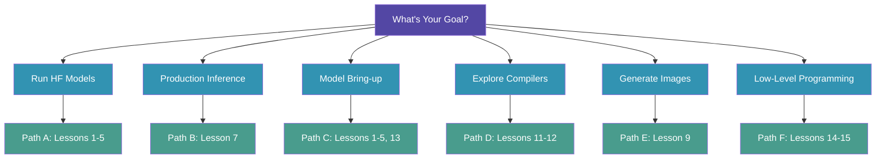
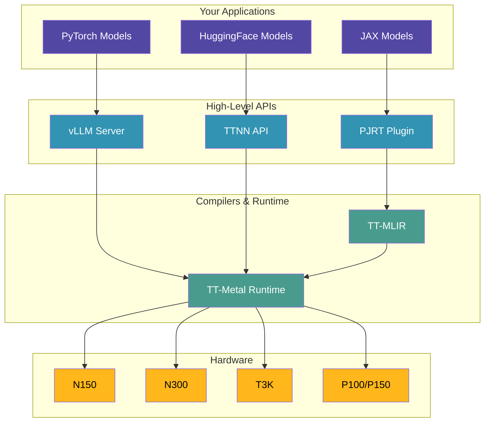

# Step Zero: Understanding the Tenstorrent Software Universe

**Before you start any lessons**, read this guide. It explains the technology stack, environment variables, and paths you can take based on your goals.

---

## 🎯 What Are You Trying to Do?



Choose your path:

### Path A: "I just want to run HuggingFace models on Tenstorrent hardware"
→ **Start with Lessons 1-5** (Direct tt-metal API)
- ✅ Works great on N150 (single chip)
- ✅ Easiest path, fewest dependencies
- ✅ 30 minutes to first inference
- **You'll learn:** How to run Llama, Qwen, Gemma models from HuggingFace
- **Hardware:** Works on any Tenstorrent hardware

### Path B: "I want production inference with vLLM"
→ **Use tt-inference-server Docker image** (recommended) or **Lesson 7** (advanced)
- ⚠️ Native installation on N150 has version compatibility challenges
- ✅ Docker image is validated and production-ready
- ✅ OpenAI-compatible API
- **You'll learn:** Production deployment, batching, scaling
- **Hardware:** N150/N300/T3K/P100 with appropriate model sizes

### Path C: "I want to bring my own model to Tenstorrent hardware"
→ **Start with Lessons 1-5, then Lesson 13** (Bounty Program)
- 🎓 Educational path, learn the architecture
- 💰 Earn $500-$3000 for successful contributions
- **You'll learn:** Model architecture, optimization, testing
- **Hardware:** Start with N150, scale to multi-chip later

### Path D: "I want to explore different compilers (XLA, Forge)"
→ **Lesson 12 (TT-XLA)** for production JAX, **Lesson 11 (TT-Forge)** for experimental MLIR
- ⚙️ Advanced users comfortable with build systems
- **TT-XLA:** Production-ready, wheel install, multi-chip support
- **TT-Forge:** Experimental, 56-minute build, cutting-edge
- **Hardware:** N150+ for XLA, N150 only for Forge

### Path E: "I want to generate images, not just text"
→ **Lesson 9** (Stable Diffusion 3.5)
- 🎨 1024x1024 image generation
- ✅ Works perfectly on N150
- 2-3 minutes per image (first run)
- **Hardware:** N150/N300/T3K/P100

### Path F: "I want to learn low-level programming on Tensix cores"
→ **Lesson 15** (TT-Metalium Cookbook) then **Lesson 14** (RISC-V)
- 🧠 Deep understanding of hardware
- Parallel computing, N² algorithms, physics simulation
- **Hardware:** N150 is perfect for learning

---

## 🏗️ The Technology Stack

### Tenstorrent Ecosystem Overview



### Core Components

#### 1. **tt-metal** (The Foundation)
**What it is:** Low-level API for programming Tenstorrent accelerators
- C++ core with Python bindings
- Direct access to Tensix cores, NoC (Network on Chip), DRAM
- Like CUDA for NVIDIA, but for Tenstorrent

**Where it lives:** `~/tt-metal/`

**What you'll use:**
- **TTNN** (TT Neural Network library) - High-level ops for ML
- **tt_lib** - Lower-level tensor operations
- **Model implementations** - Pre-optimized models in `models/`

**Installation:** Once, takes 5-15 minutes
```bash
cd ~/tt-metal
sudo ./install_dependencies.sh  # Installs OpenMPI, Rust, system packages
./build_metal.sh                # Compiles C++ core
source python_env/bin/activate  # Activates Python environment
```

#### 2. **Python Environments** (Virtual Environments)
**What they are:** Isolated Python installations with specific package versions

**Why they matter:** Different compilers need different package versions
- **tt-metal:** Python 3.10, uses `~/tt-metal/python_env/`
- **TT-XLA:** Python 3.11, uses `~/tt-xla-venv/`
- **TT-Forge:** Python 3.11, uses `~/tt-forge-fe/env/`

**You DON'T need to understand pyenv, virtualenv, conda** - the lessons activate the right environment for you.

**Key command:**
```bash
source ~/tt-metal/python_env/bin/activate  # Use tt-metal environment
```

#### 3. **TTNN** (TT Neural Network Library)
**What it is:** High-level API for ML operations on Tenstorrent hardware
- Import with `import ttnn`
- Like PyTorch ops, but runs on Tensix cores
- Used in all lessons 1-10, 15

**Common operations:**
```python
import ttnn

device = ttnn.open_device(device_id=0)
tensor_tt = ttnn.from_torch(tensor_cpu, device=device)
result = ttnn.matmul(tensor_a, tensor_b)
ttnn.close_device(device)
```

#### 4. **OpenMPI** (Multi-chip Communication)
**What it is:** Message Passing Interface library for distributed computing
- Required even for single-chip (N150) operation
- Enables multi-chip scaling (N300, T3K, Galaxy)

**Where it lives:** `/opt/openmpi-v5.0.7-ulfm/`

**Why you'll encounter it:** Import errors if library path not set
```bash
export LD_LIBRARY_PATH=/opt/openmpi-v5.0.7-ulfm/lib:$LD_LIBRARY_PATH
```

**You DON'T need to understand MPI programming** - tt-metal handles it internally.

---

## 🔧 Environment Variables Explained

Environment variables tell programs where to find things. Here are the ones that matter:

### Core Variables (Lessons 1-10)

#### `TT_METAL_HOME`
**What:** Path to tt-metal installation
**Typical value:** `~/tt-metal` or `/home/user/tt-metal`
**Why needed:** Python imports, model loading, kernel compilation
**Set it:**
```bash
export TT_METAL_HOME=~/tt-metal
```

#### `PYTHONPATH`
**What:** Where Python looks for importable modules
**Typical value:** `$TT_METAL_HOME:$PYTHONPATH` (adds tt-metal to search path)
**Why needed:** Allows `from models.tt_transformers import ...` to work
**Set it:**
```bash
export PYTHONPATH=$TT_METAL_HOME:$PYTHONPATH
```

#### `LD_LIBRARY_PATH`
**What:** Where Linux looks for shared libraries (.so files)
**Typical value:** `/opt/openmpi-v5.0.7-ulfm/lib:$LD_LIBRARY_PATH`
**Why needed:** TTNN depends on OpenMPI libraries
**Set it:**
```bash
export LD_LIBRARY_PATH=/opt/openmpi-v5.0.7-ulfm/lib:$LD_LIBRARY_PATH
```
**If you forget:** `ImportError: undefined symbol: MPIX_Comm_revoke`

#### `MESH_DEVICE`
**What:** Tells software which hardware configuration you have
**Possible values:** `N150`, `N300`, `T3K`, `P100`, `P150`, `GALAXY`
**Why needed:** Model optimizations differ per hardware
**Set it:**
```bash
export MESH_DEVICE=N150  # For single Wormhole chip
```

**Auto-detect it:**
```bash
tt-smi -s | grep board_type  # Shows your hardware
```

### vLLM Variables (Lesson 7-8)

#### `VLLM_TARGET_DEVICE`
**What:** Tells vLLM to use Tenstorrent backend
**Value:** `tt` (always)
**Set it:**
```bash
export VLLM_TARGET_DEVICE=tt
```

#### `TT_METAL_ARCH_NAME` (Blackhole chips only)
**What:** Architecture name for Blackhole chips (P100/P150)
**Value:** `blackhole` (if you have P100/P150)
**Why needed:** Blackhole uses different instruction set than Wormhole
**Set it:**
```bash
export TT_METAL_ARCH_NAME=blackhole  # Only for P100/P150
```

### TT-Forge Variables (Lesson 11)

**IMPORTANT:** TT-Forge **unsets** tt-metal variables to avoid conflicts!

```bash
unset TT_METAL_HOME
unset TT_METAL_VERSION
export TTFORGE_TOOLCHAIN_DIR=/home/user/ttforge-toolchain  # Absolute path!
export TTMLIR_TOOLCHAIN_DIR=/home/user/ttmlir-toolchain    # No tildes!
export CC=/usr/bin/clang-17
export CXX=/usr/bin/clang++-17
```

### TT-XLA Variables (Lesson 12)

**IMPORTANT:** TT-XLA also unsets tt-metal variables!

```bash
unset TT_METAL_HOME
unset LD_LIBRARY_PATH
export PYTHONPATH=~/tt-forge:$PYTHONPATH  # For imports
```

---

## 📦 Dependencies You Might Encounter

### System Dependencies (Installed by install_dependencies.sh)

**You DON'T need to install these manually** - `install_dependencies.sh` handles it:

#### **OpenMPI ULFM 5.0.7**
- Message passing for multi-chip
- Installed to `/opt/openmpi-v5.0.7-ulfm/`

#### **Rust** (Programming language)
- Used for some tt-metal build tools
- Installed via rustup

#### **Build tools** (gcc, g++, make, cmake)
- C++ compilation infrastructure
- You don't write C++, but tt-metal builds need it

#### **Python 3.10** (System Python)
- Ubuntu 22.04 comes with Python 3.10.12
- Used by tt-metal

### Python Packages (Installed automatically)

**tt-metal environment** (`~/tt-metal/python_env/`):
- `torch` (PyTorch) - ML framework
- `transformers` (HuggingFace) - Model loading
- `ttnn` - Tenstorrent neural network ops
- Many more...

**You DON'T need to pip install** - activating the environment gives you everything.

### Additional for Advanced Lessons

#### **clang-17** (C++ compiler, for TT-Forge only)
```bash
sudo apt install clang-17
```

#### **Python 3.11** (for TT-XLA and TT-Forge)
```bash
sudo add-apt-repository ppa:deadsnakes/ppa
sudo apt update
sudo apt install python3.11 python3.11-venv python3.11-dev
```

---

## 🗺️ File Locations Reference

### Where Everything Lives

```
~/tt-metal/                    # Core tt-metal installation
├── build/                     # Compiled C++ libraries
├── python_env/                # Python virtual environment
├── models/                    # Pre-optimized model implementations
│   ├── demos/                 # Demo scripts
│   └── tt_transformers/       # Transformer models
├── ttnn/                      # TTNN Python bindings
└── tt_metal/                  # C++ core source

~/models/                      # Your downloaded HuggingFace models
├── Llama-3.1-8B-Instruct/    # 16GB, gated
├── Qwen3-0.6B/               # 1.5GB, no token needed ⭐ START HERE
└── Gemma-3-1B-IT/            # 2GB, multilingual

~/tt-scratchpad/               # Extension-created scripts
├── tt-chat-direct.py         # Interactive chat demo
├── tt-api-server-direct.py   # HTTP API server
├── start-vllm-server.py      # vLLM production server
└── cookbook/                  # TT-Metalium examples
    ├── game_of_life/
    ├── mandelbrot/
    ├── audio_processor/
    ├── particle_life/
    └── image_filters/

~/tt-xla-venv/                 # TT-XLA Python environment (Lesson 12)
~/tt-forge-fe/                 # TT-Forge source (Lesson 11)
```

---

## 🎓 Common Beginner Questions

### Q: What's the difference between tt-metal, TTNN, and tt_lib?
**A:**
- **tt-metal** = The whole platform (like "CUDA Toolkit")
- **TTNN** = High-level neural network ops (like "cuDNN")
- **tt_lib** = Lower-level tensor ops (like "CUDA runtime")

**Use TTNN** for ML work (it's easiest). That's what lessons 1-10 use.

### Q: Do I need to learn C++?
**A:** No! Python API covers everything. C++ is only for:
- Contributing to tt-metal core (advanced)
- Custom kernel development (advanced)
- RISC-V programming (Lesson 14, advanced)

### Q: What models can I run?
**A:** Any HuggingFace model with Llama-compatible architecture:
- ✅ Llama (all versions)
- ✅ Qwen (all versions) ⭐ **Start with Qwen3-0.6B on N150**
- ✅ Gemma 3 (1B, 4B variants)
- ✅ Mistral family
- ✅ CodeLlama, DeepSeek-Coder
- ⚠️ Other architectures need custom implementations

**Recommendation for N150:** Start with **Qwen3-0.6B**
- Only 1.5GB (downloads in seconds)
- No HuggingFace token needed
- 0.6B parameters = fast on single chip
- Reasoning-capable (dual thinking modes)
- 32K context window

### Q: What's a "gated" model?
**A:** Models requiring HuggingFace account approval
- Example: Llama-3.1-8B-Instruct (gated)
- You need to:
  1. Create HuggingFace account
  2. Request access on model page
  3. Get approved (instant for most)
  4. Login: `huggingface-cli login`

**Qwen3-0.6B is NOT gated** - start there!

### Q: How much VRAM/DRAM does my hardware have?
**Check with:**
```bash
tt-smi -s | grep -i dram
```

**Wormhole Architecture (N150/N300/T3K/QuietBox):**
- N150: 12GB DRAM per chip (single chip)
- N300: 24GB total (2 chips)
- T3K: 96GB total (8 chips)
- **QuietBox:** Wormhole-based system (production-validated for vLLM)
- **Tensix cores:** 8x10 grid (80 cores per chip)
- **Ethernet:** 16 cores with 256KB L1

**Blackhole Architecture (P100/P150):**
- P100: ~32GB DRAM (single chip)
- P150: ~32GB per chip (configurable as 1, 2, 4, or 8 chips)
  - P150 x1: ~32GB (single chip)
  - P150 x2: ~64GB (2 chips)
  - P150 x4: ~128GB (4 chips)
  - P150 x8: ~256GB (8 chips)
- **Tensix cores:** 14x10 grid (140 cores per chip, 13x10 available for compute)
- **Enhanced NoC:** 64B reads (vs 32B on Wormhole), rectangular/strided/L-shaped multicast
- **L1 data cache:** 1464 KB with 4x16B cachelines (write-through)
- **Ethernet:** 14 cores with 512KB L1, 2x RISC-V per core
- **DRAM:** 8 banks with programmable 1x RISC-V, 128KB L1 per bank

**🔧 Important:** Blackhole chips (P100/P150) require:
```bash
export TT_METAL_ARCH_NAME=blackhole
```

**Model sizing:**
- Qwen3-0.6B: ~1.5GB (fits easily on N150 or P100)
- Llama-3.1-8B: ~16GB (tight on N150, comfortable on P100/N300+)
- Llama-3.1-70B: ~140GB (requires T3K or P150 x4+)

### Q: What if I get "ImportError: cannot import name 'ttnn'"?
**A:** You're not in the tt-metal Python environment.

**Fix:**
```bash
source ~/tt-metal/python_env/bin/activate
```

### Q: What if I get "undefined symbol: MPIX_Comm_revoke"?
**A:** OpenMPI library path not set.

**Fix:**
```bash
export LD_LIBRARY_PATH=/opt/openmpi-v5.0.7-ulfm/lib:$LD_LIBRARY_PATH
```

### Q: Do I need Docker?
**A:**
- **Lessons 1-6, 8-15:** No Docker needed ✅
- **Lesson 7 (vLLM production):** Docker recommended but not required
  - Native install on N150 has version challenges
  - Docker image is validated and works reliably

### Q: Can I use this in Jupyter notebooks?
**A:** Yes! The extension configures Jupyter to use tt-metal environment automatically.

---

## 🚀 Quick Start Checklist

Before starting Lesson 1, verify:

### Hardware Check
```bash
tt-smi -s  # Should show your hardware (N150/N300/etc.)
```

### tt-metal Check
```bash
cd ~/tt-metal
ls build/  # Should exist (if not, run ./build_metal.sh)
source python_env/bin/activate
python -c "import ttnn; print('✓ TTNN working')"
```

### Environment Variables Check
```bash
echo $TT_METAL_HOME         # Should be ~/tt-metal or /home/user/tt-metal
echo $LD_LIBRARY_PATH       # Should include /opt/openmpi-v5.0.7-ulfm/lib
echo $MESH_DEVICE           # Should be N150, N300, T3K, P100, P150, or GALAXY
```

**If any check fails:** Run the commands shown in the error message.

### Disk Space Check
```bash
df -h ~  # Need at least 30GB free for models
```

**Models are BIG:**
- Qwen3-0.6B: 1.5GB
- Llama-3.1-8B: 16GB
- Stable Diffusion: 10GB+

---

## 📚 Recommended Learning Order

### Absolute Beginners
1. **Step Zero** (this guide) ← You are here
2. **Lesson 1:** Hardware Detection
3. **Lesson 2:** Verify Installation
4. **Lesson 3:** Download Model (start with Qwen3-0.6B)
5. **Lesson 4:** Interactive Chat
6. **Lesson 5:** HTTP API Server
7. **Lesson 15:** TT-Metalium Cookbook (fun projects!)
8. **Lesson 9:** Image Generation (make art!)

### Production Deployment
1. Lessons 1-5 (understand the stack)
2. **Lesson 6:** tt-inference-server (automated deployment)
3. **Lesson 7:** vLLM (OpenAI-compatible API)
4. **Lesson 8:** VSCode Chat (integrated experience)

### Model Developers
1. Lessons 1-5 (foundation)
2. **Lesson 13:** Bounty Program (contribution workflow)
3. **Lesson 14:** RISC-V Programming (low-level optimization)
4. **Lesson 15:** TT-Metalium Cookbook (parallel algorithms)

### Compiler Explorers
1. Lessons 1-5 (baseline)
2. **Lesson 12:** TT-XLA (production JAX compiler)
3. **Lesson 11:** TT-Forge (experimental MLIR compiler)

---

## 🆘 When You Get Stuck

### Error Messages to Search For
1. Copy the LAST line of error (usually most specific)
2. Search in FAQ page (in this extension)
3. Check [Tenstorrent Discord](https://discord.gg/tenstorrent)
4. Create issue on [GitHub](https://github.com/tenstorrent/tt-metal/issues)

### Common Fixes
```bash
# "Command not found: tt-smi"
# → tt-metal not installed correctly, reinstall

# "ImportError: cannot import ttnn"
source ~/tt-metal/python_env/bin/activate

# "undefined symbol: MPIX_Comm_revoke"
export LD_LIBRARY_PATH=/opt/openmpi-v5.0.7-ulfm/lib:$LD_LIBRARY_PATH

# "Device not found"
tt-smi -s  # Verify hardware detected

# "Out of memory"
# → Model too large for hardware, try smaller model (Qwen3-0.6B)

# "No space left on device"
df -h ~  # Check disk space, delete old models
```

---

## 🎯 Your Next Step

**You're ready!** Choose your path from the top of this guide, then:

1. **Run Lesson 1** to detect your hardware
2. **Run Lesson 2** to verify tt-metal installation
3. **Pick your path** based on your goals

**Remember:** Start with Qwen3-0.6B on N150. It's small, fast, and works perfectly. Llama-3.1-8B comes later when you understand memory management.

**Good luck, and welcome to Tenstorrent! 🚀**

---

**Questions?** Check the FAQ page or visit [Tenstorrent Discord](https://discord.gg/tenstorrent).
