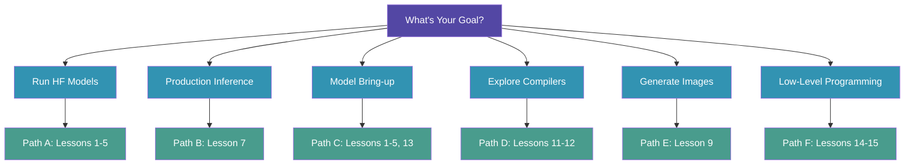
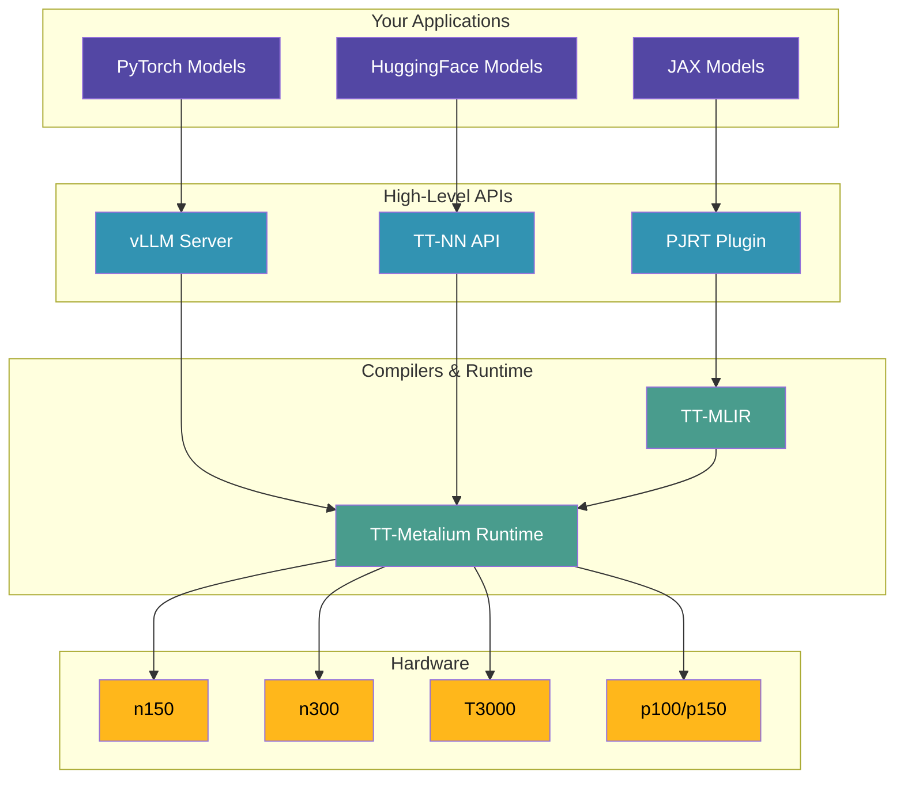

# Step Zero: Understanding the Tenstorrent Software Universe

**Before you start any lessons**, read this guide. It explains the technology stack, environment variables, and paths you can take based on your goals.

---

## 🎯 What Are You Trying to Do?


```mermaid
graph TD
    Start[What's Your Goal?]

    Start --> RunModels[Run HF Models]
    Start --> Production[Production Inference]
    Start --> BringModel[Model Bring-up]
    Start --> Compilers[Explore Compilers]
    Start --> Images[Generate Images]
    Start --> LowLevel[Low-Level Programming]

    RunModels --> PathA[Path A: Lessons 1-5]
    Production --> PathB[Path B: Lesson 7]
    BringModel --> PathC[Path C: Lessons 1-5, 13]
    Compilers --> PathD[Path D: Lessons 11-12]
    Images --> PathE[Path E: Lesson 9]
    LowLevel --> PathF[Path F: Lessons 14-15]

    style Start fill:#5347a4,color:#fff
    style RunModels fill:#3293b2,color:#fff
    style Production fill:#3293b2,color:#fff
    style BringModel fill:#3293b2,color:#fff
    style Compilers fill:#3293b2,color:#fff
    style Images fill:#3293b2,color:#fff
    style LowLevel fill:#3293b2,color:#fff
    style PathA fill:#499c8d,color:#fff
    style PathB fill:#499c8d,color:#fff
    style PathC fill:#499c8d,color:#fff
    style PathD fill:#499c8d,color:#fff
    style PathE fill:#499c8d,color:#fff
    style PathF fill:#499c8d,color:#fff
```

Choose your path:

### Path A: "I just want to run HuggingFace models on Tenstorrent hardware"
→ **Start with Lessons 1-5** (Direct TT-Metalium<sup>™</sup> API)
- ✅ Works great on n150 (single chip)
- ✅ Easiest path, fewest dependencies
- ✅ 30 minutes to first inference
- **You'll learn:** How to run Llama, Qwen, Gemma models from HuggingFace
- **Hardware:** Works on any Tenstorrent hardware

### Path B: "I want production inference with vLLM"
→ **Use TT-Inference-Server Docker image** (recommended) or **Lesson 7** (advanced)
- ⚠️ Native installation has version compatibility gotchas (chiefly a numpy pin — Lesson 7
  covers it)
- ℹ️ Native install = the standalone
  [`vllm-tt-plugin`](https://github.com/tenstorrent/vllm-tt-plugin) over **upstream
  `vllm==0.24.0`**. No Tenstorrent fork of vLLM is involved.
- ✅ Docker image is validated and production-ready
- ✅ OpenAI-compatible API
- **You'll learn:** Production deployment, batching, scaling
- **Hardware:** n150/n300/T3000/p100 with appropriate model sizes

### Path C: "I want to bring my own model to Tenstorrent hardware"
→ **Start with Lessons 1-5, then Lesson 13** (Bounty Program)
- 🎓 Educational path, learn the architecture
- 💰 Earn $500-$3000 for successful contributions
- **You'll learn:** Model architecture, optimization, testing
- **Hardware:** Start with n150, scale to multi-chip later

### Path D: "I want to explore different compilers (XLA, Forge)"
→ **Lesson 12 (TT-XLA)** for production JAX, **Lesson 11 (TT-Forge<sup>™</sup>)** for experimental MLIR
- ⚙️ Advanced users comfortable with build systems
- **TT-XLA:** Production-ready, wheel install, multi-chip support
- **TT-Forge:** Experimental, 56-minute build, cutting-edge
- **Hardware:** n150+ for XLA, n150 only for Forge

### Path E: "I want to generate images, not just text"
→ **Lesson 9** (Stable Diffusion 3.5)
- 🎨 1024x1024 image generation
- ✅ Works perfectly on n150
- 2-3 minutes per image (first run)
- **Hardware:** n150/n300/T3000/p100

### Path F: "I want to learn low-level programming on Tensix cores"
→ **Lesson 15** (TT-Metalium Cookbook) then **Lesson 14** (RISC-V)
- 🧠 Deep understanding of hardware
- Parallel computing, N² algorithms, physics simulation
- **Hardware:** n150 is perfect for learning

---

## 🏗️ The Technology Stack

### Tenstorrent Ecosystem Overview


```mermaid
graph TB
    subgraph Applications["Your Applications"]
        JAX[JAX Models]
        PyTorch[PyTorch Models]
        HF[HuggingFace Models]
    end

    subgraph HighLevel["High-Level APIs"]
        vLLM[vLLM Server]
        PJRT[PJRT Plugin]
        TT-NN[TT-NN API]
    end

    subgraph Compiler["Compilers & Runtime"]
        TTMLIR[TT-MLIR]
        TTMetal[TT-Metalium Runtime]
    end

    subgraph Hardware["Hardware"]
        n150[n150]
        n300[n300]
        T3000[T3000]
        p100[p100/p150]
    end

    JAX --> PJRT
    PyTorch --> vLLM
    HF --> TT-NN

    vLLM --> TTMetal
    PJRT --> TTMLIR
    TT-NN --> TTMetal

    TTMLIR --> TTMetal
    TTMetal --> n150
    TTMetal --> n300
    TTMetal --> T3000
    TTMetal --> p100

    style JAX fill:#5347a4,color:#fff
    style PyTorch fill:#5347a4,color:#fff
    style HF fill:#5347a4,color:#fff
    style vLLM fill:#3293b2,color:#fff
    style PJRT fill:#3293b2,color:#fff
    style TT-NN fill:#3293b2,color:#fff
    style TTMLIR fill:#499c8d,color:#fff
    style TTMetal fill:#499c8d,color:#fff
    style n150 fill:#ffb71b,color:#000
    style n300 fill:#ffb71b,color:#000
    style T3000 fill:#ffb71b,color:#000
    style p100 fill:#ffb71b,color:#000
```

### Core Components

#### 1. **TT-Metalium** (The Foundation)
**What it is:** Low-level API for programming Tenstorrent accelerators
- C++ core with Python bindings
- Direct access to Tensix cores, NoC (Network on Chip), DRAM
- Like CUDA for NVIDIA, but for Tenstorrent

**Where it lives:** `~/tt-metal/`

**What you'll use:**
- **TT-NN<sup>™</sup>** (TT Neural Network library) - High-level ops for ML
- **tt_lib** - Lower-level tensor operations
- **Model implementations** - Pre-optimized models in `models/`

**Installation:** Once, takes 5-15 minutes
```bash
cd ~/tt-metal
sudo ./install_dependencies.sh  # Installs OpenMPI, Rust, system packages
./build_metal.sh                # Compiles C++ core
source python_env/bin/activate  # Activates Python environment
```

#### 2. **Python Environments** (Virtual Environments)
**What they are:** Isolated Python installations with specific package versions

**Why they matter:** Different compilers need different package versions
- **TT-Metalium:** Python 3.10, uses `~/tt-metal/python_env/`
- **TT-XLA:** Python 3.11, uses `~/tt-xla-venv/`
- **TT-Forge:** Python 3.11, uses `~/tt-forge-fe/env/`

**You DON'T need to understand pyenv, virtualenv, conda** - the lessons activate the right environment for you.

**Key command:**
```bash
source ~/tt-metal/python_env/bin/activate  # Use TT-Metalium environment
```

#### 3. **TT-NN** (TT Neural Network Library)
**What it is:** High-level API for ML operations on Tenstorrent hardware
- Import with `import ttnn`
- Like PyTorch ops, but runs on Tensix cores
- Used in all lessons 1-10, 15

**Common operations:**
```python
import ttnn

device = ttnn.open_device(device_id=0)
tensor_tt = ttnn.from_torch(tensor_cpu, device=device)
result = ttnn.matmul(tensor_a, tensor_b)
ttnn.close_device(device)
```

#### 4. **OpenMPI** (Multi-chip Communication)
**What it is:** Message Passing Interface library for distributed computing
- Required even for single-chip (n150) operation
- Enables multi-chip scaling (n300, T3000, Galaxy)

**Where it lives:** `/opt/openmpi-v5.0.7-ulfm/`

**Why you'll encounter it:** Import errors if library path not set
```bash
export LD_LIBRARY_PATH=/opt/openmpi-v5.0.7-ulfm/lib:$LD_LIBRARY_PATH
```

**You DON'T need to understand MPI programming** - TT-Metalium handles it internally.

---

## 🔧 Environment Variables Explained

Environment variables tell programs where to find things. Here are the ones that matter:

### Core Variables (Lessons 1-10)

#### `TT_METAL_HOME`
**What:** Path to TT-Metalium installation
**Typical value:** `~/tt-metal` or `/home/user/tt-metal`
**Why needed:** Python imports, model loading, kernel compilation
**Set it:**
```bash
export TT_METAL_HOME=~/tt-metal
```

#### `PYTHONPATH`
**What:** Where Python looks for importable modules
**Typical value:** `$TT_METAL_HOME:$PYTHONPATH` (adds TT-Metalium to search path)
**Why needed:** Allows `from models.tt_transformers import ...` to work
**Set it:**
```bash
export PYTHONPATH=$TT_METAL_HOME:$PYTHONPATH
```

#### `LD_LIBRARY_PATH`
**What:** Where Linux looks for shared libraries (.so files)
**Typical value:** `/opt/openmpi-v5.0.7-ulfm/lib:$LD_LIBRARY_PATH`
**Why needed:** TT-NN depends on OpenMPI libraries
**Set it:**
```bash
export LD_LIBRARY_PATH=/opt/openmpi-v5.0.7-ulfm/lib:$LD_LIBRARY_PATH
```
**If you forget:** `ImportError: undefined symbol: MPIX_Comm_revoke`

#### `MESH_DEVICE`
**What:** Tells software which hardware configuration you have
**Possible values:** `N150`, `N300`, `T3K`, `P100`, `P150`, `P300`, `P300x2`, `TG`

Galaxy is spelled `TG`, not `GALAXY` — tt-metal and the vLLM plugin both use `TG`.
**Why needed:** Model optimizations differ per hardware
**Set it:**
```bash
export MESH_DEVICE=N150  # For single Wormhole chip
```

**Auto-detect it:**
```bash
tt-smi -s | grep board_type  # Shows your hardware
```

**For vLLM specifically:** the TT plugin accepts a fixed set of names (including `TG` for
Galaxy and `P300x2` for a TT-QuietBox 2), and `MESH_DEVICE` — not `--tensor-parallel-size` —
is how you tell vLLM to use more than one chip. See the MESH_DEVICE table in the FAQ for the
full list.

### vLLM Variables (Lesson 7-8)

#### `VLLM_TARGET_DEVICE`
**What:** A **build-time only** variable that selects which device backend vLLM compiles for.
**Value:** `empty` — and only while building vLLM, never in your shell.
**Why you don't set it:** Tenstorrent support is a vLLM **platform plugin**
(`vllm-tt-plugin`), installed from
[github.com/tenstorrent/vllm-tt-plugin](https://github.com/tenstorrent/vllm-tt-plugin)
alongside **upstream `vllm==0.24.0`** — there is no Tenstorrent fork of vLLM. The plugin
supplies the TT platform at runtime and vLLM selects it automatically whenever `ttnn` is
importable, so vLLM itself is built with no device backend compiled in:
```bash
# This appears inside the plugin's installer, not in your shell profile
VLLM_TARGET_DEVICE=empty uv pip install --no-binary vllm \
    --override docs/vllm-overrides.txt vllm==0.24.0
```
**Do not export it at runtime.** An `export VLLM_TARGET_DEVICE=tt` in your shell does nothing
useful; older guides that told you to set it predate the plugin.

**Note the `--override`.** It pins `numpy>=1.24.4,<2` and `opencv-python-headless==4.11.0.86`,
because `ttnn` needs numpy below 2 while vLLM's requirements pull an opencv that needs numpy 2.
Drop it and the install *looks* fine but `import ttnn` breaks afterwards.

#### `HF_MODEL`
**What:** For tt-metal's `tt_transformers`, the **checkpoint directory** — not just a name.
`model_config.py` sets both `CKPT_DIR` and `TOKENIZER_PATH` from it.
**Value:** either a HuggingFace `org/name` or **the path to downloaded weights**.
**Why needed:** if you hand `vllm serve` a local model directory and leave `HF_MODEL` unset,
startup fails with `ValueError: Please set HF_MODEL to a HuggingFace name e.g.
meta-llama/Llama-3.1-8B-Instruct`. That message is misleading — local paths are fine, the
variable just has to be set to the same one.
**Set it:**
```bash
export HF_MODEL=~/models/Llama-3.1-8B-Instruct     # same path you pass to vllm serve
vllm serve ~/models/Llama-3.1-8B-Instruct
```

#### `VLLM_RPC_TIMEOUT`
**What:** How long vLLM waits for its internal RPC calls, in milliseconds
**Value:** `900000` (15 minutes)
**Why needed:** The first load of a model on TT hardware compiles kernels, which can take
many minutes. The default timeout is far too short.
**Set it:**
```bash
export VLLM_RPC_TIMEOUT=900000
```

#### `VLLM_CONFIGURE_LOGGING`
**What:** Lets vLLM install its own logging configuration
**Value:** `1`
**Why needed:** Gives you readable startup and per-request logs, which is what you want while
bringing a server up for the first time.
**Set it:**
```bash
export VLLM_CONFIGURE_LOGGING=1
```

#### `VLLM_PLUGINS` (optional)
**What:** Restricts vLLM to loading only the plugins you name
**Why it's a trap:** When it is unset, vLLM loads every plugin it discovers, which is what you
want. But if you set it — or inherit it from a script or container image — it must name
**both** Tenstorrent entry points, or the platform loads without the TT model registry:
```bash
export VLLM_PLUGINS=tt,tt_model_registry
```
**Recommendation:** leave it unset unless you have a specific reason to filter plugins.

#### `TT_METAL_ARCH_NAME` (Blackhole<sup>®</sup> chips only)
**What:** Architecture name for Blackhole chips (p100/p150)
**Value:** `blackhole` (if you have p100/p150)
**Why needed:** Blackhole uses different instruction set than Wormhole
**Set it:**
```bash
export TT_METAL_ARCH_NAME=blackhole  # Only for p100/p150
```

### TT-Forge Variables (Lesson 11)

**IMPORTANT:** TT-Forge **unsets** TT-Metalium variables to avoid conflicts!

```bash
unset TT_METAL_HOME
unset TT_METAL_VERSION
export TTFORGE_TOOLCHAIN_DIR=/home/user/ttforge-toolchain  # Absolute path!
export TTMLIR_TOOLCHAIN_DIR=/home/user/ttmlir-toolchain    # No tildes!
export CC=/usr/bin/clang-17
export CXX=/usr/bin/clang++-17
```

### TT-XLA Variables (Lesson 12)

**IMPORTANT:** TT-XLA also unsets TT-Metalium variables!

```bash
unset TT_METAL_HOME
unset LD_LIBRARY_PATH
export PYTHONPATH=~/tt-forge:$PYTHONPATH  # For imports
```

---

## 📦 Dependencies You Might Encounter

### System Dependencies (Installed by install_dependencies.sh)

**You DON'T need to install these manually** - `install_dependencies.sh` handles it:

#### **OpenMPI ULFM 5.0.7**
- Message passing for multi-chip
- Installed to `/opt/openmpi-v5.0.7-ulfm/`

#### **Rust** (Programming language)
- Used for some TT-Metalium build tools
- Installed via rustup

#### **Build tools** (gcc, g++, make, cmake)
- C++ compilation infrastructure
- You don't write C++, but TT-Metalium builds need it

#### **Python 3.10** (System Python)
- Ubuntu 22.04 comes with Python 3.10.12
- Used by TT-Metalium

### Python Packages (Installed automatically)

**TT-Metalium environment** (`~/tt-metal/python_env/`):
- `torch` (PyTorch) - ML framework
- `transformers` (HuggingFace) - Model loading
- `ttnn` - Tenstorrent neural network ops
- Many more...

**You DON'T need to pip install** - activating the environment gives you everything.

### Additional for Advanced Lessons

#### **clang-17** (C++ compiler, for TT-Forge only)
```bash
sudo apt install clang-17
```

#### **Python 3.11** (for TT-XLA and TT-Forge)
```bash
sudo add-apt-repository ppa:deadsnakes/ppa
sudo apt update
sudo apt install python3.11 python3.11-venv python3.11-dev
```

---

## 🗺️ File Locations Reference

### Where Everything Lives

```
~/tt-metal/                    # Core TT-Metalium installation
├── build/                     # Compiled C++ libraries
├── python_env/                # Python virtual environment
├── models/                    # Pre-optimized model implementations
│   ├── demos/                 # Demo scripts
│   └── tt_transformers/       # Transformer models
├── ttnn/                      # TT-NN Python bindings
└── tt_metal/                  # C++ core source

~/models/                      # Your downloaded HuggingFace models
├── Llama-3.1-8B-Instruct/    # 16GB, gated
├── Qwen3-0.6B/               # 1.5GB, no token needed ⭐ START HERE
└── Gemma-3-1B-IT/            # 2GB, multilingual

~/tt-scratchpad/               # Extension-created scripts
├── tt-chat-direct.py         # Interactive chat demo
├── tt-api-server-direct.py   # HTTP API server
└── cookbook/                  # TT-Metalium examples
    ├── game_of_life/
    ├── mandelbrot/
    ├── audio_processor/
    ├── particle_life/
    └── image_filters/

~/tt-xla-venv/                 # TT-XLA Python environment (Lesson 12)
~/tt-forge-fe/                 # TT-Forge source (Lesson 11)
```

---

## 🎓 Common Beginner Questions

### Q: What's the difference between TT-Metalium, TT-NN, and tt_lib?
**A:**
- **TT-Metalium** = The whole platform (like "CUDA Toolkit")
- **TT-NN** = High-level neural network ops (like "cuDNN")
- **tt_lib** = Lower-level tensor ops (like "CUDA runtime")

**Use TT-NN** for ML work (it's easiest). That's what lessons 1-10 use.

### Q: Do I need to learn C++?
**A:** No! Python API covers everything. C++ is only for:
- Contributing to TT-Metalium core (advanced)
- Custom kernel development (advanced)
- RISC-V programming (Lesson 14, advanced)

### Q: What models can I run?
**A:** Any HuggingFace model with Llama-compatible architecture:
- ✅ Llama (all versions)
- ✅ Qwen (all versions) ⭐ **Start with Qwen3-0.6B on n150**
- ✅ Gemma 3 (1B, 4B variants)
- ✅ Mistral family
- ✅ CodeLlama, DeepSeek-Coder
- ⚠️ Other architectures need custom implementations

**Recommendation for n150:** Start with **Qwen3-0.6B**
- Only 1.5GB (downloads in seconds)
- No HuggingFace token needed
- 0.6B parameters = fast on single chip
- Reasoning-capable (dual thinking modes)
- 32K context window

### Q: What's a "gated" model?
**A:** Models requiring HuggingFace account approval
- Example: Llama-3.1-8B-Instruct (gated)
- You need to:
  1. Create HuggingFace account
  2. Request access on model page
  3. Get approved (instant for most)
  4. Login: `hf auth login`

**Qwen3-0.6B is NOT gated** - start there!

### Q: How much VRAM/DRAM does my hardware have?
**Check with:**
```bash
tt-smi -s | grep -i dram
```

**Wormhole Architecture (n150/n300/T3000/TT-QuietBox):**
- n150: 12GB DRAM per chip (single chip)
- n300: 24GB total (2 chips)
- T3000: 96GB total (8 chips)
- **TT-QuietBox:** Wormhole-based system (production-validated for vLLM)
- **Tensix cores:** 8x10 grid (80 cores per chip)
- **Ethernet:** 16 cores with 256KB L1

**Blackhole Architecture (p100/p150):**
- p100: ~32GB DRAM (single chip)
- p150: ~32GB per chip (configurable as 1, 2, 4, or 8 chips)
  - p150 x1: ~32GB (single chip)
  - p150 x2: ~64GB (2 chips)
  - p150 x4: ~128GB (4 chips)
  - p150 x8: ~256GB (8 chips)
- **Tensix cores:** 14x10 grid (140 cores per chip, 13x10 available for compute)
- **Enhanced NoC:** 64B reads (vs 32B on Wormhole), rectangular/strided/L-shaped multicast
- **L1 data cache:** 1464 KB with 4x16B cachelines (write-through)
- **Ethernet:** 14 cores with 512KB L1, 2x RISC-V per core
- **DRAM:** 8 banks with programmable 1x RISC-V, 128KB L1 per bank

**🔧 Important:** Blackhole chips (p100/p150) require:
```bash
export TT_METAL_ARCH_NAME=blackhole
```

**Model sizing:**
- Qwen3-0.6B: ~1.5GB (fits easily on n150 or p100)
- Llama-3.1-8B: ~16GB (tight on n150, comfortable on p100/n300+)
- Llama-3.1-70B: ~140GB (requires T3000 or p150 x4+)

The two chips have different grid shapes — Wormhole (above) has 80 Tensix compute cores, Blackhole (below) has 140:

```tensix_viz arch=wormhole
[]
```

```tensix_viz arch=blackhole
[]
```

### Q: What if I get "ImportError: cannot import name 'ttnn'"?
**A:** You're not in the TT-Metalium Python environment.

**Fix:**
```bash
source ~/tt-metal/python_env/bin/activate
```

### Q: What if I get "undefined symbol: MPIX_Comm_revoke"?
**A:** OpenMPI library path not set.

**Fix:**
```bash
export LD_LIBRARY_PATH=/opt/openmpi-v5.0.7-ulfm/lib:$LD_LIBRARY_PATH
```

### Q: Do I need Docker?
**A:**
- **Lessons 1-6, 8-15:** No Docker needed ✅
- **Lesson 7 (vLLM production):** Docker recommended but not required
  - Native install on n150 has version challenges
  - Docker image is validated and works reliably

### Q: Can I use this in Jupyter notebooks?
**A:** Yes! The extension configures Jupyter to use TT-Metalium environment automatically.

---

## 🚀 Quick Start Checklist

Before starting Lesson 1, verify:

### Hardware Check
```bash
tt-smi -s  # Should show your hardware (n150/n300/etc.)
```

### TT-Metalium Check
```bash
cd ~/tt-metal
ls build/  # Should exist (if not, run ./build_metal.sh)
source python_env/bin/activate
python -c "import ttnn; print('✓ TTNN working')"
```

### Environment Variables Check
```bash
echo $TT_METAL_HOME         # Should be ~/tt-metal or /home/user/tt-metal
echo $LD_LIBRARY_PATH       # Should include /opt/openmpi-v5.0.7-ulfm/lib
echo $MESH_DEVICE           # Should be N150, N300, T3K, P100, P150, P300, P300x2, or TG
```

**If any check fails:** Run the commands shown in the error message.

### Disk Space Check
```bash
df -h ~  # Need at least 30GB free for models
```

**Models are BIG:**
- Qwen3-0.6B: 1.5GB
- Llama-3.1-8B: 16GB
- Stable Diffusion: 10GB+

---

## 📚 Recommended Learning Order

### Absolute Beginners
1. **Step Zero** (this guide) ← You are here
2. **Lesson 1:** Hardware Detection
3. **Lesson 2:** Verify Installation
4. **Lesson 3:** Download Model (start with Qwen3-0.6B)
5. **Lesson 4:** Interactive Chat
6. **Lesson 5:** HTTP API Server
7. **Lesson 15:** TT-Metalium Cookbook (fun projects!)
8. **Lesson 9:** Image Generation (make art!)

### Production Deployment
1. Lessons 1-5 (understand the stack)
2. **Lesson 6:** TT-Inference-Server (automated deployment)
3. **Lesson 7:** vLLM (OpenAI-compatible API)
4. **Lesson 8:** VSCode Chat (integrated experience)

### Model Developers
1. Lessons 1-5 (foundation)
2. **Lesson 13:** Bounty Program (contribution workflow)
3. **Lesson 14:** RISC-V Programming (low-level optimization)
4. **Lesson 15:** TT-Metalium Cookbook (parallel algorithms)

### Compiler Explorers
1. Lessons 1-5 (baseline)
2. **Lesson 12:** TT-XLA (production JAX compiler)
3. **Lesson 11:** TT-Forge (experimental MLIR compiler)

---

## 🆘 When You Get Stuck

### Error Messages to Search For
1. Copy the LAST line of error (usually most specific)
2. Search in FAQ page (in this extension)
3. Check [Tenstorrent Discord](https://discord.gg/tenstorrent)
4. Create issue on [GitHub](https://github.com/tenstorrent/tt-metal/issues)

### Common Fixes
```bash
# "Command not found: tt-smi"
# → TT-Metalium not installed correctly, reinstall

# "ImportError: cannot import ttnn"
source ~/tt-metal/python_env/bin/activate

# "undefined symbol: MPIX_Comm_revoke"
export LD_LIBRARY_PATH=/opt/openmpi-v5.0.7-ulfm/lib:$LD_LIBRARY_PATH

# "Device not found"
tt-smi -s  # Verify hardware detected

# "Out of memory"
# → Model too large for hardware, try smaller model (Qwen3-0.6B)

# "No space left on device"
df -h ~  # Check disk space, delete old models
```

---

## 🌐 Ecosystem Resources

Beyond the lessons, the Tenstorrent ecosystem has tools worth knowing about:

- **[tt-awesome](https://docs.tenstorrent.com/tt-awesome/)** — curated directory of community and official tools, models, research, and guides. Good starting point for exploring what's been built.
- **[tt-toplike](https://docs.tenstorrent.com/tt-toplike/)** — htop-style real-time hardware monitor written in Rust. Shows per-chip utilization, temperature, and process info.
- **[ttnn-visualizer](https://github.com/tenstorrent/ttnn-visualizer)** — interactive graphs of model execution on hardware: memory plots, tensor details, operation flow graphs.

---

## 🎯 Your Next Step

**You're ready!** Choose your path from the top of this guide, then:

1. **Run Lesson 1** to detect your hardware
2. **Run Lesson 2** to verify TT-Metalium installation
3. **Pick your path** based on your goals

**Remember:** Start with Qwen3-0.6B on n150. It's small, fast, and works perfectly. Llama-3.1-8B comes later when you understand memory management.

**Good luck, and welcome to Tenstorrent! 🚀**

---

**Questions?** Check the FAQ page or visit [Tenstorrent Discord](https://discord.gg/tenstorrent).
