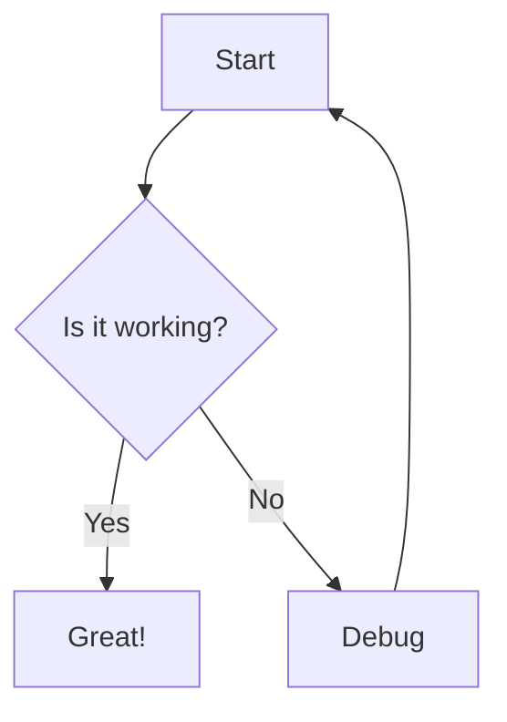
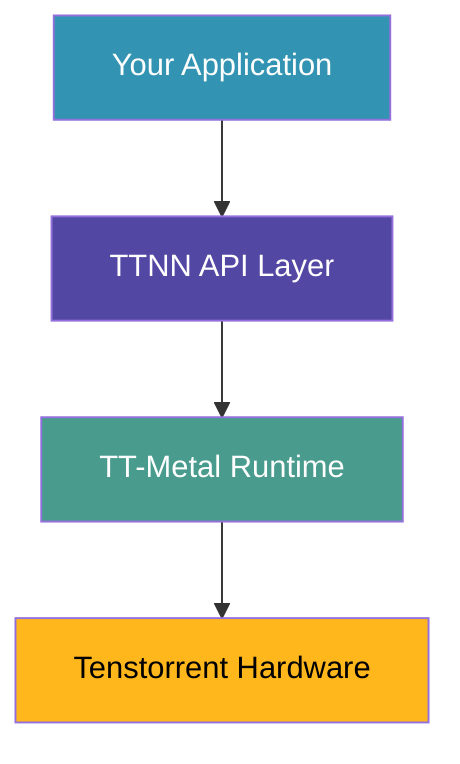
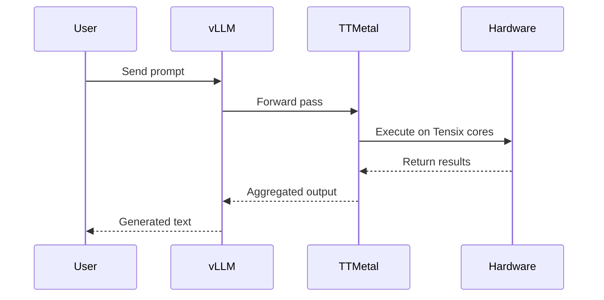
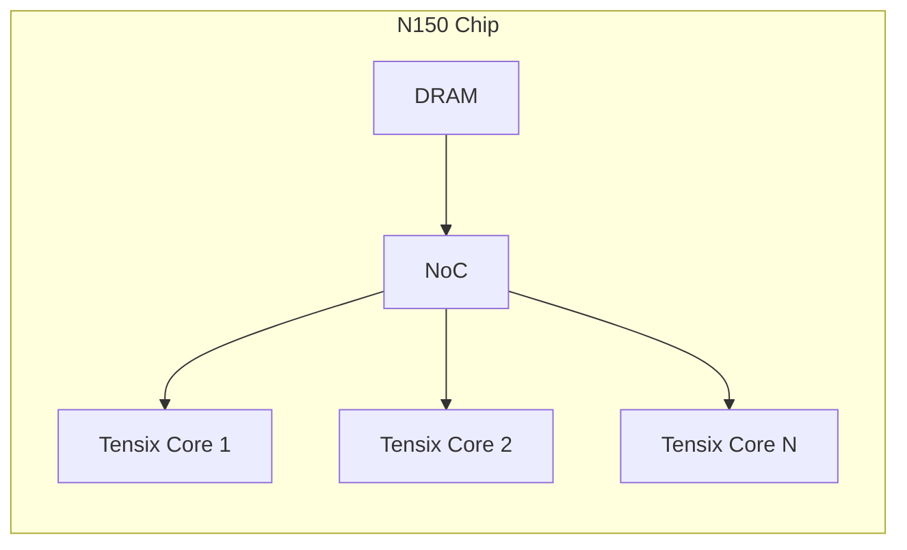
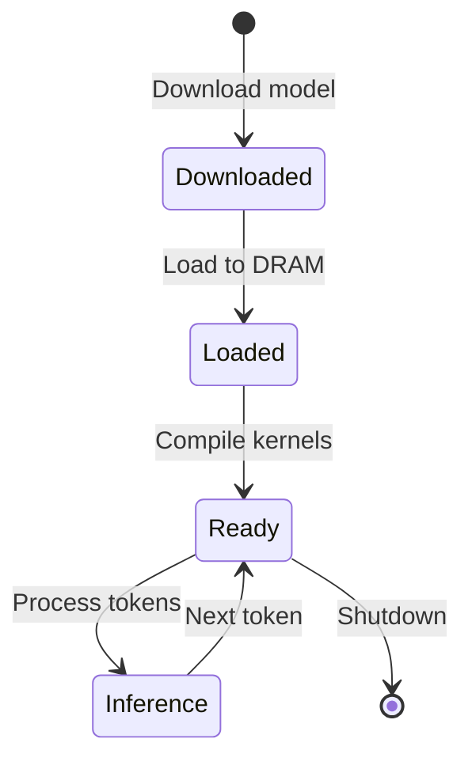

# Mermaid.js Diagram Examples

The extension now supports [Mermaid.js](https://mermaid.js.org/) diagrams in lesson content!

## Usage

In any lesson markdown file, use a code fence with `mermaid` language:

````markdown

````

## Example Diagrams

### Flowchart - TT-Metal Stack


### Sequence Diagram - Model Inference


### Architecture Diagram


### State Diagram - Model Lifecycle


## Styling

Mermaid diagrams automatically:
- Use dark theme to match VSCode
- Inherit font from VSCode settings
- Render centered with proper spacing
- Display in bordered containers

## Supported Diagram Types

- Flowchart / Graph
- Sequence Diagram
- Class Diagram
- State Diagram
- Entity Relationship Diagram
- Gantt Chart
- Pie Chart
- Git Graph
- And more! See [Mermaid docs](https://mermaid.js.org/intro/)
