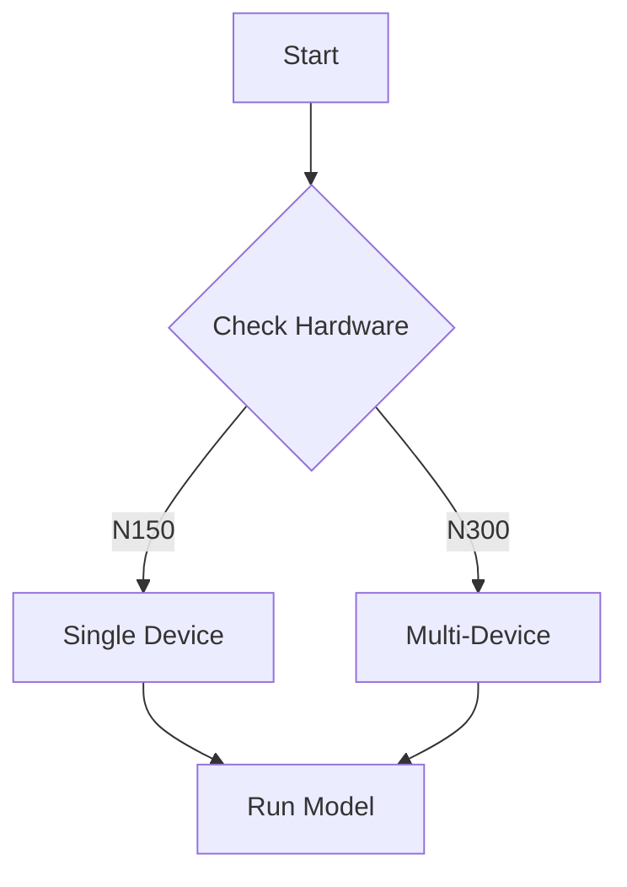
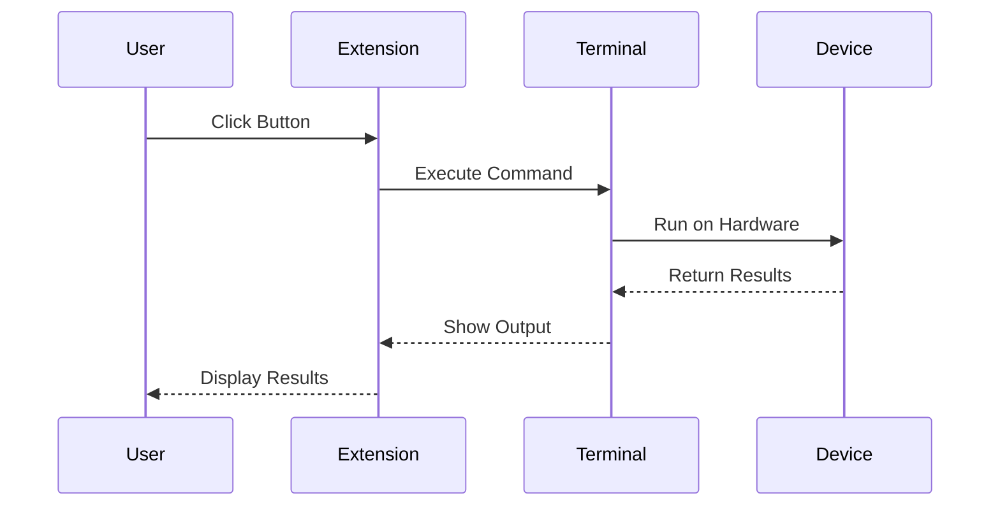
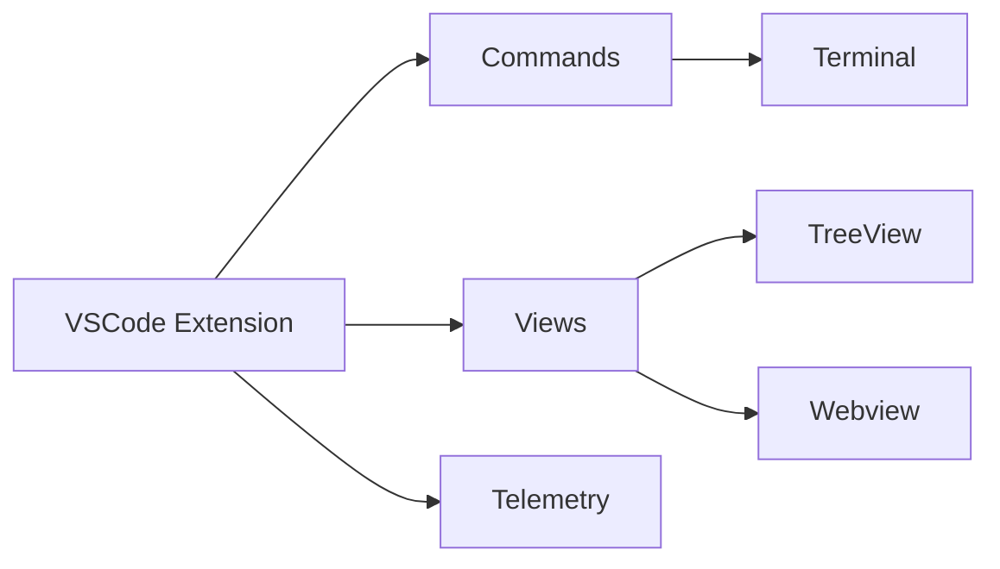

# Style Guide

This style guide ensures consistency across all lessons, documentation, and code in the Tenstorrent VSCode Toolkit.

## Table of Contents

- [Terminology Standards](#terminology-standards)
- [Writing Style](#writing-style)
- [Markdown Formatting](#markdown-formatting)
- [Command Buttons](#command-buttons)
- [Code Examples](#code-examples)
- [Mermaid Diagrams](#mermaid-diagrams)
- [Screenshots](#screenshots)

---

## Terminology Standards

### Product and Project Names

**Tenstorrent Company:**
- ✅ `Tenstorrent` (capital T, no internal caps)
- ❌ `TensTorrent`, `tensTorrent`, `TENSTORRENT`

**Software Projects:**
- ✅ `tt-metal` (lowercase, hyphenated) in code/commands
- ✅ `TT-Metal` (title case, hyphenated) in prose and documentation
- ❌ `TT Metal`, `tt metal`, `TTMetal`, `ttmetal`

- ✅ `tt-forge` (lowercase, hyphenated) in code/commands
- ✅ `TT-Forge` (title case, hyphenated) in prose and documentation
- ❌ `TT Forge`, `tt forge`, `TTForge`, `ttforge`

- ✅ `tt-xla` (lowercase, hyphenated) in code/commands
- ✅ `TT-XLA` (all caps for XLA) in prose and documentation
- ❌ `TT XLA`, `tt xla`, `TTXLA`

- ✅ `vLLM` (camelCase with lowercase v)
- ❌ `VLLM`, `vllm`, `Vllm`, `VLlm`

- ✅ `tt-inference-server` (lowercase, hyphenated)
- ✅ `TT Inference Server` (title case) in prose only when clarity demands
- ❌ `TTInferenceServer`, `tt_inference_server`

**VSCode Extension:**
- ✅ `tt-vscode-toolkit` (lowercase, hyphenated) in code/repo names
- ✅ `Tenstorrent VSCode Toolkit` (title case) in prose and UI
- ❌ `tt_vscode_toolkit`, `TTVSCodeToolkit`

### Hardware Product Names

**Always use uppercase for model numbers in prose:**
- ✅ `N150`, `N300`, `T3K`, `P100`, `P150`, `Galaxy`
- ❌ `n150`, `n300`, `t3k`, `p100`, `p150`, `galaxy` (only use lowercase in code)

**Hardware architecture names:**
- ✅ `Grayskull` (capital G)
- ✅ `Wormhole` (capital W)
- ✅ `Blackhole` (capital B)
- ❌ `grayskull`, `wormhole`, `blackhole` (except in code/environment variables)

**In code and configuration:**
```bash
# Lowercase in code/config
export TT_METAL_ARCH_NAME=wormhole
mesh_device: n300
```

**In prose:**
```markdown
The N150 uses the Wormhole architecture with 8 Tensix cores.
```

### Commands and Tools

**CLI tools:**
- ✅ `tt-smi` (lowercase, hyphenated)
- ✅ `tt-topology` (lowercase, hyphenated)
- ❌ `TTSMI`, `tt_smi`, `TT-SMI`

**Environment variables:**
- ✅ `TT_METAL_HOME` (all caps, underscores)
- ✅ `MESH_DEVICE` (all caps, underscores)
- ✅ `PYTHONPATH` (all caps, no separators)

### Model Names

**Follow official naming exactly:**
- ✅ `Llama-3.1-8B-Instruct` (with hyphens and capitalization)
- ✅ `Qwen3-0.6B` (with version number formatting)
- ✅ `Gemma-3-1B-IT` (with IT suffix)
- ❌ `llama-3.1-8b-instruct`, `LLAMA`, `qwen`, `Gemma`

### File Extensions and Formats

**Lowercase with dot:**
- ✅ `.py`, `.ts`, `.md`, `.json`, `.yaml`, `.vsix`
- ❌ `.PY`, `.Ts`, `.MD`

---

## Writing Style

### Tone

**Friendly and clear:**
- Use conversational but professional language
- Address the reader directly with "you" and "your"
- Keep sentences concise and focused
- Break complex topics into digestible steps

**Examples:**

✅ Good:
```markdown
You'll set up a vLLM server to run Llama models on your Tenstorrent hardware.
This process takes about 5 minutes and requires 8GB of RAM.
```

❌ Too formal:
```markdown
The user shall proceed to establish a vLLM server instance for the purpose of executing Llama models on Tenstorrent hardware. This procedure requires approximately 5 minutes and a minimum of 8GB RAM.
```

❌ Too casual:
```markdown
Let's spin up a vLLM server! It's gonna be super easy and quick! 😎
```

### Technical Accuracy

**Be precise with technical terms:**
- Use exact command syntax
- Include version numbers when relevant
- Specify hardware requirements clearly
- Link to official documentation when appropriate

**Always verify:**
- Commands work as written
- Paths exist and are correct
- Environment variables are accurate
- Version numbers are current

### Instructional Writing

**Structure lessons clearly:**
1. **Overview** - What will be learned (2-3 sentences)
2. **Prerequisites** - Required knowledge and setup
3. **Learning Objectives** - Bulleted list of outcomes
4. **Step-by-step instructions** - Numbered steps with explanations
5. **Troubleshooting** - Common issues and solutions
6. **What's Next** - Related lessons and resources

**Each step should:**
- Start with a clear action verb ("Install", "Configure", "Run", "Verify")
- Explain WHY before HOW when introducing new concepts
- Show expected output when running commands
- Highlight potential errors and how to fix them

---

## Markdown Formatting

### Headers

**Use ATX-style headers (# syntax):**
```markdown
# Main Title (H1)
## Section Header (H2)
### Subsection Header (H3)
#### Minor Header (H4)
```

**Header capitalization:**
- Use title case for H1 and H2
- Use sentence case for H3 and below

✅ Good:
```markdown
# Introduction to TT-Metal
## Setting Up Your Environment
### Install dependencies
```

❌ Inconsistent:
```markdown
# introduction to tt-metal
## Setting up your environment
### INSTALL DEPENDENCIES
```

### Lists

**Bulleted lists:**
```markdown
- Item one
- Item two
  - Nested item
  - Another nested item
- Item three
```

**Numbered lists:**
```markdown
1. First step
2. Second step
3. Third step
```

**Use bulleted lists for:**
- Features or capabilities
- Options or choices
- Prerequisites
- Related items

**Use numbered lists for:**
- Sequential steps
- Installation procedures
- Ordered processes

### Code Blocks

**Always specify language:**
````markdown
```bash
npm install
```

```python
import ttnn
```

```typescript
const device = ttnn.open_device(0);
```
````

**Inline code:**
Use backticks for:
- Commands: `npm run build`
- File paths: `src/extension.ts`
- Variable names: `MESH_DEVICE`
- Function names: `updateDeviceStatus()`
- Short code snippets: `device_id=0`

### Links

**Internal links (within repo):**
```markdown
See [Testing Guide](docs/TESTING.md) for details.
```

**External links:**
```markdown
Read the [TT-Metal documentation](https://docs.tenstorrent.com/tt-metal) for more information.
```

**Reference-style links for repeated URLs:**
```markdown
Check [GitHub][repo] for updates.

[repo]: https://github.com/tenstorrent/tt-vscode-toolkit
```

### Emphasis

**Bold for important terms and UI elements:**
```markdown
Click the **Run** button in VSCode.
The **N150** hardware uses Wormhole architecture.
```

**Italic for emphasis or introducing new terms:**
```markdown
This is called *model quantization*.
You should *never* run this command with sudo.
```

**Bold italic for critical warnings:**
```markdown
***WARNING:*** This will delete all data.
```

### Block Quotes

**Use for important notes:**
```markdown
> **Note:** This feature requires tt-metal v0.51.0 or later.

> **Warning:** This operation cannot be undone.

> **Tip:** Use `tt-smi -r` to reset hardware if you encounter errors.
```

---

## Lesson Metadata and Registry

### Metadata in Front Matter

**Every lesson must have complete front matter:**
```yaml
---
title: "My Lesson Title"
description: "Clear, concise description of what the lesson teaches (1-2 sentences)"
category: "advanced"  # One of: first-inference, serving, compilers, advanced, custom-training
tags: ["tag1", "tag2", "tag3"]
supportedHardware: ["n150", "n300", "t3k", "p100", "p150", "galaxy"]
status: "draft"  # One of: draft, validated, blocked
validatedOn: []  # Empty until tested, e.g., ["n150", "n300"]
estimatedMinutes: 30
---
```

**Required fields:**
- `title` - Lesson title in title case
- `description` - 1-2 sentence summary
- `category` - Must match existing category
- `tags` - Array of relevant tags (lowercase, hyphenated)
- `supportedHardware` - Array of hardware types (lowercase)
- `status` - Current validation status
- `validatedOn` - Array of hardware where tested (empty for drafts)
- `estimatedMinutes` - Time to complete (realistic estimate)

**Optional fields:**
- `minTTMetalVersion` - Minimum tt-metal version required (e.g., "v0.51.0")
- `validationDate` - ISO date when validated (e.g., "2026-01-30")
- `validationNotes` - Multi-line notes about validation testing

### Status Values

**Use appropriate status:**
- `draft` - Lesson in development, not yet tested
- `validated` - Tested on hardware, ready for production
- `blocked` - Known issues prevent validation (add `blockReason`)

**Status progression:**
1. Create lesson with `status: "draft"` and empty `validatedOn: []`
2. Test on hardware configurations
3. Update to `status: "validated"` and list tested hardware in `validatedOn`
4. If issues found, use `status: "blocked"` with explanation

### Hardware Values

**Use lowercase in code:**
- `n150` - N150 (Wormhole single chip)
- `n300` - N300 (Wormhole 2-chip)
- `t3k` - T3000 (Wormhole 8-chip)
- `p100` - P100 (Blackhole single chip)
- `p150` - P150 (Blackhole 2-chip)
- `galaxy` - Galaxy (Wormhole large-scale)
- `simulator` - Software simulator (no hardware)

### Registry Sync Workflow

**Source of truth: Markdown front matter**

The extension uses a hybrid approach:
- **Content metadata** (title, description, tags, etc.) lives in markdown
- **Extension metadata** (order, navigation, completion) lives in JSON

**When editing lessons:**
1. Edit markdown front matter
2. Run validation: `npm run validate:lessons`
3. If validation fails, sync: `npm run generate:lessons -- --execute`
4. Rebuild: `npm run build`

**When adding new lessons:**
1. Create markdown with complete front matter
2. Generate registry entry: `npm run generate:lessons -- --execute`
3. Manually add navigation (order, previousLesson, nextLesson) to JSON
4. Rebuild: `npm run build`

**Generator features:**
- Dry-run by default (shows diff without applying)
- Automatic timestamped backups
- User confirmation before changes
- Preserves manual fields (order, navigation)

**Validation features:**
- Compares 9 metadata fields
- Integrated into build (build fails if out of sync)
- Clear error messages with file and field details

### Metadata Best Practices

**Descriptions:**
- ✅ "Deploy with vLLM - OpenAI-compatible APIs, continuous batching, and enterprise features."
- ❌ "This lesson is about vLLM." (too vague)
- ❌ "In this comprehensive guide, you will learn everything there is to know about deploying..." (too verbose)

**Tags:**
- Use lowercase with hyphens: `multi-device`, `image-generation`
- 3-6 tags per lesson
- Mix technical and conceptual: `["vllm", "production", "api", "inference"]`
- Reuse existing tags when possible

**Supported hardware:**
- List ALL hardware where lesson should work
- Test on subset (at least one configuration)
- Document hardware-specific quirks in lesson content

**Estimated time:**
- Be realistic (include reading, setup, and execution)
- Round to nearest 5 minutes
- 15-30 minutes for most lessons
- 45-90 minutes for complex topics

---

## Command Buttons

### Button Format

**Command buttons use VSCode command protocol:**
```markdown
command:tenstorrent.commandName
Button Text in Title Case
```

**Rules:**
1. Command link must be on its own line
2. Button text on the next line (no blank line between)
3. Use title case for button text
4. Make button text action-oriented and clear
5. Group related buttons together

### Button Text Guidelines

**Use action verbs:**
- ✅ "Install Dependencies"
- ✅ "Start vLLM Server"
- ✅ "Run Tests"
- ❌ "Dependencies Installation"
- ❌ "vLLM Server Starting"

**Be specific:**
- ✅ "Detect N150 Hardware"
- ✅ "Install tt-metal v0.51.0"
- ❌ "Detect Hardware"
- ❌ "Install Software"

**Keep it concise (2-5 words):**
- ✅ "Build Extension"
- ✅ "Run All Tests"
- ❌ "Build the Extension from Source Code"
- ❌ "Execute the Complete Test Suite"

### Button Grouping

**Group related operations:**
```markdown
## Installation

command:tenstorrent.installDependencies
Install Dependencies

command:tenstorrent.buildMetal
Build TT-Metal

command:tenstorrent.verifyInstallation
Verify Installation
```

**Separate unrelated operations with headers:**
```markdown
## Setup

command:tenstorrent.setup
Run Setup

## Testing

command:tenstorrent.runTests
Run Tests
```

---

## Code Examples

### Python Code

**Always include SPDX header in templates:**
```python
# SPDX-FileCopyrightText: © 2024 Tenstorrent Inc.
#
# SPDX-License-Identifier: Apache-2.0

import ttnn

# Your code here
```

**Use descriptive variable names:**
```python
# ✅ Good
device_id = 0
model_path = "~/models/Llama-3.1-8B-Instruct"
num_devices = ttnn.GetNumAvailableDevices()

# ❌ Bad
d = 0
p = "~/models/Llama-3.1-8B-Instruct"
n = ttnn.GetNumAvailableDevices()
```

**Include error handling in examples:**
```python
try:
    device = ttnn.open_device(device_id=0)
    # Use device...
finally:
    ttnn.close_device(device)
```

### TypeScript Code

**Always include SPDX header:**
```typescript
// SPDX-FileCopyrightText: © 2024 Tenstorrent Inc.
//
// SPDX-License-Identifier: Apache-2.0

export class MyClass {
  // Your code here
}
```

**Follow naming conventions:**
```typescript
// Classes: PascalCase
class DeviceManager {}

// Functions: camelCase
function updateStatus() {}

// Constants: UPPER_SNAKE_CASE
const MAX_DEVICES = 8;
```

### Bash Commands

**Use `$` for user commands:**
```bash
$ cd ~/tt-metal
$ ./build_metal.sh
```

**Use `#` for comments:**
```bash
# Install dependencies first
$ ./install_dependencies.sh

# Then build
$ ./build_metal.sh
```

**Show expected output:**
```bash
$ tt-smi
Board 0: N150 (Wormhole) - OK
  Status: Ready
  Temperature: 45°C
```

---

## Mermaid Diagrams

### Color Scheme

**Use Tenstorrent brand colors:**
```javascript
%%{init: {'theme':'base', 'themeVariables': {
  'primaryColor':'#00A8E1',      /* Tenstorrent Blue */
  'primaryTextColor':'#FFFFFF',
  'primaryBorderColor':'#0088B8',
  'lineColor':'#00A8E1',
  'secondaryColor':'#F5F5F5',
  'tertiaryColor':'#E8E8E8',
  'background':'#FFFFFF',
  'mainBkg':'#00A8E1',
  'secondaryBkg':'#F5F5F5',
  'tertiaryBkg':'#E8E8E8'
}}}%%
```

### Diagram Types

**Flowcharts for processes:**


**Sequence diagrams for interactions:**


**Architecture diagrams for structure:**


---

## Screenshots

### Requirements

**Image specifications:**
- Format: PNG (for UI) or JPEG (for photos)
- Resolution: 2x retina (e.g., 1600x1200 displayed at 800x600)
- File size: Under 500KB after optimization
- Location: Store in `docs/images/`
- Naming: Descriptive kebab-case (e.g., `lesson-tree-view.png`)

### Content Guidelines

**Capture clean UI:**
- Close unnecessary tabs and windows
- Use default VSCode theme (Dark+ or Light+)
- Ensure code is properly formatted
- Hide personal information (usernames, paths)

**Highlight relevant areas:**
- Use red rectangles to draw attention
- Add arrows to show workflow direction
- Include captions below images

**Example markdown:**
```markdown

*The Tenstorrent sidebar displays lessons organized by category*
```

### Screenshot Types

**Feature screenshots:**
- Show the feature in action
- Include relevant UI context
- Demonstrate the outcome

**Workflow screenshots:**
- Multiple images showing step-by-step process
- Number images sequentially (step-1.png, step-2.png)
- Include explanatory captions

**Error screenshots:**
- Show the error message clearly
- Include enough context to understand the situation
- Follow with a solution screenshot when possible

---

## Best Practices Summary

### For Lesson Authors

1. **Research first** - Check `vendor/` repos for accurate commands and examples
2. **Test on hardware** - Verify all commands work on supported configurations
3. **Use consistent terminology** - Follow this style guide
4. **Include troubleshooting** - Document common issues and solutions
5. **Update metadata** - Mark lessons as validated after testing

### For Code Contributors

1. **Follow naming conventions** - PascalCase for classes, camelCase for functions
2. **Include SPDX headers** - All source files need license headers
3. **Write tests** - All new features should have test coverage
4. **Document changes** - Update CHANGELOG.md and relevant docs
5. **Increment version** - Always bump version in package.json

### For Reviewers

1. **Check terminology** - Ensure consistent use of product names
2. **Verify commands** - Test that commands work as documented
3. **Review screenshots** - Check image quality and relevance
4. **Test on hardware** - Confirm lessons work on target hardware
5. **Check metadata** - Ensure lesson metadata is accurate

---

## Questions?

For questions about this style guide:
- Open an issue on [GitHub](https://github.com/tenstorrent/tt-vscode-toolkit/issues)
- Ask in [Discord](https://discord.gg/tenstorrent)
- Review existing lessons as examples

---

**Version:** 1.0.0
**Last Updated:** 2026-01-30
**Maintainers:** Tenstorrent VSCode Toolkit Team
